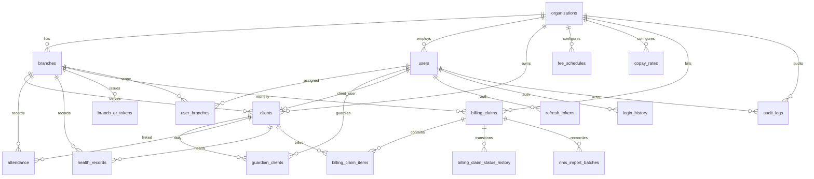
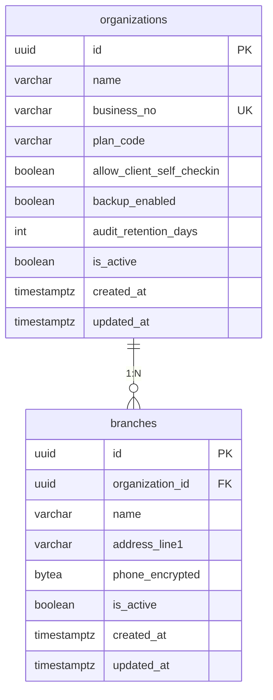
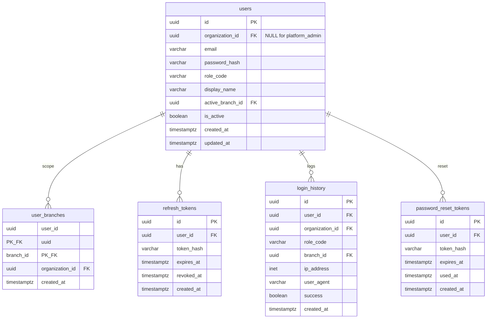
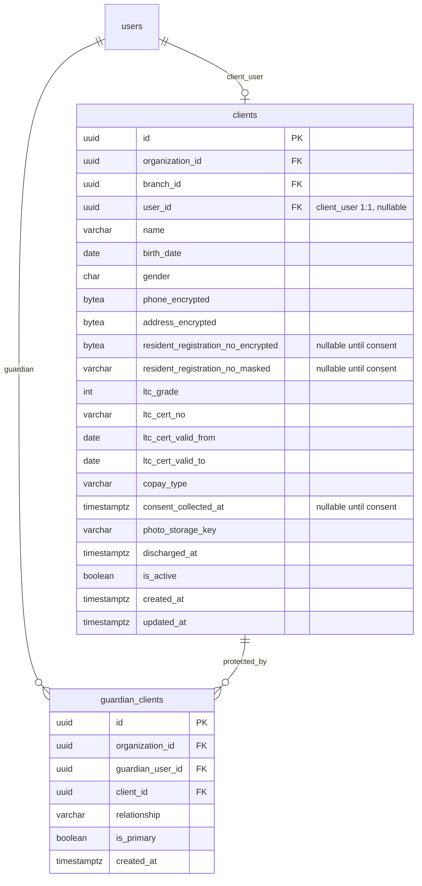
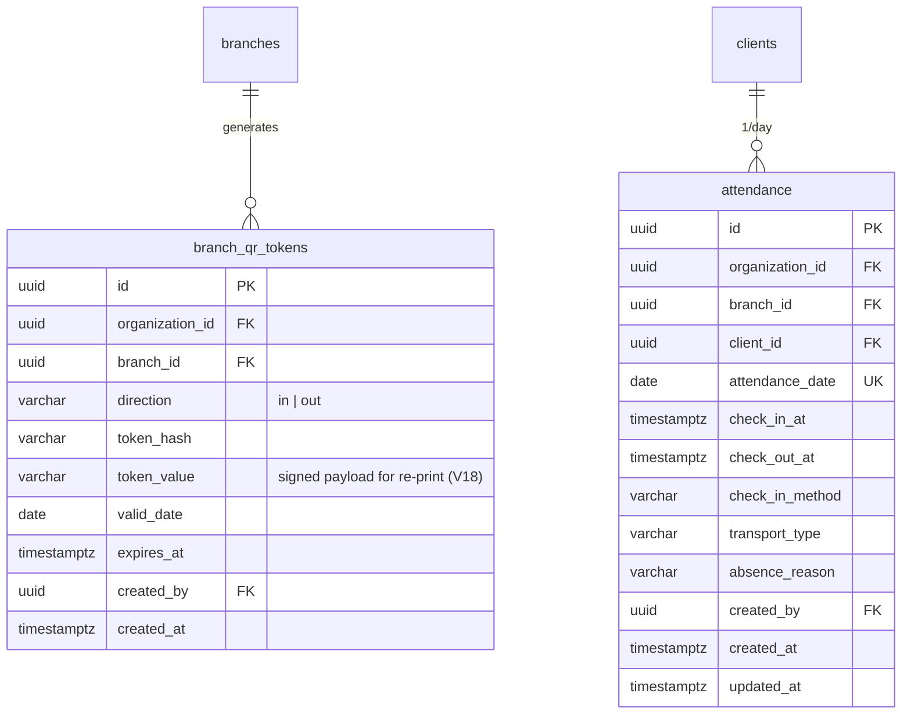
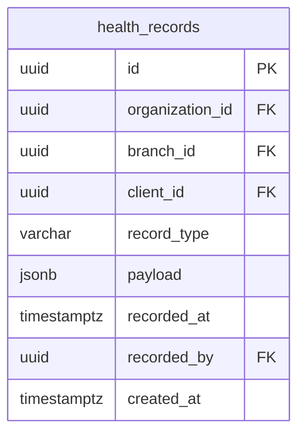
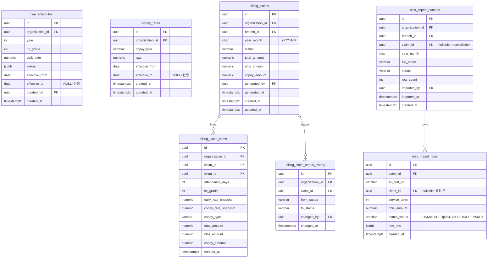
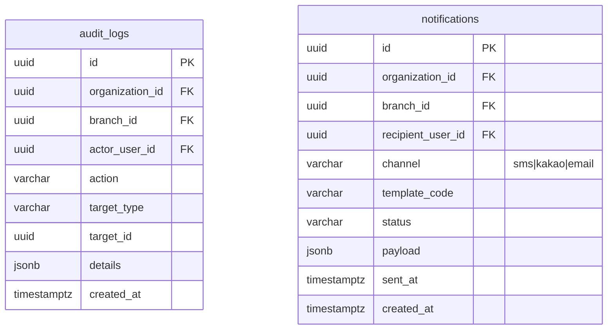
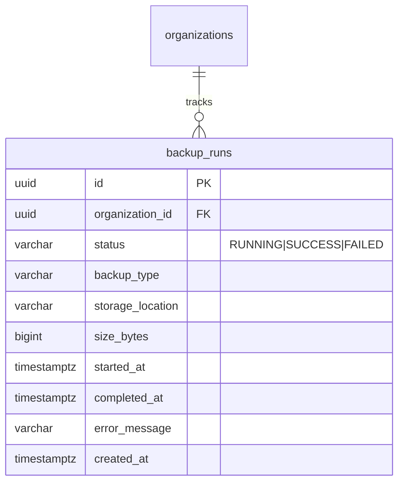

<!-- doc:owner=DBA doc:audience=COD,PLN,TSR updated=2026-06-06T12:00:00+09:00 -->
# 주간보호센터 웹 시스템 — ERD (ERD.md)

> **작성**: db_architect 에이전트  
> **최초 작성일**: 2026-06-05  
> **상태**: MVP v1 기준  
> **근거 문서**: `docs/REQUIREMENTS.md` §3, `docs/API_SPEC.md`, `docs/USER_STORIES.md`  
> **DDL**: `src/backend/src/main/resources/db/migration/V1__*.sql` … `V35__*.sql`  

---

## 1. 설계 원칙

| 원칙 | 내용 |
|------|------|
| 멀티테넌트 | 모든 운영 데이터는 `organization_id` 필수. Tenant 간 FK·쿼리 교차 금지 |
| 지점 스코프 | 이용자·출석·건강·청구 등은 `branch_id`로 지점 소속 식별 |
| RBAC | JWT `role` + `branch_ids[]` + `active_branch_id` (API_SPEC §0-2) |
| PII | 주민번호 암호화·마스킹, 연락처·주소 암호화 권장 (REQUIREMENTS §3-2-1) |
| 감사 | 민감 열람·상태 변경·PII 복호화는 `audit_logs` 기록 |
| 이력 보존 | 수가·본인부담률·청구 확정 시점 스냅샷 — 과거 청구 재계산 불변 |

---

## 2. 역할(RBAC) ↔ 데이터 접근

| 역할 코드 | `organization_id` | `branch_ids` | 운영 데이터 CRUD |
|-----------|-------------------|--------------|------------------|
| `platform_admin` | **NULL** (ogada 내부) | 없음 | Tenant·초기 `hq_admin` 생성만 |
| `hq_admin` | 소속 Tenant | 전 지점(또는 배정 지점) | 조회·집계 전 지점, **쓰기는 `active_branch_id`만** |
| `branch_admin` | 소속 Tenant | 소속 지점 | 소속 지점 전체 |
| `social_worker` | 소속 Tenant | 소속 지점 | 이용자·건강 (직원관리 제외) |
| `caregiver` | 소속 Tenant | 소속 지점 | 출석·건강 쓰기, 이용자 읽기 |
| `guardian` | 소속 Tenant | 연결 이용자 지점 | 연결 `client` 출석(QR)·기록 열람 |
| `client_user` | 소속 Tenant | 본인 `client` 지점 | 본인 1명 QR 출석·제한 열람 |
| `sysadmin` | 소속 Tenant | 전 지점(읽기) | 기술 설정·감사 로그 (운영 CRUD 없음) |

`users` ↔ `user_branches` M:N으로 지점 스코프 배정. `guardian`/`client_user`는 `guardian_clients` 또는 `clients.user_id`로 이용자 연결.

---

## 3. 전체 관계도 (MVP)



---

## 4. 도메인별 ERD

### 4-1. 테넌트·조직 (§3-12, API §2–3)



- `organizations.allow_client_self_checkin`: QR B방식 `client_user` 허용 (REQUIREMENTS §3-3).
- `organizations.backup_enabled`·`audit_retention_days`: `sysadmin` 기술 설정 (API §9, V9).
- `branches`: 지점별 QR·출석·이용자의 물리 단위.

### 4-2. 인증·계정 (§3-1, API §1)



| `role_code` 값 | 비고 |
|----------------|------|
| `platform_admin` | `organization_id` NULL, `user_branches` 없음 |
| `hq_admin` ~ `sysadmin` | Tenant 소속, 이메일은 `(organization_id, email)` UK |
| `guardian`, `client_user` | 보호자·이용자 포털 계정 |

### 4-3. 이용자·보호자 (§3-2, API §4)



| `copay_type` | 의미 | 기본 비율 (`copay_rates`) |
|--------------|------|---------------------------|
| `GENERAL` | 일반 | 0.15 |
| `REDUCED_40` | 감경 40% | 0.09 |
| `REDUCED_60` | 감경 60% | 0.06 |
| `MEDICAID` | 기초·의료급여 | 0.00 |

- 주민번호: `resident_registration_no_encrypted` + `resident_registration_no_masked` — **동의 전 NULL 허용**, `consent_collected_at` 설정 후 저장 (DB CHECK `chk_clients_rrn_consent`, `chk_clients_rrn_pair`). `consent_collected_at` 자체도 동의 전 NULL. encrypted/masked는 **쌍으로** NULL 또는 NOT NULL.
- `ltc_cert_no`: Tenant 내 **UK** `(organization_id, ltc_cert_no)` — 공단 엑셀 매칭·중복 방지.
- 복호화 열람 시 `audit_logs.action = 'PII_DECRYPT_VIEW'`.
- `clients.user_id`(client_user 셀프 출석 계정): 복합 FK `(organization_id, user_id)`로 **동일 Tenant** 계정만 연결 (V7). 등록 시점엔 NULL, 이후 `POST /clients/{id}/client-user`로 발급. `user_id` 설정 시 `users.role_code = 'client_user'` 강제 (V13).
- `guardian_clients.is_primary`: 이용자당 **1명**만 TRUE 가능 (V7 partial UK). 복수 보호자 연결 시 대표 1명 지정.
- `guardian_clients.guardian_user_id`: 연결 계정은 `users.role_code = 'guardian'`만 허용 (V13 — QR B방식 스캔 계정 무결성).
- `guardian_clients.organization_id`: **V23** `trg_guardian_clients_set_org`가 연결 `clients`에서 Tenant 자동 복사 — 앱 누락·Tenant 불일치 방어 (V21/V22 NHIS·청구 라인 패턴).

### 4-4. 출석 (§3-3, API §5)



| `check_in_method` | 설명 |
|-------------------|------|
| `manual` | 직원 수기 체크인/아웃 |
| `qr_self` | 보호자·이용자 지점 QR 스캔 (B방식) |

- **UK** `(client_id, attendance_date)`: 하루 1건. 출석(`check_in_at`)과 결석(`absence_reason`)은 **상호배타 + 최소 하나** = XOR (`chk_attendance_presence` V4 + `chk_attendance_presence_xor_absence` V11).
- `attendance_date`는 `check_in_at`·`check_out_at`의 **Asia/Seoul 달력일**과 일치해야 한다 (`chk_attendance_date_matches_*`, V15 — 청구·대시보드 일자 집계 정합).
- 결석 행: `check_out_at`·`transport_type` **NULL**, `check_in_method = manual`만 허용 (`chk_attendance_absence_*`, V14 — US-E01/US-E02). `absence_reason` 공백 불가 (V15).
- `transport_type`은 **체크아웃 후**에만 저장 (`chk_attendance_transport_requires_checkout`, V15). 값은 자유 텍스트(자가용·센터 차량 등).
- 체크아웃은 체크인 선행 필수 (`chk_attendance_checkout_requires_checkin`, V7) + 체크아웃 ≥ 체크인 (V6).
- **INSERT 시** 퇴소·비활성 이용자 차단 (`trg_attendance_guard_active_client`, V10; `trg_health_records_guard_active_client`, V13). 기존 행 UPDATE(체크아웃 등)는 허용.
- `created_by`: V14 actor Tenant FK. **V32** `trg_attendance_set_created_by`가 `ogada.actor_user_id` 세션 변수로 INSERT 시 자동 적재(앱 누락 방어). **coder는** 출석·결석·QR 트랜잭션 시작 시 `DbSessionContext.setActorUserId` 호출 권장 — `AttendanceService.createCheckIn`/`recordAbsence`는 아직 JWT subject를 entity에 직접 설정하지 않음(V33 점검).
- 청구 출석일수: `check_in_at IS NOT NULL` 행만 집계 (`idx_attendance_billing_days`).
- `branch_qr_tokens`: API `/branches/{id}/qr` — 서명·만료 포함. `token_hash`(SHA-256)는 조회 UK, `token_value`(V18)는 직원 재출력용 서명 페이로드를 저장한다(`GET /branches/{id}/qr`).
- `branch_qr_tokens.created_by`: V14 actor Tenant FK. **V35** `trg_branch_qr_tokens_set_created_by`가 session actor로 INSERT 시 자동 적재 — `AttendanceService.generateBranchQr`는 JWT subject를 앱에서 설정하나 raw SQL 방어(V32 패턴).

### 4-5. 건강 기록 (§3-4, API §6)



| `record_type` | `payload` 예시 필드 |
|---------------|---------------------|
| `vitals` | systolic, diastolic, temperature, bloodGlucose, spo2 |
| `medication` | drugName, dosage, administeredAt, notes |
| `incident` | incidentType, description, severity |
| `note` | content |

- MVP는 단일 테이블 + `record_type` 분기. v1 이후 정규화 가능.
- `recorded_by`: V14 actor Tenant FK. **V33** `trg_health_records_set_recorded_by`가 session actor로 INSERT 시 자동 적재 — `HealthRecordService`는 JWT subject를 앱에서 설정하나 raw SQL·ORM bypass 방어(V32 출석 패턴 대칭).
- 대시보드 「건강 이상」: `vitals` payload 범위 초과 또는 `incident` 유형 필터.

### 4-6. 청구·정산 (§3-9, API §7)



**계산 규칙** (REQUIREMENTS §3-9-2):

```
이용자별 total = daily_rate(유효 수가) × attendance_days
copay_amount = total × copay_rate(이용자 copay_type 기준)
nhis_amount = total − copay_amount
```

| `billing_claims.status` | 의미 |
|-------------------------|------|
| `DRAFT` | 작성중 |
| `CONFIRMED` | 확정 (라인 스냅샷 고정) |
| `PAID` | 수납완료 |

- 수가·비율 **수정 시 INSERT 신규 행** (`effective_to`로 이전 행 종료). PATCH는 UPDATE가 아닌 버전 추가.
- `fee_schedules.year`는 `effective_from` 연도와 **일치**해야 한다 (`chk_fee_schedules_year_effective`, V13 — §3-9-1 적용연도 버전).
- `fee_schedules.created_by`: V14 actor Tenant FK. **V35** `trg_fee_schedules_set_created_by`가 `ogada.actor_user_id`로 INSERT 시 자동 적재 — `BillingService.createFeeSchedule`은 `createdBy` 미설정, `updateFeeSchedule`만 이전 버전에서 복사(US-G00a).
- `copay_rates.copay_type`은 `clients`·`billing_claim_items`와 동일 4종 CHECK (V13).
- **버전 비중첩 (V7)**: `fee_schedules`(`org, year, grade`)·`copay_rates`(`org, copay_type`)는 `EXCLUDE` + `daterange`로 동일 키의 두 버전이 같은 날 동시 유효할 수 없다. 새 버전 추가 전 이전 행 `effective_to`를 닫지 않으면 거부 → 청구 시점 단일 수가/비율 보장.
- `billing_claim_items`에 `daily_rate_snapshot`, `copay_rate_snapshot` 저장 → 확정 후 불변.
- **청구서당 이용자 1라인**: `(claim_id, client_id)` **UK** `uq_billing_claim_items_claim_client` (V26; V2 `uq_claim_item_client`는 V27에서 제거) — NHIS `findByClaimIdAndClientId`·헤더 합계 정합.
- **헤더 ↔ 라인 합계**: `DRAFT→CONFIRMED` 전이 시 `billing_claims.total/nhis/copay`가 라인 합계와 일치해야 한다 (`trg_billing_claims_total_reconciliation`, V11). 행 단위 `total=nhis+copay`(V6)와 결합해 확정 청구가 항상 재현 가능.
- `billing_claim_items.organization_id`: `billing_claims`에서 비정규화 — `(organization_id, claim_id)`·`(organization_id, client_id)` 복합 FK로 **Tenant 스코프 라인 무결성** (V16, V5 출석/건강 패턴).
- `billing_claim_status_history`: 상태 전이(`DRAFT→CONFIRMED→PAID`)는 `trg_billing_claims_status_history`(V10, **V21에서 `organization_id` 자동 적재 보완**)가 자동 적재. `changed_by`는 앱이 `SET LOCAL ogada.actor_user_id = '<uuid>'` 설정 시 기록. `organization_id` + `(organization_id, changed_by)` FK로 actor Tenant 일치 (V16, V14 트리거 보완).
- `billing_claims.generated_by`: V14 actor Tenant FK. **V32** `trg_billing_claims_set_generated_by`가 `ogada.actor_user_id`로 INSERT 시 자동 적재 — `BillingService.generateClaim`이 명시 설정하지 않아도 세션 actor 기록 가능.
- `billing_claim_items.organization_id`: V16 비정규화 + Tenant FK. **V21** `trg_billing_claim_items_set_org`가 부모 `billing_claims`에서 자동 복사(앱 누락 방어).
- `nhis_import_batches.claim_id`: reconciliation 대상 청구 — `(organization_id, claim_id)` 복합 FK로 **동일 Tenant**만 연결 (V10).
- `nhis_import_rows.match_status`(`UNMATCHED|MATCHED|DISCREPANCY`, V7): 공단 엑셀 행을 `ltc_cert_no`로 이용자·청구에 매칭한 reconciliation 결과. `MATCHED`·`DISCREPANCY`는 `client_id`가 **반드시 존재**해야 한다 (`chk_nhis_import_rows_match_requires_client`, V19 — UNMATCHED만 `client_id` NULL 허용).
- `nhis_import_rows.ltc_cert_no`: NULL·공백 문자열 불가 (`chk_nhis_import_rows_ltc_cert_nonempty`, V25 — US-G04 매칭 키).
- `nhis_import_rows.service_days` ≤ 31 (V15) — `billing_claim_items.attendance_days`와 동일 월별 상한.
- `nhis_import_batches`: `row_count >= 0` (V19), `status = COMPLETED`이면 `imported_at` 필수 (`chk_nhis_import_batches_completed_imported_at`, V19 — `backup_runs` 완료 시각 패턴과 정합). **V32** `trg_nhis_batches_set_imported_at`가 `imported_at` 누락 시 `created_at`(또는 NOW())로 backstop — JPA `@PrePersist` 우회·raw SQL 방어. **V33** `trg_nhis_batches_set_imported_by`가 `imported_by` NULL 시 session actor backstop(V14 FK). `imported_at`이 설정된 경우 `imported_at >= created_at` (`chk_nhis_import_batches_imported_after_created`, V20 — `chk_backup_runs_completed_after_started` V12와 동일 시간 정합). `claim_id` 연결 시 `branch_id` = 청구 지점 (`trg_nhis_batches_claim_branch`, V21 — V17 `year_month` 정합의 지점 확장).
- `nhis_import_rows`: `client_id` 설정 시 매칭 이용자의 `clients.branch_id` = 부모 배치 `branch_id` (`trg_nhis_rows_client_branch`, V21 — US-G04 지점 단위 reconciliation).
- `nhis_import_rows.organization_id`: V8 비정규화 + Tenant FK. **V22** `trg_nhis_import_rows_set_org`가 부모 배치에서 자동 복사(앱 누락 방어, V21 청구 라인 패턴).

### 4-7. 감사·알림 (§3-1, agents.yaml core_entities)



| `audit_logs.action` 예시 | 트리거 |
|--------------------------|--------|
| `PII_DECRYPT_VIEW` | 주민번호 복호화 열람 |
| `CLAIM_STATUS_CHANGE` | 청구 상태 전이 |
| `LOGIN_SUCCESS` / `LOGIN_FAILURE` | (선택) login_history 이중 기록 |
| `CLIENT_DISCHARGE` | 퇴소 처리 |

- `notifications`: MVP 스키마만 정의. 발송 연동(SMS/알림톡)은 v1 이후 (Should). `recipient_user_id`는 `(organization_id, recipient_user_id)` 복합 FK로 Tenant 일치 (V10).

### 4-8. 시스템 설정·백업 (§3-1, API §9 — V9)



- `GET/PATCH /settings/system`: `organizations.backup_enabled`, `audit_retention_days`(30–3650).
- `GET /settings/backups`: `backup_runs` 이력 — 외부 백업 잡이 INSERT/UPDATE.
- `backup_runs`: 종료 상태(`SUCCESS`/`FAILED`)는 `completed_at` 필수 (`chk_backup_runs_terminal_completed_at`, V20 — `nhis_import_batches` V19와 동일 패턴). `FAILED`는 `error_message` 필수·`SUCCESS`/`RUNNING`은 NULL 강제 (`chk_backup_runs_error_message_status`, V20). `size_bytes >= 0` (V20).

---

## 5. v1 이후 엔티티 (Should — 스키마 예약)

| 엔티티 | 용도 | REQUIREMENTS |
|--------|------|--------------|
| `meal_menus`, `meal_records` | 식단·식사량 | §3-5 |
| `activity_programs`, `program_participations` | 프로그램·참여 | §3-6 |
| `staff_schedules`, `staff_attendance` | 직원 근태 | §3-8 |

공통: `organization_id`, `branch_id` FK, `audit_logs` 연동.

---

## 6. 인덱스 전략

| 테이블 | 인덱스 | 목적 |
|--------|--------|------|
| `clients` | `(organization_id, branch_id)`, **UK** `(organization_id, ltc_cert_no)` | 지점 목록·공단 매칭 |
| `clients` | partial `(org, branch, is_active) WHERE is_active` | 활성 이용자 목록 |
| `clients` | `(organization_id, branch_id, is_active)` | 지점 대시보드 이용자 통계(active/퇴소, V23) |
| `clients` | partial `(organization_id, user_id) WHERE user_id IS NOT NULL` | `client_user` QR 셀프 체크인 조회 (V23) |
| `clients` | partial `(organization_id, discharged_at) WHERE discharged_at IS NOT NULL` | 퇴소 이용자 retention purge 배치 (DATA_RETENTION §4-1, V32) |
| `clients` | partial `(organization_id, branch_id, discharged_at) WHERE discharged_at IS NOT NULL` | 지점 단위 퇴소 cohort purge·지점 폐쇄 정리 (DATA_RETENTION §4-1, V34) |
| `clients` | `chk_clients_discharged_after_created` | 퇴소 시각 ≥ 생성 시각 — backdated discharge 방어 (V34, V12/V20 시간 정합 패턴) |
| `clients` | partial `(organization_id, branch_id, created_at DESC) WHERE is_active` | 활성 이용자 목록 페이지네이션 (`GET /clients`, US-D02, V33) |
| `attendance` | `(client_id)` | 퇴소 후 출석 상세 purge 배치 (DATA_RETENTION §4-1, V33) |
| `health_records` | `(client_id)` | 퇴소 후 건강 기록 purge 배치 (DATA_RETENTION §4-1, V33) |
| `billing_claim_items` | `(client_id)` | 퇴소 후 청구 라인 purge/익명화 배치 (DATA_RETENTION §4-1, V33) |
| `clients` | GIN trigram `lower(name)` (`pg_trgm`) | 이용자 이름 부분 검색 (`GET /clients?q=`, US-D02) |
| `clients` | GIN trigram `lower(ltc_cert_no)` (`pg_trgm`, V26) | 인정번호 부분 검색 (`GET /clients?q=`, US-D02) |
| `attendance` | `(organization_id, branch_id, attendance_date)` | 일일·월별 집계 |
| `attendance` | `(client_id, attendance_date)` | 청구 출석일수 집계 |
| `attendance` | partial `(org, branch, client, date) WHERE check_in_at IS NOT NULL` | 월별 청구 일수 집계 |
| `attendance` | **UK** `(client_id, attendance_date)` | 중복 체크인 방지 |
| `health_records` | `(organization_id, branch_id, record_type, recorded_at DESC)` | 대시보드 건강 이상 |
| `users` | partial UK `lower(email) WHERE platform_admin` | 플랫폼 관리자 이메일 |
| `users` | partial UK `(organization_id, lower(email)) WHERE organization_id IS NOT NULL` | Tenant 직원 이메일 대소문자 무시 UK (V30 — V1 `uq_user_email_per_org` 대체) |
| `health_records` | `(client_id, recorded_at DESC)` | 그래프·이력 |
| `billing_claims` | `(organization_id, branch_id, year_month)` | 월별 청구 조회 |
| `billing_claims` | `(organization_id, branch_id, status, year_month DESC)` | 상태·기간 필터 (`GET /billing/claims`) |
| `billing_claims` | `(organization_id, branch_id, generated_at DESC)` | 청구 목록 최신순 (`GET /billing/claims`, V22) |
| `billing_claims` | `(organization_id, branch_id, status, generated_at DESC)` | 상태 필터 + 최신순 (`GET /billing/claims?status=`, API §7-3, V31) |
| `attendance` | `(organization_id, branch_id, attendance_date DESC)` | 월별 출석 통계 (`GET /attendance/stats/monthly`) |
| `attendance` | `(organization_id, branch_id, attendance_date, created_at DESC)` | 당일 출석 목록 (`GET /attendance`, V23) |
| `attendance` | partial `(org, branch, attendance_date) WHERE check_in_at IS NOT NULL` | 지점 대시보드 당일 입소 집계 (`GET /dashboard/branch`, V22) |
| `attendance` | partial `(org, branch, attendance_date) WHERE check_out_at IS NOT NULL` | 지점 대시보드 당일 퇴소 집계 (V22) |
| `attendance` | partial `(org, branch, attendance_date) WHERE absence_reason IS NOT NULL` | 지점 대시보드 당일 결석 집계 (V22) |
| `attendance` | `(organization_id, attendance_date)` | HQ 통합 대시보드 전 지점 일자 집계 (`GET /dashboard/hq`) |
| `audit_logs` | `(organization_id, created_at DESC)` | sysadmin 조회 |
| `audit_logs` | partial `(org, target_type, target_id, created_at DESC) WHERE target_id IS NOT NULL` | 대상별 PII 열람 이력 |
| `audit_logs` | partial `(org, actor_user_id, created_at DESC) WHERE actor_user_id IS NOT NULL` | 행위자별 활동 추적 |
| `refresh_tokens`·`password_reset_tokens`·`branch_qr_tokens` | **UK** `token_hash` | 토큰 해시 조회 무결성(보안) |
| `branch_qr_tokens` | `(organization_id, branch_id, valid_date, direction, expires_at DESC)` | 유효 QR 조회 (`GET /branches/{id}/qr`, V22) |
| `branch_qr_tokens` | `(expires_at)` | 유효기간 만료 후 7일 보관·파기 배치 (DATA_RETENTION §3) |
| `refresh_tokens`·`password_reset_tokens` | `(expires_at)` | 만료·폐기 배치 스캔 (DATA_RETENTION §3, V14) |
| `refresh_tokens`·`password_reset_tokens`·`branch_qr_tokens` | `expires_at >= created_at` | 만료 시각 역전 방어 (V13) |
| `refresh_tokens` | partial `(revoked_at) WHERE revoked_at IS NOT NULL` | 로그아웃·폐기 후 30일 purge 배치 (DATA_RETENTION §3, V15) |
| `password_reset_tokens` | partial `(used_at) WHERE used_at IS NOT NULL` | 사용 후 7일 purge 배치 (DATA_RETENTION §3, V16) |
| `login_history` | `(user_id, created_at DESC)`, `(organization_id, created_at DESC)` | `GET /auth/login-history` 본인·관리자 조회 (V2) |
| `login_history` | `(created_at)` | 1년 보존 purge 스캔 (DATA_RETENTION §3, V15) |
| `notifications` | `(recipient_user_id, created_at DESC)` | 수신자별 알림 이력 (v1+ 채널 연동, V2) |
| `notifications` | `(created_at)` | 1년 보존 purge 스캔 (v1+ 채널 연동, V15) |
| `backup_runs` | `(organization_id, started_at DESC)` | `GET /settings/backups` 테넌트 백업 이력 최신순 (V9) |
| `backup_runs` | `(created_at)` | 90일 메타 purge 스캔 (DATA_RETENTION §3, V16) |
| `billing_claim_items` | `(client_id, created_at DESC)` | 이용자 상세 **청구 탭** 이력 (`GET /clients/{id}`, US-D03) |
| `billing_claim_items` | 복합 FK `(organization_id, claim_id)`·`(organization_id, client_id)` | 청구 라인 Tenant·이용자 일치 (V16) |
| `billing_claim_status_history` | `(organization_id, claim_id, changed_at DESC)` | 청구 상태 전이 이력 조회 (US-G05, V22) |
| `billing_claim_status_history` | 복합 FK `(organization_id, claim_id)`·`(organization_id, changed_by)` | 상태 이력 Tenant·actor 일치 (V16) |
| `branch_qr_tokens` | `expires_at::date >= valid_date` | QR 유효일·만료 정합 (API §5, V14) |
| `attendance`·`health_records`·`billing_claims` 등 | 복합 FK `(organization_id, *_by)` → `users` | 기록자·생성자 Tenant 일치 (V14) |
| `fee_schedules` | partial UK 현행 행 `(org, year, grade) WHERE effective_to IS NULL` + `EXCLUDE` 기간 비중첩 | 수가 단일 현행·버전 중첩 차단 |
| `copay_rates` | partial UK 현행 행 `(org, copay_type) WHERE effective_to IS NULL` + `EXCLUDE` 기간 비중첩 | 본인부담률 단일 현행·버전 중첩 차단 |
| `guardian_clients` | `(guardian_user_id)`, `(client_id)`, partial UK `(client_id) WHERE is_primary` | QR 대상·보호자 포털·대표 보호자 1명 |
| `nhis_import_rows` | `(batch_id, match_status)`, partial `(client_id) WHERE client_id IS NOT NULL`, `(organization_id)` | 공단 import reconciliation·매칭·Tenant 스코프 |
| `nhis_import_rows` | `(organization_id, match_status)` | Tenant 전체 불일치·미매칭 행 필터 (US-G04, V22) |
| `nhis_import_rows` | `ltc_cert_no` NOT NULL·공백 불가 CHECK | 공단 import 행 매칭 키 무결성 (US-G04, V25) |
| `nhis_import_rows` | `(batch_id, ltc_cert_no)` | 배치 내 cert 행 조회·reconciliation UI (V26) |
| `health_records` | `(organization_id, record_type, recorded_at DESC)` | HQ 전 지점 건강 이상 통합 목록 (`GET /dashboard/hq/alerts`) |
| `health_records` | `(organization_id, branch_id, recorded_at DESC)` | 지점 대시보드 건강 이상 (`GET /dashboard/branch`, V23) |
| `fee_schedules` | `(organization_id, ltc_grade, effective_from DESC)` | 청구 생성 as-of 수가 조회 (US-G01, V23) |
| `copay_rates` | `(organization_id, copay_type, effective_from DESC)` | 청구 생성 as-of 본인부담률 조회 (US-G01, V23) |
| `guardian_clients` | `(organization_id, guardian_user_id, is_primary DESC, created_at ASC)` | QR 체크인 대상 목록 (`GET /guardian/checkin-targets`, V23) |
| `guardian_clients` | `(organization_id, client_id, is_primary DESC, created_at ASC)` | 이용자 연결 보호자 목록 (`GET /clients/{id}/guardians`, V24) |
| `health_records` | `(organization_id, client_id, recorded_at DESC)` | 이용자 건강 탭·보호자 일일 기록 (`GET /clients/{id}/health`, V24) |
| `attendance` | `(organization_id, client_id, attendance_date DESC)` | 이용자 출석 탭 이력 (US-D03, V24) |
| `attendance` | `(organization_id, branch_id, client_id, attendance_date DESC)` | 체크인/아웃·보호자 당일 행 조회 (V24) |
| `billing_claim_items` | `(organization_id, claim_id)` | 청구 상세 Tenant 스코프 라인 (`GET /billing/claims/{id}`, V24) |
| `billing_claim_items` | `(organization_id, client_id, created_at DESC)` | 이용자 청구 탭 Tenant 스코프 이력 (`listClientBillingHistory`, V25) |
| `billing_claim_items` | **UK** `(claim_id, client_id)` | 청구서당 이용자 1라인 — NHIS reconciliation·합계 정합 (V26, US-G01/G04) |
| `attendance` | partial `(org, branch, attendance_date) WHERE check_in_at IS NOT NULL` | 월별 출석일수·출석률 집계 (`GET /attendance/stats/monthly`, V25) |
| `attendance` | partial `(org, branch, client, attendance_date) WHERE check_in_at IS NOT NULL` | 청구 생성 per-client 출석일수 COUNT (`BillingService.generateClaim`, V26) |
| `user_branches` | `(branch_id, user_id)` | 지점별 직원 목록 필터 (`GET /users?branchId=`, V25) |
| `guardian_clients` | `(organization_id, guardian_user_id, client_id)` | 보호자 포털 연결 검증 (`GET /guardian/daily-records`, V25) |
| `guardian_clients` | partial `(organization_id, client_id) WHERE is_primary` | 대표 보호자 해제·재지정 (`clearPrimaryForClient`, V31) |
| `nhis_import_batches` | partial `(organization_id, claim_id) WHERE claim_id IS NOT NULL` | 청구별 NHIS reconciliation (US-G04, V24) |
| `clients` | `(organization_id, branch_id, ltc_cert_no)` | NHIS import 행별 지점+cert exact match (US-G04, V27) |
| `billing_claim_items` | `(organization_id, claim_id, created_at ASC)` | 청구 상세 Tenant 스코프 라인 정렬 (V27) |
| `fee_schedules` | `(organization_id, year DESC, ltc_grade ASC, effective_from DESC)` | 수가표 전체 목록 (`listFeeSchedules`, V27) |
| `nhis_import_batches` | `(organization_id, branch_id, year_month, created_at DESC)` | 지점·월 import 배치 이력 최신순 (US-G04, V27) |
| `organizations` | GIN trigram `lower(name)` | 플랫폼 Tenant 이름 검색 (US-A01, V27) |
| `organizations` | partial `(id) WHERE is_active AND backup_enabled` | 백업 스케줄러 Tenant 스캔 (`BackupRunService`, V28) |
| `users` | `(lower(email))` | 로그인·비밀번호 재설정 이메일 조회 (`AuthService`, US-B01, V28) |
| `users` | UK `(organization_id, id)` + 복합 FK `(organization_id, active_branch_id)` | 활성 지점 Tenant 일치 |
| `password_reset_tokens` | partial `(user_id) WHERE used_at IS NULL` | 재설정 토큰 발급 전 기존 토큰 무효화 (V28) |
| `nhis_import_rows` | `(batch_id, created_at ASC)` | import 배치 상세 행 정렬 (`findByBatchIdOrderByCreatedAtAsc`, V28) |
| `user_branches` | `(user_id)` | 로그인·직원 목록 user→지점 역조회 (`findByUserId`/`findByUserIdIn`, V29) |
| `organizations` | GIN trigram `lower(business_no)` partial | 플랫폼 Tenant 사업자번호 부분 검색 (`GET /platform/organizations`, US-A01, V29) |
| `billing_claim_items` | `(claim_id, created_at ASC)` | 청구 라인 claim_id 단독 조회·정렬 (`findByClaimIdOrderByCreatedAtAsc`, V29) |
| `users` | **UK** `(organization_id, lower(email))` partial `WHERE organization_id IS NOT NULL` | Tenant 이메일 대소문자 무시 중복 방지 — `existsByOrganizationIdAndEmailIgnoreCase`, `POST /users` (V30) |
| `users` | `(organization_id, is_active)` | Tenant 직원 목록 활성 필터 — `UserRepository.findByOrganizationId` (V30) |
| `refresh_tokens` | partial `(user_id) WHERE revoked_at IS NULL` | 비밀번호 변경·전체 로그아웃 시 활성 refresh 일괄 폐기 (V30) |
| `attendance` | `trg_attendance_set_created_by` (BEFORE INSERT) | `created_by` ← `ogada.actor_user_id` when NULL (V32, US-E01/E04) |
| `billing_claims` | `trg_billing_claims_set_generated_by` (BEFORE INSERT) | `generated_by` ← session actor when NULL (V32, US-G01) |
| `nhis_import_batches` | `trg_nhis_batches_set_imported_at` (BEFORE INSERT/UPDATE) | COMPLETED + NULL `imported_at` → `created_at`/NOW() (V32, V19 CHECK backstop) |
| `health_records` | `trg_health_records_set_recorded_by` (BEFORE INSERT) | `recorded_by` ← session actor when NULL (V33, V14 FK) |
| `nhis_import_batches` | `trg_nhis_batches_set_imported_by` (BEFORE INSERT) | `imported_by` ← session actor when NULL (V33, V14 FK) |
| `fee_schedules` | `trg_fee_schedules_set_created_by` (BEFORE INSERT) | `created_by` ← session actor when NULL (V35, V14 FK) — `createFeeSchedule` 앱 누락 방어 |
| `branch_qr_tokens` | `trg_branch_qr_tokens_set_created_by` (BEFORE INSERT) | `created_by` ← session actor when NULL (V35, V14 FK) — QR 발급 감사 backstop |

---

## 7. 마이그레이션 버전

| 파일 | 범위 |
|------|------|
| `V1__init_multi_tenant_schema.sql` | Tenant·지점·이용자·출석·건강·청구 헤더·수가·감사 기본 |
| `V2__mvp_complement_schema.sql` | 보호자 연결·QR·인증 토큰·청구 라인·공단 import·수가 버전·출석 UK |
| `V3__indexes_and_constraints.sql` | NHIS 매칭·CHECK 도메인·RRN 동의 규칙·platform_admin UK·인덱스 정리 |
| `V4__tenant_integrity_and_domain_constraints.sql` | Tenant FK(지점–조직 일치)·동의 2단계·ltc_cert UK·출석/청구 도메인 CHECK·대시보드 인덱스 |
| `V5__referential_integrity_and_billing_guards.sql` | `user_branches`·`guardian_clients` Tenant FK·출석/건강 client-branch FK·RRN 쌍 규칙·청구 라인 branch 트리거·Tenant copay 시드 |
| `V6__billing_attendance_invariants_and_audit_indexes.sql` | 청구 금액 합산 불변식(`total=nhis+copay`)·출석 체크아웃≥체크인·토큰 해시 UK·audit 대상/행위자 인덱스·중복 인덱스 정리 |
| `V7__business_rule_integrity_billing_attendance_guardian.sql` | 대표 보호자 단일 UK·`client_user` Tenant FK·수가/본인부담률 기간 비중첩(EXCLUDE)·출석 체크아웃 선행 체크인·HQ 일자 인덱스·공단 import 행 매칭 상태·notifications Tenant FK |
| `V8__active_branch_tenant_fk_billing_immutability_nhis_tenant.sql` | `users.active_branch_id` Tenant FK·청구 확정 후 불변(상태 전이 단방향+금액/스코프 잠금 트리거)·청구 라인 DRAFT 외 동결·공단 import 행 Tenant FK(org 컬럼)·HQ 건강 이상 통합 인덱스 |
| `V9__tenant_system_settings_and_backup_runs.sql` | `organizations.backup_enabled`·`audit_retention_days`·`backup_runs` (API §9 sysadmin) |
| `V10__nhis_claim_tenant_fk_status_history_attendance_guard.sql` | NHIS 배치→청구 Tenant FK·청구 상태 이력 자동 적재·알림 수신자 Tenant FK·퇴소 이용자 출석 INSERT 차단 |
| `V11__billing_total_reconciliation_and_attendance_exclusivity.sql` | 출석 출석/결석 상호배타 CHECK·공단 import 행 음수 차단·청구 확정 시 헤더 금액 = 라인 합계 검증 트리거 |
| `V12__billing_line_domains_client_search_backup_ordering.sql` | 청구 라인 스냅샷 도메인 CHECK(등급 1–5·copay_type·출석일수 ≤31)·이용자 이름 trigram 검색 인덱스·백업 실행 완료≥시작 CHECK |
| `V13__health_guard_copay_domains_qr_retention.sql` | 건강 기록 퇴소 INSERT 가드·copay_rates copay_type·fee_schedules 연도 정합·guardian/client_user 역할 트리거·QR/인증 토큰 만료 CHECK·QR 파기 인덱스 |
| `V14__attendance_absence_actor_tenant_fk_token_retention.sql` | 결석 행 checkout/transport 배제·결석은 manual만·actor Tenant FK·청구 상태 이력 actor 검증·인증 토큰 만료 purge 인덱스·QR valid_date 정합 |
| `V15__attendance_temporal_transport_retention_purge.sql` | 출석일↔체크인/아웃 달력일 정합·transport는 체크아웃 후만·결석 사유 공백 불가·NHIS service_days ≤31·login/notifications/revoked-token purge 인덱스 |
| `V16__billing_line_tenant_fk_retention_indexes.sql` | 청구 라인·상태 이력 `organization_id` 비정규화·Tenant 복합 FK·이용자 청구 탭 인덱스·backup/password-reset purge 인덱스·`audit_retention_days` 기본 3년 |
| `V17__nhis_batch_claim_period_and_status_history_domain.sql` | 공단 import 배치↔청구 월(`year_month`) 일치 트리거·청구 상태 이력 `from_status` 도메인 CHECK |
| `V18__branch_qr_token_value.sql` | `branch_qr_tokens.token_value` 추가 — 직원 QR 재출력용 서명 페이로드 저장(`token_hash`는 조회 UK 유지) |
| `V19__nhis_reconciliation_match_and_batch_integrity.sql` | 공단 import 행 `MATCHED/DISCREPANCY`는 `client_id` 필수·배치 `row_count ≥ 0`·`COMPLETED` 배치 `imported_at` 필수 |
| `V20__backup_runs_status_invariants_and_nhis_temporal_sanity.sql` | `backup_runs` 종료 상태 `completed_at` 필수·`FAILED` 시 `error_message` 강제·`size_bytes ≥ 0`·`nhis_import_batches.imported_at ≥ created_at` |
| `V21__billing_status_history_org_and_nhis_branch_alignment.sql` | 청구 상태 이력 트리거 `organization_id` 자동 적재(V16 NOT NULL 정합)·청구 라인 `organization_id` 자동 복사·NHIS 배치↔청구 지점 일치·import 행 매칭 이용자 지점 일치 |
| `V22__nhis_row_org_trigger_and_query_indexes.sql` | NHIS import 행 `organization_id` 자동 복사·청구 목록 `generated_at` 인덱스·QR 조회·대시보드 출석 partial 인덱스·청구 상태 이력 Tenant 인덱스·reconciliation `match_status` 인덱스 |
| `V23__guardian_org_trigger_and_service_query_indexes.sql` | `guardian_clients` Tenant 자동 복사·QR/checkin-targets·대시보드·청구 as-of 조회 인덱스·청구 라인 양수 금액 시 출석일 ≥1 CHECK |
| `V24__client_profile_attendance_billing_query_indexes.sql` | 이용자 프로필 출석·건강 탭 인덱스·보호자/체크인 일별 조회·청구/NHIS Tenant 스코프 claim 조회·출석일 ≥1 ⇔ 양수 금액 CHECK 쌍 |
| `V25__billing_attendance_guardian_query_indexes.sql` | 청구 탭 Tenant 스코프 인덱스·월별 출석(present) partial 인덱스·지점별 직원 목록·보호자 연결 검증·NHIS `ltc_cert_no` 공백 불가 CHECK |
| `V26__billing_claim_client_unique_and_query_indexes.sql` | 청구 라인 `(claim_id, client_id)` UK·청구 per-client 출석 partial 인덱스·인정번호 trigram 검색·NHIS batch+cert 조회 인덱스 |
| `V27__nhis_client_lookup_claim_detail_platform_search.sql` | NHIS import 지점+cert 조회·청구 상세 Tenant 라인 정렬·수가표 전체 목록·NHIS 배치 이력·플랫폼 Tenant 이름 trigram 검색·V2 중복 UK 정리 |
| `V28__auth_nhis_batch_ops_query_indexes.sql` | 로그인·비밀번호 재설정 이메일 인덱스·재설정 토큰 user_active partial·NHIS 배치 행 created_at 정렬·백업 스케줄러 Tenant partial 인덱스 |
| `V29__user_branch_platform_billing_line_query_indexes.sql` | `user_branches` user_id 역조회·플랫폼 사업자번호 trigram 검색·청구 라인 `(claim_id, created_at)` 정렬 인덱스(V2 claim-only 대체) |
| `V30__auth_email_integrity_and_session_query_indexes.sql` | Tenant 이메일 `lower(email)` UK·활성 refresh user_id partial·직원 `(organization_id, is_active)` 목록 인덱스 |
| `V31__billing_list_status_guardian_primary_query_indexes.sql` | 청구 목록 status+`generated_at` 인덱스·상태 이력 no-op 전이 CHECK·대표 보호자 partial 인덱스 |
| `V32__actor_auto_fill_and_retention_purge_indexes.sql` | 출석 `created_by`·청구 `generated_by` actor 세션 자동 적재·NHIS `imported_at` COMPLETED backstop·퇴소 purge partial 인덱스 |
| `V33__health_nhis_actor_retention_client_list_indexes.sql` | 건강 `recorded_by`·NHIS `imported_by` actor backstop·client_id retention purge 인덱스·활성 이용자 목록 pagination 인덱스 |
| `V34__clients_lifecycle_integrity_and_branch_purge.sql` | 이용자 `discharged_at >= created_at` 시간 정합 CHECK·지점 단위 퇴소 cohort partial 인덱스 (V5 `chk_clients_discharge_active` 쌍, V32 Tenant 스코프 보완) |
| `V35__fee_schedule_qr_actor_backstop_and_guardian_purge.sql` | 수가표 `created_by`·QR `created_by` actor 세션 자동 적재 (V32/V33 패턴 확장) — `BillingService.createFeeSchedule` 누락 방어 |

> **주의**: `V2__attendance_add_attendance_date.sql`은 V2와 버전 충돌 — 삭제됨. 출석일 컬럼은 `V2__mvp_complement_schema.sql`에 포함.

### 7-1. Tenant 무결성 (V4–V5)

`branches (organization_id, id)` 복합 UK로 `clients`·`attendance`·`health_records`·`billing_claims`·`branch_qr_tokens`·`nhis_import_batches`에 **복합 FK** 적용 — `branch_id`가 타 Tenant 지점을 참조하지 못하도록 DB 레벨 차단.

**V5 추가**

| 대상 | 제약 | 목적 |
|------|------|------|
| `users` | partial UK `(organization_id, id)` | Tenant 스코프 FK 앵커 |
| `clients` | UK `(organization_id, id)`, `(organization_id, branch_id, id)` | guardian·출석·건강 FK |
| `user_branches` | `organization_id` + 복합 FK → `users`·`branches` | 직원–지점 배정 Tenant 일치 |
| `guardian_clients` | 복합 FK → `users`·`clients` (동일 `organization_id`) | QR 보호자–이용자 Tenant 일치 |
| `attendance`·`health_records` | FK `(organization_id, branch_id, client_id)` → `clients` | 지점과 이용자 소속 불일치 방지 |
| `billing_claim_items` | `BEFORE INSERT/UPDATE` 트리거 | 청구서 지점 ≠ 이용자 지점 차단 |
| `organizations` | `AFTER INSERT` 트리거 | 신규 Tenant `copay_rates` 4종 자동 시드 |
| `clients` | `chk_clients_rrn_pair` | RRN encrypted/masked 동시 NULL 또는 동시 저장(동의 후) |

### 7-2. 산술·보안 불변식 (V6)

| 대상 | 제약 | 목적 |
|------|------|------|
| `attendance` | `chk_attendance_checkout_after_checkin` | 체크아웃 시각 ≥ 체크인 시각 |
| `billing_claims`·`billing_claim_items` | `chk_*_amount_sum` | `total_amount = nhis_amount + copay_amount` (계산 규칙 §4-6 불변식) |
| `refresh_tokens`·`password_reset_tokens`·`branch_qr_tokens` | `token_hash` **UK** | 해시 조회가 단일 행으로 귀결(중복 토큰 차단) |
| `audit_logs` | partial idx(target·actor) | PII 열람 이력·행위자 추적 쿼리 |

> 금액 불변식은 `copay = round(total × rate)`, `nhis = total − copay`로 계산하므로 항상 성립한다. 청구 라인 합산 오류·반올림 누락을 DB에서 차단한다.

### 7-3. 업무 규칙 무결성 (V7)

| 대상 | 제약 | 목적 |
|------|------|------|
| `guardian_clients` | partial UK `(client_id) WHERE is_primary` | 이용자당 **대표 보호자 1명** 보장 (§3-2) |
| `clients` | 복합 FK `(organization_id, user_id)` → `users` | `client_user` 셀프 출석 계정이 **동일 Tenant** 소속 (user_id NULL이면 미적용 = 2단계 발급) |
| `attendance` | `chk_attendance_checkout_requires_checkin` | 체크인 없이 체크아웃 불가 (§3-3) |
| `fee_schedules` | `EXCLUDE` `(org, year, ltc_grade)` + `daterange(effective_from, effective_to)` 비중첩 | 동일 키의 두 수가 버전이 **같은 날 동시 유효 불가** → 과거 청구 재현 (§3-9-1) |
| `copay_rates` | `EXCLUDE` `(org, copay_type)` + `daterange` 비중첩 | 본인부담률 버전 중첩 차단 (§3-9-2) |
| `attendance` | idx `(organization_id, attendance_date)` | HQ 통합 대시보드 「오늘 전 지점 출석」 (§3-11) |
| `nhis_import_rows` | `match_status` 컬럼 + CHECK + idx `(batch_id, match_status)` | 공단 import 행별 매칭/불일치 reconciliation (API §7-3) |
| `notifications` | 복합 FK `(organization_id, branch_id)` → `branches` | Tenant–지점 정합성 (V4 운영 테이블 패턴 일관화) |

> **EXCLUDE 비중첩**은 `btree_gist` 확장이 필요하다(`CREATE EXTENSION IF NOT EXISTS btree_gist`). `effective_to IS NULL`(현행) 행은 상한 무한대 구간으로 취급되어, 새 버전 추가 시 이전 행의 `effective_to`를 닫지 않으면 충돌로 거부된다. 기존 `uq_*_current` 부분 UK보다 강한 규칙이며 상충하지 않는다.
>
> **`audit_logs`는 의도적으로 Tenant 복합 FK를 적용하지 않는다** — 감사 기록은 append-only로, 참조 무결성 엣지 케이스 때문에 기록 자체가 실패해서는 안 되기 때문이다.

### 7-4. 활성 지점·청구 불변·공단 Tenant 무결성 (V8)

| 대상 | 제약 | 목적 |
|------|------|------|
| `users` | 복합 FK `(organization_id, active_branch_id)` → `branches` | 선택한 활성 지점이 **동일 Tenant** 소속 (active_branch NULL이면 MATCH SIMPLE로 미적용) |
| `billing_claims` | `trg_billing_claims_guard` (BEFORE UPDATE) | ①상태 전이 **단방향** `DRAFT→CONFIRMED→PAID`만 허용 ②`CONFIRMED/PAID` 이후 금액·`year_month`·`branch_id`·`organization_id` **불변** (§3-9-1 이력 보존, US-G05) |
| `billing_claim_items` | `trg_billing_claim_items_lock` (BEFORE INSERT/UPDATE/DELETE) | 부모 청구가 `DRAFT`가 아니면 라인 **동결** — 확정 후 스냅샷 변경 차단. 부모 cascade 삭제는 NULL 가드로 허용 |
| `nhis_import_batches` | UK `(organization_id, id)` | 공단 import 행 Tenant FK 앵커 |
| `nhis_import_rows` | `organization_id` 컬럼 + 복합 FK → `nhis_import_batches`·`clients` | 배치·매칭 이용자 모두 **동일 Tenant** (client_id NULL이면 미적용) |

> **청구 확정 불변**은 두 트리거로 보장한다. `status` PATCH(상태 전이)와 `updated_at` 갱신은 허용하되, 확정 이후 **금액·스코프**는 DB가 거부한다. 이로써 과거 청구가 항상 재현 가능하다(공단 엑셀 reconciliation 기준선 고정). 청구 정정이 필요하면 별도 취소·재생성 흐름(MVP 외)으로 처리한다.
>
> **단방향 전이**: `CONFIRMED→DRAFT`·`PAID→*` 역행은 거부된다. 상태 이력은 `billing_claim_status_history`에 적재(V10 트리거 + 앱 `ogada.actor_user_id`).

### 7-5. NHIS·알림·출석 가드 (V10)

| 대상 | 제약 | 목적 |
|------|------|------|
| `billing_claims` | UK `(organization_id, id)` | Tenant 스코프 FK 앵커 |
| `nhis_import_batches` | FK `(organization_id, claim_id)` → `billing_claims` | reconciliation 청구가 **동일 Tenant** (claim_id NULL이면 미적용) |
| `billing_claims` | `trg_billing_claims_status_history` (AFTER UPDATE status) | US-G05 상태 전이 이력 자동 기록 |
| `notifications` | FK `(organization_id, recipient_user_id)` → `users` | 알림 수신자 Tenant 일치 |
| `attendance` | `trg_attendance_guard_active_client` (BEFORE INSERT) | 퇴소·비활성 이용자 신규 출석 차단 (UPDATE 체크아웃은 허용) |

### 7-6. 출석 배타·청구 합계 정합성 (V11)

| 대상 | 제약 | 목적 |
|------|------|------|
| `attendance` | `chk_attendance_presence_xor_absence` | 하루 1행에서 `check_in_at`(출석)과 `absence_reason`(결석)은 **동시 불가** — 청구 출석일수 필터(`check_in_at IS NOT NULL`)의 모호성 제거 (§3-3, US-E01) |
| `nhis_import_rows` | `chk_nhis_import_rows_nonneg` | 공단 import `service_days`·`nhis_amount` 음수 차단 (reconciliation 입력 방어) |
| `billing_claims` | `trg_billing_claims_total_reconciliation` (BEFORE UPDATE status) | `DRAFT→CONFIRMED` 시 헤더 `total/nhis/copay` = **라인 합계** 검증 → 확정 청구 내부 정합성·재현성 보장 (§3-9-1, US-G05) |

> `chk_*_amount_sum`(V6)은 **행 단위**로 `total = nhis + copay`만 보장한다. V11은 **청구 헤더 ↔ 라인 합계**를 확정 시점에 1회 검증해, V8 금액 동결 이전에 합계 불일치를 차단한다. 라인이 없는 청구는 헤더 금액이 0이어야 확정된다. 출석 배타 CHECK는 V4 `chk_attendance_presence`(출석 또는 결석 중 하나 이상)와 결합해 **정확히 하나**(XOR)를 강제한다.

### 7-7. 청구 라인 도메인·검색·백업 정합성 (V12)

| 대상 | 제약 | 목적 |
|------|------|------|
| `billing_claim_items` | `chk_billing_claim_items_ltc_grade` (1–5), `chk_billing_claim_items_copay_type` | 라인 **스냅샷 도메인**을 원본 `clients`·`fee_schedules`(V3/V4)와 일치 — 확정·동결되는 청구가 잘못된 등급/구분으로 굳지 않도록 차단 (§3-9, US-G01) |
| `billing_claim_items` | `chk_billing_claim_items_days_max` (`attendance_days ≤ 31`) | 월별 청구 라인 출석일수 상한 — 계산 오류로 인한 청구 과대 산정 방어 (§3-9) |
| `clients` | GIN trigram `lower(name)` (`pg_trgm`) | 이용자 이름 **부분 일치 검색**(`ILIKE '%q%'`) 지원. Tenant/지점 스코프는 기존 `idx_clients_org_branch`와 bitmap AND (API §4 `q`, US-D02) |
| `backup_runs` | `chk_backup_runs_completed_after_started` | 백업 완료 시각 ≥ 시작 시각 (RUNNING 중 `completed_at` NULL은 허용) (API §9) |

> 청구 라인 도메인 CHECK는 `billing_claim_items` 잠금 트리거(V8)와 독립적이다 — `ALTER TABLE ... ADD CONSTRAINT`는 기존 행만 검증하고 행 트리거를 발화시키지 않으므로 확정된 청구의 동결 규칙과 충돌하지 않는다. `attendance_days ≤ 31`은 유효 데이터에 대해 항상 참이므로 기존 행을 거부하지 않는다.

### 7-8. 건강·보호자·수가 도메인 정합성 (V13)

| 대상 | 제약 | 목적 |
|------|------|------|
| `health_records` | `trg_health_records_guard_active_client` (BEFORE INSERT) | 퇴소·비활성 이용자 신규 건강 입력 차단 — 출석 가드(V10)와 대칭 (§3-4, DATA_RETENTION §4-1) |
| `copay_rates` | `chk_copay_rates_copay_type` | 본인부담 구분 4종만 허용 — `clients`·`billing_claim_items`와 동일 (US-G00b) |
| `fee_schedules` | `chk_fee_schedules_year_effective` | `year` = `effective_from` 연도 — 수가 버전 키 정합 (§3-9-1) |
| `guardian_clients` | `trg_guardian_clients_role_guard` | 연결 계정 `role_code = guardian` 강제 (QR B방식, API §5) |
| `clients` | `trg_clients_client_user_role_guard` | `user_id` 연결 시 `role_code = client_user` 강제 (API §4) |
| `branch_qr_tokens`·`refresh_tokens`·`password_reset_tokens` | `expires_at >= created_at` | 토큰 만료 시각 역전 방어 |
| `branch_qr_tokens` | `idx_branch_qr_tokens_expires` | 만료 후 7일 보관·파기 배치 스캔 (DATA_RETENTION §3) |

### 7-9. 출석 결석·Actor Tenant·토큰 보존 (V14)

| 대상 | 제약 | 목적 |
|------|------|------|
| `attendance` | `chk_attendance_absence_no_checkout`·`no_transport` | 결석 행에 체크아웃·교통편 불가 — 대시보드 입소/결석/퇴소 집계 모호성 제거 (US-E01/E02) |
| `attendance` | `chk_attendance_absence_manual_only` | 결석은 직원 수기(`manual`)만 — QR 셀프 결석 불가 (API §5) |
| `attendance`·`health_records`·`billing_claims`·`fee_schedules`·`branch_qr_tokens`·`nhis_import_batches` | 복합 FK `(organization_id, *_by)` → `users` | 기록·생성·import 주체가 **동일 Tenant** (notifications V10 패턴 확장) |
| `billing_claim_status_history` | `trg_billing_claim_status_history_actor_org` (BEFORE INSERT) | 상태 이력 `changed_by`가 부모 청구 Tenant 소속 (US-G05) |
| `refresh_tokens`·`password_reset_tokens` | `idx_*_expires` | 만료·폐기 배치 `expires_at` 스캔 (DATA_RETENTION §3) |
| `branch_qr_tokens` | `chk_branch_qr_tokens_valid_date_expires` | `valid_date` 당일까지 QR 유효 — `expires_at` 역전 방어 (API §5) |

### 7-10. 출석 시각·보존 purge (V15)

| 대상 | 제약 | 목적 |
|------|------|------|
| `attendance` | `chk_attendance_date_matches_checkin`·`checkout` | `attendance_date` = 체크인/아웃 **Asia/Seoul** 달력일 — 월별 청구·`GET /attendance`·대시보드 일자 필터 정합 (§3-3, §3-9) |
| `attendance` | `chk_attendance_transport_requires_checkout` | 교통편은 **체크아웃 후**만 — 체크인-only·결석 행 오염 방지 (API §5) |
| `attendance` | `chk_attendance_absence_reason_nonempty` | 결석 사유 공백 문자열 거부 (US-E02) |
| `nhis_import_rows` | `chk_nhis_import_rows_service_days_max` | 공단 import `service_days ≤ 31` — `billing_claim_items.attendance_days`(V12)와 동일 상한 |
| `login_history`·`notifications`·`refresh_tokens` | purge 인덱스 (`created_at` / `revoked_at`) | DATA_RETENTION §3 배치 스캔 최적화 |

### 7-11. 청구 라인 Tenant·보존 purge (V16)

| 대상 | 제약 | 목적 |
|------|------|------|
| `billing_claim_items` | `organization_id` + FK `(org, claim_id)`·`(org, client_id)` | 청구 라인이 **동일 Tenant** 청구·이용자만 참조 — V5 출석/건강 복합 FK 패턴 확장 (§3-9) |
| `billing_claim_status_history` | `organization_id` + FK `(org, claim_id)`·`(org, changed_by)` | 상태 이력 actor가 부모 청구 Tenant 소속 (US-G05, V14 트리거 FK 보완) |
| `billing_claim_items` | idx `(client_id, created_at DESC)` | 이용자 프로필 **청구 탭** 이력 조회 (US-D03) |
| `backup_runs` | idx `(created_at)` | 90일 메타 purge 배치 스캔 (DATA_RETENTION §3) |
| `password_reset_tokens` | partial idx `(used_at) WHERE used_at IS NOT NULL` | 사용 후 7일 purge 배치 (DATA_RETENTION §3) |
| `organizations` | `audit_retention_days` DEFAULT **1095** (3년) | DATA_RETENTION §3 감사 로그 기본 보존과 정합 (기존 365일 Tenant는 마이그레이션 시 1095로 갱신) |

### 7-12. 공단 reconciliation 기간·상태 이력 도메인 (V17)

| 대상 | 제약 | 목적 |
|------|------|------|
| `nhis_import_batches` | `trg_nhis_batches_claim_period` (BEFORE INSERT/UPDATE) | 배치 `year_month` = 연결 청구(`claim_id`)의 `year_month` — 공단 청구내역을 **다른 월 청구에 잘못 reconcile** 하는 것을 차단 (US-G04, API §7-3). `claim_id` NULL이면 미적용(청구 연결 전 업로드 허용) |
| `billing_claim_status_history` | `chk_claim_status_history_from_status` | `from_status`는 NULL(최초 전이) 또는 `DRAFT/CONFIRMED/PAID` — `to_status` 도메인(V4)과 대칭 |

> 배치↔청구 월 일치는 **교차 테이블 규칙**이라 CHECK로 표현할 수 없어 트리거를 사용한다. reconciliation은 항상 동일 서비스 월 기준이므로 유효 데이터에 대해 항상 참이며 기존 행을 거부하지 않는다.

### 7-13. QR 재출력 페이로드 (V18)

| 대상 | 변경 | 목적 |
|------|------|------|
| `branch_qr_tokens` | `token_value VARCHAR(512)` 컬럼 추가 | `GET /branches/{id}/qr` 직원 재출력 시 서명 페이로드 반환. `token_hash`는 SHA-256 조회 UK로 유지(평문 토큰은 DB에 저장하지 않음) |

### 7-14. 공단 reconciliation 매칭·배치 무결성 (V19)

| 대상 | 제약 | 목적 |
|------|------|------|
| `nhis_import_rows` | `chk_nhis_import_rows_match_requires_client` | `match_status`가 `MATCHED`·`DISCREPANCY`이면 `client_id` 필수 — 매칭 결과와 매칭 대상이 항상 함께 존재(이용자별 reconciliation 뷰 정합, API §7-3) |
| `nhis_import_batches` | `chk_nhis_import_batches_row_count_nonneg` | 파싱 행 수 음수 차단(방어) |
| `nhis_import_batches` | `chk_nhis_import_batches_completed_imported_at` | `status = COMPLETED`이면 `imported_at` 필수 — `backup_runs` 완료 시각 패턴(V9/V12)과 정합 |

> 세 제약 모두 유효 reconciliation 데이터에 대해 항상 참이므로 기존 행을 거부하지 않으며, 향후 애플리케이션 결함으로 인한 불일치를 DB에서 차단한다. `match_status` 도메인(V7)·`status` 도메인(V3)·행 음수 차단(V11 `chk_nhis_import_rows_nonneg`)을 보완한다.

### 7-15. `backup_runs` 상태 불변·NHIS 시간 정합 (V20)

| 대상 | 제약 | 목적 |
|------|------|------|
| `backup_runs` | `chk_backup_runs_terminal_completed_at` | 종료 상태(`SUCCESS`/`FAILED`)는 `completed_at` 필수 — `nhis_import_batches` V19와 동일 패턴. `GET /settings/backups` 이력의 소요 시간 표시·30일 백업 retention 배치(DATA_RETENTION §5)가 `completed_at`을 기준으로 동작하므로 NULL 종료 행을 차단한다 (API §9). |
| `backup_runs` | `chk_backup_runs_error_message_status` | `FAILED`만 `error_message` 보유, `SUCCESS`/`RUNNING`은 NULL — `sysadmin` 운영 점검 시 성공 행에 잔여 에러 메시지가 남거나 실패 행이 사유 없이 종결되는 모호성 제거 (US-I03) |
| `backup_runs` | `chk_backup_runs_size_bytes_nonneg` | 저장 바이트 수 음수 차단(방어). RUNNING·미보고는 NULL 허용 |
| `nhis_import_batches` | `chk_nhis_import_batches_imported_after_created` | `imported_at` 설정 시 `>= created_at` — `chk_backup_runs_completed_after_started`(V12)와 동일 시간 정합. PENDING/PROCESSING/FAILED(`imported_at` NULL)는 CHECK 통과 |

> 네 제약 모두 유효 운영 데이터에 대해 항상 참이므로 기존 행을 거부하지 않는다. `backup_runs` 종료 상태에서 `completed_at`/`error_message`가 정확히 채워지는지 DB 레벨로 보장 → `sysadmin` 백업 모니터링 신뢰성과 retention 배치 정합을 함께 잡는다 (REQUIREMENTS §4 백업, DATA_RETENTION §3/§5).

### 7-16. 청구 이력·NHIS 지점 정합 (V21)

| 대상 | 제약 | 목적 |
|------|------|------|
| `trg_billing_claims_status_history` | INSERT 시 `organization_id = NEW.organization_id` | V16 `organization_id NOT NULL`·Tenant FK와 정합 — **US-G05 상태 전이가 DB에서 실패하지 않도록** V10 트리거 보완 |
| `billing_claim_items` | `trg_billing_claim_items_set_org` (BEFORE INSERT/UPDATE) | 부모 청구에서 `organization_id` 자동 복사 — 앱 누락·Tenant 불일치 방어 (V16 FK 보완) |
| `nhis_import_batches` | `trg_nhis_batches_claim_branch` | `claim_id` 연결 시 배치 `branch_id` = 청구 `branch_id` — V17 월 정합의 **지점** 확장 (US-G04) |
| `nhis_import_rows` | `trg_nhis_rows_client_branch` | `client_id` 설정 시 이용자 지점 = 배치 지점 — 공단 엑셀 매칭이 **타 지점 이용자**로 reconcile 되는 것 차단 |

> V21 #3·#4는 유효 reconciliation 데이터에 대해 항상 참이므로 기존 행을 거부하지 않는다. 공단 엑셀이 Tenant 법인 단위 일괄(지점 무관)로 확정되면 `trg_nhis_rows_client_branch` 완화를 PLAN_NOTES에 기록 후 검토한다.

### 7-17. NHIS 행 Tenant·쿼리 인덱스 (V22)

| 대상 | 제약·인덱스 | 목적 |
|------|-------------|------|
| `nhis_import_rows` | `trg_nhis_import_rows_set_org` (BEFORE INSERT/UPDATE) | 부모 배치에서 `organization_id` 자동 복사 — V8 NOT NULL·Tenant FK와 V21 청구 라인 패턴 정합 (US-G04) |
| `billing_claims` | idx `(organization_id, branch_id, generated_at DESC)` | `GET /billing/claims` 최신순 목록 (API §7-3) |
| `branch_qr_tokens` | idx `(organization_id, branch_id, valid_date, direction, expires_at DESC)` | `GET /branches/{id}/qr` 유효 QR 조회 (API §5) |
| `attendance` | partial idx `(org, branch, attendance_date) WHERE check_in_at IS NOT NULL` | 지점 대시보드 당일 입소 집계 (API §8, US-E02) |
| `attendance` | partial idx `… WHERE check_out_at IS NOT NULL` | 당일 퇴소 집계 |
| `attendance` | partial idx `… WHERE absence_reason IS NOT NULL` | 당일 결석 집계 |
| `billing_claim_status_history` | idx `(organization_id, claim_id, changed_at DESC)` | V16 Tenant 컬럼 보완 — 청구 상세 상태 이력 (US-G05) |
| `nhis_import_rows` | idx `(organization_id, match_status)` | Tenant 전체 reconciliation 불일치·미매칭 필터 (US-G04) |

> V22 인덱스·트리거는 유효 운영 데이터에 대해 항상 참이므로 기존 행을 거부하지 않는다. `idx_claim_status_history_claim`(V2)은 V22 Tenant 복합 인덱스로 대체된다.

### 7-18. 보호자 Tenant·서비스 쿼리 인덱스 (V23)

| 대상 | 제약·인덱스 | 목적 |
|------|-------------|------|
| `guardian_clients` | `trg_guardian_clients_set_org` (BEFORE INSERT/UPDATE) | 연결 `clients`에서 `organization_id` 자동 복사 — QR B방식 Tenant 무결성 (V21/V22 패턴, API §5) |
| `guardian_clients` | idx `(organization_id, guardian_user_id, is_primary DESC, created_at ASC)` | `GET /guardian/checkin-targets` 대표 보호자 우선 정렬 (US-E04) |
| `clients` | idx `(organization_id, branch_id, is_active)` | 지점/HQ 대시보드 이용자 수 집계 — active·퇴소 counts (API §8, US-H01) |
| `clients` | partial idx `(organization_id, user_id) WHERE user_id IS NOT NULL` | `client_user` 본인 QR 체크인 조회 (API §4/§5) |
| `attendance` | idx `(organization_id, branch_id, attendance_date, created_at DESC)` | `GET /attendance` 당일 목록 최신순 (US-E02) |
| `health_records` | idx `(organization_id, branch_id, recorded_at DESC)` | 지점 대시보드 건강 이상 — `record_type` 필터 없이 최근 기록 스캔 (API §8) |
| `fee_schedules` | idx `(organization_id, ltc_grade, effective_from DESC)` | `BillingService.generateClaim` as-of 수가 (`findEffectiveForGrade`, US-G01) |
| `copay_rates` | idx `(organization_id, copay_type, effective_from DESC)` | as-of 본인부담률 (`findEffectiveByType`, US-G01) |
| `billing_claim_items` | `chk_billing_claim_items_positive_days` | `total_amount > 0`이면 `attendance_days ≥ 1` — 무출석 청구 라인 방어 (§3-9) |

> V23 CHECK·트리거는 유효 reconciliation·청구 데이터에 대해 항상 참이므로 기존 행을 거부하지 않는다. HQ 건강 이상(`idx_health_records_org_type_recorded`, V8)과 지점 알림(`idx_health_records_branch_recorded`, V23) 인덱스는 쿼리 패턴이 다르므로 병행한다.

### 7-19. 이용자 프로필·청구 조회 인덱스 (V24)

| 대상 | 제약·인덱스 | 목적 |
|------|-------------|------|
| `health_records` | idx `(organization_id, client_id, recorded_at DESC)` | 이용자 상세 **건강 탭**·보호자 일일 기록 (`GET /clients/{id}/health`, US-D03/US-I02) |
| `attendance` | idx `(organization_id, client_id, attendance_date DESC)` | 이용자 상세 **출석 탭** 이력 (US-D03) |
| `attendance` | idx `(organization_id, branch_id, client_id, attendance_date DESC)` | 체크인/아웃·보호자 포털 당일 행 조회 (`findTopBy…AndAttendanceDate`, US-E01/US-I02) |
| `billing_claim_items` | idx `(organization_id, claim_id)` | 청구 상세 라인 Tenant 스코프 조회 (`GET /billing/claims/{id}`) |
| `nhis_import_batches` | partial idx `(organization_id, claim_id) WHERE claim_id IS NOT NULL` | 청구별 NHIS import reconciliation (US-G04) |
| `guardian_clients` | idx `(organization_id, client_id, is_primary DESC, created_at ASC)` | 이용자 연결 보호자 목록 (`GET /clients/{id}/guardians`) |
| `billing_claim_items` | `chk_billing_claim_items_days_implies_amount` | `attendance_days ≥ 1`이면 `total_amount > 0` — V23 `positive_days` CHECK와 쌍으로 무출석·무금액 라인 방어 |

> V24 인덱스·CHECK는 유효 청구·출석 데이터에 대해 항상 참이므로 기존 행을 거부하지 않는다. `idx_attendance_client_date`(V3)는 client-only 범위 스캔용으로 유지한다.

### 7-20. 청구·출석·보호자 쿼리 인덱스 (V25)

| 대상 | 제약·인덱스 | 목적 |
|------|-------------|------|
| `billing_claim_items` | idx `(organization_id, client_id, created_at DESC)` | 이용자 상세 **청구 탭** Tenant 스코프 이력 (`BillingService.listClientBillingHistory`, US-D03) — V16 `(client_id, created_at)` 보완 |
| `attendance` | partial idx `(org, branch, attendance_date) WHERE check_in_at IS NOT NULL` | 월별 출석일수·출석률 (`GET /attendance/stats/monthly`, 대시보드 monthly rates, US-E05) — V5 `idx_attendance_monthly_stats`의 결석 행 제외 |
| `user_branches` | idx `(branch_id, user_id)` | `GET /users?branchId=` 지점별 직원 필터 (API §3) |
| `guardian_clients` | idx `(organization_id, guardian_user_id, client_id)` | 보호자 포털 연결 검증 (`existsByOrganizationIdAndGuardianUserIdAndClientId`, `GET /guardian/daily-records`, US-I02) |
| `nhis_import_rows` | `chk_nhis_import_rows_ltc_cert_nonempty` | 공단 import 행 `ltc_cert_no` 공백·NULL 차단 — 매칭 키 무결성 (US-G04) |

> V25 CHECK·인덱스는 유효 운영 데이터에 대해 항상 참이므로 기존 행을 거부하지 않는다. `idx_attendance_billing_days`(V4)는 청구 생성 per-client 일수 집계용으로 병행한다.

### 7-21. 청구 라인 UK·검색·NHIS 조회 (V26)

| 대상 | 제약·인덱스 | 목적 |
|------|-------------|------|
| `billing_claim_items` | **UK** `(claim_id, client_id)` | 청구서당 이용자 **1라인** — `BillingService.generateClaim`·`findByClaimIdAndClientId`(NHIS) 정합, 헤더 합계 오염 방지 (US-G01, US-G04) |
| `attendance` | partial idx `(org, branch, client, attendance_date) WHERE check_in_at IS NOT NULL` | `countByOrganizationIdAndBranchIdAndClientIdAndAttendanceDateBetweenAndCheckInAtIsNotNull` — 월별 청구 출석일수 집계 (US-G01) |
| `clients` | GIN trigram `lower(ltc_cert_no)` | 인정번호 부분 검색 (`GET /clients?q=`, US-D02) — `idx_clients_name_trgm`(V12) 보완 |
| `nhis_import_rows` | idx `(batch_id, ltc_cert_no)` | import 배치 내 cert 행 조회·reconciliation UI |

> V26 UK·인덱스는 유효 청구·출석 데이터에 대해 항상 참이므로 기존 행을 거부하지 않는다. `idx_attendance_org_branch_client_date`(V24)는 guardian·프로필 탭 일별 행 조회용으로 병행한다.

### 7-22. NHIS 조회·청구 상세·플랫폼 검색 (V27)

| 대상 | 제약·인덱스 | 목적 |
|------|-------------|------|
| `clients` | idx `(organization_id, branch_id, ltc_cert_no)` | NHIS import 루프 per-row cert 매칭 — `NhisImportService`·`findByOrganizationIdAndBranchIdAndLtcCertNo` (US-G04). `(organization_id, ltc_cert_no)` UK(V4)와 병행 |
| `billing_claim_items` | idx `(organization_id, claim_id, created_at ASC)` | 청구 상세 Tenant 스코프 라인 목록 — `findByClaimIdOrderByCreatedAtAsc` + JWT `organization_id` (API §7-3) |
| `fee_schedules` | idx `(organization_id, year DESC, ltc_grade ASC, effective_from DESC)` | `GET /billing/fee-schedules` 연도 필터 없는 목록 (`listFeeSchedules(null)`) |
| `nhis_import_batches` | idx `(organization_id, branch_id, year_month, created_at DESC)` | 동일 지점·월 다중 import 시 최신 배치 우선 (reconciliation UI·US-G04) |
| `organizations` | GIN trigram `lower(name)` | `platform_admin` Tenant 목록 이름 검색 (`OrganizationRepository`, US-A01) |
| `billing_claim_items` | `DROP CONSTRAINT uq_claim_item_client` | V2 UK 이름 정리 — V26 `uq_billing_claim_items_claim_client`가 동일 `(claim_id, client_id)` UK |

> V27 인덱스·정리는 유효 운영 데이터에 대해 항상 참이므로 기존 행을 거부하지 않는다.

### 7-23. 인증·NHIS 배치·백업 운영 인덱스 (V28)

| 대상 | 제약·인덱스 | 목적 |
|------|-------------|------|
| `users` | idx `(lower(email))` | `POST /auth/login`·`POST /auth/password/reset-request` — `findAllByEmailIgnoreCase` cross-tenant 이메일 조회 (US-B01). Tenant UK와 별개 |
| `password_reset_tokens` | partial idx `(user_id) WHERE used_at IS NULL` | 재설정 토큰 발급 전 `invalidateActiveTokensForUser` — `uq_password_reset_hash`(V6)와 병행 |
| `nhis_import_rows` | idx `(batch_id, created_at ASC)` | import 응답·UI 배치 행 목록 — `findByBatchIdOrderByCreatedAtAsc` (US-G04). `idx_nhis_import_rows_batch_ltc`(V26)와 병행 |
| `organizations` | partial idx `(id) WHERE is_active AND backup_enabled` | `@Scheduled` 백업 잡 Tenant 선택 — `findByActiveTrueAndBackupEnabledTrue` (API §9, US-I03) |

> V28 인덱스는 유효 운영 데이터에 대해 항상 참이므로 기존 행을 거부하지 않는다. Must 엔티티(billing·attendance·guardians·audit) 테이블·제약은 V1–V27에서 완료 — V28은 인증·운영 배치 쿼리 보완.

### 7-24. 직원·플랫폼·청구 라인 쿼리 인덱스 (V29)

| 대상 | 제약·인덱스 | 목적 |
|------|-------------|------|
| `user_branches` | idx `(user_id)` | JWT 로그인 후 `resolveBranchIds`·`UserService.loadUserBranches` — user→지점 M:N 역조회 (API §1/§3). V25 `(branch_id, user_id)`는 지점 필터 전용 |
| `organizations` | GIN trigram `lower(business_no)` partial `WHERE business_no IS NOT NULL` | `platform_admin` Tenant 목록 사업자번호 부분 검색 — V27 `name` trigram 보완 (US-A01) |
| `billing_claim_items` | idx `(claim_id, created_at ASC)` | `findByClaimIdOrderByCreatedAtAsc` — 청구 생성·상세·NHIS reconciliation 라인 로드. V2 `idx_billing_claim_items_claim`(claim_id only) **대체**; V27 `(organization_id, claim_id, created_at)` Tenant 스코프 조회와 병행 |

> V29 인덱스는 유효 운영 데이터에 대해 항상 참이므로 기존 행을 거부하지 않는다. Must 엔티티 테이블·핵심 제약은 V1–V28에서 완료 — V29는 잔여 repository 쿼리 패턴 보완.

### 7-25. 인증 이메일·세션·직원 목록 (V30)

| 대상 | 제약·인덱스 | 목적 |
|------|-------------|------|
| `users` | **UK** `(organization_id, lower(email))` partial `WHERE organization_id IS NOT NULL` | Tenant 내 이메일 **대소문자 무시** 중복 차단 — V1 `uq_user_email_per_org`(case-sensitive) 대체. `idx_users_email_lower`(V28) cross-tenant 로그인·본 UK와 병행 |
| `refresh_tokens` | partial idx `(user_id) WHERE revoked_at IS NULL` | `resetPassword` 후 활성 refresh 일괄 `revoked_at` 설정 시 스캔 — `idx_refresh_tokens_user`(V2) 보완 |
| `users` | idx `(organization_id, is_active)` | `GET /users` Tenant 직원 목록 + 향후 `active` 쿼리 파라미터 (`UserRepository.findByOrganizationId`) |

> V30 UK·인덱스는 유효 운영 데이터에 대해 항상 참이므로 기존 행을 거부하지 않는다(동일 Tenant·대소문자만 다른 이메일이 없다는 전제). **Must 엔티티**(billing·attendance·guardians·health·audit) 테이블·핵심 제약은 V1–V29에서 완료 — V30은 인증·계정 무결성 보완.

### 7-26. 청구 목록·상태 이력·보호자 쿼리 (V31)

| 대상 | 제약·인덱스 | 목적 |
|------|-------------|------|
| `billing_claims` | idx `(organization_id, branch_id, status, generated_at DESC)` | `GET /billing/claims?status=` + 최신순 목록 (API §7-3). V22 `generated_at`·V5 `status+year_month` 인덱스 보완 |
| `billing_claim_status_history` | `chk_claim_status_history_distinct_transition` | `from_status`·`to_status` 동일 no-op 이력 거부 — US-G05 감사 정합 |
| `guardian_clients` | partial idx `(organization_id, client_id) WHERE is_primary` | `clearPrimaryForClient` UPDATE 스캔 — 대표 보호자 1명 UK(V7) 보완 |

> V31 CHECK·인덱스는 유효 청구·보호자 데이터에 대해 항상 참이므로 기존 행을 거부하지 않는다. Must 엔티티 테이블·핵심 제약은 V1–V30에서 완료 — V31은 API_SPEC 잔여 쿼리·감사 무결성 보완.

### 7-27. Actor 자동 적재·퇴소 purge (V32)

| 대상 | 제약·트리거·인덱스 | 목적 |
|------|-------------------|------|
| `ogada_read_actor_user_id()` | 공통 함수 | `ogada.actor_user_id` 세션 변수 안전 파싱 (V10/V21 패턴 재사용) |
| `attendance` | `trg_attendance_set_created_by` (BEFORE INSERT) | `created_by` NULL이면 session actor 적재 — 수기·QR·결석 INSERT 감사 (PLAN_NOTES #20, V14 FK) |
| `billing_claims` | `trg_billing_claims_set_generated_by` (BEFORE INSERT) | `generated_by` NULL이면 session actor 적재 — `generateClaim` 헤더 감사 (US-G01) |
| `nhis_import_batches` | `trg_nhis_batches_set_imported_at` (BEFORE INSERT/UPDATE) | `status=COMPLETED` + `imported_at` NULL → `COALESCE(created_at, NOW())` — V19 CHECK backstop |
| `clients` | partial idx `(organization_id, discharged_at) WHERE discharged_at IS NOT NULL` | 퇴소 후 5년 retention purge 배치 Tenant 스코프 스캔 (DATA_RETENTION §4-1) |

> V32 트리거·인덱스는 유효 운영 데이터에 대해 항상 참이므로 기존 행을 거부하지 않는다. **coder는** 출석·청구·NHIS import·수가 등 쓰기 트랜잭션에서 `DbSessionContext.setActorUserId(jwtSubject)` 호출 — actor FK(V14)와 status history(V10)와 동일 패턴. Must 엔티티 테이블·핵심 제약은 V1–V31에서 완료 — V32는 actor 감사·retention purge 보완.

### 7-28. 건강·NHIS actor·retention purge·이용자 목록 (V33)

| 대상 | 제약·트리거·인덱스 | 목적 |
|------|-------------------|------|
| `health_records` | `trg_health_records_set_recorded_by` (BEFORE INSERT) | `recorded_by` NULL이면 `ogada.actor_user_id` 적재 — V32 출석 패턴 대칭, V14 actor Tenant FK (§3-4) |
| `nhis_import_batches` | `trg_nhis_batches_set_imported_by` (BEFORE INSERT) | `imported_by` NULL이면 session actor 적재 — V32 `imported_at` backstop·V14 FK 보완 (US-G04) |
| `attendance` | idx `(client_id)` | 퇴소 cohort purge 시 `DELETE … WHERE client_id IN (…)` (DATA_RETENTION §4-1) |
| `health_records` | idx `(client_id)` | 동일 — 건강·투약(`record_type=medication`) 이력 purge |
| `billing_claim_items` | idx `(client_id)` | 동일 — 청구 라인 purge/익명화 (청구 헤더는 `year_month` retention 별도) |
| `clients` | partial idx `(org, branch, created_at DESC) WHERE is_active` | `GET /clients` 활성 목록 페이지네이션 — `searchByScope` query=null (US-D02) |

> V33 트리거·인덱스는 유효 운영 데이터에 대해 항상 참이므로 기존 행을 거부하지 않는다. Must 엔티티(billing·attendance·health·guardians·audit) 테이블·핵심 제약은 V1–V32에서 완료 — V33은 actor backstop·retention purge·이용자 목록 쿼리 보완.

### 7-29. 이용자 생애주기·지점 retention purge (V34)

| 대상 | 제약·인덱스 | 목적 |
|------|-------------|------|
| `clients` | `chk_clients_discharged_after_created` | 퇴소 시각 `>= created_at` — `ClientService.discharge()`는 `OffsetDateTime.now()`로 항상 충족하지만 raw SQL·잘못된 backfill에 의한 backdated discharge 방어. `chk_backup_runs_completed_after_started`(V12)·`chk_nhis_import_batches_imported_after_created`(V20) 시간 정합 패턴 |
| `clients` | partial idx `(organization_id, branch_id, discharged_at) WHERE discharged_at IS NOT NULL` | 지점 단위 retention purge·지점 폐쇄 정리 — V32 `idx_clients_org_discharged_at`(Tenant 스코프) 보완. ops가 단일 지점만 cohort 선정하는 시나리오 (`WHERE organization_id = ? AND branch_id = ? AND discharged_at < cutoff`) |

> V34 CHECK·인덱스는 유효 운영 데이터에 대해 항상 참이므로 기존 행을 거부하지 않는다(`ClientService.discharge`가 `setActive(false) + setDischargedAt(NOW())`로 동시 적재). **V5 `chk_clients_discharge_active`**(`discharged_at IS NULL OR is_active = FALSE`)와 쌍을 이뤄 `discharged_at` ↔ `is_active` 양방향 무결성을 완성한다. Must 엔티티 테이블·핵심 제약은 V1–V33에서 완료 — V34는 이용자 생애주기 정합·지점 단위 retention purge 보완.

### 7-30. 수가·QR actor backstop (V35)

| 대상 | 제약·트리거 | 목적 |
|------|-------------|------|
| `fee_schedules` | `trg_fee_schedules_set_created_by` (BEFORE INSERT) | `created_by` NULL이면 `ogada.actor_user_id` 적재 — `BillingService.createFeeSchedule`은 `createdBy` 미설정, `updateFeeSchedule`만 이전 행 복사 (US-G00a 감사, V14 actor Tenant FK) |
| `branch_qr_tokens` | `trg_branch_qr_tokens_set_created_by` (BEFORE INSERT) | `created_by` NULL이면 session actor 적재 — `AttendanceService.generateBranchQr`는 JWT subject 설정하나 V32 출석 패턴과 동일 DB 방어 (US-E03) |

> V35 트리거는 유효 운영 데이터에 대해 항상 참이므로 기존 행을 거부하지 않는다. **coder는** 수가 등록·QR 발급·출석·청구·NHIS 쓰기 트랜잭션에서 `DbSessionContext.setActorUserId` 공통 호출 — actor FK(V14)와 status history(V10)와 동일 패턴. Must 엔티티 테이블·핵심 제약은 V1–V34에서 완료 — V35는 잔여 actor 감사 backstop.

---

## 8. API_SPEC ↔ 테이블 매핑

| API 경로 | 주 테이블 |
|----------|-----------|
| `GET/POST /platform/organizations` | `organizations`, `users` |
| `GET/PATCH /organization` | `organizations` |
| `GET/POST /branches` | `branches` |
| `GET/POST /users` | `users`, `user_branches` |
| `GET/POST /clients` | `clients`, `guardian_clients` |
| `GET /clients/{clientId}/health` | `health_records` |
| `GET /clients/{clientId}/guardians` | `guardian_clients` |
| `POST /clients/{id}/client-user` | `users`, `clients.user_id` |
| `POST /attendance/check-in` | `attendance` |
| `POST /branches/{id}/qr` | `branch_qr_tokens` |
| `POST /attendance/qr/scan` | `attendance`, `branch_qr_tokens` |
| `POST .../health/*` | `health_records` |
| `GET/POST /billing/fee-schedules` | `fee_schedules` |
| `GET/PATCH /billing/copay-rates` | `copay_rates` |
| `POST /billing/claims/generate` | `billing_claims`, `billing_claim_items` |
| `POST /billing/imports/nhis` | `nhis_import_batches`, `nhis_import_rows` |
| `GET /attendance/stats/monthly` | `attendance` |
| `GET /guardian/checkin-targets` | `guardian_clients` |
| `GET /guardian/daily-records` | `attendance`, `health_records`, `guardian_clients` |
| `GET /settings/audit-logs` | `audit_logs` |
| `GET/PATCH /settings/system` | `organizations` (`backup_enabled`, `audit_retention_days`, `allow_client_self_checkin`) |
| `GET /settings/backups` | `backup_runs` |
| `GET /dashboard/branch` | `clients`, `attendance`, `health_records` |
| `GET /dashboard/hq` | `branches`, `clients`, `attendance` |
| `GET /dashboard/hq/alerts` | `health_records`, `clients`, `branches` |

---

*변경 시 `docs/API_SPEC.md`, Flyway 마이그레이션과 동기화한다.*
