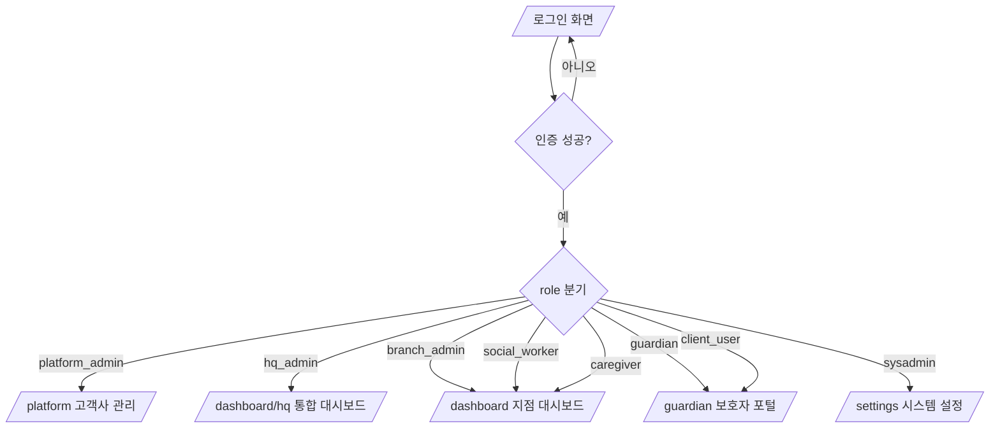
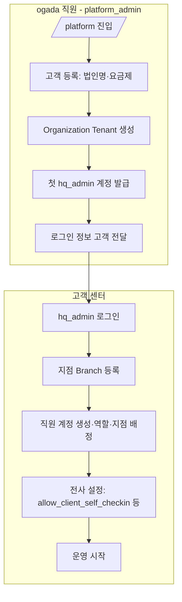
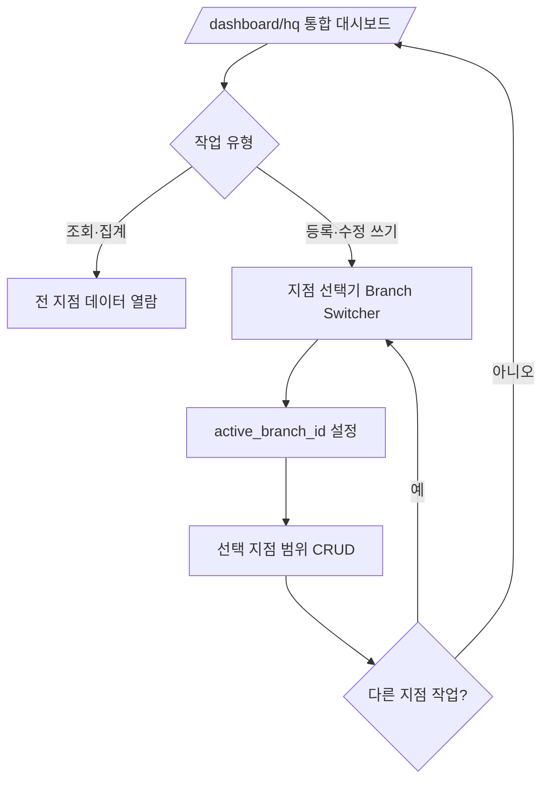
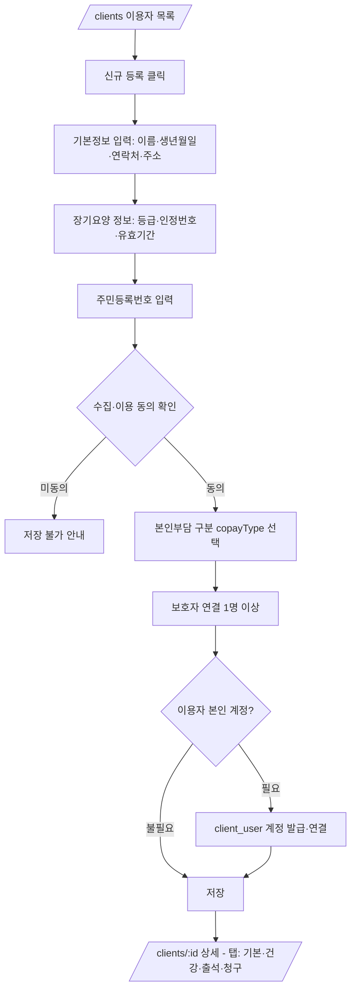
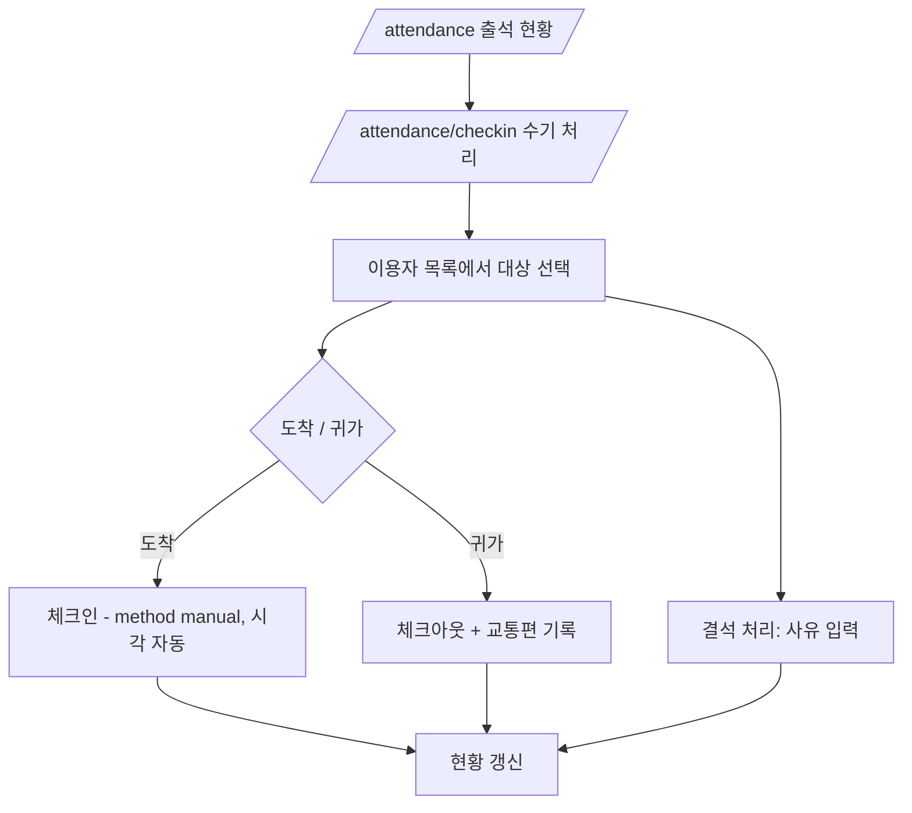
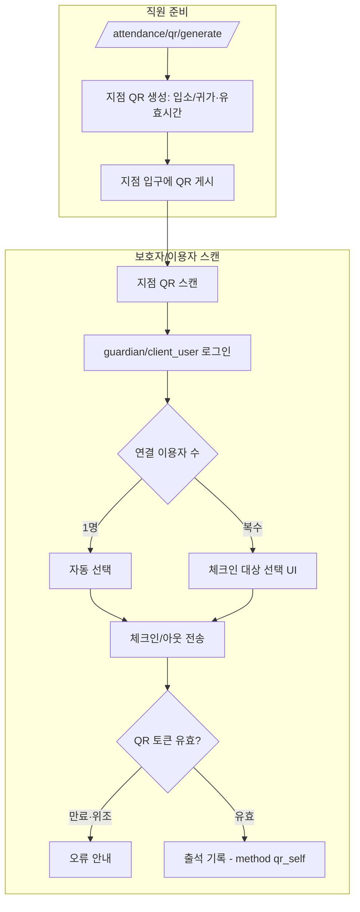
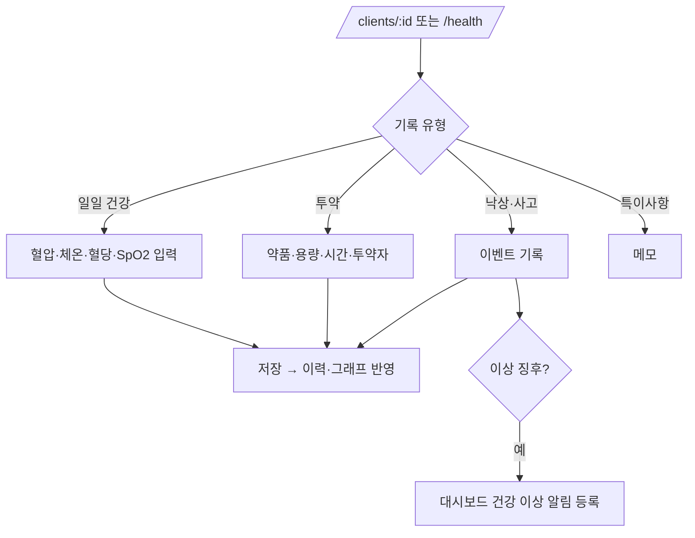
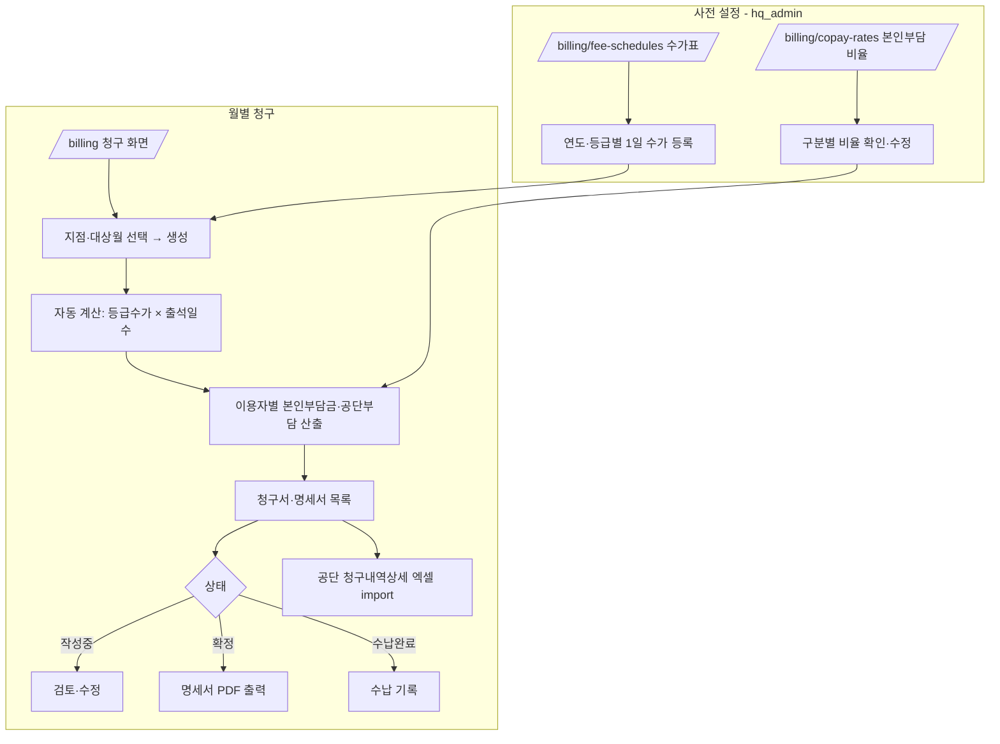
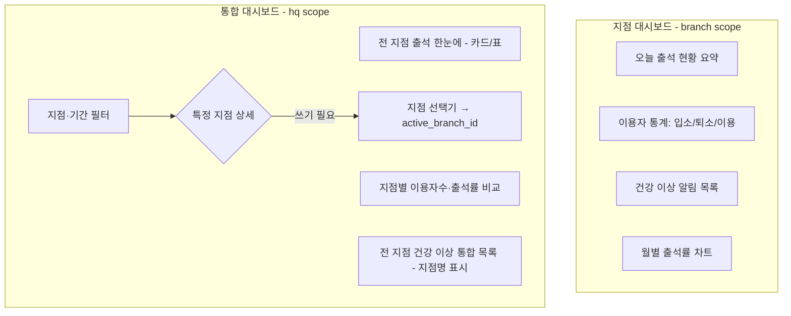
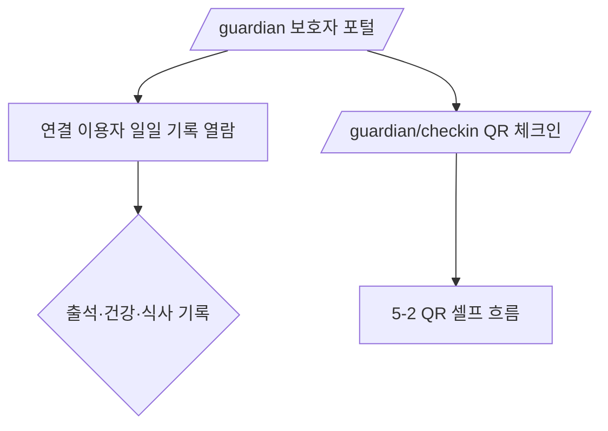

# 주간보호센터 웹 시스템 — 화면 흐름도 (FLOWCHART.md)

> **작성**: planner 에이전트
> **최초 작성일**: 2026-06-05
> **상태**: 초안 (Draft) — 사용자 승인 전
> **범위**: MVP v1 (Must) — 7역할 + `client_user`
> **기준 문서**: `REQUIREMENTS.md`(§2-4 역할별 홈, §5 화면 목록), `API_SPEC.md`

> 다이어그램은 Mermaid 문법. GitHub·VS Code 등에서 렌더링됩니다.

---

## 1. 로그인 → 역할별 홈 라우팅 (전체 진입)

REQUIREMENTS §2-4 기준. 로그인 후 JWT의 `role`로 홈 화면을 분기한다.

> 세션 30분 비활성 시 자동 만료 → 로그인 화면 복귀(§3-1).

---

## 2. 신규 고객 온보딩 (platform_admin) — §1-3

ogada 직원이 새 센터(Tenant)와 첫 `hq_admin`을 만든 뒤, 고객이 운영을 시작하는 전체 흐름.

---

## 3. 다지점 권한·지점 전환 (hq_admin) — §2-3

`hq_admin`은 전 지점 조회·집계가 기본이며, **쓰기**는 지점 선택기로 `active_branch_id`를 정한 경우 해당 지점만.

---

## 4. 이용자 등록 (branch_admin / social_worker) — §3-2

> 주민등록번호는 암호화 저장·마스킹 표시(§3-2-1). 동의 미완료 시 저장 차단.

---

## 5. 출석 — 2경로 (수기 + QR B방식) — §3-3

### 5-1. 수기 체크인/아웃 (직원)

### 5-2. QR 셀프 체크인 (보호자 / 이용자 본인 — B방식)

> `client_user` 스캔은 Organization `allow_client_self_checkin`이 on일 때만 허용(§3-3).

---

## 6. 건강 기록 입력 (caregiver 이상) — §3-4

---

## 7. 청구·정산 (hq_admin / branch_admin) — §3-9

수가표·본인부담 비율표를 선행 설정한 뒤 월별 청구서를 생성한다.

> 공단 포털 직접 전송·보호자 발송·CMS 결제는 MVP 제외(후속).

---

## 8. 대시보드 — §3-11

---

## 9. 보호자 포털 (guardian / client_user) — §3-7 일부 (MVP는 열람+QR)

> MVP 보호자 포털은 **기록 열람 + QR 체크인** 중심. 알림(알림톡/SMS)은 v1 이후(§3-7).

---

## 10. 화면 ↔ 역할 ↔ API 매핑 요약

| 화면 | 주 역할 | 주요 API(§API_SPEC) |
|------|---------|----------------------|
| `/` 로그인 | 전체 | `POST /auth/login` |
| `/platform` | platform_admin | `/platform/organizations*` |
| `/dashboard/hq` | hq_admin | `/dashboard/hq*`, `/auth/active-branch` |
| `/dashboard` | branch_admin·social_worker·caregiver | `/dashboard/branch` |
| `/clients*` | branch_admin·social_worker | `/clients*` |
| `/attendance*` | caregiver 이상 | `/attendance*`, `/branches/{id}/qr` |
| `/guardian*` | guardian·client_user | `/attendance/qr/scan`, `/guardian/checkin-targets` |
| `/health*` | caregiver 이상 | `/clients/{id}/health*` |
| `/billing*` | hq_admin·branch_admin | `/billing/*` |
| `/settings` | sysadmin | `/settings/*` |

---

*이 문서는 planner 에이전트가 관리합니다. 흐름 변경 시 `REQUIREMENTS.md`·`API_SPEC.md`와 동기화하세요.*
