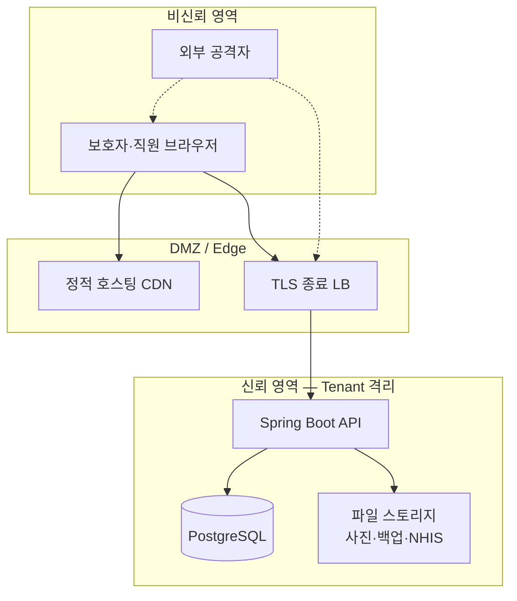

<!-- doc:owner=SEC doc:audience=COD,PLN,TSR updated=2026-06-23T17:00:00+09:00 -->
# 위협 모델 (security/THREAT_MODEL.md)

> **작성**: security_auditor (`SEC`)  
> **방법**: STRIDE + 데이터 흐름 기반  
> **시스템**: ogada — 주간보호센터 B2B SaaS (멀티테넌트)  
> **스택**: React SPA ↔ Spring Boot API ↔ PostgreSQL  
> **2026-06-23 23차 갱신**: develop **`5fd12dd`/`426d63a`**(양 스트림 **WT DIRTY** — BE 9M+1U·FE 38M+11U) · `origin/test`=`598d108`/`ab4de83`(P0·SEC-D14·530+187 unpushed). 신규: **V172 staff_annual_leave_yearly roster/yearly/save API** · **V173 defense-in-depth(상한·합계·non-empty·user_branch 3-way FK) + readiness probe** · **V174 staff_leave_ledger per-event canonical API**(Tenant FK pairs·leave_type/days CHECK) · **V175 leave_ledger 무결성(memo non-empty·user_branch FK·WT untracked·SEC-D35)** · **G-STAFF-ANNUAL-LEAVE 입력 검증**(범위·precision·합계·payload 길이) · **j03 solapi placeholder 거부**(fail-closed 강화) · **ClientService 주소 마스킹**(PII 최소노출·시·구·도로명까지) · **live-e2e 테넌트 UUID 격리**(dev seed 비중첩). **23차 신규 BLOCK급 audit Open 0건** · **신규 SEC-D35**(V175 미커밋·양 스트림 WT DIRTY·Low/process). SEC-D33·D34·D4(4 파서)·SEC-D18 악화(+16/+20) 유지. 상세 `SECURITY_AUDIT.md` §1.25.

---

## 1. 시스템 개요

### 1-1. 신뢰 경계



### 1-2. 자산 (가치 순)

| 순위 | 자산 | 분류 | 보호 요구 |
|------|------|------|-----------|
| 1 | 주민등록번호·건강기록 | 고유식별·민감정보 | 암호화·RBAC·audit |
| 2 | JWT·refresh·QR 토큰 | 인증 자격증명 | 단기·해시·rate limit |
| 3 | 청구·NHIS 데이터 | 영업·행정 | Tenant 격리·무결성 |
| 4 | 감사 로그 | 컴플라이언스 | 변조 방지·3년 보존 |
| 5 | 직원 계정·비밀번호 | 인증 | bcrypt·lockout |

### 1-3. 역할·권한 매트릭스 (요약)

| 역할 | 테넌트 | 지점 | PII 쓰기 | RRN reveal | 플랫폼 |
|------|--------|------|----------|------------|--------|
| ogada_platform_admin | 전체 | — | — | — | ☑ (구 `platform_admin`·V160 rename) |
| hq_admin | 자기 org | active_branch 쓰기 | ☑ | ☑ | — |
| branch_admin | 자기 org | 할당 지점 | ☑ | ☑ | — |
| social_worker | 자기 org | 할당 지점 | ☑ | ☑ | — |
| caregiver | 자기 org | 할당 지점 | 제한 | — | — |
| guardian | 자기 org | 연결 이용자 | 읽기 | — | — |
| client_user | 자기 org | 본인 | 읽기 | — | — |
| sysadmin | 자기 org | — | 설정 | — | — |

---

## 2. 데이터 흐름 (DFD)

### 2-1. 로그인·JWT 발급

```
[사용자] --email/password--> [POST /auth/login]
    --> [AuthService] --bcrypt--> [users]
    --> [JwtTokenService] --RS256--> access JWT + opaque refresh
    --> [클라이언트] AuthContext + session.js (메모리 JWT)
```

**위협**: credential stuffing, JWT 키 탈취, refresh 탈취

### 2-2. 이용자 PII CRUD

```
[직원] --Bearer JWT--> [ClientController]
    --> [JwtScopeResolver] org/branch 검증
    --> [ClientService] --AES-GCM--> [clients.*_encrypted]
    --> 마스킹된 DTO 응답
```

**위협**: IDOR, 크로스테넌트, RRN 무단 reveal

### 2-3. NHIS Excel Import

```
[관리자] --multipart xlsx--> [BillingController]
    --> [NhisImportService] --Apache POI--> 파싱
    --> [billing_claims] 매칭·저장
```

**위협**: 악성 OOXML (CVE-2025-31672), zip bomb, 잘못된 청구 데이터 주입

### 2-4. QR 출석 체크인

```
[보호자 앱] --QR 스캔--> [AttendanceController]
    --> [QrTokenService] HMAC 검증
    --> [AttendanceService] 소유권·지점 검증
    --> [attendance] 기록
```

**위협**: QR 토큰 위조, 재생 공격, IDOR

### 2-5. 보호자 알림 (Solapi alimtalk/SMS, v2/J03)

```
[BillingNotifyService] --tenant scope--> [GuardianPhoneResolver]
    --> [PiiCryptoService] decrypt phone_encrypted
    --> [SolapiMessageClient] HMAC auth --> Solapi API
    --> (외부) 카카오/SMS 전달
```

**위협**: 크로스테넌트 전화번호 유출, API credential 탈취, 로그 PII 노출

### 2-6. 방문요양 일정 (Epic V, v2/G21)

```
[직원] --Bearer JWT--> [VisitController @PreAuthorize]
    --> [VisitService] requireOrganizationId · validateBranchWriteScope
    --> requireHomeVisitBranch(service_type 가드) · requireClientInScope
    --> [visit_schedules] (V53 + V55 무결성 트리거: 퇴소/비활성 가드·actor backstop)
```

**위협**: 비-방문요양 지점 일정 생성, 크로스테넌트 client 연결, 퇴소 이용자 일정, actor 위조 — **V55 트리거 + 앱 스코프로 완화**

### 2-7. CMS 자동이체 등록·출금 (v2 G2/US-L03, FCMS)

```
[관리자] --Bearer JWT--> [CmsController @PreAuthorize(HQ/BRANCH)]
    --> [CmsService] requireOrganizationId · validateBranchWriteScope
    --> guardianClientRepository.existsBy…(연결 보호자 검증)
    --> [FcmsClient] registerMember / requestDebit (외부 Hyosung FCMS)
    --> [cms_enrollments / cms_debit_requests]
        (V59 + V60 복합 테넌트 FK: org+branch/client/guardian/claim/enrollment)
    --> 성공 시 billingService.recordCopayPayment(CONFIRMED→PAID)
```

**위협**: 크로스테넌트 청구↔CMS 위임 교차참조(**V60 복합 FK로 차단**), 전체 계좌번호 유출(**last4만 저장**), FCMS credential 탈취(env·stub default·fail-closed), 중복 출금(REQUESTED/SUCCEEDED 멱등 가드)

### 2-8. 은행 입금 Excel 일괄 처리 (v2 US-L01)

```
[관리자] --multipart xlsx--> [BillingController @PreAuthorize(HQ/BRANCH)]
    --> [BankDepositImportService] requireOrganizationId · validateBranchWriteScope
    --> [BankDepositExcelParser] --Apache POI XSSF--> 파싱(입금자·금액·일자)
    --> org+branch 스코프 CONFIRMED 청구 매칭(이용자명·금액)
    --> billingService.recordCopayPayment(BANK_TRANSFER)
    --> audit_logs(건수만 — 입금자/이용자명 미로깅)
```

**위협**: 악성 OOXML(CVE-2025-31672 — **NHIS와 함께 2번째 POI 표면**), zip bomb, 크로스테넌트 매칭(**org+branch 스코프로 차단**), 입금자명(PII) 로그 노출(건수만 기록)

### 2-8b. 본인부담금 간편결제 (v2 G2/7-5, BNK-189)

```
[관리자] --Bearer JWT--> [EasyPayController @PreAuthorize(HQ/BRANCH)]
    --> [EasyPayService] requireOrganizationId · validateBranchWriteScope
    --> guardianClientRepository.existsBy…(연결 보호자 검증)
    --> prior-month copay guard · CONFIRMED 청구만 · provider allowlist(CARD/KAKAO_PAY)
    --> [EasyPayProvider] createOrder / confirmPayment (stub 또는 실 PG)
    --> [easy_pay_requests] (V108~V111: org/branch/client/guardian 복합 FK·guardian link 트리거)
    --> billingService.recordCopayPayment(CONFIRMED→PAID, EASY_PAY)
```

**위협**: 크로스테넌트 guardian↔client 위조(**V111 트리거+앱 검증**), stub provider prod misconfiguration(**SEC-D28** — 자동 PAID 시뮬레이션), PG credential 탈취, 중복 결제(REQUESTED/PENDING/SUCCEEDED 멱등 가드), 카드번호 저장(**미저장** — pg_order_id·transaction_id만)

### 2-9. G21 RFID plan-vs-tag diff compare (v2 G21, ezCare matrix)

```
[사회복지사/지점관리자] --Bearer JWT--> [VisitController POST /imports/rfid/compare @PreAuthorize]
    --> [VisitService] requireOrganizationId · validateBranchWriteScope · requireHomeVisitBranch
    --> [NhisVisitScheduleExcelParser] + [RfidTransmissionExcelParser] --Apache POI WorkbookFactory-->
    --> [VisitRfidDiffMatcher] diff code 집계 응답 (PII 최소 — 일정·인정번호 메타)
```

**위협**: 악성 OOXML(CVE-2025-31672 — **3번째 POI 파서 표면**), zip bomb, 크로스테넌트 branchId(**앱 스코프로 차단**)

### 2-9a. G32 사례관리 회의 attendee opinions (FAQ21797)

```
[사회복지사/지점관리자] --Bearer JWT--> [CaseManagementController @PreAuthorize]
    --> [CaseManagementService] requireOrganizationId · branch scope
    --> normalizeAttendeeOpinions · validateAttendeeOpinions(참석자 1:1·중복 거부)
    --> [case_management_meetings.attendee_opinions JSONB] (V157 array CHECK)
```

**위협**: 크로스테넌트 meeting IDOR(**org scope로 차단**), malformed JSON injection(**AttendeeOpinionsCodec+CHECK**), 참석자 불일치 데이터(**서버 검증**)

### 2-9b. G-CASH-RECEIPT-LOG 현금영수증 발급 (FAQ21701)

```
[본부/지점관리자] --Bearer JWT--> [BillingController @PreAuthorize(HQ/BRANCH)]
    --> [CashReceiptIssuanceService] requireOrganizationId · validateBranchWriteScope
    --> PAID+CASH 청구 검증 · 1청구 1발급 · 금액=본인부담금
    --> [cash_receipt_issuances] (V158: identifier_value 평문 at-rest — SEC-D32)
    --> 응답 maskIdentifier(010****1234)
```

**위협**: 크로스테넌트 청구 연결(**org+branch scope**), 비현금 청구 발급(**payment_method 가드**), DB 침해 시 휴대폰/사업자번호 노출(**SEC-D32 Low** — API 마스킹·RBAC 제한)

### 2-10. 직원 입사~퇴사 lifecycle (v2 US-R03)

```
[HQ/BRANCH 관리자] --Bearer JWT--> [UserController @PreAuthorize(HQ/BRANCH)]
    --> [UserService] requireOrganizationId · branch scope
    --> enforceRolePolicy(생성/변경 역할 검증 — platform_admin 차단·branch_admin allowlist)
    --> passwordEncoder.encode(비밀번호 해시)
    --> [users] lifecycle_status·hired_at·terminated_at·lifecycle_checklist
        (V86 컬럼 + V87 CHECK: terminated_at >= hired_at · TERMINATED 시 날짜 필수)
```

**위협**: 권한상승(상위 역할 부여 — **enforceRolePolicy로 차단**), 크로스테넌트 직원 변조(org/branch scope), 비밀번호 평문 노출(bcrypt 해시), 비정상 lifecycle 상태(CHECK 제약·퇴사 시 증빙 강제)

### 2-11. 직원 계정 발급 요청·승인 (v2 staff account-request)

```
[HQ/BRANCH 관리자] --Bearer JWT--> [UserAccountRequestController POST @PreAuthorize(HQ/BRANCH)]
    --> [UserAccountRequestService.submit] requireOrganizationId · branch scope
    --> validateAssignableRoleForTenantRequest(enforceRolePolicy — ogada_*/sysadmin/hq_admin 차단·branch_admin allowlist)
    --> [user_account_requests] PENDING (V162: org+requester FK)
[ogada_platform_admin] --Bearer JWT--> [PlatformUserAccountRequestController approve @PreAuthorize(OGADA_PLATFORM_ADMIN)]
    --> [UserAccountRequestService.approve] provisionApprovedAccount(enforceRolePolicy 재검증 · bcrypt encode)
    --> [users] (V161: org당 hq_admin 1 UNIQUE)
```

**위협**: 권한상승(상위/ogada 역할 자가발급 — **enforceRolePolicy 이중 검증**), 크로스테넌트 요청 변조(org scope·V162 FK), 비밀번호 평문(bcrypt), tenant 직접 user 생성 우회(**`createUser` 봉인·승인 경유만**), org 다중 hq_admin(**V161 UNIQUE**)

### 2-12. 요양보호사 NHIS Excel → 계정요청 (v2 G-STAFF-NHIS-EXCEL-IMPORT)

```
[HQ/BRANCH 관리자] --multipart xlsx--> [StaffNhisCaregiverImportController @PreAuthorize(HQ/BRANCH)]
    --> [StaffNhisCaregiverImportService] requireOrganizationId · validateBranchWriteScope
    --> [StaffNhisCaregiverExcelParser] --Apache POI WorkbookFactory--> 파싱(인력번호·성명·생년월일·전화·이메일)
    --> caregiver 역할 하드코딩 account-request submit(권한상승 불가)
    --> audit_logs(건수만 — 이름·전화 미로깅)
```

**위협**: 악성 OOXML(CVE-2025-31672 — **4번째 POI 파서 표면**·SEC-D4), zip bomb, **확장자/Content-Type 미검증**(SEC-D34 — `WorkbookFactory` 자동판별 의존), 권한상승(**caregiver 고정·account-request 경유**로 차단), 크로스테넌트 branch(앱 스코프 차단)

### 2-13. 본인부담금 명세·NTS 의료비공제 CSV export (v2 G-7-1 / g26)

```
[HQ/BRANCH 관리자] --Bearer JWT--> [BillingController GET .../statement-export · /reports/medical-deduction/export @PreAuthorize(HQ/BRANCH)]
    --> [BillingStatementExportService / BillingService] requireOrganizationId · validateBranchWriteScope
    --> CONFIRMED/PAID 청구만 · 보호자 전화 maskedphone · 주소 region label · RRN 없음(NTS는 인정번호)
    --> UTF-8+BOM CSV (csvEscape: quote만 — 수식 prefix 미중화)
```

**위협**: 크로스테넌트 청구 export(org+branch scope 차단), PII 과다 노출(**전화 마스킹·주소 region label·RRN 미포함**으로 완화), **CSV/수식 인젝션**(이용자명·보호자명 `=`/`+`/`-`/`@` prefix → Excel 수식·DDE 실행·**SEC-D33 Low**)

### 2-14. 미납 회수 CRM·금액 조정 (v2 G-BILLING-OVERDUE-ADJUSTMENT, 케어포 p.89)

```
[본부/지점관리자] --Bearer JWT--> [BillingController /overdue/claims/* @PreAuthorize(HQ/BRANCH)]
    --> [OverdueManagementService] requireOrganizationId · validateBranchWriteScope
    --> requireOverdueClaim · requireClaimItem(org+claim+client)
    --> ②③ management records · ④ adjustments(copayAmount 감소만)
    --> [billing_overdue_management_records / billing_overdue_adjustments]
        (V167 + V168: note/reason non-empty CHECK · Tenant FK pairs · recorded_by org scope)
    --> SMS 자동 등록: recordAutomaticSmsRemindersForClaim(중복·과거 청구월·CONFIRMED guard)
```

**위협**: 크로스테넌트 claim/client 연결(**org scope+requireClaimItem**), 권한 없는 caregiver 접근(**HQ/BRANCH only**), 빈 note/reason·cross-tenant actor(**V168 CHECK+FK pairs**), SMS 중복 audit(**existsBy autoGenerated guard**), 금액 조정 악용(**adjustedAmount < previousAmount** 서버 검증)

### 2-15. 출석 roster 일일 목록 (v2 attendance, BNK-479)

```
[직원] --Bearer JWT--> [AttendanceController GET /attendance @PreAuthorize(HQ/BRANCH/SOCIAL_WORKER/CAREGIVER)]
    --> [AttendanceService] requireOrganizationId · resolveBranchScope
    --> 활성 지점 수급자 roster + derived status(CHECKED_IN/OUT/ABSENT)
    --> clientName(지점 스코프 내) · transportMode 필터
```

**위협**: 크로스테넌트 roster(**branch scope**), caregiver 타 지점 수급자 열람(**validateBranchReadScope**), clientName PII 과다(**역할·지점 범위 내 업무 필요 최소**)

### 2-16. 직원 HR 모바일 카메라 촬영 업로드 (v1.2.1 US-R03)

```
[지점관리자/사회복지사] --multipart image--> [StaffHrFileController POST /users/{userId} @PreAuthorize(BRANCH/SOCIAL_WORKER)]
    --> (클라이언트) <input capture="environment" accept="image/*"> — FileUpload/StaffDocumentRepositoryPanel
    --> [StaffHrFileService] requireWritableStaffUser · validateDocumentType
    --> [StaffHrFileStorageService] Content-Type allowlist · size limit · UUID storage key
```

**위협**: 확장자/MIME 위장(**Content-Type allowlist·SEC-D25 magic-byte 미검증**), 크로스테넌트 staff file(**org+branch user scope**), 카메라 캡처 악성 payload(**서버 검증 동일 경로**)

### 2-17. 직원 연차휴가 연간 현황 (v2 US-R03e / G-STAFF-ANNUAL-LEAVE, ezCare worker-b100 tab01)

```
[HQ/BRANCH/사회복지사] --Bearer JWT--> [StaffAnnualLeaveController @PreAuthorize]
    --> [StaffAnnualLeaveService] requireOrganizationId · resolveReadableBranchId(allowlist 교차검증)
    --> requireWritableStaffUser(STAFF_ROLE_CODES·isActive·validateBranchWriteScope) · requireActorUserId
    --> 입력 검증: year 2000~2100 · month≤99.9 · entitlement≤999.9 · sum≤entitlement · precision 1자리 · ≤12개월
    --> [staff_annual_leave_yearly] (V172 + V173: month_max·entitlement_max·used_within·memo nonempty·user_branch 3-way FK)
    --> [V173 readiness probe] 미적용 시 /health·live-e2e fail-fast
```

**위협**: 크로스테넌트 직원 연차 변조(**org scope + user_branch 3-way FK**), 권한 없는 caregiver write(**PUT=BRANCH/SOCIAL_WORKER only**), 상한초과·합계초과·빈 memo 적재(**V173 CHECK + 앱 검증**), 미적용 마이그레이션 운영(**readiness probe fail-fast**)

### 2-18. 직원 연차·유급휴일 per-event 대장 (v3 US-R01-c / 케어포 8-13, BNK-532)

```
[HQ/BRANCH/사회복지사] --Bearer JWT--> [StaffLeaveLedgerController @PreAuthorize]
    --> [StaffLeaveLedgerService] requireOrganizationId · resolveReadableBranchId / requireWritableStaffUser
    --> update/delete: findByOrganizationIdAndId(org 격리) 후 writable 재검증
    --> 입력 검증: leaveType allowlist(ANNUAL_LEAVE/PAID_HOLIDAY) · date order · 0<daysUsed≤99.9 · precision
    --> [staff_leave_ledger_entries] (V174 Tenant FK pairs·CHECK + V175 memo nonempty·user_branch FK·**WT untracked·SEC-D35**)
```

**위협**: 크로스테넌트 휴가 항목 IDOR(**org 격리 조회 + V174 Tenant FK**), 권한 없는 write(**create/update/delete=BRANCH/SOCIAL_WORKER only**), 잘못된 유형·음수 일수(**allowlist + CHECK**), 빈 memo·교차지점 적재(**V175 — 단 미커밋 시 무결성 유실 위험·SEC-D35**)

---

## 3. STRIDE 위협 분석

### 3-1. Spoofing (위장)

| ID | 위협 | 공격 시나리오 | 현재 통제 | 잔여 위험 | 조치 |
|----|------|---------------|-----------|-----------|------|
| T-S1 | JWT 위조 | stolen private key | RS256, JWKS, prod validator | **Low (develop prod)** · **Low (origin/test `598d108`)** |
| T-S2 | QR 토큰 위조 | HMAC secret 추측 | HMAC-SHA256, prod validator | **Low (develop prod)** · **Low (origin/test)** |
| T-S3 | 보호자 계정 탈취 | 피싱·reuse password | bcrypt | Medium | MFA (v2) |
| T-S4 | 프론트 역할 스푸핑 | `/platform` 직접 URL | `ProtectedRoute` (develop) | **Low (develop)** · **Low (origin/test)** — settings/org 분리 @ `f749311` |
| T-J1 | 보호자 초대 토큰 위조·재생 | 만료 토큰 재사용 | 128-bit·SHA-256·rate limit·single-use | **Low** — SEC-D8 Fixed @ `f47ffa1` |
| T-S10 | workspace baseline 불일치 | 잘못된 HEAD 배포 | `workspace_baseline.yaml` | **Low** — SEC-D10 Fixed (`136239e`/`7170b2a`) |

### 3-2. Tampering (변조)

| ID | 위협 | 공격 시나리오 | 현재 통제 | 잔여 위험 | 조치 |
|----|------|---------------|-----------|-----------|------|
| T-T1 | API 요청 org_id 변조 | body에 타 tenant ID | JWT claim만 신뢰 | Low | 유지 |
| T-T2 | xlsx 변조 (NHIS·은행입금·RFID·요양보호사) | duplicate zip entry | POI 5.3.0 (**4 파서**) | Medium | POI 5.4.0 (SEC-D4 20차 확대·요양보호사 확장자 검증 SEC-D34) |
| T-T3 | 감사 로그 삭제 | DB 직접 접근 | 앱 RBAC | Medium | DB 권한 분리 |
| T-T4 | 청구 금액 변조 | 확정 후 수정 API | 비즈니스 규칙 | Low | TSR 검증 |
| T-T5 | 검증된 코드 ≠ 배포 산출물 | merge/push 미실행 | git 이관 규율 | **Low** — `origin/test`=`598d108`/`c7c8f07` P0 포함 ✓ · v2/v1.3 develop 152+186 ahead(feature only·SEC-D18) · 양 스트림 WT CLEAN |
| T-T6 | visit_schedules 직접 변조 | raw SQL·비서비스 경로 | V55 트리거(퇴소 가드·actor backstop) | **Low** — DB-level 무결성 강화 |
| T-T7 | 크로스테넌트 CMS 위임 변조 | 타 테넌트 청구↔CMS 위임 연결 | V60 복합 테넌트 FK + 앱 스코프 | **Low** — DB-level 차단(org+claim/enrollment 복합 FK) |
| T-T8 | 신규 테이블 크로스테넌트/퇴소 client INSERT | raw SQL·body org/branch 변조 | V70/V74 트리거 + V168 overdue + **V173 연차·V174/V175 휴가대장 Tenant FK + user_branch 3-way FK** | **Low** — outings·기능회복·사례관리·미납·**연차/휴가대장** DB-level 무결성(V175 커밋 전까지 leave_ledger nonempty/user_branch FK는 WT만·SEC-D35) |
| T-T9 | tenant context 미설정 우회 | 인증 전 필터 실행으로 org/branch null | SecurityConfig 필터를 `BearerTokenAuthenticationFilter` 뒤로(SEC-D24) | **Low** — 인증 후 JWT principal로 TenantContext 정확 설정 · **커밋 완료(WT CLEAN)** |
| T-T10 | 신규 첨부(급여계약서·등급이력·**HR·보수교육**) 크로스테넌트/퇴소 INSERT | raw SQL·body org/branch 변조 | V85/V79/V92 트리거(client 파생·active 가드·actor backstop) | **Low** — DB-level 무결성 강화 |
| T-T11 | G21 무단 체크인/아웃(배정 외 caregiver) | 타 caregiver ID로 check-in | `VisitService` 배정 caregiver·active·branch 가드(`0db1e68`~`78cfb8a`) | **Low** — 방어 강화 |
| T-T12 | G42 익명함 공개 접수 오해 | 비인증 익명 제보 endpoint | **없음** — `ANONYMOUS_BOX`는 수납 채널 enum·전 API `@PreAuthorize` | **Low** — 공개 endpoint 아님 |

### 3-3. Repudiation (부인)

| ID | 위협 | 공격 시나리오 | 현재 통제 | 잔여 위험 | 조치 |
|----|------|---------------|-----------|-----------|------|
| T-R1 | PII 조회 부인 | RRN reveal 후 부인 | audit_logs | Low | 목적 필드 강화 |
| T-R2 | 로그인 부인 | 공유 계정 | login_history | Low | 계정 공유 금지 정책 |

### 3-4. Information Disclosure (정보 노출)

| ID | 위협 | 공격 시나리오 | 현재 통제 | 잔여 위험 | 조치 |
|----|------|---------------|-----------|-----------|------|
| T-I1 | 크로스테넌트 데이터 | scope bypass bug | JwtScopeResolver | Medium | RLS + TSR |
| T-I2 | 에러 스택 노출 | 500 응답 | GlobalExceptionHandler | Low | 유지 |
| T-I3 | 백업 error_message | SYSADMIN API | 역할 제한 | Medium | 메시지 sanitize |
| T-I4 | SQL 로그 PII | format_sql | prod off 필요 | Low | 설정 |
| T-I5 | XSS·무방비 UI | URL 직접 접근·XSS | React escape · ProtectedRoute (develop) | **Low (develop)** · **Low (origin/test)** |
| T-I9 | 설정 API JWT 미첨부 | raw fetch 401·기능 불능 | `apiFetch` Bearer | **Low** — SEC-D17 **Fixed**(raw fetch는 `http.js` 래퍼 1곳뿐·전 페이지 `services.js`) |
| T-I10 | DB 예외 메시지 노출 | 스키마 드리프트·이메일 중복 힌트 | 고정 메시지(raw cause 미echo) | **Low** — SEC-D19 **Fixed(committed)** · 인증 사용자 한정 힌트만 |
| T-I11 | 계좌·예금주명 유출 | DB 침해·로그 | last4만 저장·payer_name 평문 | **Low** — 전체 계좌번호 미저장(SEC-D21 payer_name 암호화 검토) |
| T-I12 | dev 시크릿 파일 Git 유출 | `git add .` → `dev-backend.env` 커밋 | WT `.gitignore` `*.env`/`scripts/*.env` 무시 | **Low** — SEC-D22 완화 · `git check-ignore` 통과 · parent repo 커밋 대기 |
| T-I13 | pilot 더미 데이터 prod 시딩 | hq_admin이 prod에서 PilotFixturePanel 실행 | `import.meta.env.DEV` 게이트 커밋 | **Low** — SEC-D23 **Fixed** · prod 빌드 미렌더 |
| T-I14 | 첨부 파일 위장(확장자/MIME 위조) | png/pdf 위장한 악성 파일 업로드 | Content-Type 화이트리스트+크기·저장 키 UUID 서버 생성 | **Low~Medium** — SEC-D25 · HR·보수교육 증명서 표면 추가 · magic-byte 미검증 |
| T-I15 | dev 빌드 체인 RCE | 악의적 NPM registry로 esbuild binary 치환 | overrides `esbuild ^0.25.0` | **Low(dev)** — SEC-D26 GHSA-gv7w-rqvm-qjhr · prod 0건 · CI 격리 권고 |
| T-I16 | health·live-e2e 상태 정보 노출 | `GET /api/v1/health`로 activeProfiles·DB 장애 유형·live-e2e readiness 추론 | permitAll health · DB probe detail sanitize | **Low** — SEC-D30 · prod profile 마스킹 권고 |
| T-I17 | CSV/수식 인젝션 | 이용자명·보호자명에 `=`/`+`/`-`/`@` 삽입 → 명세·NTS export CSV를 Excel로 열 때 수식·DDE 실행 | org+branch RBAC export · `csvEscape` quote(`"`/`,`/`\n`) | **Low** — SEC-D33 · 수식 prefix sanitize(`'` escape) 권고(CWE-1236) |
| T-I6 | DB 백업 유출 | 스토리지 침해 | — | **High** | 백업 암호화 |
| T-I7 | PII 전화번호 마스킹 회귀 | 마스킹 제거 빌드 배포 | `PhoneMaskingUtil`·`MaskedPhone` | **Low** — SEC-D9 Fixed · `010-****-5678` 유지 |
| T-I8 | Solapi relay credential 노출 | env 누락·로그 유출 | env 주입·HMAC 헤더 | **Low** — 미설정 fail-closed · 로그에 key/전화 미노출 |

### 3-5. Denial of Service (서비스 거부)

| ID | 위협 | 공격 시나리오 | 현재 통제 | 잔여 위험 | 조치 |
|----|------|---------------|-----------|-----------|------|
| T-D1 | 로그인 flood | mass POST /login | `AuthRateLimitService` (60s window) | **Low (develop)** · **Low (origin/test `598d108`)** |
| T-D2 | 대용량 업로드 | 10MB×N 동시 | multipart limit | Medium | WAF·conn limit |
| T-D3 | xlsx 파싱 CPU | zip bomb xlsx (NHIS·은행입금·RFID·요양보호사 4표면) | multipart limit | Medium | POI 5.4.0+ 업그레이드(SEC-D4 상향) |

### 3-6. Elevation of Privilege (권한 상승)

| ID | 위협 | 공격 시나리오 | 현재 통제 | 잔여 위험 | 조치 |
|----|------|---------------|-----------|-----------|------|
| T-E1 | branch_admin → hq_admin | role 변경 API | `UserService.enforceRolePolicy` (US-R03) | **Low** — branch_admin 역할 부여 allowlist · `platform_admin` 생성 차단 |
| T-E2 | guardian → staff 데이터 | 잘못된 branch_ids | JWT 발급 시 검증 | Low | 유지 |
| T-E3 | ApplicationTemp (CVE) | 동일 호스트 공격자 | Boot **3.3.1** | **Medium** — 패치 라인 업그레이드 검토 | Boot CVE 스캔 |
| T-E4 | 직원 생성 시 상위 역할 부여 | account-request role=ogada_*/hq_admin | `enforceRolePolicy` allowlist(submit+approve 이중)·`createUser` 봉인·`@PreAuthorize` | **Low** — ogada_*/sysadmin/hq_admin 차단·branch_admin allowlist·V161 hq_admin UNIQUE (US-R03·account-request 20차) |
| T-E5 | live-e2e bootstrap 무인증 hq_admin | `LIVE_E2E_BOOTSTRAP_ENABLED=true` 노출 환경 | `@ConditionalOnProperty` 기본 off · `ProductionSecretValidator` prod 거부 · password 필드 0 · blank credential fail-fast · probe default cred 허용(QA-B95) | **Low** — SEC-D29 **Mitigated** |

---

## 4. 공격 트리 (우선 시나리오)

### 시나리오 1: 크로스테넌트 이용자 정보 유출

```
목표: Tenant A 직원이 Tenant B 이용자 PII 조회
├── [1] JWT organization_id 변조 → 실패 (서명 검증)
├── [2] API에 타 org UUID 전달 → 실패 (JWT scope)
├── [3] SQLi로 RLS 우회 → 실패 (파라미터 바인딩)
└── [4] 앱 버그 — scope 검증 누락 엔드포인트 → **가능** (회귀 테스트 필수)
```

**완화**: TSR 크로스테넌트 테스트, 코드 리뷰 체크리스트, (선택) PostgreSQL RLS

### 시나리오 2: 인증 API 브루트포스

```
목표: 유효 계정 비밀번호 탈취
├── [1] POST /auth/login 대량 시도 → **차단**(AuthRateLimitService — develop·`origin/test` 모두 포함)
├── [2] 동일 메시지로 계정 존재 여부 확인 → 어려움 (통일 메시지)
└── [3] reset-request로 이메일 열거 → 어려움 (generic 응답)
```

**완화**: `AuthRateLimitService` ✓(develop·`origin/test` 공통·SEC-D14 Fixed), CAPTCHA (v2), account lockout

### 시나리오 3: 악성 NHIS Excel 업로드

```
목표: 잘못된 청구 데이터 주입 또는 서버 장애
├── [1] duplicate zip entry xlsx → POI 5.3.0 비일관 파싱 (CVE-2025-31672)
├── [2] oversized xlsx → 10MB 제한으로 완화
└── [3] 매크로/외부 링크 → POI 기본 비활성
```

**완화**: POI 5.4.0+, 업로드 전 파일 시그니처, 신뢰 공단 파일만 허용 정책

### 시나리오 4: 프론트엔드 권한 우회 (현재)

```
목표: 미인증 사용자가 /platform 접근
└── [1] URL 직접 입력 → **차단**(develop `ProtectedRoute` 역할 가드 커밋) — 단 클라이언트 가드는 우회 가능
```

**완화**: ProtectedRoute(커밋 완료) + 백엔드 `@PreAuthorize`가 최종 방어 (이중 검증, A-2-3 커버리지 필수)

---

## 5. 신뢰 수준·가정

| 가정 | 신뢰도 | 비고 |
|------|--------|------|
| TLS 종료 LB 정상 구성 | 필수 | 인프라 팀 |
| PostgreSQL 네트워크 격리 | 필수 | API만 접속 |
| 운영 시크릿은 시크릿 매니저 | **부분 충족** (develop prod: `ProductionSecretValidator` / test stale) | test merge + 시크릿 매니저 |
| 파일럿 사용자 기기 무악성 | 낮음 | 보호자 모바일 고려 |
| Spring Boot 단일 JVM 또는 키 공유 | **부분 충족** (develop prod 키 필수; test stale) | test merge |
| 검증 코드 = 배포 산출물 | **충족** — `origin/test`=`598d108`/`c7c8f07` P0 포함 · v2/v1.2.1/v1.3 feature merge 잔여(198+241) | SEC-D18 develop→test TSR merge |

---

## 6. 위협 우선순위 매트릭스

```
영향 ↑
  │  T-E3 CVE        T-I6 백업
  │  T-S1 JWT key    T-S4 프론트
  │  T-D1 brute      T-I1 cross-tenant
  │  T-S2 QR         T-T2 NHIS
  └────────────────────────→ 가능성
```

| 순위 | Threat ID | DREAD (1-10) | 조치 우선 |
|------|-----------|--------------|-----------|
| 1 | T-T2/T-D3 / SEC-D4 | 6 | POI 5.4.0+ — **NHIS·은행입금·RFID·요양보호사** 4 파서 회귀 테스트 |
| 2 | T-E3 / A06-1 | 5 | Spring Boot 패치 라인 업그레이드 |
| 3 | T-I14 / SEC-D25 | 4 | 첨부 magic-byte(HR·보수교육·사진·xlsx·급여계약서·등급이력·요양보호사) |
| 4 | T-I17 / SEC-D33 | 3 | CSV export 수식 prefix sanitize(명세·NTS) |
| 5 | T-T2 / SEC-D34 | 3 | 요양보호사 import 확장자/Content-Type 검증 |
| 6 | T-I15 / SEC-D26 | 3 | form-data dev 패치 또는 CI 격리(1 HIGH) |
| 7 | T-I12 / SEC-D22 | 3 | parent repo `.gitignore` `*.env` 커밋 |
| 8 | T-E5 / SEC-D29 | 2 | live-e2e prod misconfiguration 방지(validator·password 0) |
| 9 | T-I6 백업 암호화 | 4 | 인프라 백업 암호화 |
| 10 | T-I11 / SEC-D21·D32 | 2 | `payer_name`·현금영수증 `identifier_value` at-rest 암호화(V159 무결성은 보강) |
| 11 | T-I16 / SEC-D30 | 2 | prod health `activeProfiles` 마스킹 |
| 12 | SEC-D35 (process) | 2 | **V175 커밋 + develop 커밋·push**(양 스트림 WT DIRTY·무결성 제약 유실 방지) |
| ✅ | V172/V173/V174·readiness probe·annual-leave/leave-ledger RBAC·j03 placeholder 거부·ClientService 주소 마스킹·live-e2e 격리·SEC-D17·D19·D14·D23·D24 | ↓ | develop `5fd12dd`/`426d63a` Pass/보안 긍정 |

---

## 7. 모니터링·탐지

| 이벤트 | 탐지 방법 | 대응 |
|--------|-----------|------|
| 로그인 실패 급증 | `login_history` 집계 | IP 차단·알림 |
| RRN reveal 급증 | `audit_logs` `CLIENT_RRN_REVEALED` | 계정 정지·조사 |
| 401/403 급증 | API 로그 | 스캔·권한 오류 조사 |
| NHIS import 실패 | `billing` import 로그 | 파일 격리·분석 |
| 비정상 Tenant 접근 | scope exception 로그 | SEC 에스컬레이션 |

---

## 8. 미해결 질문

> 불확실 항목 — `docs/planning/PLAN_NOTES.md` `### [SEC] 보안 감사 질문` 참조

1. 프로덕션 TLS 종료 지점 (LB vs 앱) — HSTS 적용 주체
2. 백업 스토리지 암호화·접근 제어 상세 (S3/OCI 등)
3. 파일럿 배포 시 MFA 요구 여부

---
*다음 갱신: V175 커밋 + 양 스트림 develop 커밋·push(SEC-D35·SEC-D18 530+187)·poi-ooxml 상향(SEC-D4·4 파서)·CSV export 수식 sanitize(SEC-D33)·요양보호사 import 검증(SEC-D34)·Spring Boot 패치(A06-1)·첨부 magic-byte(SEC-D25)·form-data dev 패치(SEC-D26)·`.gitignore` `*.env` 커밋(SEC-D22) 또는 신규 src 변경 후*
