<!-- doc:owner=DBA doc:audience=COD,PLN,TSR updated=2026-06-15T09:55:00+09:00 -->
# 주간보호센터 웹 시스템 — ERD (technical/ERD.md)

> **작성**: db_architect 에이전트
> **최초 작성일**: 2026-06-05
> **상태**: MVP v1 기준
> **근거 문서**: `docs/planning/REQUIREMENTS.md` §3, `docs/technical/API_SPEC.md`, `docs/planning/USER_STORIES.md`
> **DDL**: `src/backend/src/main/resources/db/migration/V1__*.sql` … `V127__*.sql`

---

## 1. 설계 원칙

| 원칙 | 내용 |
|------|------|
| 멀티테넌트 | 모든 운영 데이터는 `organization_id` 필수. Tenant 간 FK·쿼리 교차 금지 |
| 지점 스코프 | 이용자·출석·건강·청구 등은 `branch_id`로 지점 소속 식별 |
| RBAC | JWT `role` + `branch_ids[]` + `active_branch_id` (API_SPEC §0-2) |
| PII | 주민번호 암호화·마스킹, 연락처·주소 암호화 권장 (REQUIREMENTS §3-2-1) |
| 감사 | 민감 열람·상태 변경·PII 복호화는 `audit_logs` 기록 |
| 이력 보존 | 수가·본인부담률·청구 확정 시점 스냅샷 — 과거 청구 재계산 불변 |

---

## 2. 역할(RBAC) ↔ 데이터 접근

| 역할 코드 | `organization_id` | `branch_ids` | 운영 데이터 CRUD |
|-----------|-------------------|--------------|------------------|
| `platform_admin` | **NULL** (ogada 내부) | 없음 | Tenant·초기 `hq_admin` 생성만 |
| `hq_admin` | 소속 Tenant | 전 지점(또는 배정 지점) | 조회·집계 전 지점, **쓰기는 `active_branch_id`만** |
| `branch_admin` | 소속 Tenant | 소속 지점 | 소속 지점 전체 |
| `social_worker` | 소속 Tenant | 소속 지점 | 이용자·건강 (직원관리 제외) |
| `caregiver` | 소속 Tenant | 소속 지점 | 출석·건강 쓰기, 이용자 읽기 |
| `guardian` | 소속 Tenant | 연결 이용자 지점 | 연결 `client` 출석(QR)·기록 열람 |
| `client_user` | 소속 Tenant | 본인 `client` 지점 | 본인 1명 QR 출석·제한 열람 |
| `sysadmin` | 소속 Tenant | 전 지점(읽기) | 기술 설정·감사 로그 (운영 CRUD 없음) |

`users` ↔ `user_branches` M:N으로 지점 스코프 배정. `guardian`/`client_user`는 `guardian_clients` 또는 `clients.user_id`로 이용자 연결.

---

## 3. 전체 관계도 (MVP)

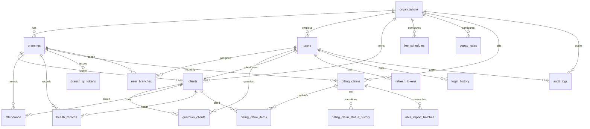
```mermaid
erDiagram
    organizations ||--o{ branches : has
    organizations ||--o{ users : employs
    organizations ||--o{ clients : owns
    organizations ||--o{ fee_schedules : configures
    organizations ||--o{ copay_rates : configures
    organizations ||--o{ billing_claims : bills
    organizations ||--o{ audit_logs : audits

    branches ||--o{ clients : serves
    branches ||--o{ attendance : records
    branches ||--o{ health_records : records
    branches ||--o{ branch_qr_tokens : issues
    branches ||--o{ billing_claims : monthly

    users ||--o{ user_branches : assigned
    branches ||--o{ user_branches : scope
    users ||--o{ guardian_clients : guardian
    clients ||--o{ guardian_clients : linked
    users ||--o| clients : client_user

    clients ||--o{ attendance : daily
    clients ||--o{ health_records : health
    clients ||--o{ billing_claim_items : billed

    billing_claims ||--o{ billing_claim_items : contains
    billing_claims ||--o{ billing_claim_status_history : transitions
    billing_claims ||--o{ nhis_import_batches : reconciles

    users ||--o{ refresh_tokens : auth
    users ||--o{ login_history : auth
    users ||--o{ audit_logs : actor
```

---

## 4. 도메인별 ERD

### 4-1. 테넌트·조직 (§3-12, API §2–3)

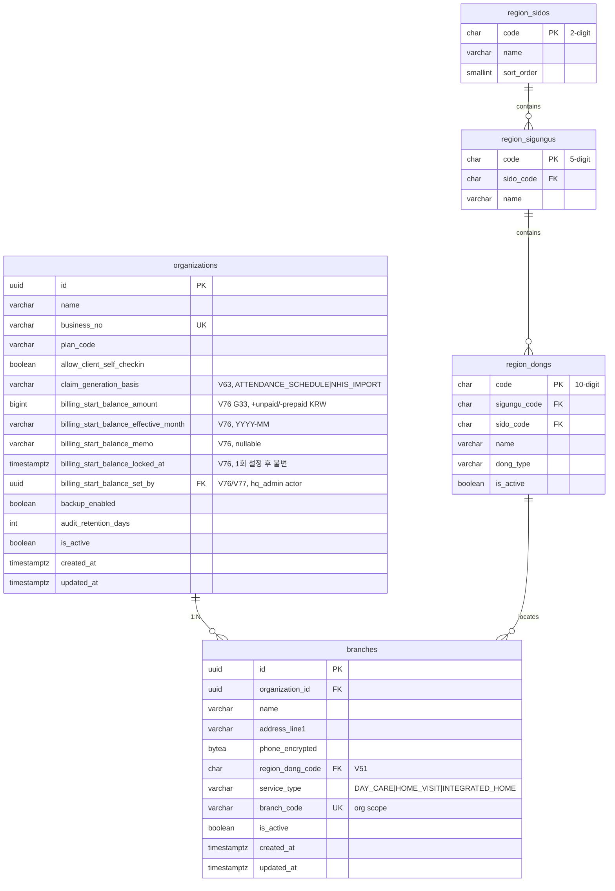
```mermaid
erDiagram
    organizations {
        uuid id PK
        varchar name
        varchar business_no UK
        varchar plan_code
        boolean allow_client_self_checkin
        varchar claim_generation_basis "V63, ATTENDANCE_SCHEDULE|NHIS_IMPORT"
        bigint billing_start_balance_amount "V76 G33, +unpaid/-prepaid KRW"
        varchar billing_start_balance_effective_month "V76, YYYY-MM"
        varchar billing_start_balance_memo "V76, nullable"
        timestamptz billing_start_balance_locked_at "V76, 1회 설정 후 불변"
        uuid billing_start_balance_set_by FK "V76/V77, hq_admin actor"
        boolean backup_enabled
        int audit_retention_days
        boolean is_active
        timestamptz created_at
        timestamptz updated_at
    }

    branches {
        uuid id PK
        uuid organization_id FK
        varchar name
        varchar address_line1
        bytea phone_encrypted
        char region_dong_code FK "V51"
        varchar service_type "DAY_CARE|HOME_VISIT|INTEGRATED_HOME"
        varchar branch_code UK "org scope"
        boolean is_active
        timestamptz created_at
        timestamptz updated_at
    }

    region_sidos {
        char code PK "2-digit"
        varchar name
        smallint sort_order
    }

    region_sigungus {
        char code PK "5-digit"
        char sido_code FK
        varchar name
    }

    region_dongs {
        char code PK "10-digit"
        char sigungu_code FK
        char sido_code FK
        varchar name
        varchar dong_type
        boolean is_active
    }

    organizations ||--o{ branches : "1:N"
    region_sidos ||--o{ region_sigungus : contains
    region_sigungus ||--o{ region_dongs : contains
    region_dongs ||--o{ branches : locates
```

- `organizations.allow_client_self_checkin`: QR B방식 `client_user` 허용 (REQUIREMENTS §3-3).
- **V63 청구 생성 기준** (US-M03, 케어포 9-1): `claim_generation_basis` ∈ `ATTENDANCE_SCHEDULE`|`NHIS_IMPORT` (`chk_organizations_claim_generation_basis`, default `ATTENDANCE_SCHEDULE`). `ATTENDANCE_SCHEDULE` → `generateClaim`이 `attendance` 출석일수 집계(`idx_attendance_billing_days`·`idx_attendance_billing_client_present`). `NHIS_IMPORT` → 동월 `nhis_import_batches`/`nhis_import_rows`의 `MATCHED`/`DISCREPANCY` 행 `service_days` 합산(`findScopedBatches`·`idx_nhis_import_batches_org_branch_claim_created`). Tenant 단위 설정 — `GET/PATCH /settings/billing` (`BillingSettingsController`, `b953662`).
- **V76/V77 G33 청구시작 기준금액** (US-L05, 케어포 PDF p.90): `organizations.billing_start_balance_*` — 도입 전 미납(+)/선납(-) 1회 설정 후 `billing_start_balance_locked_at`·`effective_month`·`memo`·`set_by` **불변**. `POST /settings/billing/start-balance`(`hq_admin`)가 최초 lock — **V77** `fk_organizations_billing_start_balance_set_by_org`·`trg_organizations_set_billing_start_balance_set_by`(V52 actor 패턴)·`trg_organizations_guard_billing_start_balance`(양수 잔액만 감소 허용 — settlement). `POST …/start-balance/settle`·charges ledger opening row·overdue list·claim generation guard는 `OrganizationRepository.findById`(PK) + 인메모리 필터 — **신규 인덱스 불요**. settlement 이력(입금일·수단)은 DB 미저장(앱 응답만, 최소 수집).
- `organizations.backup_enabled`·`audit_retention_days`: `sysadmin` 기술 설정 (API §9, V9).
- `branches`: 지점별 QR·출석·이용자의 물리 단위.
- **V51 (v1.2.1 G14)**: `region_sidos`·`region_sigungus`·`region_dongs` — **Tenant 비스코프** 행정구역 마스터(행안부 법정동 10자리). 파일럿 시드(서울·부산·대구·인천) + `idx_region_sigungus_sido`·`idx_region_dongs_sigungu` partial. `branches.region_dong_code` FK → `region_dongs`, `service_type` ∈ `DAY_CARE`|`HOME_VISIT`|`INTEGRATED_HOME`(REQUIREMENTS `HOME_CARE` 용어와 매핑 — DB enum은 coder V51 확정), `branch_code` = `{dong_code_10}{service_suffix_2}` (`fn_build_branch_code`), UK `(organization_id, branch_code)`. `VisitService`는 `HOME_VISIT`·`INTEGRATED_HOME` 지점만 방문 API 허용(`1812165`).

### 4-2. 인증·계정 (§3-1, API §1)

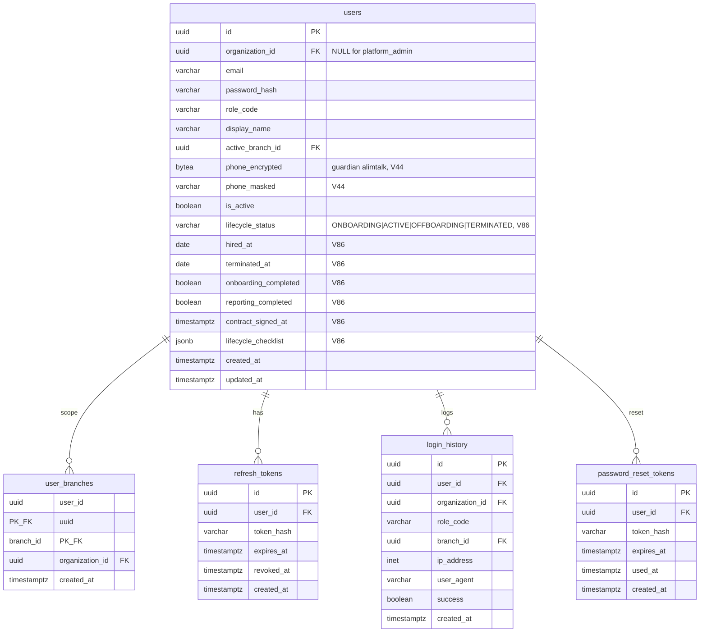
```mermaid
erDiagram
    users {
        uuid id PK
        uuid organization_id FK "NULL for platform_admin"
        varchar email
        varchar password_hash
        varchar role_code
        varchar display_name
        uuid active_branch_id FK
        bytea phone_encrypted "guardian alimtalk, V44"
        varchar phone_masked "V44"
        boolean is_active
        varchar lifecycle_status "ONBOARDING|ACTIVE|OFFBOARDING|TERMINATED, V86"
        date hired_at "V86"
        date terminated_at "V86"
        boolean onboarding_completed "V86"
        boolean reporting_completed "V86"
        timestamptz contract_signed_at "V86"
        jsonb lifecycle_checklist "V86"
        timestamptz created_at
        timestamptz updated_at
    }

    user_branches {
        uuid user_id PK_FK
        uuid branch_id PK_FK
        uuid organization_id FK
        timestamptz created_at
    }

    refresh_tokens {
        uuid id PK
        uuid user_id FK
        varchar token_hash
        timestamptz expires_at
        timestamptz revoked_at
        timestamptz created_at
    }

    login_history {
        uuid id PK
        uuid user_id FK
        uuid organization_id FK
        varchar role_code
        uuid branch_id FK
        inet ip_address
        varchar user_agent
        boolean success
        timestamptz created_at
    }

    password_reset_tokens {
        uuid id PK
        uuid user_id FK
        varchar token_hash
        timestamptz expires_at
        timestamptz used_at
        timestamptz created_at
    }

    users ||--o{ user_branches : scope
    users ||--o{ refresh_tokens : has
    users ||--o{ login_history : logs
    users ||--o{ password_reset_tokens : reset
```

| `role_code` 값 | 비고 |
|----------------|------|
| `platform_admin` | `organization_id` NULL, `user_branches` 없음 |
| `hq_admin` ~ `sysadmin` | Tenant 소속, 이메일은 `(organization_id, email)` UK |
| `guardian`, `client_user` | 보호자·이용자 포털 계정 |

- **V44 (v2 J03)**: `users.phone_encrypted` + `users.phone_masked` — 보호자 초대 수락(`POST /guardian/invitations/{token}/accept`) 시 `phone` 수집·AES-GCM 저장. `GuardianPhoneResolver`가 알림톡/SMS 발송 시 Tenant 스코프 복호화. 직원 역할은 NULL 허용. **V45** `chk_users_phone_pair` — encrypted/masked **쌍** 규칙(`clients` RRN pair 패턴).
- **V86 (v2 US-R03)**: 직원 입사~퇴사 lifecycle 컬럼 — `lifecycle_status`(ONBOARDING/ACTIVE/OFFBOARDING/TERMINATED, 기본 ACTIVE)·`hired_at`·`terminated_at`·`onboarding_completed`·`reporting_completed`·`contract_signed_at`·`lifecycle_checklist`(JSONB). `chk_users_lifecycle_status` 도메인 CHECK + `idx_users_org_lifecycle_status` partial(`organization_id` NOT NULL) 인덱스. `UserService`가 입사 완료(계약 서명/체크리스트)·퇴사 증빙(보고/오프보딩) 전이를 검증. **V87** `chk_users_terminated_after_hired`(`terminated_at >= hired_at`)·`chk_users_terminated_requires_date`(TERMINATED → `terminated_at` 필수) — 앱 검증의 DB 방어선(raw SQL 직접 수정 방어, V36 temporal sanity 패턴).
- **US-S02 (v2 8-7-1, `9c9fd5b`)**: 보수교육 compliance는 **신규 테이블 없음** — `users.hired_at` + `lifecycle_checklist` JSONB 키 `refresher-training`(bool, 완료 여부)만 사용. `StaffRefresherTrainingService`가 `userRepository.findByOrganizationId` → Tenant 목록·`user_branches` 지점 필터·`idx_users_org_lifecycle_status`(V86) 재사용. 격년 2년 due date·4상태(UPCOMING/OVERDUE/COMPLETED/NOT_APPLICABLE)는 **앱 도메인**(`StaffRefresherTrainingCompliance`) — DB CHECK 보류(PLAN_NOTES #115). P2 이수증 첨부·직원 파일함은 별도 DDL 예정.

### 4-3. 이용자·보호자 (§3-2, API §4)

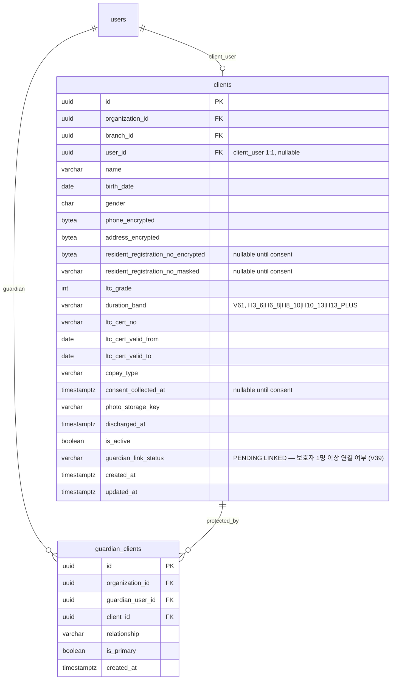
```mermaid
erDiagram
    clients {
        uuid id PK
        uuid organization_id FK
        uuid branch_id FK
        uuid user_id FK "client_user 1:1, nullable"
        varchar name
        date birth_date
        char gender
        bytea phone_encrypted
        bytea address_encrypted
        bytea resident_registration_no_encrypted "nullable until consent"
        varchar resident_registration_no_masked "nullable until consent"
        int ltc_grade
        varchar duration_band "V61, H3_6|H6_8|H8_10|H10_13|H13_PLUS"
        varchar ltc_cert_no
        date ltc_cert_valid_from
        date ltc_cert_valid_to
        varchar copay_type
        timestamptz consent_collected_at "nullable until consent"
        varchar photo_storage_key
        timestamptz discharged_at
        boolean is_active
        varchar guardian_link_status "PENDING|LINKED — 보호자 1명 이상 연결 여부 (V39)"
        timestamptz created_at
        timestamptz updated_at
    }

    guardian_clients {
        uuid id PK
        uuid organization_id FK
        uuid guardian_user_id FK
        uuid client_id FK
        varchar relationship
        boolean is_primary
        timestamptz created_at
    }

    users ||--o{ guardian_clients : guardian
    clients ||--o{ guardian_clients : protected_by
    users ||--o| clients : client_user
```

| `copay_type` | 의미 | 기본 비율 (`copay_rates`) |
|--------------|------|---------------------------|
| `GENERAL` | 일반 | 0.15 |
| `REDUCED_40` | 감경 40% | 0.09 |
| `REDUCED_60` | 감경 60% | 0.06 |
| `MEDICAID` | 기초·의료급여 | 0.00 |

- 주민번호: `resident_registration_no_encrypted` + `resident_registration_no_masked` — **동의 전 NULL 허용**, `consent_collected_at` 설정 후 저장 (DB CHECK `chk_clients_rrn_consent`, `chk_clients_rrn_pair`). `consent_collected_at` 자체도 동의 전 NULL. encrypted/masked는 **쌍으로** NULL 또는 NOT NULL.
- **V61 이용시간 밴드** (`duration_band`): 등급별 수가 조회 키(`fee_schedules.duration_band`)·청구 라인 스냅샷 backstop(`trg_billing_claim_items_set_duration_band` → V62). default `H10_13`(파일럿 10~13h 단일 밴드).
- `ltc_cert_no`: Tenant 내 **UK** `(organization_id, ltc_cert_no)` — 공단 엑셀 매칭·중복 방지.
- 복호화 열람 시 `audit_logs.action = 'PII_DECRYPT_VIEW'`.
- `clients.user_id`(client_user 셀프 출석 계정): 복합 FK `(organization_id, user_id)`로 **동일 Tenant** 계정만 연결 (V7). 등록 시점엔 NULL, 이후 `POST /clients/{id}/client-user`로 발급. `user_id` 설정 시 `users.role_code = 'client_user'` 강제 (V13).
- `guardian_clients.is_primary`: 이용자당 **1명**만 TRUE 가능 (V7 partial UK). 복수 보호자 연결 시 대표 1명 지정.
- `clients.guardian_link_status`: `PENDING` \| `LINKED` — 활성 이용자는 등록 시 **보호자 1명 이상** 연결 필수 (V39 트리거가 `guardian_clients` INSERT/DELETE 시 동기화).
- `guardian_clients.guardian_user_id`: 연결 계정은 `users.role_code = 'guardian'`만 허용 (V13 — QR B방식 스캔 계정 무결성).
- `guardian_clients.organization_id`: **V23** `trg_guardian_clients_set_org`가 연결 `clients`에서 Tenant 자동 복사 — 앱 누락·Tenant 불일치 방어 (V21/V22 NHIS·청구 라인 패턴).
- **V47 (v1.3-A 배차)**: `uses_transport`·`address_search_encrypted`/`address_detail_encrypted`·`pickup_address_encrypted`·`pickup_lat`/`pickup_lng`/`geocoded_at`·`pickup_contact_encrypted`·`default_pickup_time`·`address_verified` 메타. 레거시 `address_encrypted`(V1)와 병행 — coder는 지오코딩 대상을 `pickup_address_encrypted` NULL 시 `address_search`+`detail` 조합으로 해석.
- **`ltc_grade` 도메인 (V99 G9-COG)**: `0`(인지지원등급)–`5`(요양등급 1~5) — `chk_clients_ltc_grade`·`fee_schedules`·`billing_claim_items`·`client_ltc_grade_history` CHECK 전부 `BETWEEN 0 AND 5`. 등급 0 수가·월 급여한도는 `fee_schedules` Tenant 시드 + 인메모리 `MonthlyBenefitCapCatalog`(G27)로 앱이 해석 — DB는 도메인만 허용.
- **V48 (v1.2 P0)**: `client_ltc_grade_history` — `clients.ltc_grade` UPDATE 시 `trg_clients_ltc_grade_history`가 append. 최초 등록 이력은 앱이 INSERT 시 1행 추가 권장(트리거는 UPDATE만).

#### 4-3-1. 보호자 초대 (v1.1 — US-J01, API §4-1, V43)

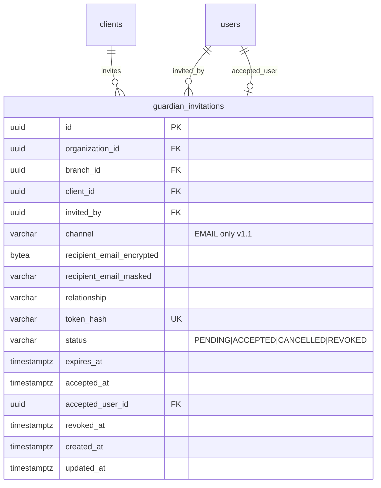
```mermaid
erDiagram
    guardian_invitations {
        uuid id PK
        uuid organization_id FK
        uuid branch_id FK
        uuid client_id FK
        uuid invited_by FK
        varchar channel "EMAIL only v1.1"
        bytea recipient_email_encrypted
        varchar recipient_email_masked
        varchar relationship
        varchar token_hash UK
        varchar status "PENDING|ACCEPTED|CANCELLED|REVOKED"
        timestamptz expires_at
        timestamptz accepted_at
        uuid accepted_user_id FK
        timestamptz revoked_at
        timestamptz created_at
        timestamptz updated_at
    }

    clients ||--o{ guardian_invitations : invites
    users ||--o{ guardian_invitations : invited_by
    users ||--o| guardian_invitations : accepted_user
```

- **v1.1 Must(기능) / MVP DB 범위 외** — develop BE-8(J01)용. 채널 **`EMAIL` 단일**(결정 59, REQUIREMENTS §8-1). SMS·알림톡은 v2.
- `token_hash`: SHA-256 UK — `POST /guardian/invitations/{token}/accept` 조회(V6 토큰 패턴). 평문 토큰은 DB 미저장.
- `recipient_email_encrypted` + `recipient_email_masked`: 목록 API 마스킹(`g***@example.com`) + 발송·재발송용 복호화(PII, REQUIREMENTS §3-2-1 준식별).
- `expires_at`: 발급 후 **7일**(API_SPEC §4-1 가정). 만료는 앱에서 `status=PENDING AND expires_at < now()` → `410`.
- `status`: `PENDING`(활성) → `ACCEPTED`(수락·`guardian` 계정+`guardian_clients` 연결) | `CANCELLED`(직원 DELETE) | `REVOKED`(재발송 시 기존 PENDING 무효화).
- **V43** `trg_guardian_invitations_set_org_branch`: `organization_id`·`branch_id`를 연결 `clients`에서 자동 복사 — 지점 스코프·Tenant FK 정합(V23 `guardian_clients` 패턴).
- **V43** `trg_guardian_invitations_set_invited_by`: `invited_by` ← `ogada.actor_user_id` when NULL(V32 actor 패턴) — `branch_admin`/`social_worker` 감사.
- **V43** `client_id` FK **`ON DELETE CASCADE`** — `guardian_clients`(V2)와 동일. 이용자 물리 purge 시 초대 행 자동 제거(DATA_RETENTION §4-1).
- 복합 FK `(organization_id, client_id)`·`(organization_id, branch_id, client_id)`·actor `(organization_id, invited_by|accepted_user_id)` → V5/V14 Tenant 스코프 패턴.

### 4-4. 출석 (§3-3, API §5)

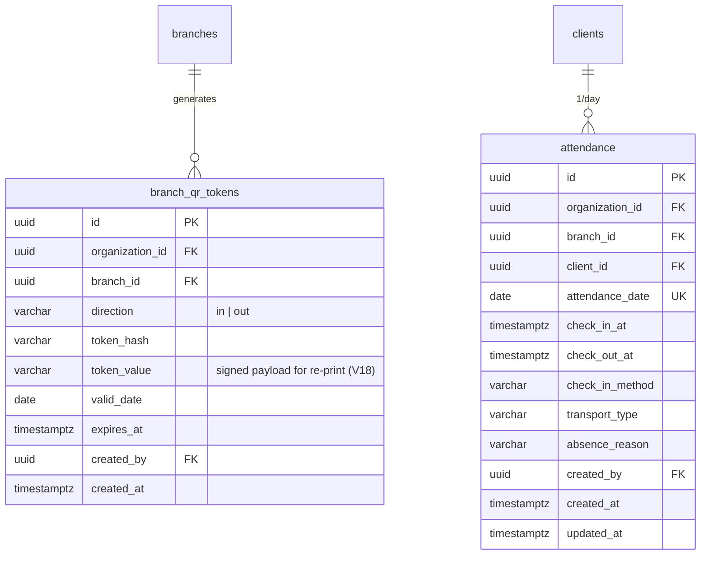
```mermaid
erDiagram
    attendance {
        uuid id PK
        uuid organization_id FK
        uuid branch_id FK
        uuid client_id FK
        date attendance_date UK
        timestamptz check_in_at
        timestamptz check_out_at
        varchar check_in_method
        varchar transport_type
        varchar absence_reason
        uuid created_by FK
        timestamptz created_at
        timestamptz updated_at
    }

    branch_qr_tokens {
        uuid id PK
        uuid organization_id FK
        uuid branch_id FK
        varchar direction "in | out"
        varchar token_hash
        varchar token_value "signed payload for re-print (V18)"
        date valid_date
        timestamptz expires_at
        uuid created_by FK
        timestamptz created_at
    }

    branches ||--o{ branch_qr_tokens : generates
    clients ||--o{ attendance : "1/day"
```

| `check_in_method` | 설명 |
|-------------------|------|
| `manual` | 직원 수기 체크인/아웃 |
| `qr_self` | 보호자·이용자 지점 QR 스캔 (B방식) |

- **UK** `(client_id, attendance_date)`: 하루 1건. 출석(`check_in_at`)과 결석(`absence_reason`)은 **상호배타 + 최소 하나** = XOR (`chk_attendance_presence` V4 + `chk_attendance_presence_xor_absence` V11).
- `attendance_date`는 `check_in_at`·`check_out_at`의 **Asia/Seoul 달력일**과 일치해야 한다 (`chk_attendance_date_matches_*`, V15 — 청구·대시보드 일자 집계 정합).
- 결석 행: `check_out_at`·`transport_type` **NULL**, `check_in_method = manual`만 허용 (`chk_attendance_absence_*`, V14 — US-E01/US-E02). `absence_reason` 공백 불가 (V15).
- `transport_type`은 **체크아웃 후**에만 저장 (`chk_attendance_transport_requires_checkout`, V15). 값은 자유 텍스트(자가용·센터 차량 등).
- 체크아웃은 체크인 선행 필수 (`chk_attendance_checkout_requires_checkin`, V7) + 체크아웃 ≥ 체크인 (V6).
- **INSERT 시** 퇴소·비활성 이용자 차단 (`trg_attendance_guard_active_client`, V10; `trg_health_records_guard_active_client`, V13). 기존 행 UPDATE(체크아웃 등)는 허용.
- `created_by`: V14 actor Tenant FK. **V32** `trg_attendance_set_created_by`가 `ogada.actor_user_id` 세션 변수로 INSERT 시 자동 적재(앱 누락 방어). **coder는** 출석·결석·QR 트랜잭션 시작 시 `DbSessionContext.setActorUserId` 호출 권장 — `AttendanceService.createCheckIn`/`recordAbsence`는 아직 JWT subject를 entity에 직접 설정하지 않음(V33 점검).
- **V37** `chk_attendance_updated_after_created`(`updated_at >= created_at`)·`chk_attendance_checkin_after_created`(`check_in_at IS NULL OR check_in_at >= created_at`): 체크아웃 UPDATE·수기/QR 체크인 INSERT는 JPA `@UpdateTimestamp`·`OffsetDateTime.now()`로 항상 충족. raw SQL backdated check-in·시간 역전 1차 방어(V36 clients/billing temporal 패턴 확장).
- 청구 출석일수: `check_in_at IS NOT NULL` 행만 집계 (`idx_attendance_billing_days`).
- `branch_qr_tokens`: API `/branches/{id}/qr` — 서명·만료 포함. `token_hash`(SHA-256)는 조회 UK, `token_value`(V18)는 직원 재출력용 서명 페이로드를 저장한다(`GET /branches/{id}/qr`).
- `branch_qr_tokens.created_by`: V14 actor Tenant FK. **V35** `trg_branch_qr_tokens_set_created_by`가 session actor로 INSERT 시 자동 적재 — `AttendanceService.generateBranchQr`는 JWT subject를 앱에서 설정하나 raw SQL 방어(V32 패턴).

### 4-5. 건강 기록 (§3-4, API §6)

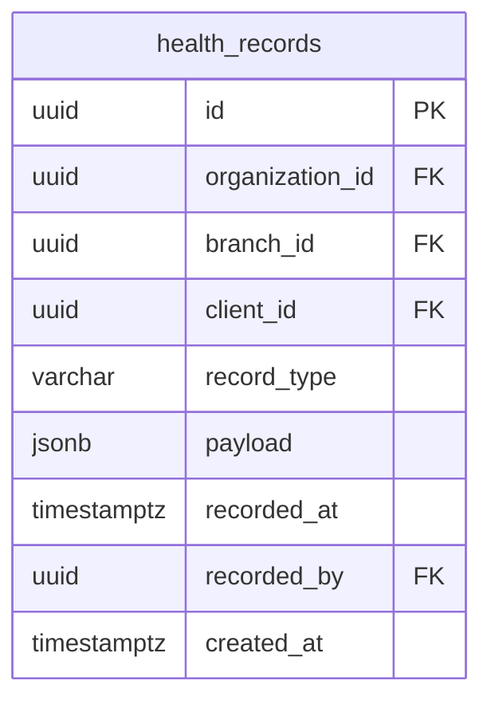
```mermaid
erDiagram
    health_records {
        uuid id PK
        uuid organization_id FK
        uuid branch_id FK
        uuid client_id FK
        varchar record_type
        jsonb payload
        timestamptz recorded_at
        uuid recorded_by FK
        timestamptz created_at
    }
```

| `record_type` | `payload` 실제 JSON 키 (`HealthRecordService` 기준) |
|---------------|---------------------|
| `vitals` | systolic, diastolic, temperature, bloodGlucose, spo2 |
| `medication` | medicationName, dosage, administeredAt, administeredBy |
| `incident` | incidentType, detail |
| `note` | note |

- 위 키는 `HealthRecordService.createVitals/createMedication/createIncident/createNote`가 INSERT하는 `payload` JSONB 키와 **1:1 실측 일치**(2026-06-11 검증). 조회·리포트·알림 템플릿은 `payload ->> 'medicationName'` 등 **이 키 경로**로 접근해야 하며, 과거 표기(`drugName`·`description`·`severity`·`content`)는 폐기 — 실제 행에는 존재하지 않아 NULL이 반환된다.
- MVP는 단일 테이블 + `record_type` 분기. v1 이후 정규화 가능.
- `recorded_by`: V14 actor Tenant FK. **V33** `trg_health_records_set_recorded_by`가 session actor로 INSERT 시 자동 적재 — `HealthRecordService`는 JWT subject를 앱에서 설정하나 raw SQL·ORM bypass 방어(V32 출석 패턴 대칭).
- 대시보드 「건강 이상」: `vitals` payload 범위 초과 또는 `incident` 유형 필터.

### 4-6. 청구·정산 (§3-9, API §7)

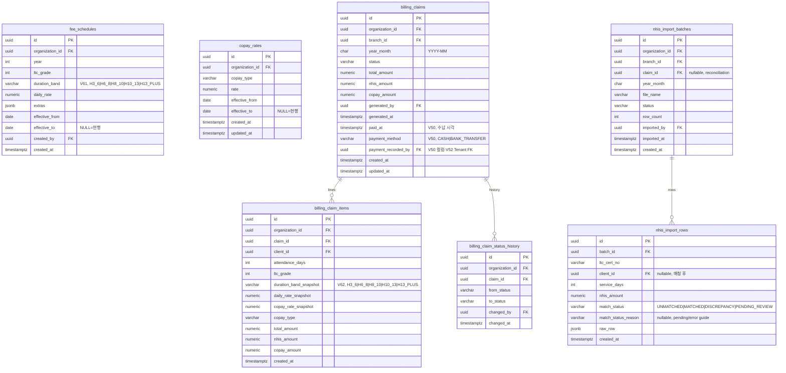
```mermaid
erDiagram
    fee_schedules {
        uuid id PK
        uuid organization_id FK
        int year
        int ltc_grade
        varchar duration_band "V61, H3_6|H6_8|H8_10|H10_13|H13_PLUS"
        numeric daily_rate
        jsonb extras
        date effective_from
        date effective_to "NULL=현행"
        uuid created_by FK
        timestamptz created_at
    }

    copay_rates {
        uuid id PK
        uuid organization_id FK
        varchar copay_type
        numeric rate
        date effective_from
        date effective_to "NULL=현행"
        timestamptz created_at
        timestamptz updated_at
    }

    billing_claims {
        uuid id PK
        uuid organization_id FK
        uuid branch_id FK
        char year_month "YYYY-MM"
        varchar status
        numeric total_amount
        numeric nhis_amount
        numeric copay_amount
        uuid generated_by FK
        timestamptz generated_at
        timestamptz paid_at "V50, 수납 시각"
        varchar payment_method "V50, CASH|BANK_TRANSFER"
        uuid payment_recorded_by FK "V50 컬럼·V52 Tenant FK"
        timestamptz created_at
        timestamptz updated_at
    }

    billing_claim_items {
        uuid id PK
        uuid organization_id FK
        uuid claim_id FK
        uuid client_id FK
        int attendance_days
        int ltc_grade
        varchar duration_band_snapshot "V62, H3_6|H6_8|H8_10|H10_13|H13_PLUS"
        numeric daily_rate_snapshot
        numeric copay_rate_snapshot
        varchar copay_type
        numeric total_amount
        numeric nhis_amount
        numeric copay_amount
        timestamptz created_at
    }

    billing_claim_status_history {
        uuid id PK
        uuid organization_id FK
        uuid claim_id FK
        varchar from_status
        varchar to_status
        uuid changed_by FK
        timestamptz changed_at
    }

    nhis_import_batches {
        uuid id PK
        uuid organization_id FK
        uuid branch_id FK
        uuid claim_id FK "nullable, reconciliation"
        char year_month
        varchar file_name
        varchar status
        int row_count
        uuid imported_by FK
        timestamptz imported_at
        timestamptz created_at
    }

    nhis_import_rows {
        uuid id PK
        uuid batch_id FK
        varchar ltc_cert_no
        uuid client_id FK "nullable, 매칭 후"
        int service_days
        numeric nhis_amount
        varchar match_status "UNMATCHED|MATCHED|DISCREPANCY|PENDING_REVIEW"
        varchar match_status_reason "nullable, pending/error guide"
        jsonb raw_row
        timestamptz created_at
    }

    billing_claims ||--o{ billing_claim_items : lines
    billing_claims ||--o{ billing_claim_status_history : history
    nhis_import_batches ||--o{ nhis_import_rows : rows
```

**계산 규칙** (REQUIREMENTS §3-9-2):

```
이용자별 total = daily_rate(유효 수가) × service_days
copay_amount = total × copay_rate(이용자 copay_type 기준)
nhis_amount = total − copay_amount
```

- `service_days` 출처는 Tenant `organizations.claim_generation_basis`(V63)에 따름: `ATTENDANCE_SCHEDULE` → `attendance` 출석일수(`check_in_at IS NOT NULL`); `NHIS_IMPORT` → 해당 월 `nhis_import_rows.service_days`(매칭 완료 행만).

| `billing_claims.status` | 의미 |
|-------------------------|------|
| `DRAFT` | 작성중 |
| `CONFIRMED` | 확정 (라인 스냅샷 고정) |
| `PAID` | 수납완료 |
| `REFUNDED` | 본인부담금 환불 완료 (V71, US-M03 7-9) |

- 수가·비율 **수정 시 INSERT 신규 행** (`effective_to`로 이전 행 종료). PATCH는 UPDATE가 아닌 버전 추가.
- `fee_schedules.year`는 `effective_from` 연도와 **일치**해야 한다 (`chk_fee_schedules_year_effective`, V13 — §3-9-1 적용연도 버전).
- `fee_schedules.created_by`: V14 actor Tenant FK. **V35** `trg_fee_schedules_set_created_by`가 `ogada.actor_user_id`로 INSERT 시 자동 적재 — `BillingService.createFeeSchedule`은 `createdBy` 미설정, `updateFeeSchedule`만 이전 버전에서 복사(US-G00a).
- `copay_rates.copay_type`은 `clients`·`billing_claim_items`와 동일 4종 CHECK (V13).
- **버전 비중첩 (V7)**: `fee_schedules`(`org, year, grade`)·`copay_rates`(`org, copay_type`)는 `EXCLUDE` + `daterange`로 동일 키의 두 버전이 같은 날 동시 유효할 수 없다. 새 버전 추가 전 이전 행 `effective_to`를 닫지 않으면 거부 → 청구 시점 단일 수가/비율 보장.
- `billing_claim_items`에 `daily_rate_snapshot`, `copay_rate_snapshot` 저장 → 확정 후 불변.
- **V62 밴드 스냅샷** (G9 후속, §3-9-1 수가 버전 보존): V61이 fee_schedules에 `duration_band`(등급 × 이용시간)를 도입했으나 청구 라인은 daily_rate / grade / copay_rate만 스냅샷해 **어느 밴드 수가가 적용됐는지** 재대조할 수 없었다. **V62**가 `billing_claim_items.duration_band_snapshot`(V61과 동일 5종 CHECK `chk_billing_claim_items_duration_band`)을 추가. 기존 행 backfill은 **명시 UPDATE 대신 `NOT NULL DEFAULT 'H10_13'` 후 `DROP DEFAULT`**로 처리 — V8 `trg_billing_claim_items_lock`이 CONFIRMED/PAID 청구의 라인 UPDATE를 거부하므로 UPDATE backfill은 확정/수납 청구에서 실패하나, PG11+ 상수 DEFAULT ADD COLUMN은 메타데이터 전용(행 재기록·트리거 미발생)이라 모든 기존 라인이 안전하게 H10_13(V61 이전 단일 밴드 10~13h)으로 채워진다. DROP DEFAULT 후엔 밴드 생략 INSERT가 NULL로 도착하고 `trg_billing_claim_items_set_duration_band`(BEFORE INSERT, `clients.duration_band`에서 해석 — V32/V48 backstop 패턴, `clients.id` PK 조회로 V21 org backstop 순서 무관)가 채워, 앱이 라인에 밴드를 적재하지 않아도 정확 보존(향후 coder 명시 적재 시 IF NULL로 비간섭).
- **청구서당 이용자 1라인**: `(claim_id, client_id)` **UK** `uq_billing_claim_items_claim_client` (V26; V2 `uq_claim_item_client`는 V27에서 제거) — NHIS `findByClaimIdAndClientId`·헤더 합계 정합.
- **헤더 ↔ 라인 합계**: `DRAFT→CONFIRMED` 전이 시 `billing_claims.total/nhis/copay`가 라인 합계와 일치해야 한다 (`trg_billing_claims_total_reconciliation`, V11). 행 단위 `total=nhis+copay`(V6)와 결합해 확정 청구가 항상 재현 가능.
- `billing_claim_items.organization_id`: `billing_claims`에서 비정규화 — `(organization_id, claim_id)`·`(organization_id, client_id)` 복합 FK로 **Tenant 스코프 라인 무결성** (V16, V5 출석/건강 패턴).
- `billing_claim_status_history`: 상태 전이(`DRAFT→CONFIRMED→PAID`)는 `trg_billing_claims_status_history`(V10, **V21에서 `organization_id` 자동 적재 보완**)가 자동 적재. `changed_by`는 앱이 `SET LOCAL ogada.actor_user_id = '<uuid>'` 설정 시 기록. `organization_id` + `(organization_id, changed_by)` FK로 actor Tenant 일치 (V16, V14 트리거 보완).
- `billing_claims.generated_by`: V14 actor Tenant FK. **V32** `trg_billing_claims_set_generated_by`가 `ogada.actor_user_id`로 INSERT 시 자동 적재 — `BillingService.generateClaim`이 명시 설정하지 않아도 세션 actor 기록 가능.
- **V50 본인부담금 수납 메타** (v2 US-L01·US-L02): `paid_at`·`payment_method`(`CASH|BANK_TRANSFER`, `chk_billing_claims_payment_method`)·`payment_recorded_by`를 `billing_claims`에 추가 — `BillingService.recordCopayPayment`(`POST /billing/claims/{id}/payments`)가 `CONFIRMED→PAID` 전이 시 적재. `chk_billing_claims_paid_requires_metadata`(status='PAID' → `paid_at`·`payment_method` 필수)가 수납 메타 없는 PAID 행을 거부. 미납 목록(`GET /billing/overdue`, `findBy…StatusAndYearMonthLessThanOrderByYearMonthAsc`)은 `idx_billing_claims_org_branch_status_year_month`(V50, `(organization_id, branch_id, status, year_month)`)로 backing. **V58**: 미납 목록의 `lastReminderAt` 집계는 `NotificationRepository.findLatestBillingReminderAtByClaimIds`(native, `template_code='BILLING_STATEMENT'`·`payload.claimId IN`) — `idx_notifications_org_template_claim_reminder` partial.
- **V52 수납 actor 무결성**: V50의 `payment_recorded_by`는 다른 actor 컬럼(`created_by`/`recorded_by`/`generated_by`/`imported_by`, V14)과 달리 Tenant FK·세션 backstop이 누락돼 있었다. **V52**가 ① 복합 Tenant FK `fk_billing_claims_payment_recorded_by_org`(`(organization_id, payment_recorded_by) → users(organization_id, id)`, MATCH SIMPLE → DRAFT/CONFIRMED NULL 행 skip)와 ② `trg_billing_claims_set_payment_recorded_by`(PAID 전이 시 `ogada.actor_user_id` backstop, V47 transport `confirmed_by` UPDATE 패턴)를 추가해 actor 컬럼 규약을 정렬. `recordCopayPayment`이 이미 `requireActorUserId()`(동일 Tenant)를 적재하므로 기존 흐름은 항상 충족(backfill 불필요). (V51은 coder의 `admin_regions`/branch_profile 마이그레이션이 선점 — 본 billing 후속은 V52.)
- **V71 본인부담금 환불 (v2 US-M03 7-9, BNK-82)**: `billing_claims.status`에 `REFUNDED` 추가 — 전이 `PAID→REFUNDED`만 허용(`trg_billing_claims_guard` V71 갱신). `refunded_at`·`refund_amount`·`refund_reason`·`refund_recorded_by` + `chk_billing_claims_refunded_requires_metadata`(REFUNDED ⇒ `refunded_at`·`refund_amount`·`paid_at`·`payment_method` 필수) + `fk_billing_claims_refund_recorded_by_org`(Tenant FK) + partial `idx_billing_claims_org_branch_status_refunded_at`. `BillingService.recordCopayRefund`(`POST /billing/claims/{id}/refunds`)가 PAID 청구의 copay 전액 환불만 허용. **V74** `chk_billing_claims_refund_amount_positive`·`chk_billing_claims_refunded_after_paid`·`trg_billing_claims_set_refund_recorded_by`(V52 대칭).
- **V59 CMS(효성 FCMS) 스켈레톤** (v2 G2, 결정 87): `billing_claims.payment_method` CHECK에 `CMS` 추가 + `cms_enrollments`(보호자 자동출금 동의 — `payer_name`·`bank_code`·`account_last4`·`fcms_member_id`·`status` PENDING|ACTIVE|CANCELLED, `(org, client_id, guardian_user_id)` UK)와 `cms_debit_requests`(청구별 출금 요청 — `(org, claim_id)` UK로 청구당 1건, `status` REQUESTED|SUCCEEDED|FAILED) 신규.
- **V60 CMS Tenant 무결성·FK backing** (DBA): V59는 모든 관계 컬럼을 **단일컬럼 FK**로만 선언해 다른 Tenant의 지점/이용자/보호자/청구를 CMS 출금에 연결할 수 있는 cross-tenant 위험이 있었다. **V60**이 전사 규약(V4/V5/V8/V52)에 맞춰 ① `uq_cms_enrollments_org_id` 앵커 + ② `cms_enrollments` 복합 Tenant FK 3건(`(org, branch_id)→branches`·`(org, client_id)→clients`·`(org, guardian_user_id)→users`) + ③ `cms_debit_requests` 복합 Tenant FK 2건(`(org, claim_id)→billing_claims`·`(org, enrollment_id)→cms_enrollments`)을 추가(V59 단일 FK는 V8 패턴대로 유지). 모든 스코프 컬럼 NOT NULL → MATCH SIMPLE = 완전 매치. FK backing은 V56 컨벤션으로 `idx_cms_enrollments_org_branch`·`idx_cms_enrollments_org_guardian`·`idx_cms_debit_requests_org_enrollment`(이미 좌선두 인덱스가 있는 `(org, client_id)`·`(org, claim_id)`는 재인덱스 안 함).
- **V37** `chk_billing_claims_updated_after_created`(`updated_at >= created_at`): 상태 PATCH(`DRAFT→CONFIRMED→PAID`) 시 `@UpdateTimestamp` 갱신 — V36 `generated_at >= created_at`과 쌍으로 청구 audit timeline 단조성 완성.
- `billing_claim_items.organization_id`: V16 비정규화 + Tenant FK. **V21** `trg_billing_claim_items_set_org`가 부모 `billing_claims`에서 자동 복사(앱 누락 방어).
- `nhis_import_batches.claim_id`: reconciliation 대상 청구 — `(organization_id, claim_id)` 복합 FK로 **동일 Tenant**만 연결 (V10).
- `nhis_import_rows.match_status`(`UNMATCHED|MATCHED|DISCREPANCY|PENDING_REVIEW`, V7/V54): 공단 엑셀 행을 `ltc_cert_no`로 이용자·청구에 매칭한 reconciliation 결과. `MATCHED`·`DISCREPANCY`는 `client_id`가 **반드시 존재**해야 한다 (`chk_nhis_import_rows_match_requires_client`, V54). `UNMATCHED`·`PENDING_REVIEW`는 보정 전 상태이므로 `client_id` NULL을 허용한다.
- `PENDING_REVIEW`: 케어포식 「대기/보류」 패리티(G7). `match_status_reason`은 사용자에게 보여줄 보류 사유·조치 가이드이며, DB는 `PENDING_REVIEW` 행에 공백이 아닌 사유를 강제한다(`chk_nhis_import_rows_pending_review_reason`, V54). 내부 스택·파서 예외 원문은 저장하지 않는다.
- `nhis_import_rows.ltc_cert_no`: NULL·공백 문자열 불가 (`chk_nhis_import_rows_ltc_cert_nonempty`, V25 — US-G04 매칭 키).
- `nhis_import_rows.service_days` ≤ 31 (V15) — `billing_claim_items.attendance_days`와 동일 월별 상한.
- `nhis_import_batches`: `row_count >= 0` (V19), `status = COMPLETED`이면 `imported_at` 필수 (`chk_nhis_import_batches_completed_imported_at`, V19 — `backup_runs` 완료 시각 패턴과 정합). **V32** `trg_nhis_batches_set_imported_at`가 `imported_at` 누락 시 `created_at`(또는 NOW())로 backstop — JPA `@PrePersist` 우회·raw SQL 방어. **V33** `trg_nhis_batches_set_imported_by`가 `imported_by` NULL 시 session actor backstop(V14 FK). `imported_at`이 설정된 경우 `imported_at >= created_at` (`chk_nhis_import_batches_imported_after_created`, V20 — `chk_backup_runs_completed_after_started` V12와 동일 시간 정합). `claim_id` 연결 시 `branch_id` = 청구 지점 (`trg_nhis_batches_claim_branch`, V21 — V17 `year_month` 정합의 지점 확장).
- `nhis_import_rows`: `client_id` 설정 시 매칭 이용자의 `clients.branch_id` = 부모 배치 `branch_id` (`trg_nhis_rows_client_branch`, V21 — US-G04 지점 단위 reconciliation).
- `nhis_import_rows.organization_id`: V8 비정규화 + Tenant FK. **V22** `trg_nhis_import_rows_set_org`가 부모 배치에서 자동 복사(앱 누락 방어, V21 청구 라인 패턴).
- **V37** `uq_nhis_import_rows_org_id`(`organization_id`, `id` UK): `PATCH /billing/imports/nhis/rows/{rowId}/match`의 `findByIdAndOrganizationId` Tenant 스코프 앵커 — `uq_nhis_batches_org_id`(V8)·`uq_billing_claims_org_id`(V10) 패턴. `idx_nhis_import_batches_org_branch_claim_created` partial 인덱스는 `GET /billing/imports/nhis?claimId=` 지점+청구 필터 목록(`findScopedBatches`) 지원.

### 4-7. 감사·알림 (§3-1, agents.yaml core_entities)

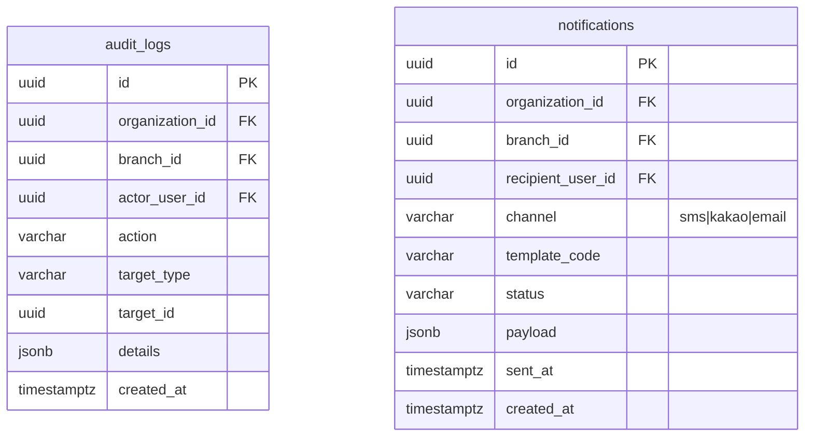
```mermaid
erDiagram
    audit_logs {
        uuid id PK
        uuid organization_id FK
        uuid branch_id FK
        uuid actor_user_id FK
        varchar action
        varchar target_type
        uuid target_id
        jsonb details
        timestamptz created_at
    }

    notifications {
        uuid id PK
        uuid organization_id FK
        uuid branch_id FK
        uuid recipient_user_id FK
        varchar channel "sms|kakao|email"
        varchar template_code
        varchar status
        jsonb payload
        timestamptz sent_at
        timestamptz created_at
    }
```

| `audit_logs.action` 예시 | 트리거 |
|--------------------------|--------|
| `PII_DECRYPT_VIEW` | 주민번호 복호화 열람 |
| `CLAIM_STATUS_CHANGE` | 청구 상태 전이 |
| `LOGIN_SUCCESS` / `LOGIN_FAILURE` | (선택) login_history 이중 기록 |
| `CLIENT_DISCHARGE` | 퇴소 처리 |

- `notifications`: V2 스키마 + V3 `chk_notifications_channel`(`sms`|`kakao`|`email`)·`chk_notifications_status`(`PENDING`|`SENT`|`FAILED`|`CANCELLED`). develop **`136239e`** `NotificationService`+Solapi providers(J03)가 출석 체크인/아웃·청구 이벤트 후 `dispatchClientEvent` → `notifications` INSERT(`PENDING`→provider→`SENT`/`FAILED`). **V45** `chk_notifications_sent_requires_at`(`SENT ⇒ sent_at IS NOT NULL`)·`chk_notifications_sent_after_created` — `finalizeNotification`이 성공 시 둘 다 설정. `recipient_user_id`는 `(organization_id, recipient_user_id)` 복합 FK(V10); `branch_id`는 V7 `fk_notifications_branch_org`. `template_code`는 VARCHAR(80) 도메인 CHECK 없음 — J03·G2 템플릿(`BILLING_PAYMENT_RECEIVED`·`CARE_PROVISION_RECORD`·`HOME_NEWSLETTER`·`ELDER_ABUSE_PREVENTION_GUIDELINE` 등)은 기존 컬럼에 수용. G2 서류 이메일·수납 영수증 알림은 `channel='email'`(V3 CHECK)·V46 history·V58 reminder 인덱스 재사용.

#### 4-7-1. 보호자 알림 수신 설정 (v2 — API §11, V41 + V42)

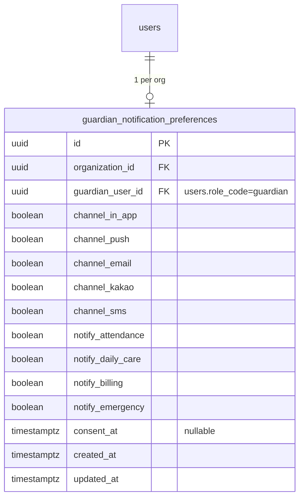
```mermaid
erDiagram
    guardian_notification_preferences {
        uuid id PK
        uuid organization_id FK
        uuid guardian_user_id FK "users.role_code=guardian"
        boolean channel_in_app
        boolean channel_push
        boolean channel_email
        boolean channel_kakao
        boolean channel_sms
        boolean notify_attendance
        boolean notify_daily_care
        boolean notify_billing
        boolean notify_emergency
        timestamptz consent_at "nullable"
        timestamptz created_at
        timestamptz updated_at
    }

    users ||--o| guardian_notification_preferences : "1 per org"
```

- **MVP Must 범위 외** — v2 B08. develop `feac558`(V41) + `428ba7d`(V42) **커밋 완료** — `NotificationPreferenceService`/`…Entity`/`…Repository`/Controller·테스트. 작업트리 clean.
- 보호자 1명당 Organization 스코프 **1행** — UK `(organization_id, guardian_user_id)`.
- FK `guardian_user_id` → `users`(guardian 역할). API_SPEC §11-1은 `guardians.guardian_id`로 표기하나 실제 스키마는 `users` 참조 — PLN/COD 텍스트 정렬 권장.
- **V42 (B08 commit 후 추가)**: consent-required CHECK(`channel_kakao=FALSE OR consent_at IS NOT NULL`, SMS 대칭) + `chk_guardian_notification_preferences_updated_after_created`·`chk_guardian_notification_preferences_consent_after_created`(V36/V37 시간 정합 패턴). `NotificationPreferenceService.applyUpdate`가 kakao·sms 활성화 시 항상 `consent_at = now()` 적재(`isConsentChannelEnabled`)하고 NULL로 되돌리지 않으므로 앱 작성 행은 항상 충족(§7-36).
- **V45 (round 62)**: 복합 FK `(organization_id, guardian_user_id) → users`(V10 `notifications`·V5 `guardian_clients` 패턴) + `trg_guardian_notification_preferences_role_guard`(`role_code='guardian'` — V13 `guardian_clients` 대칭). Tenant 불일치·비보호자 계정 연결 DB 차단.

### 4-8. 시스템 설정·백업 (§3-1, API §9 — V9)

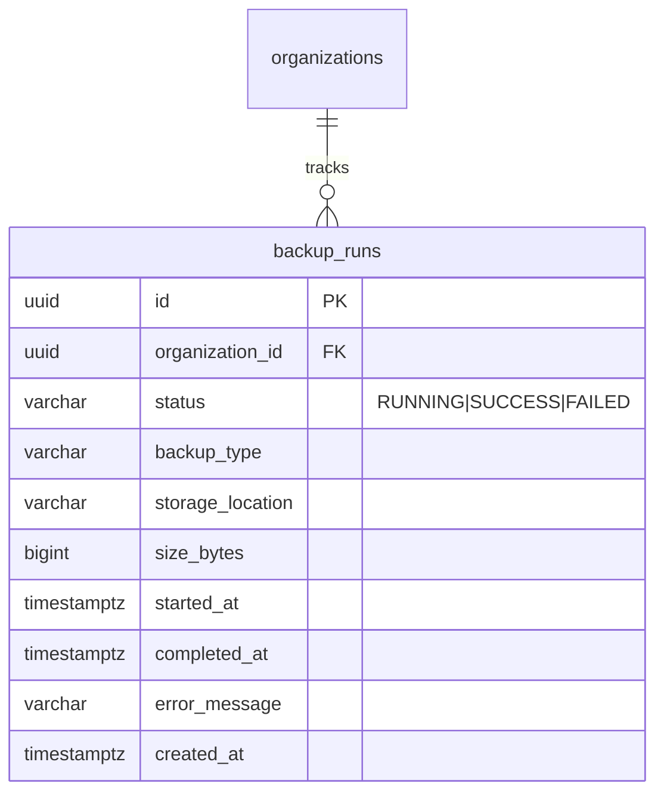
```mermaid
erDiagram
    organizations ||--o{ backup_runs : tracks

    backup_runs {
        uuid id PK
        uuid organization_id FK
        varchar status "RUNNING|SUCCESS|FAILED"
        varchar backup_type
        varchar storage_location
        bigint size_bytes
        timestamptz started_at
        timestamptz completed_at
        varchar error_message
        timestamptz created_at
    }
```

- `GET/PATCH /settings/system`: `organizations.backup_enabled`, `audit_retention_days`(30–3650).
- `GET /settings/backups`: `backup_runs` 이력 — 외부 백업 잡이 INSERT/UPDATE.
- `backup_runs`: 종료 상태(`SUCCESS`/`FAILED`)는 `completed_at` 필수 (`chk_backup_runs_terminal_completed_at`, V20 — `nhis_import_batches` V19와 동일 패턴). `FAILED`는 `error_message` 필수·`SUCCESS`/`RUNNING`은 NULL 강제 (`chk_backup_runs_error_message_status`, V20). `size_bytes >= 0` (V20).

### 4-9. 배차·이동경로 (v1.3-A — §3-13, API §12, V47)

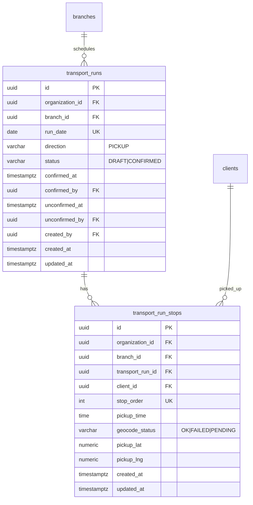
```mermaid
erDiagram
    transport_runs {
        uuid id PK
        uuid organization_id FK
        uuid branch_id FK
        date run_date UK
        varchar direction "PICKUP"
        varchar status "DRAFT|CONFIRMED"
        timestamptz confirmed_at
        uuid confirmed_by FK
        timestamptz unconfirmed_at
        uuid unconfirmed_by FK
        uuid created_by FK
        timestamptz created_at
        timestamptz updated_at
    }

    transport_run_stops {
        uuid id PK
        uuid organization_id FK
        uuid branch_id FK
        uuid transport_run_id FK
        uuid client_id FK
        int stop_order UK
        time pickup_time
        varchar geocode_status "OK|FAILED|PENDING"
        numeric pickup_lat
        numeric pickup_lng
        timestamptz created_at
        timestamptz updated_at
    }

    branches ||--o{ transport_runs : schedules
    transport_runs ||--o{ transport_run_stops : has
    clients ||--o{ transport_run_stops : picked_up
```

| 규칙 | 내용 |
|------|------|
| 운행 단위 | **v1.3-A**: 지점 1 × 일자 1 × `direction=PICKUP`(`vehicle_id IS NULL`) — partial UK `(org, branch, run_date, direction) WHERE vehicle_id IS NULL` (**V122**). **v1.3-B**: 차량당 1 run — partial UK `(org, branch, run_date, direction, vehicle_id) WHERE vehicle_id IS NOT NULL` (**V120**) |
| 상태 | `DRAFT`(hq_admin 편집) → `CONFIRMED`(직원 읽기 전용). 되돌림 시 `unconfirmed_at`/`unconfirmed_by` 감사 |
| 정차 상한 | **15명/운행** — `trg_transport_run_stops_enforce_max`(결정 62) + 앱 검증 |
| 명단 자격 | `uses_transport=TRUE`·`is_active`·`discharged_at IS NULL`·지점 일치 — `trg_transport_run_stops_guard_client` |
| 좌표 | 정차별 `pickup_lat`/`pickup_lng` 스냅샷 + `geocode_status`. 이용자 마스터 좌표(`clients.pickup_*`)와 분리 |
| actor | `trg_transport_runs_set_actors` — `created_by`·`confirmed_by`·`unconfirmed_by` ← `ogada.actor_user_id`(V32) |

- `GET /transport/roster`: `idx_clients_transport_roster` partial(`uses_transport AND is_active`).
- `GET /transport/runs`: `idx_transport_runs_org_branch_status_date`.

#### 4-9-1. 이동서비스 이용 계약서 (v1.3-C G15 — US-T05, V64·V65)

```mermaid
erDiagram
    transport_service_contracts {
        uuid id PK
        uuid organization_id FK
        uuid branch_id FK
        uuid client_id FK UK
        text completed_rule_ids
        varchar guardian_signatory_name
        date guardian_signed_on
        varchar institution_signatory_name
        date institution_signed_on
        uuid recorded_by FK
        timestamptz created_at
        timestamptz updated_at
    }

    clients ||--o| transport_service_contracts : "1 contract per client"
    users ||--o{ transport_service_contracts : recorded_by
```

| 규칙 | 내용 |
|------|------|
| 단위 | 이용자(`client_id`)당 **1건** — UK `(organization_id, client_id)` |
| 수칙 체크리스트 | 5종 rule id(`driver_qualification`·`companion_staff`·`vehicle_safety`·`accident_response`·`vehicle_log`) — `completed_rule_ids` CSV, 앱 검증 |
| 이중 서명 | 보호자·기관 각 `signatory_name` + `signed_on` — V65 pair CHECK(날짜만 있고 이름 공백 불가) |
| 자격 | `uses_transport=TRUE`·활성·미퇴소·지점 일치 — `trg_transport_service_contracts_guard_client`(V65, V47 패턴) |
| actor | `recorded_by` ← `ogada.actor_user_id` backstop(V65) + 복합 Tenant FK(V64) |
| 조회 | `findByOrganizationIdAndClientId` → UK `(organization_id, client_id)` |

- API: `GET/PUT /transport/contracts/{clientId}` (`TransportContractService`, develop `3c8f9fe`). API_SPEC §7의 `POST …/signature` 경로는 구현과 불일치 — 실측은 GET/PUT.

#### 4-9-2. 수급자 외출 (v1.3-C G15 — US-T05, V67·V70)

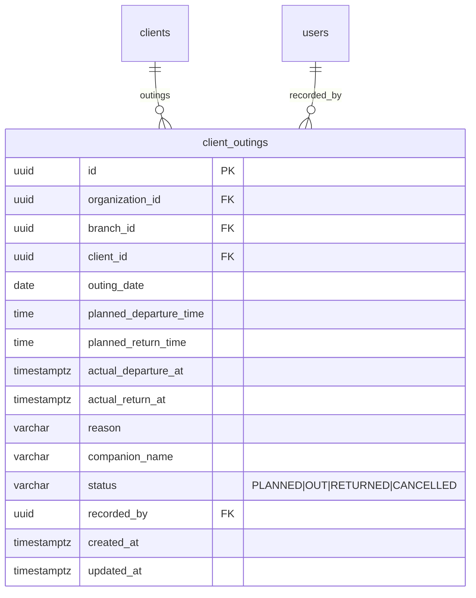
```mermaid
erDiagram
    client_outings {
        uuid id PK
        uuid organization_id FK
        uuid branch_id FK
        uuid client_id FK
        date outing_date
        time planned_departure_time
        time planned_return_time
        timestamptz actual_departure_at
        timestamptz actual_return_at
        varchar reason
        varchar companion_name
        varchar status "PLANNED|OUT|RETURNED|CANCELLED"
        uuid recorded_by FK
        timestamptz created_at
        timestamptz updated_at
    }

    clients ||--o{ client_outings : outings
    users ||--o{ client_outings : recorded_by
```

| 규칙 | 내용 |
|------|------|
| 생애주기 | `PLANNED` → `OUT`(출발) → `RETURNED`(복귀) · `CANCELLED`(예정/외출 중) — 앱 상태 전이, DB CHECK 4종 |
| 시간 | `actual_departure_at <= actual_return_at` — V67 CHECK |
| 자격 | 활성·미퇴소 이용자만 INSERT — `trg_client_outings_guard_active_client`(V70, V49 패턴) |
| Tenant | `trg_client_outings_set_org_branch` — `clients`에서 org/branch 자동 복사 + `(org, branch, client)` 복합 FK(V70) |
| actor | `recorded_by` ← `ogada_read_actor_user_id()` backstop(V70) |
| 조회 | `idx_client_outings_org_branch_date` — 지점 월간 리포트 · `idx_client_outings_org_client_date` — 이용자별 이력 |

#### 4-9-3. 이동서비스비·차량 (v1.3-C G16 — US-T05, V68·V69·V70)

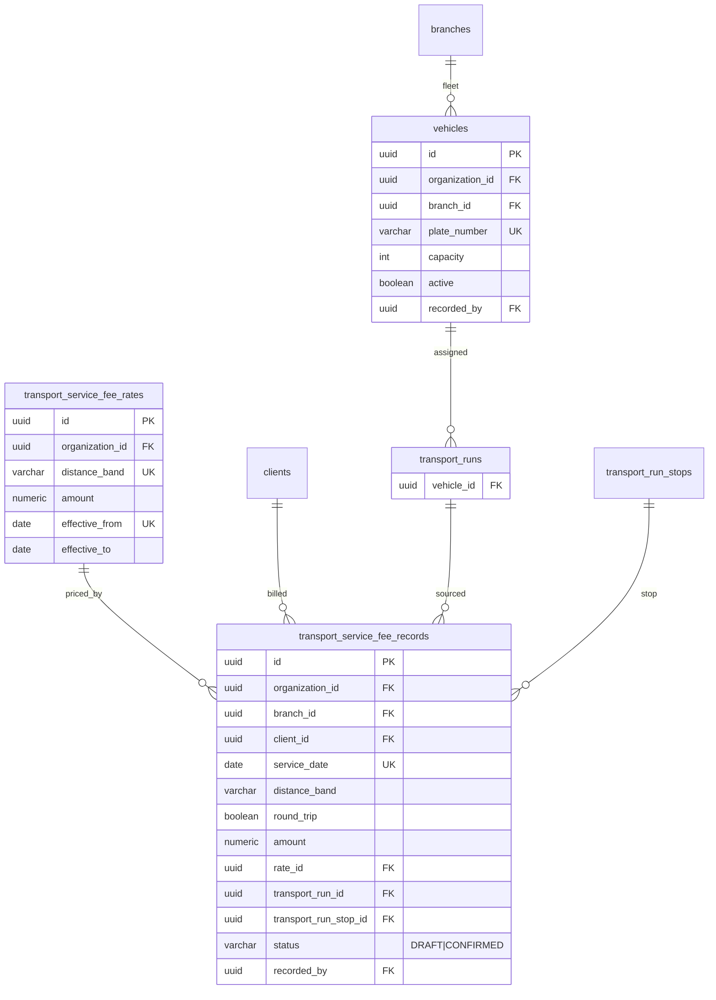
```mermaid
erDiagram
    transport_service_fee_rates {
        uuid id PK
        uuid organization_id FK
        varchar distance_band UK
        numeric amount
        date effective_from UK
        date effective_to
    }

    transport_service_fee_records {
        uuid id PK
        uuid organization_id FK
        uuid branch_id FK
        uuid client_id FK
        date service_date UK
        varchar distance_band
        boolean round_trip
        numeric amount
        uuid rate_id FK
        uuid transport_run_id FK
        uuid transport_run_stop_id FK
        varchar status "DRAFT|CONFIRMED"
        uuid recorded_by FK
    }

    vehicles {
        uuid id PK
        uuid organization_id FK
        uuid branch_id FK
        varchar plate_number UK
        int capacity
        boolean active
        uuid recorded_by FK
    }

    transport_runs {
        uuid vehicle_id FK
    }

    transport_service_fee_rates ||--o{ transport_service_fee_records : priced_by
    clients ||--o{ transport_service_fee_records : billed
    transport_runs ||--o{ transport_service_fee_records : sourced
    transport_run_stops ||--o{ transport_service_fee_records : stop
    branches ||--o{ vehicles : fleet
    vehicles ||--o{ transport_runs : assigned
```

| 규칙 | 내용 |
|------|------|
| 수가 catalog | `transport_service_fee_rates` — Tenant별 `RU_1`~`RU_4` 거리구간·`effective_from` UK · V68 BNK-25 참고 시드 + **V103** BNK-174 NHIS lawImg 정본 보정(`RU_3` 4,430→**5,230**·`RU_4` 6,230→**8,630** KRW, `@39ee679`) |
| 1일 1회 | **UK** `(organization_id, client_id, service_date)` — 협회 세부운영규정 제8조 · `existsBy…AndServiceDate` |
| 자격 | `uses_transport`·활성·미퇴소·지점 일치 — `trg_transport_service_fee_records_guard_client`(V70, V65 패턴) |
| actor | fee records `recorded_by` backstop(V68 INSERT) · vehicles `trg_vehicles_set_recorded_by`(V70) |
| 차량 | **UK** `(organization_id, plate_number)` · `capacity` 1–15 · `transport_runs.vehicle_id` FK — **지점 일치** `trg_transport_runs_guard_vehicle_branch`(V70) |
| 조회 | `idx_transport_service_fee_records_org_branch_date` · `idx_vehicles_org_branch_active` · `idx_transport_runs_org_vehicle` partial |

### 4-10. 등급 변동 이력 · 인정기간 계획서 첨부 (v1.2 P0 / v2 G37 — US-M01, V48·V78·V79)

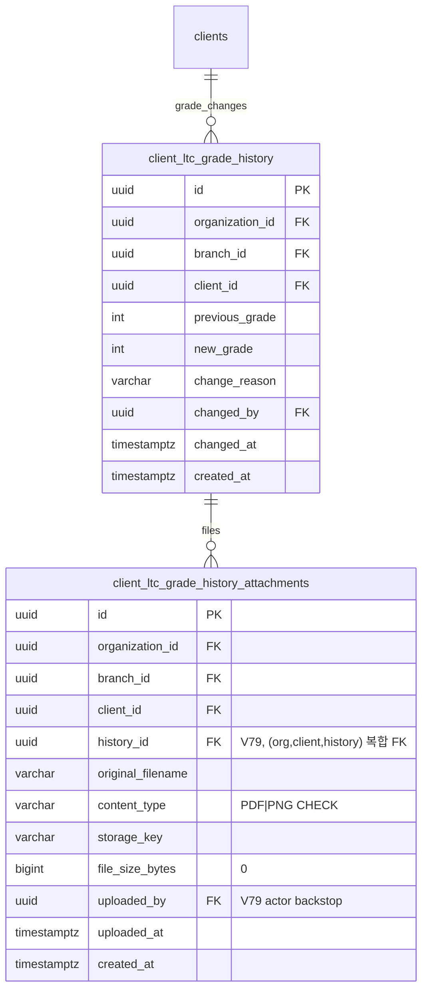
```mermaid
erDiagram
    client_ltc_grade_history {
        uuid id PK
        uuid organization_id FK
        uuid branch_id FK
        uuid client_id FK
        int previous_grade
        int new_grade
        varchar change_reason
        uuid changed_by FK
        timestamptz changed_at
        timestamptz created_at
    }

    client_ltc_grade_history_attachments {
        uuid id PK
        uuid organization_id FK
        uuid branch_id FK
        uuid client_id FK
        uuid history_id FK "V79, (org,client,history) 복합 FK"
        varchar original_filename
        varchar content_type "PDF|PNG CHECK"
        varchar storage_key
        bigint file_size_bytes "0<n<=10MB CHECK"
        uuid uploaded_by FK "V79 actor backstop"
        timestamptz uploaded_at
        timestamptz created_at
    }

    clients ||--o{ client_ltc_grade_history : grade_changes
    client_ltc_grade_history ||--o{ client_ltc_grade_history_attachments : files
```

- `trg_clients_ltc_grade_history`: `clients.ltc_grade` UPDATE 시 자동 append — `previous_grade`/`new_grade`는 0–5 CHECK(V99 G9-COG, V4→V99 정합).
- 조회: `idx_client_ltc_grade_history_org_client_changed` — 이용자 상세 등급 탭.
- **V78 (v2 G37, BNK-105)**: `client_ltc_grade_history_attachments` — 인정기간 이력별 케어플랜 PDF/PNG 1:N 첨부(이지케어 FAQ `49a778e8`). `content_type` PDF/PNG·`file_size_bytes` ≤10MB·filename/storage_key nonempty CHECK. 조회: `idx_..._org_history`(`org, history_id, uploaded_at DESC`)·`idx_..._org_client`.
- **V79 (DBA 후속)**: ① 부모 `client_ltc_grade_history`에 `uq_..._org_client_id`(`org, client_id, id`) 추가 후 첨부 FK를 `(org, history_id)` → **`(org, client_id, history_id)`** 로 교체 — 첨부의 `history_id`가 **동일 이용자** 등급이력에만 연결(앱 `findBy…IdAndClientIdAndHistoryId` 검증을 DB로 이중화, cross-client 우회 INSERT 차단, `ON DELETE CASCADE` 유지). ② `uploaded_by` 세션 actor backstop(`trg_..._set_uploaded_by`, V70 패턴). ③ `chk_..._uploaded_at_sane`(`uploaded_at >= created_at`). ④ purge/감사 인덱스 `idx_..._client_purge`(`client_id`)·`idx_..._org_uploaded_by` partial.
- **G38 케어플랜 알림 compliance (v2, BNK-106, coder `5fd35a6`)**: 신규 테이블 없음 — `clients.ltc_cert_valid_from`/`ltc_cert_valid_to`(5·11개월 마일스톤) + 최신 `client_ltc_grade_history` 행 + `client_ltc_grade_history_attachments` 첨부 유무(재발급 미반영 CRITICAL). `GET /clients/care-plan-notifications/compliance`·대시보드 widget(`a0a7f9c`) — read-only 집계. 쿼리 backing: ① `ClientRepository.findByOrganizationIdAndBranchIdAndActiveTrue` → **`idx_clients_org_branch_active`**(V3) ② `ClientLtcGradeHistoryRepository.findByOrganizationIdAndBranchIdOrderByClientIdAscChangedAtDesc` → **`idx_client_ltc_grade_history_org_client_changed`**(V48, `branch_id` residual filter — 지점당 수십~수백행 규모, 전용 `(org, branch, client, changed_at)` 인덱스 보류) ③ `ClientLtcGradeHistoryAttachmentRepository.countByOrganizationIdAndHistoryIdIn` → **`idx_client_ltc_grade_history_attachments_org_history`**(V78).

### 4-11. 식사·프로그램 (v3 — §3-5·§3-6, API §13, V49)

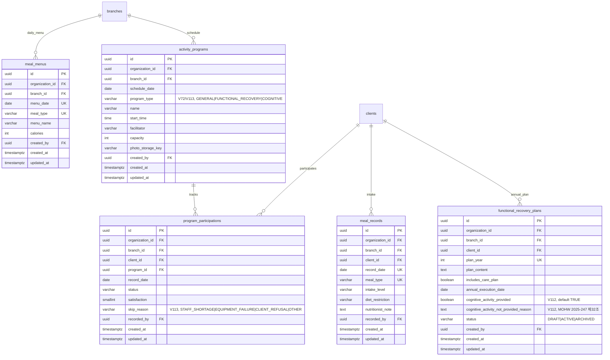
```mermaid
erDiagram
    meal_menus {
        uuid id PK
        uuid organization_id FK
        uuid branch_id FK
        date menu_date UK
        varchar meal_type UK
        varchar menu_name
        int calories
        uuid created_by FK
        timestamptz created_at
        timestamptz updated_at
    }

    meal_records {
        uuid id PK
        uuid organization_id FK
        uuid branch_id FK
        uuid client_id FK
        date record_date UK
        varchar meal_type UK
        varchar intake_level
        varchar diet_restriction
        text nutritionist_note
        uuid recorded_by FK
        timestamptz created_at
        timestamptz updated_at
    }

    activity_programs {
        uuid id PK
        uuid organization_id FK
        uuid branch_id FK
        date schedule_date
        varchar program_type "V72/V113, GENERAL|FUNCTIONAL_RECOVERY|COGNITIVE"
        varchar name
        time start_time
        varchar facilitator
        int capacity
        varchar photo_storage_key
        uuid created_by FK
        timestamptz created_at
        timestamptz updated_at
    }

    functional_recovery_plans {
        uuid id PK
        uuid organization_id FK
        uuid branch_id FK
        uuid client_id FK
        int plan_year UK
        text plan_content
        boolean includes_care_plan
        date annual_execution_date
        boolean cognitive_activity_provided "V112, default TRUE"
        text cognitive_activity_not_provided_reason "V112, MOHW 2025-247 제32조"
        varchar status "DRAFT|ACTIVE|ARCHIVED"
        uuid created_by FK
        timestamptz created_at
        timestamptz updated_at
    }

    program_participations {
        uuid id PK
        uuid organization_id FK
        uuid branch_id FK
        uuid client_id FK
        uuid program_id FK
        date record_date
        varchar status
        smallint satisfaction
        varchar skip_reason "V113, STAFF_SHORTAGE|EQUIPMENT_FAILURE|CLIENT_REFUSAL|OTHER"
        uuid recorded_by FK
        timestamptz created_at
        timestamptz updated_at
    }

    branches ||--o{ meal_menus : daily_menu
    clients ||--o{ meal_records : intake
    branches ||--o{ activity_programs : schedule
    activity_programs ||--o{ program_participations : tracks
    clients ||--o{ program_participations : participates
    clients ||--o{ functional_recovery_plans : annual_plan
```

| 규칙 | 내용 |
|------|------|
| 식단 | UK `(org, branch, menu_date, meal_type)` — 아침/점심/간식 1행. `meal_type` ∈ BREAKFAST/LUNCH/SNACK |
| 식사 기록 | UK `(client_id, record_date, meal_type)` — 이용자·일자·구분당 1건. `intake_level` ∈ WELL/NORMAL/LESS |
| 식이 제한 | `diet_restriction` ∈ NONE/LOW_SALT/DIABETIC/SOFT/OTHER — frontend `config/meals.js` 정합 |
| 프로그램 일정 | `activity_programs` = 당일 스케줄 행(마스터·일정 통합). `photo_storage_key`는 사진 업로드(v3 후속) 예약 |
| 기능회복훈련 (V72, G17) | `activity_programs.program_type` ∈ `GENERAL`|`FUNCTIONAL_RECOVERY`|`COGNITIVE`(V113). `functional_recovery_plans` = 이용자×연도 1건 UK `(org, client_id, plan_year)` — 지표 27 연간 계획. **V74** 퇴소 INSERT 가드·org/branch sync·actor backstop·purge 인덱스 |
| 인지활동형 미제공 (V112/V113, G17b) | **V112** `functional_recovery_plans.cognitive_activity_provided`(default TRUE) + `cognitive_activity_not_provided_reason` — `chk_functional_recovery_plans_cognitive_activity_reason`(제공=TRUE ⇒ reason NULL · 미제공=FALSE ⇒ reason trim>0). **V113** `program_participations.skip_reason` 4종 enum CHECK + `chk_program_participations_attended_skip_reason`(ATTENDED ⇒ skip_reason NULL). `COGNITIVE` 프로그램 결석 시 skip_reason **필수**는 앱 `ProgramService.resolveSkipReason`·`CognitiveActivitySkipReason.normalize`(DB trigger 미적용 — PLAN_NOTES #130) |
| 참여 | UK `(client_id, program_id, record_date)`. `status` ATTENDED/ABSENT — ABSENT 시 `satisfaction` NULL(`chk_program_participations_satisfaction_pair` V49 + 앱 `resolveSatisfaction` 이중 방어 @ `3bd6a43`), ATTENDED 시 1–5 필수 |
| Tenant·지점 | `meal_records`·`program_participations`는 부모 `clients`/`activity_programs`에서 org/branch 자동 복사 |
| 퇴소 가드 | INSERT 시 `trg_*_guard_active_client`(V13 health 패턴) — 퇴소·비활성 이용자 신규 기록 차단 |
| actor | `trg_meal_records_set_recorded_by`·`trg_program_participations_set_recorded_by`·menus/programs `created_by` ← `ogada.actor_user_id`(V32) |

- **API 경로 주의**: frontend `services.js`는 `/programs/schedule`(단수) — API_SPEC §13 `/programs/schedules`와 불일치. **coder는 frontend 경로 우선** 또는 양쪽 alias.
- **메뉴 등록 API**: v3 UI는 식단 **조회만** 구현 — `meal_menus` INSERT는 hq_admin CRUD 후속(PLN).

### 4-12. 방문요양 일정 (v2 — G21·Epic V, V53)

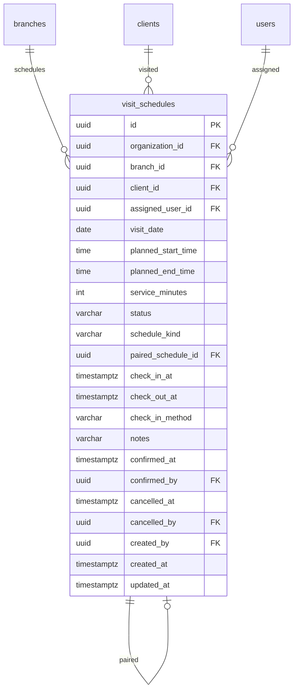
```mermaid
erDiagram
    visit_schedules {
        uuid id PK
        uuid organization_id FK
        uuid branch_id FK
        uuid client_id FK
        uuid assigned_user_id FK
        date visit_date
        time planned_start_time
        time planned_end_time
        int service_minutes
        varchar status
        varchar schedule_kind
        uuid paired_schedule_id FK
        timestamptz check_in_at
        timestamptz check_out_at
        varchar check_in_method
        varchar notes
        timestamptz confirmed_at
        uuid confirmed_by FK
        timestamptz cancelled_at
        uuid cancelled_by FK
        uuid created_by FK
        timestamptz created_at
        timestamptz updated_at
    }

    branches ||--o{ visit_schedules : schedules
    clients ||--o{ visit_schedules : visited
    users ||--o{ visit_schedules : assigned
    visit_schedules ||--o| visit_schedules : paired
```

| 규칙 | 내용 |
|------|------|
| 상태 | `status` ∈ DRAFT/CONFIRMED/IN_PROGRESS/COMPLETED/CANCELLED — `chk_visit_schedules_status`. CONFIRMED↑은 `confirmed_at` 필수, COMPLETED는 `check_out_at` 필수, CANCELLED는 `cancelled_at` 필수 |
| 계획/청구 이중 일정 | `schedule_kind` ∈ PLAN/BILLING (이지케어 패턴) — `chk_visit_schedules_kind`. `paired_schedule_id` self-FK로 PLAN↔BILLING 페어 연결 |
| 체크인/아웃 | `check_in_method` ∈ MOBILE/MANUAL. `check_out_at >= check_in_at` (`chk_visit_schedules_check_in_before_check_out`) |
| 시간 정합 | `planned_end_time > planned_start_time`·`service_minutes` 1–480·`updated_at >= created_at` CHECK |
| Tenant·지점 | 복합 FK `(org, branch)→branches`·`(org, client)→clients`·`(org, branch, client)→clients`·actor 4종 `(org, user)→users` — Tenant 교차 차단 |
| 단일성 | `uq_visit_schedules_org_id` UNIQUE `(organization_id, id)` — 복합 FK 앵커 |
| 퇴소 가드 | **V55** `trg_visit_schedules_guard_active_client` — INSERT 시 퇴소·비활성 이용자 차단(V10 출석·V49 meal_records 패턴). `VisitService.requireClientInScope(write=true)`는 지점 스코프만 검증 — DB가 lifecycle 방어 |
| actor | **V55** `trg_visit_schedules_set_actors` — `created_by` INSERT backstop·`confirmed_by`/`cancelled_by` 상태 전이 backstop(V47 transport 패턴). `VisitService`는 confirm/cancel/check-in 트랜잭션에서 `DbSessionContext.setActorUserId` 호출 — 기존 흐름 항상 충족 |
| 배정 직원 검증 (G21) | **Java-only** (`VisitService.validateAssignedUser` @ `dc48933`) — `POST /visits`·`PATCH /visits/{id}`에서 `assigned_user_id` 지정 시 ① `findByIdAndOrganizationId`(**V5 `uq_users_org_id`**) Tenant 내 존재 ② `is_active`/`terminated_at`(V86) 퇴사·비활성 거부 ③ `existsByOrganizationIdAndUserIdAndBranchId`(**V90 `uq_user_branches_org_user_branch`** `(organization_id, user_id, branch_id)`) 해당 지점 배속 직원만 허용. 신규 DDL 0건 — `assigned_user_id` self-FK(V53 `fk_visit_schedules_assigned_user_org`)·일정 조회 인덱스(V56 `idx_visit_schedules_org_assigned_date`)는 별도 backed |

- `GET /visits` (지점·기간): `idx_visit_schedules_org_branch_date` — `findBy…BranchIdAndVisitDateBetween…`.
- `GET /visits?kind=` (계획/청구 필터): `idx_visit_schedules_org_branch_kind_date` — `findBy…ScheduleKindAndVisitDateBetween…`.
- 상태별 운영 보드: `idx_visit_schedules_org_branch_status_date`.
- 이용자 일정 탭·퇴소 purge: `idx_visit_schedules_org_client_date` (`(organization_id, client_id, visit_date DESC)`).
- PLAN↔BILLING 페어 조회·self-FK backing: **V56** `idx_visit_schedules_org_paired` (`(organization_id, paired_schedule_id) WHERE paired_schedule_id IS NOT NULL` — `POST /visits`·`POST /visits/imports/nhis`의 `createPairedBillingSchedule` 페어 적재).
- 배정 요양보호사 일정·assigned_user self-FK backing: **V56** `idx_visit_schedules_org_assigned_date` (`(organization_id, assigned_user_id, visit_date DESC) WHERE assigned_user_id IS NOT NULL`).
- NHIS import 확정 PLAN 가드 EXISTS: **V57** `idx_visit_schedules_org_branch_client_plan_blocking` (`(organization_id, branch_id, client_id, visit_date) WHERE schedule_kind='PLAN' AND status IN (CONFIRMED, IN_PROGRESS, COMPLETED)` — `hasBlockingConfirmedPlan`·`POST /visits/imports/nhis` @ `84f3441`).
- NHIS import 중복 슬롯 EXISTS: **V66** `idx_visit_schedules_org_branch_client_slot_duplicate` (`(organization_id, branch_id, client_id, visit_date, schedule_kind, planned_start_time, planned_end_time) WHERE status IN (DRAFT, CONFIRMED, IN_PROGRESS, COMPLETED)` — `hasExistingVisitSchedule`·`POST /visits/imports/nhis` @ `9aafa3e`, 재import 시 동일 client/date/kind/time 윈도우 skip).
- PLAN↔BILLING 페어 체크인/아웃 동기화: **Java-only** (`syncPairedScheduleProgress` @ `9d7c17f`) — `findByIdAndOrganizationId(pairedScheduleId)`는 V56 `idx_visit_schedules_org_paired`·`uq_visit_schedules_org_id` backed, 신규 DDL 0건.

### 4-13. 사례관리 회의 (v2 — G32 지표 43, V73·V75)

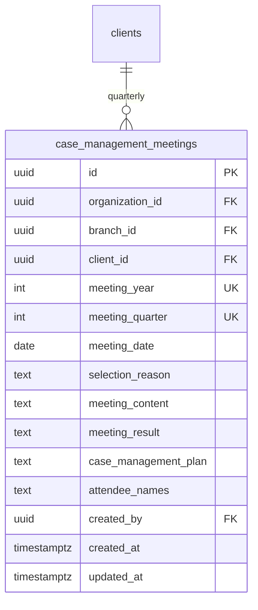
```mermaid
erDiagram
    case_management_meetings {
        uuid id PK
        uuid organization_id FK
        uuid branch_id FK
        uuid client_id FK
        int meeting_year UK
        int meeting_quarter UK
        date meeting_date
        text selection_reason
        text meeting_content
        text meeting_result
        text case_management_plan
        text attendee_names
        uuid created_by FK
        timestamptz created_at
        timestamptz updated_at
    }

    clients ||--o{ case_management_meetings : quarterly
```

| 규칙 | 내용 |
|------|------|
| 분기별 1건 | UK `(organization_id, client_id, meeting_year, meeting_quarter)` — silverangel 지표 43 「분기별 1회 이상」 |
| 6필수 필드 | `meeting_date`·`selection_reason`·`meeting_content`·`meeting_result`·`attendee_names` NOT NULL + trim CHECK. `client_id`로 수급자 식별 |
| 사례관리 계획 | **V75** `case_management_plan TEXT NOT NULL` + `chk_case_management_meetings_plan_nonempty`(trim>0) — 이지케어 FAQ 21797 7항 패리티(BNK-91 P2). 기존 행은 `meeting_result`로 backfill 후 NOT NULL 승격 |
| 참석자 ≥2명 | **앱 검증**(`CaseManagementService.validateAttendeeCount` — 쉼표/줄바꿈 구분) — DB CHECK는 구분자 규칙 미확정으로 보류(PLAN_NOTES #107) |
| 지표 29 평가실시 | **앱 compliance**(`ProgramParticipationRepository.existsAttendedFunctionalRecoveryForClientInDateWindow`·`FunctionalRecoveryPlanRepository.existsUpdatedPlanForClientInWindow` — BNK-92 P1) — DB cross-table CHECK 보류, 기존 V49 `idx_program_participations_client_date`·V72 `uq_functional_recovery_plans_client_year`(org+client 접두어) backed |
| 일자·분기 정합 | **V74** `chk_case_management_meetings_date_year_quarter` — `meeting_year`/`meeting_quarter` = `meeting_date`에서 파생 |
| Tenant·지점 | 복합 FK `(org, branch)→branches`·`(org, client)→clients`·`(org, branch, client)→clients`·`(org, created_by)→users` |
| 퇴소 가드 | **V74** `trg_case_management_meetings_guard_active_client` — INSERT 시 퇴소·비활성 이용자 차단 |
| actor | **V74** `trg_case_management_meetings_set_created_by` + `trg_case_management_meetings_set_org_branch`(V70 패턴) |

- `GET/POST /programs/case-management/meetings`·`GET …/compliance` — `CaseManagementMeetingRepository`·`idx_case_management_meetings_org_branch_year_quarter`.

---

### 4-14. 급여제공결과평가 (v2 — G39 지표 44, V80·V81)

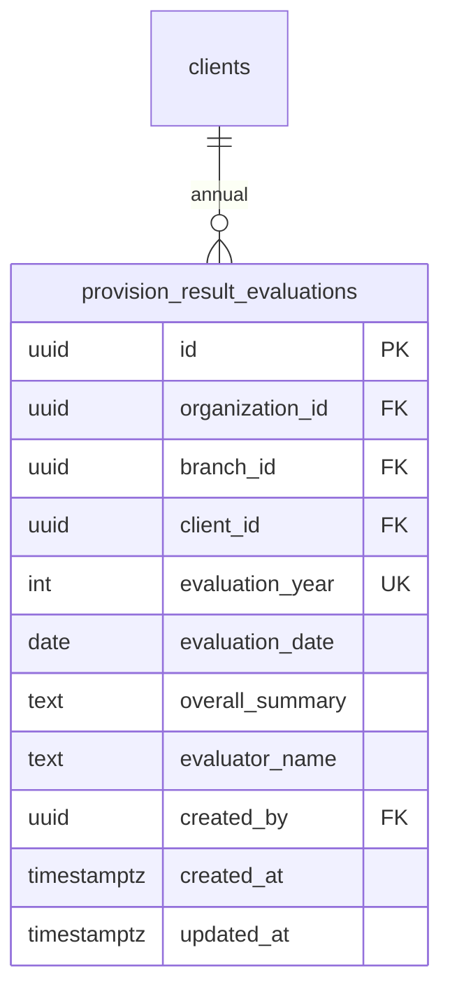
```mermaid
erDiagram
    provision_result_evaluations {
        uuid id PK
        uuid organization_id FK
        uuid branch_id FK
        uuid client_id FK
        int evaluation_year UK
        date evaluation_date
        text overall_summary
        text evaluator_name
        uuid created_by FK
        timestamptz created_at
        timestamptz updated_at
    }

    clients ||--o{ provision_result_evaluations : annual
```

| 규칙 | 내용 |
|------|------|
| 연 1건 | UK `(organization_id, client_id, evaluation_year)` — silverangel 지표 44 ③ 「연1 평가」(BNK-107). 수급자×연도 1행 |
| 4-pillar 준수 | ①주1 상태변화 ②월1 기록지 ③연1 평가 ④30일 계획 재작성 — **앱 compliance**(`GET /provision-result-evaluations/compliance`, `attendance`·`program_participations`·본 테이블 집계). 본 테이블은 ③ 연간 평가 저장 |
| 필수 본문 | `overall_summary`·`evaluator_name` NOT NULL + `length(trim(...)) > 0` CHECK (V80). `evaluation_year` 2000~2100 CHECK |
| 시각 정합 | **V80** `chk_provision_result_evaluations_updated_after_created`(`updated_at >= created_at`) — PATCH backdate 방어 |
| Tenant·지점 | **V80** 복합 FK `(org, branch)→branches`·`(org, client)→clients`·`(org, branch, client)→clients`·`(org, created_by)→users` + Tenant 앵커 UK `(org, id)` |
| org/branch sync | **V81** `trg_provision_result_evaluations_set_org_branch` — `organization_id`/`branch_id`를 `client_id`의 현재 값으로 동기화(복합 FK 항상 충족, V74 패턴) |
| 퇴소 가드 | **V81** `trg_provision_result_evaluations_guard_active_client` — INSERT 시 퇴소·비활성 이용자 차단(V74 패턴, 앱은 활성 수급자만 평가) |
| actor | **V81** `trg_provision_result_evaluations_set_created_by` — `DbSessionContext.setActorUserId` 미설정 시 세션 actor backstop |

- `GET/POST/PATCH /provision-result-evaluations`·`GET …/compliance` — `ProvisionResultEvaluationRepository`·**V80** `idx_provision_result_evaluations_org_branch_year`(`org, branch, evaluation_year, client_id`). 연도·지점 필터 목록. coder `f082933`(BE)·`1c99bcd`(FE). **compliance 4-pillar**(`a0a7f9c`): ① 주1 상태변화 — `HealthRecordRepository.existsRecordForClientInWindow` → **`idx_health_records_org_client_recorded`**(V24) ② 월1 급여제공기록 — `NotificationRepository.existsCareProvisionNotificationForClientMonth`(native, `template_code`+`payload.clientId`/`yearMonth`) → **`idx_notifications_org_created`**(V2) residual scan(이용자×월 EXISTS, 지점당 규모 소) ③ 연1 평가 — 본 테이블 UK ④ 30일 계획 재작성 — `ProgramParticipationRepository.existsUpdatedProgramParticipationForClientInWindow`·`FunctionalRecoveryPlanRepository.existsUpdatedPlanForClientInWindow` → V49 **`idx_program_participations_client_date`**·V72 **`uq_functional_recovery_plans_client_year`**(round 111 #109 패턴 재사용).

---

### 4-15. 선임 요양보호사 업무수행일지 (v2 — G34 / US-S01, V82·V83)

```mermaid
erDiagram
    lead_caregiver_work_logs {
        uuid id PK
        uuid organization_id FK
        uuid branch_id FK
        uuid client_id FK
        date log_date UK
        uuid lead_caregiver_user_id FK
        text work_content
        text care_notes
        varchar signature_status
        varchar signature_method
        uuid signed_by_user_id FK
        timestamptz signed_at
        uuid created_by FK
        timestamptz created_at
        timestamptz updated_at
    }

    clients ||--o{ lead_caregiver_work_logs : "1/day"
    users ||--o{ lead_caregiver_work_logs : lead_caregiver
```

| 규칙 | 내용 |
|------|------|
| 일 1건 | UK `(organization_id, client_id, log_date)` — 케어포 8-1-2·이지케어 2974fadd triple-source (BNK-118) |
| 본문 | `work_content` NOT NULL + `length(trim(work_content)) > 0` CHECK (V82) |
| 서명 상태 | `signature_status` ∈ `DRAFT` \| `SIGNED`; `SIGNED` 시 `signature_method`·`signed_by_user_id`·`signed_at` 필수 쌍 CHECK (V82) |
| 서명 방식 | `signature_method` ∈ `DIRECT` \| `SMS_VERIFIED` (이지케어 전자서명 워크플로, BNK-105) — v1 구현은 staff-initiated DIRECT/SMS_VERIFIED |
| 서명 후 잠금 | 앱 `LeadCaregiverWorkLogService` DRAFT만 PATCH 허용 + **V83** `trg_lead_caregiver_work_logs_guard_signed_immutable` UPDATE 차단 |
| Tenant·지점 | **V82** 복합 FK `(org, branch)→branches`·`(org, client)→clients`·`(org, branch, client)→clients`·`(org, lead_caregiver_user_id)→users`·`(org, signed_by_user_id)→users`·`(org, created_by)→users` + Tenant 앵커 UK `(org, id)` |
| org/branch sync | **V83** `trg_lead_caregiver_work_logs_set_org_branch` — `organization_id`/`branch_id`를 `client_id` 현재 값으로 동기화(V81 패턴) |
| 퇴소 가드 | **V83** `trg_lead_caregiver_work_logs_guard_active_client` — INSERT 시 퇴소·비활성 이용자 차단(V74 패턴) |
| actor | **V83** `trg_lead_caregiver_work_logs_set_created_by` — `DbSessionContext.setActorUserId` 미설정 시 세션 actor backstop |
| 시각 정합 | **V82** `chk_lead_caregiver_work_logs_updated_after_created`(`updated_at >= created_at`) |

- `GET/POST/PATCH /staff/lead-caregiver-logs`·`POST …/{logId}/sign` — `LeadCaregiverWorkLogRepository`·**V82** `idx_lead_caregiver_work_logs_org_branch_date`(`org, branch, log_date DESC, client_id`) 지점·일자 목록 + **UK** `(org, client_id, log_date)` 중복·이용자 단일일 조회. coder `559648f`(BE)·`6d6b426`(FE).

---

### 4-16. 요양보호사 보수교육 이수증 (v2 — G34/US-S02 8-7-1, V88·V90)

```mermaid
erDiagram
    staff_refresher_training_certificates {
        uuid id PK
        uuid organization_id FK
        uuid branch_id FK
        uuid user_id FK
        varchar original_filename
        varchar content_type
        varchar storage_key
        bigint file_size_bytes
        uuid uploaded_by FK
        timestamptz uploaded_at
        timestamptz created_at
    }

    users ||--o{ staff_refresher_training_certificates : certificates
    user_branches ||--o{ staff_refresher_training_certificates : assignment
```

| 규칙 | 내용 |
|------|------|
| 대상 | 직원(`users`) 보수교육(격년 2년) **이수증 파일** — compliance bool은 `users.lifecycle_checklist['refresher-training']`(V86), 본 테이블은 PDF/JPEG/PNG 첨부 |
| MIME·크기 | `content_type` ∈ `application/pdf`·`image/png`·`image/jpeg` · `0 < file_size_bytes ≤ 10485760`(10MB, V88 CHECK) |
| 지점 배정 | **V90** `(org, user_id, branch_id)` → `user_branches` 복합 FK — 직원 미배정 지점에 이수증 연결 차단 |
| org sync | **V90** `trg_staff_refresher_training_certificates_set_org` — `organization_id`를 `users`에서 동기화 |
| actor | **V90** `trg_staff_refresher_training_certificates_set_uploaded_by` — `DbSessionContext.setActorUserId` 미설정 시 세션 actor backstop |
| 시각 정합 | **V90** `uploaded_at >= created_at` CHECK |
| purge | **V90** `idx_staff_refresher_training_certificates_user_purge` — 퇴사(`users.terminated_at`) cohort 3년 후 `user_id IN (…)` 일괄 삭제 + 오브젝트 스토리지(`storage_key`) |

- `GET/POST/DELETE /staff/refresher-training/users/{userId}/certificates` — `StaffRefresherTrainingCertificateRepository`·**V88** `idx_staff_refresher_training_certificates_org_user_uploaded`(`org, user_id, uploaded_at DESC`). coder `51477bd`/`1817c36`(BE)·`50bdb6e`(FE).

---

### 4-17. 직원 건강검진 (v2 — US-R02 8-10, V89·V90)

```mermaid
erDiagram
    staff_health_checkups {
        uuid id PK
        uuid organization_id FK
        uuid branch_id FK
        uuid user_id FK
        date checkup_date
        boolean body_measurement_completed
        boolean urinalysis_completed
        boolean blood_test_completed
        boolean imaging_completed
        boolean result_assessment_completed
        boolean is_office_worker
        text result_notes
        uuid recorded_by FK
        timestamptz created_at
        timestamptz updated_at
    }

    users ||--o{ staff_health_checkups : checkups
    user_branches ||--o{ staff_health_checkups : assignment
```

| 규칙 | 내용 |
|------|------|
| FAQ21799 5영역 | 신체계측·요검사·혈액검사·영상검사·결과판정 — **최소 1영역** 완료 필수(`chk_staff_health_checkups_at_least_one_area`, V89) |
| 사무직 | `is_office_worker` — 검진 주기·필수 영역 nuance는 앱 compliance(`StaffHealthCheckupCompliance`) |
| 지점 배정 | **V90** `(org, user_id, branch_id)` → `user_branches` 복합 FK |
| org sync | **V90** `trg_staff_health_checkups_set_org` |
| actor | **V90** `trg_staff_health_checkups_set_recorded_by` |
| 실시일 | **V90** `checkup_date <= created_at`(Asia/Seoul 달력일) — 미래일 raw INSERT 방어(앱도 동일 검증) |
| 시각 정합 | **V89** `updated_at >= created_at` |
| purge | **V90** `idx_staff_health_checkups_user_purge` — 직원 lifecycle 3년 보존(§DATA_RETENTION §3) |

- `GET /staff/health-checkups/compliance`·`GET/POST /staff/health-checkups/users/{userId}` — `StaffHealthCheckupRepository`·**V89** `idx_staff_health_checkups_org_user_date`·`idx_staff_health_checkups_org_branch_date`. coder `f1268c6`/`bad88f5`(BE)·`604787f`(FE).

---

### 4-18. 직원 HR 파일함 (v2 — US-R03 / FAQ21806, V91·V92)

```mermaid
erDiagram
    staff_hr_files {
        uuid id PK
        uuid organization_id FK
        uuid branch_id FK
        uuid user_id FK
        varchar document_type
        varchar original_filename
        varchar content_type
        varchar storage_key
        bigint file_size_bytes
        uuid uploaded_by FK
        timestamptz uploaded_at
        timestamptz created_at
    }

    users ||--o{ staff_hr_files : hr_documents
    user_branches ||--o{ staff_hr_files : assignment
```

| 규칙 | 내용 |
|------|------|
| 대상 | 직원(`users`) **입사~퇴사 HR 서류** — FAQ21806 8종(`id-card`·`certificate`·`bank-account`·`health-check`·`dementia-training`·`employment-contract`·`criminal-record`·`resignation`) + 건강검진 결과서 업로드 경로 |
| UK | `(organization_id, user_id, document_type)` — 유형당 1파일(재업로드는 UPSERT) |
| MIME·크기 | `content_type` ∈ `application/pdf`·`image/png`·`image/jpeg` · `0 < file_size_bytes ≤ 10485760`(10MB, V91 CHECK) |
| 지점 배정 | **V91** `(org, user_id, branch_id)` → `user_branches` 복합 FK — 직원 미배정 지점에 파일 연결 차단 |
| org sync | **V92** `trg_staff_hr_files_set_org` — `organization_id`를 `users`에서 동기화 |
| actor | **V92** `trg_staff_hr_files_set_uploaded_by` — `DbSessionContext.setActorUserId` 미설정 시 세션 actor backstop |
| 시각 정합 | **V92** `uploaded_at >= created_at` CHECK |
| purge | **V92** `idx_staff_hr_files_user_purge` — 퇴사(`users.terminated_at`) cohort 3년 후 `user_id IN (…)` 일괄 삭제 + 오브젝트 스토리지(`storage_key`) |
| lifecycle 연동 | 업로드 시 `users.lifecycle_checklist[document_type]=true`·삭제 시 false — 앱(`StaffHrFileService`)이 동기화, DB CHECK 없음 |

- `GET/POST/DELETE /staff/hr-files/users/{userId}`·`GET …/{fileId}` — `StaffHrFileRepository`·**V91** `idx_staff_hr_files_org_user_uploaded`(`org, user_id, uploaded_at DESC`)·`idx_staff_hr_files_org_document_type`. coder `bbb8e35`/`4a622ab`(BE)·`bc3c967`/`9a6fdb6`(FE).

---

### 4-18-1. 직원 교육일지 (v1.2.1 — US-S02 / FAQ21807·21828·G41b, V104–V107)

```mermaid
erDiagram
    staff_training_logs {
        uuid id PK
        uuid organization_id FK
        uuid branch_id FK
        varchar training_type
        int reference_year
        smallint reference_half
        date trained_at
        varchar training_method
        varchar instructor_name
        text training_content
        text attendee_names
        boolean new_hire_orientation
        uuid new_hire_user_id FK
        uuid created_by FK
        timestamptz created_at
        timestamptz updated_at
    }

    branches ||--o{ staff_training_logs : branch_logs
    users ||--o{ staff_training_logs : new_hire_orientation
    user_branches ||--o{ staff_training_logs : new_hire_assignment
```

| 규칙 | 내용 |
|------|------|
| 5종 교육 | **V106** `training_type` ∈ `ELDERLY_HUMAN_RIGHTS`(노인인권·반기 1회, FAQ21807) \| `OPERATING_REGULATION`(운영규정·연 1회 + 신규직원 오리엔테이션, FAQ21828) \| `DISASTER_RESPONSE` \| `FIRE_SAFETY_EQUIPMENT` \| `STAFF_RIGHTS`(케어포 func.php 8-7 4분류·연 1회, G41b BNK-184) |
| 반기·연도 | `ELDERLY_HUMAN_RIGHTS` → `reference_half` ∈ {1,2} 필수 · 연간 4종(`OPERATING_REGULATION`·G41b 3종) → `reference_half` NULL — **V104** `chk_*_operating_no_half`·**V107** `chk_*_g41b_annual_no_half`. `reference_year` 2000–2100 |
| 교육일 정합 | **V105** `trained_at` 연도 = `reference_year` CHECK — 앱 `validateTrainedAtYear`와 동일 |
| 신규직원 오리엔테이션 | `new_hire_orientation=true` 시 `new_hire_user_id` 필수 · 입사 7일 이내(앱 `NEW_HIRE_ORIENTATION_WINDOW_DAYS`) — DB는 배정·타입만 강제 |
| 지점 배정 | **V105** `(org, new_hire_user_id, branch_id)` → `user_branches` 복합 FK — 미배정 지점 직원 오리엔테이션 연결 차단 |
| org sync | **V105** `trg_staff_training_logs_set_org` — `branch_id`에서 `organization_id` 동기화(V74 패턴) |
| actor | **V105** `trg_staff_training_logs_set_created_by` — `DbSessionContext.setActorUserId` 미설정 시 세션 actor backstop |
| purge | **V105** `idx_staff_training_logs_new_hire_user_purge` — 신규직원 오리엔테이션 행은 퇴사 cohort 3년 후 `new_hire_user_id IN (…)` 삭제. 지점 단위 연간·반기 일지는 `trained_at` 기준 5년(§DATA_RETENTION) |
| compliance | **앱** `StaffTrainingLogService.getCompliance` — 반기 1회·연 5종(운영규정+G41b 3종) 1회·신규직원 7일 오리엔테이션(최초 `trained_at` 기준, BNK-187) 집계. `countBy…ReferenceHalf`·`countBy…NewHireOrientationFalse`·`findBy…NewHireUserIdIn` → **V104** `idx_staff_training_logs_org_branch_year_type`·`idx_staff_training_logs_org_branch_new_hire_user` |
| 지점 스코프 | **V105** `(org,new_hire_user_id,branch_id)→user_branches` + 앱 `validateCreateFields`(BNK-187 @ `32f87f1`) — 오리엔테이션 대상은 로그 `branch_id`에 배정된 직원만 |

- `GET/POST/PATCH /api/v1/staff/training-logs`·`GET …/compliance` — `StaffTrainingLogRepository`·**V104** UK `(org, id)`·도메인 CHECK. coder `6191b91`(V104)·`613b6af`(V105/V106)·`32f87f1`(G41b compliance, BNK-184~187).

---

### 4-19. 신규입소 위험도평가 (v2 — G40 / US-T11, V93·V94)

```mermaid
erDiagram
    client_risk_assessments {
        uuid id PK
        uuid organization_id FK
        uuid branch_id FK
        uuid client_id FK
        varchar assessment_type UK
        date assessed_on
        int scale_score
        varchar risk_level
        text notes
        uuid recorded_by FK
        timestamptz recorded_at
        timestamptz created_at
        timestamptz updated_at
    }

    clients ||--o{ client_risk_assessments : admission_screening
```

| 규칙 | 내용 |
|------|------|
| 3종 스크리닝 | `assessment_type` ∈ `FALL_RISK` \| `PRESSURE_ULCER` \| `COGNITIVE_FUNCTION` — silverangel **지표21** 「급여제공 시작일까지」 낙상·욕창·인지기능 (BNK-150~151) |
| UK | `(organization_id, client_id, assessment_type)` — 이용자당 유형 1건(UPSERT) |
| 위험도 | `risk_level` ∈ `LOW` \| `MODERATE` \| `HIGH` · `scale_score` ≥ 0 또는 NULL |
| 급여개시일 가드 | **앱** `ClientRiskAssessmentService.validateAssessedOn` — `assessed_on` ≤ `clients.ltc_cert_valid_from`(급여개시일). DB CHECK 보류(인정기간 미설정 이용자 NULL 허용) |
| Tenant·지점 | 복합 FK `(org, client)→clients`·`(org, branch, client)→clients`·`(org, branch)→branches`·`(org, recorded_by)→users` + Tenant 앵커 UK `(org, id)` |
| org/branch sync | **V93** `trg_client_risk_assessments_set_org_branch` — `client_id` 현재 지점·Tenant 동기화(V85 패턴) |
| 퇴소 가드 | **V93** `trg_client_risk_assessments_guard_active_client` — INSERT 시 퇴소·비활성 이용자 차단 |
| actor | **V93** `trg_client_risk_assessments_set_recorded_by` — `DbSessionContext.setActorUserId` 미설정 시 세션 actor backstop |
| 시각 정합 | **V93** `updated_at >= created_at` · **V94** `recorded_at >= created_at` |
| purge | **V93** `idx_client_risk_assessments_client_purge` — 퇴소 cohort 5년 후 `client_id IN (…)` 일괄 삭제(DATA_RETENTION §3) |
| compliance | **앱** `getAdmissionCompliance` — `ltc_cert_valid_from` 설정 이용자 중 3종 완료·`assessed_on` ≤ 급여개시일. missing/late 타입은 인메모리 도메인 |

- `GET/PUT /clients/{clientId}/risk-assessments`·`GET /clients/admission-risk-assessments/compliance?branchId=` — `ClientRiskAssessmentRepository`·**V93** `idx_client_risk_assessments_org_client_type`(단건·목록 lookup)·**V94** `idx_client_risk_assessments_org_branch`(`findByOrganizationIdAndBranchId` compliance branch sweep). coder `22d736b`/`686d686`(BE)·FE Panel @ `72676a5`/`e89175e`(BNK-152).

---

### 4-20. 반기 기초평가 위험도 (v2 — G40b / US-T12, V95·V96)

```mermaid
erDiagram
    client_periodic_risk_assessments {
        uuid id PK
        uuid organization_id FK
        uuid branch_id FK
        uuid client_id FK
        int fiscal_year UK
        smallint fiscal_half UK
        varchar assessment_type UK
        date assessed_on
        int scale_score
        varchar risk_level
        text notes
        uuid recorded_by FK
        timestamptz recorded_at
        timestamptz created_at
        timestamptz updated_at
    }

    clients ||--o{ client_periodic_risk_assessments : periodic_screening
```

| 규칙 | 내용 |
|------|------|
| G40 vs G40b | **G40**(V93) = 급여개시 전 1회(지표21) · **G40b**(V95) = **반기 1회** 재평가(지표16·FAQ21811, BNK-153~154) |
| 3종 스크리닝 | `assessment_type` ∈ `FALL_RISK` \| `PRESSURE_ULCER` \| `COGNITIVE_FUNCTION` — G40과 동일 enum |
| UK | `(organization_id, client_id, fiscal_year, fiscal_half, assessment_type)` — 반기·유형당 1건(UPSERT) |
| 반기 | `fiscal_half` ∈ {1, 2} · `fiscal_year` 2000–2100 — 앱 `ClientRiskFiscalHalf` 윈도우와 짝 |
| 위험도 | `risk_level` ∈ `LOW` \| `MODERATE` \| `HIGH` · `scale_score` ≥ 0 또는 NULL |
| 반기 범위 가드 | **앱** `ClientRiskAssessmentService.isInPeriodicScope` — 급여 수급 기간과 반기 윈도우 교집합. DB CHECK 보류(인정기간 미설정·부분 수급 NULL 허용) |
| Tenant·지점 | 복합 FK `(org, client)→clients`·`(org, branch, client)→clients`·`(org, branch)→branches`·`(org, recorded_by)→users` + Tenant 앵커 UK `(org, id)` |
| org/branch sync | **V95** `trg_client_periodic_risk_assessments_set_org_branch` — `client_id` 현재 지점·Tenant 동기화(V93 패턴) |
| 퇴소 가드 | **V95** `trg_client_periodic_risk_assessments_guard_active_client` — INSERT 시 퇴소·비활성 이용자 차단 |
| actor | **V95** `trg_client_periodic_risk_assessments_set_recorded_by` — `DbSessionContext.setActorUserId` 미설정 시 세션 actor backstop |
| 시각 정합 | **V95** `updated_at >= created_at` · **V96** `recorded_at >= created_at` |
| purge | **V95** `idx_client_periodic_risk_assessments_client_purge` — 퇴소 cohort 5년 후 `client_id IN (…)` 일괄 삭제(DATA_RETENTION §3) |
| compliance | **앱** `getPeriodicCompliance` — 반기 윈도우 내 활성·수급 이용자 중 3종 완료(`periodicComplete`). branch sweep → **V95** `idx_client_periodic_risk_assessments_org_branch_period` |

- `GET/PUT /clients/{clientId}/periodic-risk-assessments`·`GET /clients/periodic-risk-assessments/compliance?branchId=` — `ClientPeriodicRiskAssessmentRepository`·**V95** UK `(org, client, year, half, type)`(upsert lookup)·`idx_*_org_client_period`(단건 목록)·`idx_*_org_branch_period`(compliance branch sweep). coder `84e59d2`/`bdfc140`(BE)·FE Panel+widget @ `22325f4`(BNK-153~154).

---

### 4-21. 고충상담 기록 (v2 — G42 / US-T14, V97·V98)

```mermaid
erDiagram
    grievance_counseling_records {
        uuid id PK
        uuid organization_id FK
        uuid branch_id FK
        varchar receipt_channel "WRITTEN|PHONE|SMS|IN_PERSON|ANONYMOUS_BOX"
        varchar target_type "CLIENT|CAREGIVER|OTHER"
        uuid client_id FK "nullable, target=CLIENT"
        uuid staff_user_id FK "nullable, target=CAREGIVER"
        text target_name
        timestamptz counseled_at
        text counseling_content
        text follow_up_notes
        boolean recurrence_confirmed "V102, nullable until follow-up"
        timestamptz follow_up_recorded_at "V102, nullable until follow-up"
        varchar approval_status "DRAFT|SUBMITTED|APPROVED"
        timestamptz submitted_at
        uuid approved_by FK
        timestamptz approved_at
        uuid created_by FK
        timestamptz created_at
        timestamptz updated_at
    }

    branches ||--o{ grievance_counseling_records : files
    clients ||--o{ grievance_counseling_records : client_target
    users ||--o{ grievance_counseling_records : staff_target
```

| 규칙 | 내용 |
|------|------|
| 채널 | `receipt_channel` ∈ `WRITTEN` \| `PHONE` \| `SMS` \| `IN_PERSON` \| `ANONYMOUS_BOX` — 익명함은 `target_type=OTHER` 강제(앱 `resolveTargetLinks`) |
| 대상 폴리모피즘 | `target_type=CLIENT` ↔ `staff_user_id IS NULL` · `CAREGIVER` ↔ `client_id IS NULL` · `OTHER` ↔ 둘 다 NULL (V97 `chk_*_target_links`) |
| 결재 상태 | `approval_status` ∈ `DRAFT` \| `SUBMITTED` \| `APPROVED` — V97 `chk_*_submitted_fields`가 상태당 `submitted_at`/`approved_by`/`approved_at` NULL 강제 |
| Tenant·지점 | 복합 FK `(org, branch)→branches`·`(org, client)→clients`·`(org, branch, client)→clients`·`(org, staff_user)→users`·`(org, approved_by)→users`·`(org, created_by)→users` + Tenant 앵커 UK `(org, id)` |
| 상태 전이 | DRAFT→SUBMITTED→APPROVED 단방향 (`GrievanceCounselingService.submit/approve`). `ensureDraftStatus`가 비-DRAFT UPDATE 차단(앱), DB는 V97 `chk_*_submitted_fields`로 NULL 일관성만 강제 |
| 시각 정합 | V97 `updated_at >= created_at` · **V98** `submitted_at >= created_at` · **V98** `approved_at >= submitted_at` (V36/V94 temporal 패턴) |
| actor backstop | **V98** `trg_grievance_counseling_records_set_created_by` — `DbSessionContext.setActorUserId` 미설정 시 세션 actor backstop (V83 패턴, 앱은 항상 설정) |
| 활성 가드 | **앱 강제** — `requireClientInScope`는 `findByIdAndOrganizationIdAndActiveTrue`(target=CLIENT)·`requireActiveStaffUser`는 `isActive && terminatedAt IS NULL`(target=CAREGIVER). DB INSERT 가드 미적용(과거 사건 백데이트 등록 허용 — `counseled_at` 백데이트 가능, DRAFT/접수만 활성 강제) |
| 결재 큐 | **V98** `idx_*_org_branch_pending_approval` partial — `SUBMITTED` 행만 색인, 결재함 widget(123차 P2)·전자결재 UI 핫패스 |
| FK backing | **V98** `idx_*_client_purge`(`client_id` partial) · `idx_*_org_staff_user`·`idx_*_org_approved_by`·`idx_*_org_created_by` partial — V97 복합 Tenant FK용 lookup·purge 인덱스(PostgreSQL FK 자동 인덱스 부재) |
| 사후관리 (V102) | **V102** `recurrence_confirmed`·`follow_up_recorded_at` — 결재(APPROVED) 후 1회 사후관리 기록(FAQ21814 사후관리·재발 확인). `chk_*_follow_up_fields`: 둘 다 NULL(미기록) 또는 셋 다 NOT NULL + `follow_up_notes` 비공백 + `approved_at` NOT NULL + `follow_up_recorded_at >= approved_at`. 앱 `recordFollowUp`은 이미 기록 시 `BusinessRuleException` — DB는 raw SQL pair 일관성만 강제 |
| 사후관리 큐 | **V102** `idx_*_pending_follow_up` partial — `approval_status='APPROVED' AND follow_up_recorded_at IS NULL` · `(org, branch, approved_at DESC)` — `listPendingFollowUps`·`getFollowUpCompliance`·대시보드 widget 핫패스 |
| 익명함 (P2) | DDL은 `ANONYMOUS_BOX` 채널·`target_type=OTHER`로 P2 익명 접수 준비됨 — UI 126차 follow-up ✅(BNK-161 P2) |
| 보존 | DATA_RETENTION §3 grievance 행 — 접수일(`counseled_at`) 기준 5년(인사·민원 증빙). target=CLIENT cohort는 이용자 퇴소 purge 시 동반 삭제(`idx_*_client_purge`) |

- `GET /staff/grievance-counselings?from=&to=&targetType=` — `findByOrganizationIdAndBranchIdAndCounseledAtBetweenOrderByCounseledAtDesc` / `…AndTargetTypeAndCounseledAtBetweenOrderByCounseledAtDesc` → V97 `idx_grievance_counseling_records_org_branch_counseled_at`. 단건 lookup은 `findByIdAndOrganizationId` → PK + V97 Tenant 앵커 UK.
- `POST /staff/grievance-counselings`·`PATCH …/{id}` — DRAFT CRUD. `POST …/{id}/submit` → SUBMITTED, `POST …/{id}/approve` → APPROVED (`GrievanceCounselingService`). coder `b0a9e06`/`bcdc411`/`0460e9b` @ backend `8487667`.
- `POST /staff/grievance-counselings/{id}/follow-up` — APPROVED 행 사후관리 1회 기록(`recordFollowUp`). **V102** CHECK + `idx_*_pending_follow_up` partial. coder `2ebca70` @ backend `39ee679`(BNK-161 P2 · 126차 ✅).

---

### 4-22. 모니터링 — 자체점검·전화상담 (v2 — G30 / FAQ21836·21841, V100·V101)

```mermaid
erDiagram
    monitoring_self_diagnoses {
        uuid id PK
        uuid organization_id FK
        uuid branch_id FK
        int reference_year "2000~2100"
        int reference_month "1~12"
        int item_code "1~15"
        text inspection_direction
        text related_basis
        text inspection_criteria
        text inspection_result
        text inspection_method
        uuid created_by FK
        timestamptz created_at
        timestamptz updated_at
    }

    monitoring_phone_consultations {
        uuid id PK
        uuid organization_id FK
        uuid branch_id FK
        int reference_year "2000~2100"
        int reference_month "1~12"
        uuid client_id FK
        date consulted_at
        text consultation_notes
        uuid created_by FK
        timestamptz created_at
        timestamptz updated_at
    }

    branches ||--o{ monitoring_self_diagnoses : self_checks
    branches ||--o{ monitoring_phone_consultations : logs
    clients ||--o{ monitoring_phone_consultations : consulted
```

| 규칙 | 내용 |
|------|------|
| 월 단위 자체점검 | `monitoring_self_diagnoses` — 지점×월×항목(1~15) 단위 자체점검표. UK `(org, branch, reference_year, reference_month, item_code)`로 월별 항목당 1행 강제 (V100) |
| 월 단위 전화상담 | `monitoring_phone_consultations` — 지점×월×이용자 단위 안부전화 기록. UK `(org, branch, reference_year, reference_month, client_id)`로 월별 이용자당 1행 강제 (V100) |
| 도메인 | `reference_year` 2000~2100 · `reference_month` 1~12 · `item_code` 1~15 · 본문 텍스트 `length(trim())>0` NOT-EMPTY CHECK (V100) |
| Tenant·지점 | 복합 FK `(org, branch)→branches`·`(org, client)→clients`·`(org, branch, client)→clients`(전화상담)·`(org, created_by)→users` + Tenant 앵커 UK `(org, id)` (V100) |
| 시각 정합 | V100 `updated_at >= created_at` (V36/V94 temporal 패턴) |
| 활성 가드 | **앱 강제 + DB 방어** — `MonitoringService.recordPhoneConsultation`이 `findByIdAndOrganizationIdAndActiveTrue`로 활성 이용자만 허용. **V101** `trg_monitoring_phone_consultations_guard_active_client`가 raw SQL INSERT의 퇴소·비활성 이용자(`is_active≠true OR discharged_at IS NOT NULL`)를 거부 (V93 패턴). 자체점검표는 이용자 비참조 — 가드 미해당 |
| actor backstop | **V101** `trg_monitoring_self_diagnoses_set_created_by`·`trg_monitoring_phone_consultations_set_created_by` — `created_by` NULL 시 세션 actor backstop (V32 `ogada_read_actor_user_id`, V93/V98 패턴, 앱은 항상 설정) |
| FK backing | **V101** `idx_monitoring_phone_consultations_client_purge`(`client_id`) · `idx_monitoring_phone_consultations_org_created_by`·`idx_monitoring_self_diagnoses_org_created_by` partial — V100 복합 Tenant FK용 lookup·purge 인덱스(PostgreSQL FK 자동 인덱스 부재) |
| 보존 | DATA_RETENTION §3 monitoring 행 — 점검·상담은 평가·감사 증빙으로 5년 보존. 전화상담 이용자 cohort는 퇴소 purge 시 동반 삭제(`idx_*_client_purge`) |

- `GET /monitoring/self-diagnoses?year=&month=` → `findByOrganizationIdAndBranchIdAndReferenceYearAndReferenceMonthOrderByItemCodeAsc` / 중복 점검 `existsBy…AndItemCode` → V100 `idx_monitoring_self_diagnoses_org_branch_year_month` + UK.
- `GET /monitoring/phone-consultations?year=&month=` → `findBy…OrderByConsultedAtAsc`·`countBy…`·중복 `existsBy…AndClientId` → V100 `idx_monitoring_phone_consultations_org_branch_year_month` + UK. 미상담 이용자 추천(suggestion)은 `clientRepository.findByOrganizationIdAndBranchIdAndActiveTrue`(기존 client 인덱스).
- coder `6a72b70`(API)·`5501745`(route)·`b8e92bf`(E2E·RBAC) @ backend `5692662`(BNK-169).

---

### 4-23. 본인부담금 간편결제 (v2 — G2 7-5 / US-L01, V108·V109·V110)

```mermaid
erDiagram
    easy_pay_requests {
        uuid id PK
        uuid organization_id FK
        uuid branch_id FK
        uuid claim_id FK
        uuid client_id FK
        uuid guardian_user_id FK "nullable, 보호자 셀프 결제 시"
        numeric amount "copay 금액 양수"
        varchar provider "CARD|KAKAO_PAY"
        varchar status "REQUESTED|PENDING|SUCCEEDED|FAILED|CANCELLED"
        varchar pg_order_id "V109 nullable — order-init 실패 시 NULL"
        varchar payment_url
        varchar pg_transaction_id "SUCCEEDED 필수"
        varchar failure_reason "FAILED 필수"
        timestamptz requested_at
        timestamptz completed_at "terminal 상태 필수"
        timestamptz created_at
        timestamptz updated_at
    }

    billing_claims ||--o| easy_pay_requests : "1 request per claim"
    clients ||--o{ easy_pay_requests : payer
    users ||--o{ easy_pay_requests : guardian_payer
    branches ||--o{ easy_pay_requests : branch_scope
```

| 규칙 | 내용 |
|------|------|
| 단위 | 청구서당 1행 — **UK** `(organization_id, claim_id)`(V108 `uq_easy_pay_requests_org_claim`). FAILED 행은 재시도 시 동일 row UPDATE(케어포 view.npay_manage, BNK-189) |
| Provider | `provider` ∈ `CARD` \| `KAKAO_PAY`(V108 `chk_easy_pay_requests_provider`). KG이니시스/카카오페이 stub provider(`StubEasyPayProvider`) |
| 생애주기 | `status` ∈ `REQUESTED`(transient — 코드 상수만, persist 미존재) → `PENDING`(createOrder 성공·`pg_order_id` 채움) → `SUCCEEDED`(confirm 성공·`pg_transaction_id`·`completed_at`) \| `FAILED`(createOrder 또는 confirm 실패·`failure_reason`·`completed_at`) · `CANCELLED`(P2 예약). **V110** `chk_easy_pay_requests_completed_at_lifecycle`: REQUESTED/PENDING ↔ `completed_at IS NULL`, SUCCEEDED/FAILED/CANCELLED ↔ `completed_at IS NOT NULL` |
| 도메인 invariant | **V110** FAILED → `failure_reason` 비공백 · SUCCEEDED → `pg_transaction_id` 비공백 · PENDING → `pg_order_id` 비공백(createOrder 성공 후 보존). FAILED는 `pg_order_id` NULL 허용(V109 — order-init 실패) |
| 금액 | `amount > 0`(V110 `chk_easy_pay_requests_amount_positive`) — 앱은 `claim.copay_amount.signum() <= 0` 거부, DB 방어선 |
| 단건 청구만 | **앱** `EasyPayService.requireSingleClientClaim` — 청구 라인 전부 동일 `client_id`여야 간편결제 허용. 다인 청구는 `BusinessRuleException`(개별 카드결제 UX 무의미) |
| 보호자 검증 | `guardian_user_id` 지정 시 앱 `existsByOrganizationIdAndGuardianUserIdAndClientId` + **V111** `trg_easy_pay_requests_validate_guardian_link`가 `users.role_code='guardian'` 및 `guardian_clients` `(organization_id, guardian_user_id, client_id)` 연결을 이중 검증. NULL = 직원/관리자 대납 |
| 청구 상태 | INSERT는 청구 `status='CONFIRMED'`(미수납) 행만 허용 — 앱 `EasyPayService.requestClaimPayment`. SUCCEEDED 후 `billingService.recordCopayPayment` → 청구 PAID 전이(V50/V52) |
| 전월 미납 가드 | **앱** `BillingService.getClaimGenerationGuard` — 전월 미수납 청구가 있으면 간편결제 거부(BNK-189 `b893e97`) |
| Tenant·지점 | **V110** 복합 FK 5건 `(org, branch_id)→branches`·`(org, claim_id)→billing_claims`·`(org, client_id)→clients`·`(org, branch_id, client_id)→clients`·`(org, guardian_user_id)→users` + Tenant 앵커 UK `(org, id)` |
| org sync | **V110** `trg_easy_pay_requests_set_org` — `organization_id`를 `branch_id`에서 동기화(V60 CMS·V74 case_management 패턴) |
| 퇴소 가드 | **V110** `trg_easy_pay_requests_guard_active_client` — INSERT 시 퇴소·비활성 이용자 거부(V10/V93 패턴 — 간편결제는 실시간 결제, 활성 이용자만). UPDATE는 미적용(FAILED 재시도 허용) |
| 시각 정합 | **V110** `updated_at >= created_at`·`requested_at >= created_at`·`completed_at IS NULL OR completed_at >= requested_at`(V36/V37/V20 패턴) |
| FK backing | **V110** `(org, branch_id)`·`(client_id)` purge·partial `(org, guardian_user_id) WHERE guardian_user_id IS NOT NULL`. `(org, claim_id)`는 V108 UK 좌선두 backed |
| Actor | `created_by` 컬럼 없음 — 청구 `payment_recorded_by`(V50, PAID 전이 시 V52 actor backstop)가 누가 수납을 기록했는지 추적 |
| `payment_method` 확장 | **V108** `billing_claims.payment_method` CHECK에 `EASY_PAY` 추가(V50 CASH/BANK_TRANSFER·V59 CMS와 동급) — SUCCEEDED 시 청구는 `payment_method='EASY_PAY'`·`paid_at`·`copay_amount` 기록 |
| 보호자 PII | DB 미저장 — `claim.copay_amount`·`payer_name` 등은 stub provider 페이로드만, `payment_url`은 PG redirect용 URL(영구 저장 불권장은 P2 — 현재 VARCHAR(500)에 저장됨) |
| RBAC | 현재 API는 `hq_admin`/`branch_admin`만 `POST/GET /billing/easy-pay/claims/{id}` 허용(API_SPEC §9-15, `EasyPayController`). 보호자 셀프 결제 확장 시 `guardian_user_id`는 V111 DB guard로 본인 연결 청구만 허용 |

- `POST /billing/easy-pay/claims/{claimId}`·`GET /billing/easy-pay/claims/{claimId}` — `EasyPayController`·`EasyPayService`·`EasyPayRequestRepository.findByOrganizationIdAndClaimId` → V108 `uq_easy_pay_requests_org_claim` 1:1 backing. coder `438f5c7`(skeleton)·`70b3fb8`(V109 nullable)·`1231389`(pilot E2E)·`b893e97`(prior-month guard) @ backend `b893e97`(BNK-189).
- V110은 **DBA 후속 integrity** — V108 단일컬럼 FK·lifecycle 누락·temporal·FK backing 5건을 V60 CMS / V20 backup_runs / V93 risk-assessment 패턴으로 정렬.

---

### 4-24. 간호급여 — 욕창·통합 바이탈·체중 (v3.1 Must — G-NURSING / L03, V114·V115·V116·V117)

> **범위**: 케어포 demo-work L03 간호급여 패리티 — 욕창 위험도·예방계획·케어 기록(G-NURSING-PRESSURE-ULCER, US-O03) · 통합 바이탈(L03_M11) · 체중 관리(L03_M14). MVP `health_records`(§4-5)와 **별도 정규화 테이블** — 간호 전용 필드·UK·compliance 집계.

```mermaid
erDiagram
    pressure_ulcer_assessments {
        uuid id PK
        uuid organization_id FK
        uuid branch_id FK
        uuid client_id FK
        date assessed_on UK
        int scale_score "6-23 nullable"
        varchar risk_level "LOW|MODERATE|HIGH"
        text assessment_notes
        text prevention_plan
        date plan_effective_from
        boolean care_plan_reflected
        uuid recorded_by FK
        timestamptz recorded_at
        timestamptz created_at
        timestamptz updated_at
    }

    pressure_ulcer_care_records {
        uuid id PK
        uuid organization_id FK
        uuid branch_id FK
        uuid client_id FK
        date care_date UK
        varchar body_site UK
        int ulcer_stage "1-4 nullable"
        text treatment_notes
        text prevention_measures
        uuid recorded_by FK
        timestamptz created_at
        timestamptz updated_at
    }

    nursing_vital_checks {
        uuid id PK
        uuid organization_id FK
        uuid branch_id FK
        uuid client_id FK
        date check_date UK
        time check_time UK
        int systolic
        int diastolic
        int pulse
        int respiration_rate
        numeric temperature
        int spo2
        numeric weight_kg "nullable"
        int blood_glucose "nullable"
        text notes
        uuid recorded_by FK
        timestamptz created_at
        timestamptz updated_at
    }

    nursing_weight_records {
        uuid id PK
        uuid organization_id FK
        uuid branch_id FK
        uuid client_id FK
        date measure_date UK
        numeric weight_kg
        numeric height_cm "nullable"
        numeric goal_weight_kg "nullable"
        text notes
        uuid recorded_by FK
        timestamptz created_at
        timestamptz updated_at
    }

    clients ||--o{ pressure_ulcer_assessments : quarterly_risk
    clients ||--o{ pressure_ulcer_care_records : daily_care
    clients ||--o{ nursing_vital_checks : integrated_vitals
    clients ||--o{ nursing_weight_records : weight_trend
```

| 규칙 | 내용 |
|------|------|
| Tenant·지점 | **V114–V116** 복합 Tenant FK 4건(`branch_org`·`client_org`·`client_branch_org`·`recorded_by_org`) + UK `(organization_id, id)` 앵커 |
| org/branch sync | **V117** `trg_*_set_org_branch` — `client_id` 현재 지점·Tenant 동기화(V93 패턴) |
| 퇴소 가드 | **V117** `trg_*_guard_active_client` — INSERT 시 퇴소·비활성 이용자 차단. UPDATE는 기존 행 수정 허용(V10 출석 패턴) |
| actor | **V117** `trg_*_set_recorded_by` — `DbSessionContext.setActorUserId` 미설정 시 세션 actor backstop |
| 욕창 평가 UK | `(organization_id, client_id, assessed_on)` — 일자당 1건 |
| 욕창 케어 UK | `(organization_id, client_id, care_date, body_site)` — 부위별 일일 1건 |
| 바이탈 UK | `(organization_id, client_id, check_date, check_time)` — 일시당 1건 |
| 체중 UK | `(organization_id, client_id, measure_date)` — 일자당 1건 |
| 예방계획 pair | **V114** `chk_pressure_ulcer_assessments_plan_pair` — `prevention_plan`·`plan_effective_from` 동시 NULL 또는 동시 NOT NULL |
| 시각 정합 | **V114** `updated_at >= created_at` · **V117** `pressure_ulcer_assessments.recorded_at >= created_at` |
| purge | **V117** `idx_*_client_purge` — 퇴소 cohort 5년 후 `client_id IN (…)` 일괄 삭제(DATA_RETENTION §3) |
| G40과 관계 | `client_risk_assessments.assessment_type='PRESSURE_ULCER'`(V93, 입소 스크리닝)와 **주기·목적 분리** — 본 테이블은 분기별 욕창 lifecycle·예방계획·일일 케어 |

- `GET/POST/PATCH /nursing/pressure-ulcer/*` — `PressureUlcerService`·`PressureUlcerAssessmentRepository`/`PressureUlcerCareRecordRepository` → V114 list index + UK. coder `edda491`/`8570fa2`(BE)·FE @ `e214da1`(BNK-204~206).
- `GET/POST/PATCH /nursing/vital-checks` — `NursingVitalCheckService` → V115 `idx_nursing_vital_checks_org_branch_check_date` + UK. coder `8570fa2`/`80c0bd5`(BNK-207).
- `GET/POST/PATCH /nursing/weight-records` — `NursingWeightRecordService` → V116 `idx_nursing_weight_records_org_branch_measure_date` + UK. coder `1a822d2`(V116, BNK-208). FE wire Planned.
- **V117**은 **DBA 후속 integrity** — V114–V116 coder DDL의 org sync·퇴소 guard·actor backstop·purge/FK backing 누락을 V93/V70 패턴으로 정렬.

#### 4-24-1. 간호급여 — 구강상태·응급상황 (v3.1 Must — G-NURSING / L03, V118·V119·V121)

> **범위**: 케어포 L03_M13 구강상태 점검관리(US-O04 M13, BNK-211) · L03_M04 응급상황 기록(US-O04 M04, BNK-212).

```mermaid
erDiagram
    nursing_oral_care_checks {
        uuid id PK
        uuid organization_id FK
        uuid branch_id FK
        uuid client_id FK
        date check_date UK
        boolean brushing_assisted
        varchar oral_condition_status "GOOD|FAIR|POOR"
        boolean denture_worn
        text notes
        uuid recorded_by FK
        timestamptz created_at
        timestamptz updated_at
    }

    nursing_emergency_records {
        uuid id PK
        uuid organization_id FK
        uuid branch_id FK
        uuid client_id FK
        date occurrence_date
        varchar incident_category "FALL|CHOKING|CARDIAC|SEIZURE|BLEEDING|OTHER"
        text action_taken
        text detail
        boolean guardian_notified
        text notes
        uuid recorded_by FK
        timestamptz created_at
        timestamptz updated_at
    }

    clients ||--o{ nursing_oral_care_checks : daily_oral
    clients ||--o{ nursing_emergency_records : emergency
```

| 규칙 | 내용 |
|------|------|
| Tenant·지점 | **V118–V119** 복합 Tenant FK 4건(`branch_org`·`client_org`·`client_branch_org`·`recorded_by_org`) + UK `(organization_id, id)` 앵커 |
| org/branch sync | **V121** `trg_*_set_org_branch` — `client_id` 현재 지점·Tenant 동기화(V117 패턴) |
| 퇴소 가드 | **V121** `trg_*_guard_active_client` — INSERT 시 퇴소·비활성 이용자 차단 |
| actor | **V121** `trg_*_set_recorded_by` — `DbSessionContext.setActorUserId` 미설정 시 세션 actor backstop |
| 구강 UK | `(organization_id, client_id, check_date)` — 일자당 1건 (V118) |
| 응급 다건 | 일자당 다건 허용 — `occurrence_date` UK 없음(사건 다발 기록) |
| purge | **V121** `idx_*_client_purge` — 퇴소 cohort 5년 후 삭제(DATA_RETENTION §3) |

- `GET/POST/PATCH /nursing/oral-care-checks` — `NursingOralCareCheckService` → V118 list/UK 인덱스. coder `3540b4f`/`faf55f0`(BNK-211).
- `GET/POST/PATCH /nursing/emergency-records` — `NursingEmergencyRecordService` → V119 list 인덱스. coder `81bca68`(BNK-212).
- **V121**은 **DBA 후속 integrity** — V118–V119 coder DDL의 org sync·퇴소 guard·actor backstop·purge 누락을 V117 패턴으로 정렬.

#### 4-24-2. 간호급여 — 간호서비스 제공기록·배설/경관 관리 (v3.1 Must — G-NURSING / L03, V123·V124·V125)

> **범위**: 케어포 L03_M01 간호서비스 제공기록(US-O04 M01, BNK-214) · L03_M06 배설·경관영양(NG)·유치도뇨 관리(US-O04 M06, BNK-216).

```mermaid
erDiagram
    nursing_service_records {
        uuid id PK
        uuid organization_id FK
        uuid branch_id FK
        uuid client_id FK
        date service_date UK
        boolean nursing_provided
        text nursing_notes
        boolean medication_provided
        text medication_notes
        boolean medical_visit
        varchar medical_institution
        text medical_notes
        text notes
        uuid recorded_by FK
        timestamptz created_at
        timestamptz updated_at
    }

    nursing_excretion_tube_records {
        uuid id PK
        uuid organization_id FK
        uuid branch_id FK
        uuid client_id FK
        date record_date UK
        varchar tube_type UK "EXCRETION|NG_TUBE|URINARY_CATHETER"
        varchar tube_size
        date insertion_date
        date replacement_due_date
        text management_detail
        text notes
        uuid recorded_by FK
        timestamptz created_at
        timestamptz updated_at
    }

    clients ||--o{ nursing_service_records : daily_nursing
    clients ||--o{ nursing_excretion_tube_records : tube_care
```

| 규칙 | 내용 |
|------|------|
| Tenant·지점 | **V123–V124** 복합 Tenant FK 4건(`branch_org`·`client_org`·`client_branch_org`·`recorded_by_org`) + UK `(organization_id, id)` 앵커 |
| org/branch sync | **V125** `trg_*_set_org_branch` — `client_id` 현재 지점·Tenant 동기화(V117/V121 패턴) |
| 퇴소 가드 | **V125** `trg_*_guard_active_client` — INSERT 시 퇴소·비활성 이용자 차단 |
| actor | **V125** `trg_*_set_recorded_by` — `DbSessionContext.setActorUserId` 미설정 시 세션 actor backstop |
| 제공기록 UK | `(organization_id, client_id, service_date)` — 일자당 1건 (V123) |
| 제공기록 선택 가드 | **V123** `chk_nursing_service_records_provision_selected` — `nursing_provided`·`medication_provided`·`medical_visit` 중 최소 1종 |
| 경관/도뇨 UK | `(organization_id, client_id, record_date, tube_type)` — 일자×관 종류당 1건 (V124) |
| 교체일 정합 | **V124** `chk_*_replacement_after_insertion` — `replacement_due_date >= insertion_date`(둘 다 NOT NULL 시) |
| purge | **V125** `idx_*_client_purge` — 퇴소 cohort 5년 후 삭제(DATA_RETENTION §3) + `idx_*_org_recorded_by` partial(actor audit) |

- `GET/POST/PATCH /nursing/service-records` — `NursingServiceRecordService` → V123 `idx_nursing_service_records_org_branch_service_date` + UK. coder `9bd1660`(BNK-214/215).
- `GET/POST/PATCH /nursing/excretion-tube-records` — `NursingExcretionTubeRecordService` → V124 `idx_nursing_excretion_tube_records_org_branch_record_date` + UK. coder(BNK-216).
- **V125**은 **DBA 후속 integrity** — V123–V124 coder DDL의 org sync·퇴소 guard·actor backstop·purge/FK backing 누락을 V117/V121 패턴으로 정렬.
- **읽기 전용 리포트 (L03_M07/M09/M10/M15, coder `c23b1a3`/`75bddee`, BNK-218 — 신규 DDL 0건)**: `GET /nursing/service-records/reports/{total,hospital-visits,medication-delivery}`(`NursingServiceRecordService.getTotalReport`/`getHospitalVisitReport`/`getMedicationDeliveryReport`) 및 `GET /nursing/pressure-ulcer/reports/provision`(alias `/reports/provisions`, `PressureUlcerService.getProvisionReport`)는 모두 기존 `list(...)`/`listCareRecords(...)` 결과를 **인메모리 집계·필터**한다. 별도 DB 쿼리·집계 SQL이 없어 V123 `idx_nursing_service_records_org_branch_service_date`·V114 `idx_pressure_ulcer_care_records_*` list 인덱스로 충분 — **신규 인덱스 불요**.

### 4-25. 배차 자동제안 PoC (v1.3-B — §3-13-9-5, V120·V122)

> **범위**: 결정 75 — 다중 차량 suggest·지점 최적화 가중치·일일 suggest 상한 로그.

```mermaid
erDiagram
    clients {
        varchar transport_notes "V120, nullable 500"
    }

    branch_transport_settings {
        uuid organization_id PK_FK
        uuid branch_id PK_FK
        int pickup_tolerance_minutes
        numeric optimize_weight_stability
        numeric optimize_weight_fairness
        numeric optimize_weight_distance
        timestamptz updated_at
        uuid updated_by FK
    }

    transport_suggest_events {
        uuid id PK
        uuid organization_id FK
        uuid branch_id FK
        date run_date
        uuid created_by FK
        timestamptz created_at
    }

    branches ||--o| branch_transport_settings : configures
    branches ||--o{ transport_suggest_events : logs
```

| 규칙 | 내용 |
|------|------|
| 지점 설정 | PK `(organization_id, branch_id)` — `GET/PUT /transport/settings`. 가중치 합 > 0 CHECK(V120). `updated_by` actor backstop(**V122**) |
| suggest 상한 | `TransportSuggestEventRepository.countByOrganizationIdAndBranchIdAndRunDate` — `idx_transport_suggest_events_org_branch_date`(V120). PoC 기본 10회/지점/일(앱 `TransportProperties`) |
| 다중 운행 | V120이 V47 UK 해제 후 차량별 partial UK 추가. **V122**가 `vehicle_id IS NULL` legacy 단일 운행 UK 보존 |
| 이용자 메모 | `clients.transport_notes` — 배차 roster 보조 메모(PII 금지, 운영 메모만) |

- `POST /transport/runs/suggest` — `TransportSuggestService`·`TransportRunOptimizer` @ backend `090b2d7`(WIP).
- **V122** — suggest 이벤트 Tenant 앵커·`created_by` backstop·legacy transport_runs UK·settings `updated_by` backstop.

---

## 5. v1 이후 엔티티 (Should — 스키마 예약)

| 엔티티 | 용도 | REQUIREMENTS |
|--------|------|--------------|
| `staff_schedules`, `staff_attendance` | 직원 근태 | §3-8 |
| `billing_payments` | 본인부담 부분입금·수단 이력 | §3-9 Epic L (API_SPEC 미작성) |

> **v1.3-C 구현 완료**(V67–V70): `client_outings`(G15 외출)·`transport_service_fee_rates`/`transport_service_fee_records`(G16 이동서비스비)·`vehicles`(G16 차량) — coder `7dfcc9e`/`88d4c59`/`bd375e6` @ backend `dd7a580`.

공통: `organization_id`, `branch_id` FK, `audit_logs` 연동.

---

## 6. 인덱스 전략

| 테이블 | 인덱스 | 목적 |
|--------|--------|------|
| `clients` | `(organization_id, branch_id)`, **UK** `(organization_id, ltc_cert_no)` | 지점 목록·공단 매칭 |
| `clients` | partial `(org, branch, is_active) WHERE is_active` | 활성 이용자 목록 |
| `clients` | `(organization_id, branch_id, is_active)` | 지점 대시보드 이용자 통계(active/퇴소, V23) |
| `clients` | partial `(organization_id, user_id) WHERE user_id IS NOT NULL` | `client_user` QR 셀프 체크인 조회 (V23) |
| `clients` | partial `(organization_id, discharged_at) WHERE discharged_at IS NOT NULL` | 퇴소 이용자 retention purge 배치 (DATA_RETENTION §4-1, V32) |
| `clients` | partial `(organization_id, branch_id, discharged_at) WHERE discharged_at IS NOT NULL` | 지점 단위 퇴소 cohort purge·지점 폐쇄 정리 (DATA_RETENTION §4-1, V34) |
| `clients` | partial `(organization_id, branch_id) WHERE guardian_link_status = 'PENDING' AND is_active` | 보호자 미연결 활성 이용자 조회 — 등록 후속 보호자 연결 누락 점검 (US-D01, 결정 19/45, V39) |
| `clients` | `chk_clients_discharged_after_created` | 퇴소 시각 ≥ 생성 시각 — backdated discharge 방어 (V34, V12/V20 시간 정합 패턴) |
| `clients` | `chk_clients_consent_after_created` | 동의 수집 시각 ≥ 생성 시각 — 2단계 등록 시간 정합 (V36, V34 시간 정합 패턴) |
| `clients` | `chk_clients_ltc_cert_valid_from_after_birth` | 인정 시작일 ≥ 출생일 — 입력 typo·import 데이터 방어 (V36, V4 ltc_cert_validity 종료일 쌍) |
| `clients` | `chk_clients_updated_after_created` | 행 수정 시각 ≥ 생성 시각 — PATCH/discharge backdate 방어 (V37, V36 temporal 패턴) |
| `billing_claims` | `chk_billing_claims_generated_after_created` | 청구 생성 시각 ≥ 행 생성 시각 — backdated regenerate 방어 (V36, V12 backup·V20 NHIS 시간 정합) |
| `billing_claims` | `chk_billing_claims_updated_after_created` | 상태 PATCH 시각 ≥ 생성 시각 — V36 generated_at CHECK와 쌍 (V37) |
| `attendance` | `chk_attendance_updated_after_created` | 체크아웃 UPDATE 시각 ≥ 생성 시각 (V37) |
| `attendance` | `chk_attendance_checkin_after_created` | 체크인 시각 ≥ 행 생성 시각 — backdated check-in 방어 (V37) |
| `clients` | partial `(organization_id, branch_id, created_at DESC) WHERE is_active` | 활성 이용자 목록 페이지네이션 (`GET /clients`, US-D02, V33) |
| `attendance` | `(client_id)` | 퇴소 후 출석 상세 purge 배치 (DATA_RETENTION §4-1, V33) |
| `health_records` | `(client_id)` | 퇴소 후 건강 기록 purge 배치 (DATA_RETENTION §4-1, V33) |
| `pressure_ulcer_assessments` | **UK** `(organization_id, client_id, assessed_on)` | 분기 위험도 1일 1건 (V114) |
| `pressure_ulcer_assessments` | `(organization_id, branch_id, assessed_on DESC, client_id)` | 분기 목록·compliance (`PressureUlcerAssessmentRepository`, V114) |
| `pressure_ulcer_assessments` | `(client_id)` | 퇴소 purge (`idx_*_client_purge`, V117) |
| `pressure_ulcer_assessments` | partial `(organization_id, recorded_by) WHERE recorded_by IS NOT NULL` | 기록 행위자 감사 (V117) |
| `pressure_ulcer_care_records` | **UK** `(organization_id, client_id, care_date, body_site)` | 부위별 일일 1건 (V114) |
| `pressure_ulcer_care_records` | `(organization_id, branch_id, care_date DESC, client_id)` | 일일 케어 목록 (V114) |
| `pressure_ulcer_care_records` | `(client_id)` | 퇴소 purge (V117) |
| `nursing_vital_checks` | **UK** `(organization_id, client_id, check_date, check_time)` | 일시당 1건 (V115) |
| `nursing_vital_checks` | `(organization_id, branch_id, check_date DESC, client_id)` | 통합 바이탈 목록 (V115) |
| `nursing_vital_checks` | `(client_id)` | 퇴소 purge (V117) |
| `nursing_weight_records` | **UK** `(organization_id, client_id, measure_date)` | 일자당 1건 (V116) |
| `nursing_weight_records` | `(organization_id, branch_id, measure_date DESC, client_id)` | 체중 추이 목록 (V116) |
| `nursing_weight_records` | `(client_id)` | 퇴소 purge (V117) |
| `nursing_oral_care_checks` | **UK** `(organization_id, client_id, check_date)` | 일자당 1건 (V118) |
| `nursing_oral_care_checks` | `(organization_id, branch_id, check_date DESC, client_id)` | 구강 점검 목록 (V118) |
| `nursing_oral_care_checks` | `(client_id)` | 퇴소 purge (V121) |
| `nursing_oral_care_checks` | partial `(organization_id, recorded_by) WHERE recorded_by IS NOT NULL` | 기록 행위자 감사 (V121) |
| `nursing_emergency_records` | `(organization_id, branch_id, occurrence_date DESC, created_at DESC, client_id)` | 응급 기록 목록 (V119) |
| `nursing_emergency_records` | `(client_id)` | 퇴소 purge (V121) |
| `nursing_emergency_records` | partial `(organization_id, recorded_by) WHERE recorded_by IS NOT NULL` | 기록 행위자 감사 (V121) |
| `nursing_service_records` | **UK** `(organization_id, client_id, service_date)` | 일자당 1건 (V123) |
| `nursing_service_records` | `(organization_id, branch_id, service_date DESC, client_id)` | 간호급여 제공기록 목록 (V123) |
| `nursing_service_records` | `(client_id)` | 퇴소 purge (V125) |
| `nursing_service_records` | partial `(organization_id, recorded_by) WHERE recorded_by IS NOT NULL` | 기록 행위자 감사 (V125) |
| `nursing_excretion_tube_records` | **UK** `(organization_id, client_id, record_date, tube_type)` | 일자×관 종류당 1건 (V124) |
| `nursing_excretion_tube_records` | `(organization_id, branch_id, record_date DESC, client_id, tube_type)` | 배설/경관 관리 목록 (V124) |
| `nursing_excretion_tube_records` | `(client_id)` | 퇴소 purge (V125) |
| `nursing_excretion_tube_records` | partial `(organization_id, recorded_by) WHERE recorded_by IS NOT NULL` | 기록 행위자 감사 (V125) |
| `billing_claim_items` | `(client_id)` | 퇴소 후 청구 라인 purge/익명화 배치 (DATA_RETENTION §4-1, V33) |
| `clients` | GIN trigram `lower(name)` (`pg_trgm`) | 이용자 이름 부분 검색 (`GET /clients?q=`, US-D02) |
| `clients` | GIN trigram `lower(ltc_cert_no)` (`pg_trgm`, V26) | 인정번호 부분 검색 (`GET /clients?q=`, US-D02) |
| `attendance` | `(organization_id, branch_id, attendance_date)` | 일일·월별 집계 |
| `attendance` | `(client_id, attendance_date)` | 청구 출석일수 집계 |
| `attendance` | partial `(org, branch, client, date) WHERE check_in_at IS NOT NULL` | 월별 청구 일수 집계 |
| `attendance` | **UK** `(client_id, attendance_date)` | 중복 체크인 방지 |
| `health_records` | `(organization_id, branch_id, record_type, recorded_at DESC)` | 대시보드 건강 이상 |
| `users` | partial UK `lower(email) WHERE platform_admin` | 플랫폼 관리자 이메일 |
| `users` | partial UK `(organization_id, lower(email)) WHERE organization_id IS NOT NULL` | Tenant 직원 이메일 대소문자 무시 UK (V30 — V1 `uq_user_email_per_org` 대체) |
| `health_records` | `(client_id, recorded_at DESC)` | 그래프·이력 |
| `billing_claims` | `(organization_id, branch_id, year_month)` | 월별 청구 조회 |
| `billing_claims` | `(organization_id, branch_id, status, year_month DESC)` | 상태·기간 필터 (`GET /billing/claims`) |
| `billing_claims` | `(organization_id, branch_id, generated_at DESC)` | 청구 목록 최신순 (`GET /billing/claims`, V22) |
| `billing_claims` | `(organization_id, branch_id, status, generated_at DESC)` | 상태 필터 + 최신순 (`GET /billing/claims?status=`, API §7-3, V31) |
| `billing_claims` | `(organization_id, branch_id, status, year_month)` | 본인부담 **미납 목록** — `status=CONFIRMED`·`year_month < 현재` (`GET /billing/overdue`, `findBy…StatusAndYearMonthLessThanOrderByYearMonthAsc`, US-L02, V50) |
| `attendance` | `(organization_id, branch_id, attendance_date DESC)` | 월별 출석 통계 (`GET /attendance/stats/monthly`) |
| `attendance` | `(organization_id, branch_id, attendance_date, created_at DESC)` | 당일 출석 목록 (`GET /attendance`, V23) |
| `attendance` | partial `(org, branch, attendance_date) WHERE check_in_at IS NOT NULL` | 지점 대시보드 당일 입소 집계 (`GET /dashboard/branch`, V22) |
| `attendance` | partial `(org, branch, attendance_date) WHERE check_out_at IS NOT NULL` | 지점 대시보드 당일 퇴소 집계 (V22) |
| `attendance` | partial `(org, branch, attendance_date) WHERE absence_reason IS NOT NULL` | 지점 대시보드 당일 결석 집계 (V22) |
| `attendance` | `(organization_id, attendance_date)` | HQ 통합 대시보드 전 지점 일자 집계 (`GET /dashboard/hq`) |
| `audit_logs` | `(organization_id, created_at DESC)` | sysadmin 조회 |
| `audit_logs` | partial `(org, target_type, target_id, created_at DESC) WHERE target_id IS NOT NULL` | 대상별 PII 열람 이력 |
| `audit_logs` | partial `(org, actor_user_id, created_at DESC) WHERE actor_user_id IS NOT NULL` | 행위자별 활동 추적 |
| `refresh_tokens`·`password_reset_tokens`·`branch_qr_tokens` | **UK** `token_hash` | 토큰 해시 조회 무결성(보안) |
| `branch_qr_tokens` | `(organization_id, branch_id, valid_date, direction, expires_at DESC)` | 유효 QR 조회 (`GET /branches/{id}/qr`, V22) |
| `branch_qr_tokens` | `(expires_at)` | 유효기간 만료 후 7일 보관·파기 배치 (DATA_RETENTION §3) |
| `refresh_tokens`·`password_reset_tokens` | `(expires_at)` | 만료·폐기 배치 스캔 (DATA_RETENTION §3, V14) |
| `refresh_tokens`·`password_reset_tokens`·`branch_qr_tokens` | `expires_at >= created_at` | 만료 시각 역전 방어 (V13) |
| `refresh_tokens` | partial `(revoked_at) WHERE revoked_at IS NOT NULL` | 로그아웃·폐기 후 30일 purge 배치 (DATA_RETENTION §3, V15) |
| `password_reset_tokens` | partial `(used_at) WHERE used_at IS NOT NULL` | 사용 후 7일 purge 배치 (DATA_RETENTION §3, V16) |
| `login_history` | `(user_id, created_at DESC)`, `(organization_id, created_at DESC)` | `GET /auth/login-history` 본인·관리자 조회 (V2) |
| `login_history` | `(created_at)` | 1년 보존 purge 스캔 (DATA_RETENTION §3, V15) |
| `notifications` | `(recipient_user_id, created_at DESC)` | 수신자별 알림 이력 (v1+ 채널 연동, V2) |
| `notifications` | `(organization_id, recipient_user_id, created_at DESC)` | Tenant 스코프 알림 이력 페이지네이션 (`GET /guardian/notifications`, `GET /clients/{clientId}/notifications`, API §11-5, V46) |
| `notifications` | partial `(organization_id, template_code, payload->>'claimId', COALESCE(sent_at, created_at) DESC) WHERE payload ? 'claimId'` | 미납 목록 `lastReminderAt` — `findLatestBillingReminderAtByClaimIds` DISTINCT ON claimId (`GET /billing/overdue`, US-L02, V58) |
| `notifications` | `(created_at)` | 1년 보존 purge 스캔 (v1+ 채널 연동, V15) |
| `clients` | partial `(org, branch, name) WHERE uses_transport AND is_active` | 배차 명단 (`GET /transport/roster`, V47) |
| `transport_runs` | `(organization_id, branch_id, run_date DESC)` | 운행 목록·roster 연동 (V47) |
| `transport_runs` | `(organization_id, branch_id, status, run_date DESC)` | 상태별 운행 필터 (V47) |
| `transport_runs` | partial **UK** `(org, branch, run_date, direction) WHERE vehicle_id IS NULL` | v1.3-A legacy 단일 운행 (V122) |
| `transport_runs` | partial **UK** `(org, branch, run_date, direction, vehicle_id) WHERE vehicle_id IS NOT NULL` | v1.3-B 차량당 1 run (V120) |
| `transport_run_stops` | `(transport_run_id, stop_order)` | 정차 순서 조회·지도 (V47) |
| `transport_service_contracts` | **UK** `(organization_id, client_id)` | G15 계약서 단건 조회 (`GET /transport/contracts/{clientId}`, V64) |
| `transport_service_contracts` | `(organization_id, branch_id)` | 지점별 계약 목록·branch FK backing (V64) |
| `transport_service_contracts` | `(client_id)` | 퇴소 purge (`DELETE … WHERE client_id IN (…)`, V65) |
| `transport_service_contracts` | partial `(organization_id, recorded_by) WHERE recorded_by IS NOT NULL` | `recorded_by` 복합 FK backing (V65) |
| `client_outings` | `(organization_id, branch_id, outing_date)` | 지점 월간 외출 리포트 (`GET …/outings/report`, V67) |
| `client_outings` | `(organization_id, client_id, outing_date DESC)` | 이용자별 외출 이력 (`ClientOutingRepository`, V67) |
| `client_outings` | `(client_id)` | 퇴소 purge (V70) |
| `client_outings` | `trg_client_outings_guard_active_client` | 퇴소·비활성 이용자 INSERT 차단 (V70, V49 패턴) |
| `transport_service_fee_rates` | `(organization_id, effective_from DESC, distance_band)` | 유효 수가 조회 `findEffectiveRates` (V68) |
| `transport_service_fee_records` | **UK** `(organization_id, client_id, service_date)` | 수급자별 1일 1회 · `existsBy…AndServiceDate` (V68) |
| `transport_service_fee_records` | `(organization_id, branch_id, service_date DESC)` | 지점별 fee 목록 (V68) |
| `transport_service_fee_records` | `(client_id)` | 퇴소 purge (V70) |
| `transport_service_fee_records` | `trg_transport_service_fee_records_guard_client` | `uses_transport`·활성·지점 일치 (V70) |
| `vehicles` | **UK** `(organization_id, plate_number)` | 차량번호 중복 방지 · `existsBy…PlateNumberIgnoreCase` (V69) |
| `vehicles` | `(organization_id, branch_id, active)` | 지점별 차량 목록 (V69) |
| `transport_runs` | partial `(organization_id, vehicle_id) WHERE vehicle_id IS NOT NULL` | 차량별 운행 조회 (V69) |
| `transport_runs` | `trg_transport_runs_guard_vehicle_branch` | 운행↔차량 지점 일치 (V70) |
| `branch_transport_settings` | PK `(organization_id, branch_id)` | 지점별 배차 최적화 설정 (`GET/PUT /transport/settings`, V120) |
| `branch_transport_settings` | partial `(organization_id, updated_by) WHERE updated_by IS NOT NULL` | 설정 변경 actor 감사 (V122) |
| `transport_suggest_events` | `(organization_id, branch_id, run_date DESC, created_at DESC)` | suggest 상한 집계·이력 (V120) |
| `transport_suggest_events` | **UK** `(organization_id, id)` | Tenant 스코프 앵커 (V122) |
| `transport_suggest_events` | partial `(organization_id, created_by) WHERE created_by IS NOT NULL` | suggest 요청 actor 감사 (V122) |
| `transport_service_contracts` | `chk_*_signature_pair` | 서명일·서명자 이름 쌍 정합 (V65) |
| `client_ltc_grade_history` | `(organization_id, client_id, changed_at DESC)` | 등급 이력 탭 (US-M01, V48) |
| `client_ltc_grade_history` | **UK** `(organization_id, client_id, id)` | 첨부 client-scoped FK backing (V79) |
| `client_ltc_grade_history_attachments` | `(organization_id, history_id, uploaded_at DESC)` · `(organization_id, client_id, uploaded_at DESC)` | 이력별·이용자별 첨부 목록 (G37, V78) |
| `client_ltc_grade_history_attachments` | `fk_*_client_history` `(org, client_id, history_id)` | 첨부↔이력 동일 이용자 강제·cross-client 차단 (V79) |
| `client_ltc_grade_history_attachments` | `(client_id)` · partial `(organization_id, uploaded_by) WHERE uploaded_by IS NOT NULL` | 퇴소 purge·actor 감사 (V79) |
| `meal_menus` | **UK** `(org, branch, menu_date, meal_type)` | 당일 식단 3구분 (V49, API §13) |
| `meal_menus` | `(organization_id, branch_id, menu_date DESC)` | `GET /meals/menus?date=` (V49) |
| `meal_records` | **UK** `(client_id, record_date, meal_type)` | 이용자·일자·구분 1건 (V49) |
| `meal_records` | `(organization_id, branch_id, record_date DESC)` | `GET /meals/records?date=` (V49) |
| `meal_records` | `(client_id, record_date DESC)` | 퇴소 purge·이용자 탭 (V49, DATA_RETENTION §3) |
| `activity_programs` | `(organization_id, branch_id, schedule_date, start_time)` | `GET /programs/schedule?date=` (V49) |
| `program_participations` | **UK** `(client_id, program_id, record_date)` | 참여 1건 (V49) |
| `program_participations` | `(organization_id, branch_id, record_date DESC)` | `GET /programs/participations?date=` (V49) |
| `program_participations` | `(client_id, record_date DESC)` | 퇴소 purge (V49) |
| `visit_schedules` | **UK** `(organization_id, id)` | Tenant 복합 FK 앵커 (V53) |
| `visit_schedules` | `(organization_id, branch_id, visit_date DESC)` | 지점·기간 일정 목록 (`GET /visits`, V53) |
| `visit_schedules` | `(organization_id, client_id, visit_date DESC)` | 이용자 일정 탭·퇴소 purge (V53) |
| `visit_schedules` | `(organization_id, branch_id, schedule_kind, visit_date DESC)` | 계획/청구 일정 필터 (`GET /visits?kind=`, V53) |
| `visit_schedules` | `(organization_id, branch_id, status, visit_date DESC)` | 상태별 운영 보드 (V53) |
| `visit_schedules` | `(organization_id, paired_schedule_id) WHERE paired_schedule_id IS NOT NULL` | PLAN↔BILLING 페어 조회·self-FK backing (V56) |
| `visit_schedules` | `(organization_id, assigned_user_id, visit_date DESC) WHERE assigned_user_id IS NOT NULL` | 배정 요양보호사 일정·assigned_user FK backing (V56) |
| `visit_schedules` | partial `(organization_id, branch_id, client_id, visit_date) WHERE schedule_kind='PLAN' AND status IN (CONFIRMED, IN_PROGRESS, COMPLETED)` | NHIS import 확정 PLAN 가드 EXISTS (`hasBlockingConfirmedPlan`, V57) |
| `visit_schedules` | partial `(org, branch, client, visit_date, schedule_kind, planned_start_time, planned_end_time) WHERE status IN (DRAFT, CONFIRMED, IN_PROGRESS, COMPLETED)` | NHIS import 중복 슬롯 EXISTS (`hasExistingVisitSchedule`, V66) + 수기 `POST /visits`·`PATCH /visits/{id}` 중복 슬롯 가드 (`existsBy…IdNot…StatusIn`, `ensureNoDuplicateVisitSlot` @ `970c7af` — `IdNot`는 비인덱스 trivial 필터) |
| `lead_caregiver_work_logs` | **UK** `(organization_id, client_id, log_date)` | 수급자×일자 1건·중복 생성 방지 (`LeadCaregiverWorkLogService.createLog`, V82) |
| `lead_caregiver_work_logs` | `(organization_id, branch_id, log_date DESC, client_id)` | 지점·일자 목록 (`GET /staff/lead-caregiver-logs`, V82) |
| `lead_caregiver_work_logs` | `(client_id)` | 퇴소 후 업무수행일지 purge 배치 (DATA_RETENTION §4-1, V83) |
| `lead_caregiver_work_logs` | partial `(organization_id, created_by) WHERE created_by IS NOT NULL` | 행위자별 감사 추적 (V83) |
| `lead_caregiver_work_logs` | `trg_lead_caregiver_work_logs_guard_signed_immutable` (BEFORE UPDATE, V83) | 전자서명 완료 후 본문·선임자 수정 차단 — G34 서명 잠금 |
| `staff_refresher_training_certificates` | `(organization_id, user_id, uploaded_at DESC)` | 이수증 목록 (`GET …/certificates`, V88) |
| `staff_refresher_training_certificates` | `(user_id)` | 퇴사 purge (`idx_*_user_purge`, V90) |
| `staff_health_checkups` | `(organization_id, user_id, checkup_date DESC)` | 직원 건강검진 이력·compliance latest (V89) |
| `staff_health_checkups` | `(organization_id, branch_id, checkup_date DESC)` | 지점 compliance 집계 (V89) |
| `staff_health_checkups` | `(user_id)` | 퇴사 purge (V90) |
| `staff_hr_files` | `(organization_id, user_id, uploaded_at DESC)` | HR 파일 목록 (`GET /staff/hr-files/users/{userId}`, V91) |
| `staff_hr_files` | **UK** `(organization_id, user_id, document_type)` | 유형당 1파일·UPSERT (`StaffHrFileService.uploadFile`, V91) |
| `staff_hr_files` | `(user_id)` | 퇴사 purge (`idx_*_user_purge`, V92) |
| `staff_hr_files` | partial `(organization_id, uploaded_by) WHERE uploaded_by IS NOT NULL` | 업로드 행위자 감사 추적 (V92) |
| `client_risk_assessments` | **UK** `(organization_id, client_id, assessment_type)` | 3종 UPSERT·단건 lookup (`findBy…AndAssessmentType`, V93) |
| `client_risk_assessments` | `(organization_id, client_id, assessment_type)` | 목록 정렬 (`findBy…OrderByAssessmentTypeAsc`, V93) |
| `client_risk_assessments` | `(organization_id, branch_id)` | compliance branch sweep (`findByOrganizationIdAndBranchId`, V94) |
| `client_risk_assessments` | `(client_id)` | 퇴소 purge (`idx_*_client_purge`, V93) |
| `client_risk_assessments` | partial `(organization_id, recorded_by) WHERE recorded_by IS NOT NULL` | 기록 행위자 감사 추적 (V93) |
| `client_periodic_risk_assessments` | **UK** `(organization_id, client_id, fiscal_year, fiscal_half, assessment_type)` | 반기·유형 UPSERT·단건 lookup (`findBy…AndAssessmentType`, V95) |
| `client_periodic_risk_assessments` | `(organization_id, client_id, fiscal_year, fiscal_half)` | 반기 3종 목록 (`findBy…OrderByAssessmentTypeAsc`, V95) |
| `client_periodic_risk_assessments` | `(organization_id, branch_id, fiscal_year, fiscal_half)` | compliance branch sweep (`findByOrganizationIdAndBranchIdAndFiscalYearAndFiscalHalf`, V95) |
| `client_periodic_risk_assessments` | `(client_id)` | 퇴소 purge (`idx_*_client_purge`, V95) |
| `client_periodic_risk_assessments` | partial `(organization_id, recorded_by) WHERE recorded_by IS NOT NULL` | 기록 행위자 감사 추적 (V95) |
| `grievance_counseling_records` | `(organization_id, branch_id, counseled_at DESC)` | 지점 기간 목록·필터 (`GET /staff/grievance-counselings`, V97) |
| `grievance_counseling_records` | partial `(organization_id, branch_id, submitted_at DESC) WHERE approval_status='SUBMITTED'` | 전자결재 큐(SUBMITTED 결재함 widget, V98 · 123차 P2 잔여) |
| `grievance_counseling_records` | partial `(client_id) WHERE client_id IS NOT NULL` | target=CLIENT 퇴소 cohort purge (DATA_RETENTION §3 grievance, V98) |
| `grievance_counseling_records` | partial `(organization_id, staff_user_id) WHERE staff_user_id IS NOT NULL` | target=CAREGIVER FK backing·직원 cohort 조회 (V98) |
| `grievance_counseling_records` | partial `(organization_id, approved_by) WHERE approved_by IS NOT NULL` | 결재자 감사 추적·FK backing (V98) |
| `grievance_counseling_records` | partial `(organization_id, created_by) WHERE created_by IS NOT NULL` | 작성자 감사 추적·FK backing (V98) |
| `grievance_counseling_records` | `chk_*_submitted_after_created` · `chk_*_approved_after_submitted` | 결재 상태 전이 시각 정합 — 백데이트 SUBMITTED/APPROVED 거부 (V98, V36/V94 temporal 패턴) |
| `grievance_counseling_records` | `trg_*_set_created_by` (BEFORE INSERT, V98) | `created_by` 세션 actor backstop — V83 패턴 |
| `grievance_counseling_records` | partial `(organization_id, branch_id, approved_at DESC) WHERE approval_status='APPROVED' AND follow_up_recorded_at IS NULL` | 사후관리 대기 큐·compliance 집계 (`listPendingFollowUps`·`getFollowUpCompliance`, V102 · G42 BNK-161 P2) |
| `grievance_counseling_records` | `chk_*_follow_up_fields` (V102) | 사후관리 쌍(NULL pair 또는 notes+recurrence+approved_at+temporal) — raw SQL pair 일관성 |
| `monitoring_self_diagnoses` | `(organization_id, branch_id, reference_year, reference_month)` · **UK** `(org, branch, year, month, item_code)` | 지점×월 자체점검표 목록·항목당 1행 (V100) |
| `monitoring_self_diagnoses` | partial `(organization_id, created_by) WHERE created_by IS NOT NULL` | 작성자 감사 추적·FK backing (V101) |
| `monitoring_self_diagnoses` | `trg_*_set_created_by` (BEFORE INSERT, V101) | `created_by` 세션 actor backstop — V93 패턴 |
| `monitoring_phone_consultations` | `(organization_id, branch_id, reference_year, reference_month)` · **UK** `(org, branch, year, month, client_id)` | 지점×월 전화상담 목록·이용자당 1행 (V100) |
| `monitoring_phone_consultations` | `(client_id)` | 전화상담 이용자 퇴소 cohort purge·cascade backing (DATA_RETENTION §3 monitoring, V101) |
| `monitoring_phone_consultations` | partial `(organization_id, created_by) WHERE created_by IS NOT NULL` | 작성자 감사 추적·FK backing (V101) |
| `monitoring_phone_consultations` | `trg_*_guard_active_client` · `trg_*_set_created_by` (BEFORE INSERT, V101) | 퇴소·비활성 이용자 INSERT 거부(V93 패턴) · `created_by` actor backstop |
| `user_branches` | **UK** `(organization_id, user_id, branch_id)` | staff HR 테이블 배정 FK 앵커 (V90) |
| `cms_enrollments` | `(organization_id, client_id, status)` | 이용자별 CMS 동의 조회 (V59) |
| `cms_enrollments` | `(organization_id, branch_id)`·`(organization_id, guardian_user_id)` | branch/guardian 복합 FK backing (V60) |
| `cms_debit_requests` | `(organization_id, claim_id)` UK·`(organization_id, claim_id, status)` | 청구당 출금 1건·상태 조회 (V59) |
| `cms_debit_requests` | `(organization_id, enrollment_id)` | enrollment 복합 FK backing (V60) |
| `backup_runs` | `(organization_id, started_at DESC)` | `GET /settings/backups` 테넌트 백업 이력 최신순 (V9) |
| `backup_runs` | `(created_at)` | 90일 메타 purge 스캔 (DATA_RETENTION §3, V16) |
| `billing_claim_items` | `(client_id, created_at DESC)` | 이용자 상세 **청구 탭** 이력 (`GET /clients/{id}`, US-D03) |
| `billing_claim_items` | 복합 FK `(organization_id, claim_id)`·`(organization_id, client_id)` | 청구 라인 Tenant·이용자 일치 (V16) |
| `billing_claim_status_history` | `(organization_id, claim_id, changed_at DESC)` | 청구 상태 전이 이력 조회 (US-G05, V22) |
| `billing_claim_status_history` | 복합 FK `(organization_id, claim_id)`·`(organization_id, changed_by)` | 상태 이력 Tenant·actor 일치 (V16) |
| `branch_qr_tokens` | `expires_at::date >= valid_date` | QR 유효일·만료 정합 (API §5, V14) |
| `attendance`·`health_records`·`billing_claims` 등 | 복합 FK `(organization_id, *_by)` → `users` | 기록자·생성자 Tenant 일치 (V14) |
| `fee_schedules` | partial UK 현행 행 `(org, year, grade) WHERE effective_to IS NULL` + `EXCLUDE` 기간 비중첩 | 수가 단일 현행·버전 중첩 차단 |
| `copay_rates` | partial UK 현행 행 `(org, copay_type) WHERE effective_to IS NULL` + `EXCLUDE` 기간 비중첩 | 본인부담률 단일 현행·버전 중첩 차단 |
| `guardian_clients` | `(guardian_user_id)`, `(client_id)`, partial UK `(client_id) WHERE is_primary` | QR 대상·보호자 포털·대표 보호자 1명 |
| `nhis_import_rows` | `(batch_id, match_status)`, partial `(client_id) WHERE client_id IS NOT NULL`, `(organization_id)` | 공단 import reconciliation·매칭·Tenant 스코프 |
| `nhis_import_rows` | `(organization_id, match_status)` | Tenant 전체 불일치·미매칭 행 필터 (US-G04, V22) |
| `nhis_import_rows` | partial `(organization_id, batch_id, created_at ASC) WHERE match_status='PENDING_REVIEW'` | G7 NHIS 대기/보류 행 필터·대시보드 미처리 집계 (V54) |
| `nhis_import_rows` | `ltc_cert_no` NOT NULL·공백 불가 CHECK | 공단 import 행 매칭 키 무결성 (US-G04, V25) |
| `nhis_import_rows` | `(batch_id, ltc_cert_no)` | 배치 내 cert 행 조회·reconciliation UI (V26) |
| `health_records` | `(organization_id, record_type, recorded_at DESC)` | HQ 전 지점 건강 이상 통합 목록 (`GET /dashboard/hq/alerts`) |
| `health_records` | `(organization_id, branch_id, recorded_at DESC)` | 지점 대시보드 건강 이상 (`GET /dashboard/branch`, V23) |
| `fee_schedules` | `(organization_id, ltc_grade, duration_band, effective_from DESC)` | 청구 생성 as-of 수가 조회 — 밴드 키 (`findEffectiveForGradeAndBand`, US-G01·G9, V62; V23 밴드 미포함 인덱스 대체) |
| `copay_rates` | `(organization_id, copay_type, effective_from DESC)` | 청구 생성 as-of 본인부담률 조회 (US-G01, V23) |
| `guardian_clients` | `(organization_id, guardian_user_id, is_primary DESC, created_at ASC)` | QR 체크인 대상 목록 (`GET /guardian/checkin-targets`, V23) |
| `guardian_clients` | `(organization_id, client_id, is_primary DESC, created_at ASC)` | 이용자 연결 보호자 목록 (`GET /clients/{id}/guardians`, V24) |
| `health_records` | `(organization_id, client_id, recorded_at DESC)` | 이용자 건강 탭·보호자 일일 기록 (`GET /clients/{id}/health`, V24) |
| `attendance` | `(organization_id, client_id, attendance_date DESC)` | 이용자 출석 탭 이력 (US-D03, V24) |
| `attendance` | `(organization_id, branch_id, client_id, attendance_date DESC)` | 체크인/아웃·보호자 당일 행 조회 (V24) |
| `billing_claim_items` | `(organization_id, claim_id)` | 청구 상세 Tenant 스코프 라인 (`GET /billing/claims/{id}`, V24) |
| `billing_claim_items` | `(organization_id, client_id, created_at DESC)` | 이용자 청구 탭 Tenant 스코프 이력 (`listClientBillingHistory`, V25) |
| `billing_claim_items` | **UK** `(claim_id, client_id)` | 청구서당 이용자 1라인 — NHIS reconciliation·합계 정합 (V26, US-G01/G04) |
| `attendance` | partial `(org, branch, attendance_date) WHERE check_in_at IS NOT NULL` | 월별 출석일수·출석률 집계 (`GET /attendance/stats/monthly`, V25) |
| `attendance` | partial `(org, branch, client, attendance_date) WHERE check_in_at IS NOT NULL` | 청구 생성 per-client 출석일수 COUNT (`BillingService.generateClaim`, V26) |
| `user_branches` | `(branch_id, user_id)` | 지점별 직원 목록 필터 (`GET /users?branchId=`, V25) |
| `guardian_clients` | `(organization_id, guardian_user_id, client_id)` | 보호자 포털 연결 검증 (`GET /guardian/daily-records`, V25) |
| `guardian_invitations` | `(organization_id, client_id, created_at DESC)` | 이용자별 초대 목록 (`GET /clients/{id}/guardians/invitations`, V43) |
| `guardian_invitations` | partial `(org, client_id, created_at DESC) WHERE status = 'PENDING'` | 재발송 시 기존 PENDING 무효화 스캔 (US-J01, V43) |
| `guardian_invitations` | **UK** `token_hash` | 초대 수락 토큰 조회 (`POST /guardian/invitations/{token}/accept`, V43) |
| `guardian_invitations` | `(expires_at)` | 만료·purge 배치 (DATA_RETENTION §3, V43) |
| `guardian_invitations` | partial `(expires_at) WHERE status = 'PENDING'` | 만료 PENDING 초대 purge 스캔 (V43) |
| `guardian_invitations` | partial `(org, client_id, recipient_email_masked) WHERE status='PENDING'` | J01 `existsBy…AndRecipientEmailMaskedAndStatus`·`revokePendingByClientAndMaskedEmail` (V45) |
| `guardian_invitations` | partial `(revoked_at) WHERE revoked_at IS NOT NULL` | 취소·무효화 후 30일 purge (V43) |
| `guardian_invitations` | **UK** `(organization_id, id)` | Tenant 스코프 초대 조회·PATCH/DELETE (V43) |
| `guardian_clients` | partial `(organization_id, client_id) WHERE is_primary` | 대표 보호자 해제·재지정 (`clearPrimaryForClient`, V31) |
| `nhis_import_batches` | partial `(organization_id, claim_id) WHERE claim_id IS NOT NULL` | 청구별 NHIS reconciliation (US-G04, V24) |
| `clients` | `(organization_id, branch_id, ltc_cert_no)` | NHIS import 행별 지점+cert exact match (US-G04, V27) |
| `billing_claim_items` | `(organization_id, claim_id, created_at ASC)` | 청구 상세 Tenant 스코프 라인 정렬 (V27) |
| `fee_schedules` | `(organization_id, year DESC, ltc_grade ASC, effective_from DESC)` | 수가표 전체 목록 (`listFeeSchedules`, V27) |
| `nhis_import_batches` | `(organization_id, branch_id, year_month, created_at DESC)` | 지점·월 import 배치 이력 최신순 (US-G04, V27) |
| `nhis_import_batches` | partial `(org, branch, claim_id, created_at DESC) WHERE claim_id IS NOT NULL` | 청구별 import 배치 목록 (`GET /billing/imports/nhis?claimId=`, V37) |
| `nhis_import_batches` | `(organization_id, branch_id, created_at DESC)` | 지점 전체 import 배치 최신순 (`GET /billing/imports/nhis?branchId=`, yearMonth·claimId 없음, V38) |
| `nhis_import_rows` | **UK** `(organization_id, id)` | Tenant 스코프 행 PATCH·FK 앵커 (`PATCH .../rows/{rowId}/match`, V37) |
| `organizations` | GIN trigram `lower(name)` | 플랫폼 Tenant 이름 검색 (US-A01, V27) |
| `organizations` | partial `(id) WHERE is_active AND backup_enabled` | 백업 스케줄러 Tenant 스캔 (`BackupRunService`, V28) |
| `users` | `(lower(email))` | 로그인·비밀번호 재설정 이메일 조회 (`AuthService`, US-B01, V28) |
| `users` | UK `(organization_id, id)` + 복합 FK `(organization_id, active_branch_id)` | 활성 지점 Tenant 일치 |
| `password_reset_tokens` | partial `(user_id) WHERE used_at IS NULL` | 재설정 토큰 발급 전 기존 토큰 무효화 (V28) |
| `nhis_import_rows` | `(batch_id, created_at ASC)` | import 배치 상세 행 정렬 (`findByBatchIdOrderByCreatedAtAsc`, V28) |
| `user_branches` | `(user_id)` | 로그인·직원 목록 user→지점 역조회 (`findByUserId`/`findByUserIdIn`, V29) |
| `organizations` | GIN trigram `lower(business_no)` partial | 플랫폼 Tenant 사업자번호 부분 검색 (`GET /platform/organizations`, US-A01, V29) |
| `billing_claim_items` | `(claim_id, created_at ASC)` | 청구 라인 claim_id 단독 조회·정렬 (`findByClaimIdOrderByCreatedAtAsc`, V29) |
| `users` | **UK** `(organization_id, lower(email))` partial `WHERE organization_id IS NOT NULL` | Tenant 이메일 대소문자 무시 중복 방지 — `existsByOrganizationIdAndEmailIgnoreCase`, `POST /users` (V30) |
| `branches` | **UK** `(organization_id, lower(name))` | Tenant 지점명 대소문자 무시 중복 방지 — `existsByOrganizationIdAndNameIgnoreCase`, `POST/PATCH /branches` (V40 — V1 case-sensitive `uq_branch_name_per_org` 대체) |
| `users` | `(organization_id, is_active)` | Tenant 직원 목록 활성 필터 — `UserRepository.findByOrganizationId` (V30) |
| `refresh_tokens` | partial `(user_id) WHERE revoked_at IS NULL` | 비밀번호 변경·전체 로그아웃 시 활성 refresh 일괄 폐기 (V30) |
| `attendance` | `trg_attendance_set_created_by` (BEFORE INSERT) | `created_by` ← `ogada.actor_user_id` when NULL (V32, US-E01/E04) |
| `billing_claims` | `trg_billing_claims_set_generated_by` (BEFORE INSERT) | `generated_by` ← session actor when NULL (V32, US-G01) |
| `nhis_import_batches` | `trg_nhis_batches_set_imported_at` (BEFORE INSERT/UPDATE) | COMPLETED + NULL `imported_at` → `created_at`/NOW() (V32, V19 CHECK backstop) |
| `health_records` | `trg_health_records_set_recorded_by` (BEFORE INSERT) | `recorded_by` ← session actor when NULL (V33, V14 FK) |
| `nhis_import_batches` | `trg_nhis_batches_set_imported_by` (BEFORE INSERT) | `imported_by` ← session actor when NULL (V33, V14 FK) |
| `fee_schedules` | `trg_fee_schedules_set_created_by` (BEFORE INSERT) | `created_by` ← session actor when NULL (V35, V14 FK) — `createFeeSchedule` 앱 누락 방어 |
| `users` | `chk_users_phone_pair` (V45) | `phone_encrypted`/`phone_masked` 쌍 규칙 — V44 J03 guardian alimtalk PII |
| `notifications` | `chk_notifications_sent_requires_at`·`sent_after_created` (V45) | SENT 행 `sent_at` 필수·시간 정합 — J03 `finalizeNotification` backstop |
| `guardian_notification_preferences` | FK `(org, guardian_user_id)` + role trigger (V45) | Tenant 스코프·`role_code=guardian` — V10 notifications 패턴 |
| `billing_claims` | `trg_billing_claims_set_payment_recorded_by` (BEFORE INSERT/UPDATE OF status, V52) | `CONFIRMED→PAID` 전이 시 `payment_recorded_by` ← session actor when NULL — V50 수납 메타 actor backstop(V47 transport `confirmed_by`/V32 generated_by 패턴). 복합 Tenant FK `fk_billing_claims_payment_recorded_by_org` 동반 |
| `region_sigungus` | `(sido_code, sort_order, name)` | 시도 선택 시 시군구 드롭다운 (Region API, V51) |
| `region_dongs` | partial `(sigungu_code, name) WHERE is_active` | 시군구 선택 시 활성 법정동 드롭다운 (Region API, V51) |
| `region_dongs` | `(sido_code, sigungu_code)` | 시도→시군구 계층 조회 (V51) |
| `branches` | partial `(region_dong_code) WHERE region_dong_code IS NOT NULL` | 법정동별 지점 역조회 (V51) |
| `branches` | `(organization_id, service_type, is_active)` | 지점 서비스유형(주간보호·방문요양·통합재가) 필터 — `VisitService` HOME_VISIT/INTEGRATED_HOME 스코프 (V51) |
| `branches` | **UK** `(organization_id, branch_code)` | Tenant 지점코드(`{법정동10}{서비스2}`) 중복 방지 (`fn_build_branch_code`, V51) |
| `easy_pay_requests` | **UK** `(organization_id, claim_id)` | 청구서당 간편결제 1행 — `EasyPayRequestRepository.findByOrganizationIdAndClaimId`(V108) |
| `easy_pay_requests` | `(organization_id, claim_id, status)` | 상태 필터·재시도 lookup (V108) |
| `easy_pay_requests` | **UK** `(organization_id, id)` | Tenant 앵커 — V110 복합 FK 5건 backing |
| `easy_pay_requests` | `(organization_id, branch_id)` | branch 복합 FK backing·지점 결제 이력 조회 (V110) |
| `easy_pay_requests` | `(client_id)` | 퇴소 cohort purge 배치 (DATA_RETENTION §3, V110) |
| `easy_pay_requests` | partial `(organization_id, guardian_user_id) WHERE guardian_user_id IS NOT NULL` | guardian 복합 FK backing·보호자별 결제 이력 (V110) |
| `easy_pay_requests` | `chk_easy_pay_requests_completed_at_lifecycle` (V110) | REQUESTED/PENDING ↔ `completed_at IS NULL` · SUCCEEDED/FAILED/CANCELLED ↔ `completed_at IS NOT NULL` (V20 backup_runs 패턴) |
| `easy_pay_requests` | `chk_easy_pay_requests_failed_requires_reason` (V110) | FAILED → `failure_reason` 비공백 (V20 error_message 패턴) |
| `easy_pay_requests` | `chk_easy_pay_requests_succeeded_requires_tx` · `_pending_requires_order_id` (V110) | SUCCEEDED → `pg_transaction_id` 비공백 · PENDING → `pg_order_id` 비공백(FAILED는 V109로 NULL 허용) |
| `easy_pay_requests` | `chk_easy_pay_requests_amount_positive` (V110) | `amount > 0` 양수 결제 (앱 copay > 0 가드의 DB 방어선) |
| `easy_pay_requests` | `chk_easy_pay_requests_updated/requested/completed_after_*` (V110) | `updated_at`/`requested_at >= created_at` · `completed_at >= requested_at` (V36/V37/V20 패턴) |
| `easy_pay_requests` | `trg_easy_pay_requests_set_org` (BEFORE INSERT/UPDATE OF branch_id, V110) | `organization_id` ← `branches` (V60 CMS·V74 패턴) |
| `easy_pay_requests` | `trg_easy_pay_requests_guard_active_client` (BEFORE INSERT, V110) | 퇴소·비활성 이용자 간편결제 차단 — 실시간 결제 invariant (V10/V93 패턴) |
| `easy_pay_requests` | `trg_easy_pay_requests_validate_guardian_link` (BEFORE INSERT/UPDATE, V111) | `guardian_user_id`가 있으면 동일 Tenant `guardian` 역할 + `guardian_clients` 이용자 연결 필수. 직원/관리자 대납(NULL)은 비간섭 |
| `billing_claims` | `chk_billing_claims_payment_method` (V50→V59→V108) | `CASH \| BANK_TRANSFER \| CMS \| EASY_PAY` — V108이 EASY_PAY 추가(G2 7-5 BNK-189) |

---

## 7. 마이그레이션 버전

| 파일 | 범위 |
|------|------|
| `V1__init_multi_tenant_schema.sql` | Tenant·지점·이용자·출석·건강·청구 헤더·수가·감사 기본 |
| `V2__mvp_complement_schema.sql` | 보호자 연결·QR·인증 토큰·청구 라인·공단 import·수가 버전·출석 UK |
| `V3__indexes_and_constraints.sql` | NHIS 매칭·CHECK 도메인·RRN 동의 규칙·platform_admin UK·인덱스 정리 |
| `V4__tenant_integrity_and_domain_constraints.sql` | Tenant FK(지점–조직 일치)·동의 2단계·ltc_cert UK·출석/청구 도메인 CHECK·대시보드 인덱스 |
| `V5__referential_integrity_and_billing_guards.sql` | `user_branches`·`guardian_clients` Tenant FK·출석/건강 client-branch FK·RRN 쌍 규칙·청구 라인 branch 트리거·Tenant copay 시드 |
| `V6__billing_attendance_invariants_and_audit_indexes.sql` | 청구 금액 합산 불변식(`total=nhis+copay`)·출석 체크아웃≥체크인·토큰 해시 UK·audit 대상/행위자 인덱스·중복 인덱스 정리 |
| `V7__business_rule_integrity_billing_attendance_guardian.sql` | 대표 보호자 단일 UK·`client_user` Tenant FK·수가/본인부담률 기간 비중첩(EXCLUDE)·출석 체크아웃 선행 체크인·HQ 일자 인덱스·공단 import 행 매칭 상태·notifications Tenant FK |
| `V8__active_branch_tenant_fk_billing_immutability_nhis_tenant.sql` | `users.active_branch_id` Tenant FK·청구 확정 후 불변(상태 전이 단방향+금액/스코프 잠금 트리거)·청구 라인 DRAFT 외 동결·공단 import 행 Tenant FK(org 컬럼)·HQ 건강 이상 통합 인덱스 |
| `V9__tenant_system_settings_and_backup_runs.sql` | `organizations.backup_enabled`·`audit_retention_days`·`backup_runs` (API §9 sysadmin) |
| `V10__nhis_claim_tenant_fk_status_history_attendance_guard.sql` | NHIS 배치→청구 Tenant FK·청구 상태 이력 자동 적재·알림 수신자 Tenant FK·퇴소 이용자 출석 INSERT 차단 |
| `V11__billing_total_reconciliation_and_attendance_exclusivity.sql` | 출석 출석/결석 상호배타 CHECK·공단 import 행 음수 차단·청구 확정 시 헤더 금액 = 라인 합계 검증 트리거 |
| `V12__billing_line_domains_client_search_backup_ordering.sql` | 청구 라인 스냅샷 도메인 CHECK(등급 1–5·copay_type·출석일수 ≤31)·이용자 이름 trigram 검색 인덱스·백업 실행 완료≥시작 CHECK |
| `V13__health_guard_copay_domains_qr_retention.sql` | 건강 기록 퇴소 INSERT 가드·copay_rates copay_type·fee_schedules 연도 정합·guardian/client_user 역할 트리거·QR/인증 토큰 만료 CHECK·QR 파기 인덱스 |
| `V14__attendance_absence_actor_tenant_fk_token_retention.sql` | 결석 행 checkout/transport 배제·결석은 manual만·actor Tenant FK·청구 상태 이력 actor 검증·인증 토큰 만료 purge 인덱스·QR valid_date 정합 |
| `V15__attendance_temporal_transport_retention_purge.sql` | 출석일↔체크인/아웃 달력일 정합·transport는 체크아웃 후만·결석 사유 공백 불가·NHIS service_days ≤31·login/notifications/revoked-token purge 인덱스 |
| `V16__billing_line_tenant_fk_retention_indexes.sql` | 청구 라인·상태 이력 `organization_id` 비정규화·Tenant 복합 FK·이용자 청구 탭 인덱스·backup/password-reset purge 인덱스·`audit_retention_days` 기본 3년 |
| `V17__nhis_batch_claim_period_and_status_history_domain.sql` | 공단 import 배치↔청구 월(`year_month`) 일치 트리거·청구 상태 이력 `from_status` 도메인 CHECK |
| `V18__branch_qr_token_value.sql` | `branch_qr_tokens.token_value` 추가 — 직원 QR 재출력용 서명 페이로드 저장(`token_hash`는 조회 UK 유지) |
| `V19__nhis_reconciliation_match_and_batch_integrity.sql` | 공단 import 행 `MATCHED/DISCREPANCY`는 `client_id` 필수·배치 `row_count ≥ 0`·`COMPLETED` 배치 `imported_at` 필수 |
| `V20__backup_runs_status_invariants_and_nhis_temporal_sanity.sql` | `backup_runs` 종료 상태 `completed_at` 필수·`FAILED` 시 `error_message` 강제·`size_bytes ≥ 0`·`nhis_import_batches.imported_at ≥ created_at` |
| `V21__billing_status_history_org_and_nhis_branch_alignment.sql` | 청구 상태 이력 트리거 `organization_id` 자동 적재(V16 NOT NULL 정합)·청구 라인 `organization_id` 자동 복사·NHIS 배치↔청구 지점 일치·import 행 매칭 이용자 지점 일치 |
| `V22__nhis_row_org_trigger_and_query_indexes.sql` | NHIS import 행 `organization_id` 자동 복사·청구 목록 `generated_at` 인덱스·QR 조회·대시보드 출석 partial 인덱스·청구 상태 이력 Tenant 인덱스·reconciliation `match_status` 인덱스 |
| `V23__guardian_org_trigger_and_service_query_indexes.sql` | `guardian_clients` Tenant 자동 복사·QR/checkin-targets·대시보드·청구 as-of 조회 인덱스·청구 라인 양수 금액 시 출석일 ≥1 CHECK |
| `V24__client_profile_attendance_billing_query_indexes.sql` | 이용자 프로필 출석·건강 탭 인덱스·보호자/체크인 일별 조회·청구/NHIS Tenant 스코프 claim 조회·출석일 ≥1 ⇔ 양수 금액 CHECK 쌍 |
| `V25__billing_attendance_guardian_query_indexes.sql` | 청구 탭 Tenant 스코프 인덱스·월별 출석(present) partial 인덱스·지점별 직원 목록·보호자 연결 검증·NHIS `ltc_cert_no` 공백 불가 CHECK |
| `V26__billing_claim_client_unique_and_query_indexes.sql` | 청구 라인 `(claim_id, client_id)` UK·청구 per-client 출석 partial 인덱스·인정번호 trigram 검색·NHIS batch+cert 조회 인덱스 |
| `V27__nhis_client_lookup_claim_detail_platform_search.sql` | NHIS import 지점+cert 조회·청구 상세 Tenant 라인 정렬·수가표 전체 목록·NHIS 배치 이력·플랫폼 Tenant 이름 trigram 검색·V2 중복 UK 정리 |
| `V28__auth_nhis_batch_ops_query_indexes.sql` | 로그인·비밀번호 재설정 이메일 인덱스·재설정 토큰 user_active partial·NHIS 배치 행 created_at 정렬·백업 스케줄러 Tenant partial 인덱스 |
| `V29__user_branch_platform_billing_line_query_indexes.sql` | `user_branches` user_id 역조회·플랫폼 사업자번호 trigram 검색·청구 라인 `(claim_id, created_at)` 정렬 인덱스(V2 claim-only 대체) |
| `V30__auth_email_integrity_and_session_query_indexes.sql` | Tenant 이메일 `lower(email)` UK·활성 refresh user_id partial·직원 `(organization_id, is_active)` 목록 인덱스 |
| `V31__billing_list_status_guardian_primary_query_indexes.sql` | 청구 목록 status+`generated_at` 인덱스·상태 이력 no-op 전이 CHECK·대표 보호자 partial 인덱스 |
| `V32__actor_auto_fill_and_retention_purge_indexes.sql` | 출석 `created_by`·청구 `generated_by` actor 세션 자동 적재·NHIS `imported_at` COMPLETED backstop·퇴소 purge partial 인덱스 |
| `V33__health_nhis_actor_retention_client_list_indexes.sql` | 건강 `recorded_by`·NHIS `imported_by` actor backstop·client_id retention purge 인덱스·활성 이용자 목록 pagination 인덱스 |
| `V34__clients_lifecycle_integrity_and_branch_purge.sql` | 이용자 `discharged_at >= created_at` 시간 정합 CHECK·지점 단위 퇴소 cohort partial 인덱스 (V5 `chk_clients_discharge_active` 쌍, V32 Tenant 스코프 보완) |
| `V35__fee_schedule_qr_actor_backstop_and_guardian_purge.sql` | 수가표 `created_by`·QR `created_by` actor 세션 자동 적재 (V32/V33 패턴 확장) — `BillingService.createFeeSchedule` 누락 방어 |
| `V36__clients_billing_temporal_sanity.sql` | `clients.consent_collected_at >= created_at`·`ltc_cert_valid_from >= birth_date`·`billing_claims.generated_at >= created_at` 시간 정합 CHECK (V20 NHIS·V12 backup·V34 discharge 패턴 완성) |
| `V37__attendance_billing_row_lifecycle_and_nhis_query.sql` | `attendance`/`clients`/`billing_claims` `updated_at >= created_at`·`attendance.check_in_at >= created_at`·`nhis_import_rows (org,id)` UK·NHIS 배치 claim+branch 목록 partial 인덱스 |
| `V38__nhis_batch_branch_list_query_index.sql` | NHIS 배치 지점 전체 목록 `(org, branch, created_at DESC)` — `findScopedBatches` yearMonth·claimId null 경로 (API §7-4) |
| `V39__client_guardian_link_status.sql` | `clients.guardian_link_status` (PENDING/LINKED) + `guardian_clients` 연동 트리거·미연결 이용자 조회 인덱스 |
| `V40__branch_name_case_insensitive_unique.sql` | 지점명 **대소문자 무시** UK `(organization_id, lower(name))` — V1 case-sensitive `uq_branch_name_per_org` 대체. `BranchService` `existsByOrganizationIdAndNameIgnoreCase` 앱 검증과 정합 (V30 이메일 UK 패턴) |
| `V41__guardian_notification_preferences.sql` | v2 보호자 알림 수신 설정 — 채널 5종(`channel_in_app/push/email/kakao/sms`)·이벤트 4종(`notify_attendance/daily_care/billing/emergency`)·`consent_at`. UK `(organization_id, guardian_user_id)`. develop `feac558` 커밋(B08). MVP Must 범위 외 |
| `V42__guardian_notification_preferences_consent_temporal.sql` | v2 알림 설정 무결성 — kakao/sms **consent-required** CHECK(API §11-3)·`updated_at >= created_at`·`consent_at >= created_at` 시간 정합(V36/V37 패턴). develop `428ba7d` 커밋 완료(B08 #2) |
| `V43__guardian_invitations.sql` | v1.1 US-J01 보호자 **이메일 초대** — `guardian_invitations`(EMAIL only·token_hash UK·status lifecycle·PII email encrypted/masked)·Tenant/branch/client 복합 FK·org/branch 자동 복사·`invited_by` actor backstop·목록/pending/만료 purge 인덱스 (API_SPEC §4-1, REQUIREMENTS §8-1) |
| `V44__users_guardian_phone.sql` | v2 J03 — `users.phone_encrypted`·`phone_masked` (초대 수락 시 수집, `GuardianPhoneResolver` 알림톡/SMS 수신자) |
| `V45__v2_notification_prefs_integrity_and_users_phone_pair.sql` | v2 잔여 — `users` phone 쌍 CHECK·`notifications` SENT `sent_at` CHECK·`guardian_notification_preferences` Tenant FK+guardian role 트리거·J01 pending masked-email partial 인덱스 |
| `V46__notification_history_query_index.sql` | v2 알림 이력 조회 — `idx_notifications_org_recipient_created` (`organization_id`, `recipient_user_id`, `created_at DESC`) — API §11-5 `NotificationRepository` 페이지네이션 (develop `c53dd3b`) |
| `V47__transport_v1_3_a.sql` | v1.3-A 배차 — `clients` transport 컬럼·`transport_runs`·`transport_run_stops`(≤15)·지점/명단/actor 트리거 (API §12) |
| `V48__client_ltc_grade_history.sql` | v1.2 P0 등급 이력 — `client_ltc_grade_history` + `trg_clients_ltc_grade_history` (US-M01) |
| `V49__meals_programs_v3_schema.sql` | v3 식사·프로그램 — `meal_menus`·`meal_records`·`activity_programs`·`program_participations` (API §13, frontend @ `7ef1083`) |
| `V50__billing_copay_payment_metadata.sql` | v2 본인부담금 수납 — `billing_claims.paid_at`·`payment_method`(`CASH|BANK_TRANSFER` CHECK)·`payment_recorded_by`·PAID 메타 필수 CHECK·미납 목록 인덱스 `(org, branch, status, year_month)` (API §7 `POST /claims/{id}/payments`·`GET /overdue`, US-L01/L02, develop `598d108`) |
| `V51__admin_regions_and_branch_profile.sql` | (coder 소유) 행정구역 마스터(시도·시군구·법정동 행안부 10자리 코드) + 지점 서비스 프로필(`service_type` DAY_CARE/HOME_VISIT/INTEGRATED_HOME·`branch_code`·`region_dong_code` FK) — 다지점·지역 벤치마크 (REQUIREMENTS §1-2). DBA는 버전 충돌 회피 위해 billing 후속을 V52로 이동 |
| `V52__billing_payment_recorded_by_actor_integrity.sql` | v2 수납 actor 무결성 — `billing_claims.payment_recorded_by` 복합 Tenant FK(`(org, payment_recorded_by) → users`, V14 패턴) + `trg_billing_claims_set_payment_recorded_by`(PAID 전이 session-actor backstop, V47/V32 패턴) — V50이 누락한 actor 컬럼 규약 정렬 |
| `V53__visit_schedules_v2.sql` | (coder 소유) v2 방문요양 일정 — `visit_schedules`(상태 5종·`schedule_kind` PLAN/BILLING 이중 일정·`paired_schedule_id` self-FK·체크인/아웃·복합 Tenant FK·시간 정합 CHECK) + 4개 조회 인덱스 (G21·Epic V, API §14) |
| `V54__nhis_pending_review_status.sql` | G7 NHIS reconciliation 보류 상태 — `nhis_import_rows.match_status`에 `PENDING_REVIEW` 추가·`match_status_reason` 사유 컬럼·보류 사유 CHECK·`MATCHED/DISCREPANCY` client 필수 제약 재정렬·보류 행 partial 인덱스 |
| `V55__visit_schedules_integrity_triggers.sql` | G21 follow-up — `visit_schedules` 퇴소·비활성 이용자 INSERT 가드(`trg_visit_schedules_guard_active_client`, V10/V49 패턴) + actor session backstop(`trg_visit_schedules_set_actors` — `created_by`/`confirmed_by`/`cancelled_by`, V47 패턴) |
| `V56__visit_schedules_fk_backing_indexes.sql` | G21 follow-up — V53가 누락한 관계 컬럼 backing 인덱스 2건(전사 컨벤션 정합, V47 transport_run_stops·V29 billing_claim_items 패턴): `idx_visit_schedules_org_paired`(self-FK `paired_schedule_id` partial — PLAN↔BILLING 페어 적재, `POST /visits`·NHIS import @ `ee3fa3a`) + `idx_visit_schedules_org_assigned_date`(`assigned_user_id` FK partial — 배정 요양보호사 일정) |
| `V57__visit_schedules_plan_blocking_exists_index.sql` | G21 NHIS import 확정 PLAN 가드 — `existsByOrganizationIdAndBranchIdAndClientIdAndVisitDateAndScheduleKindAndStatusIn`(`hasBlockingConfirmedPlan`, `POST /visits/imports/nhis` @ `84f3441`) partial EXISTS 인덱스 `idx_visit_schedules_org_branch_client_plan_blocking` |
| `V58__notifications_billing_reminder_claim_lookup_index.sql` | v2 US-L02 미납 목록 reminder 집계 — `NotificationRepository.findLatestBillingReminderAtByClaimIds`(native DISTINCT ON `payload.claimId`, `template_code='BILLING_STATEMENT'`) partial 인덱스 `idx_notifications_org_template_claim_reminder` (`4ee652d`) |
| `V59__cms_fcms_enrollment.sql` | v2 G2 CMS(효성 FCMS) — `payment_method`에 `CMS` 추가 + `cms_enrollments`(보호자 출금 동의·계좌 last4·FCMS member id)·`cms_debit_requests`(청구별 출금 요청 1건 `uq_cms_debit_requests_org_claim`) 신규 (결정 87, `2c6e57e`) |
| `V60__cms_enrollment_tenant_fk_backing.sql` | DBA — V59 CMS 스켈레톤의 단일컬럼 FK를 전사 Tenant 무결성 규약(V4/V5/V8/V52)에 정렬: `uq_cms_enrollments_org_id` 앵커 + `cms_enrollments` 복합 FK 3건(branch/client/guardian) + `cms_debit_requests` 복합 FK 2건(claim/enrollment) + FK backing 인덱스 3건(`idx_cms_enrollments_org_branch`·`_org_guardian`·`idx_cms_debit_requests_org_enrollment`, V56 컨벤션) |
| `V61__fee_schedules_duration_band.sql` | G9 등급 × 이용시간 수가(`duration_band` H3_6~H13_PLUS) — `fee_schedules`·`clients`에 `duration_band` 컬럼 + 5종 CHECK, `EXCLUDE` 비중첩·`uq_fee_schedule_current` partial UK에 밴드 추가 (coder, `425a05f`/`06d68dd`) |
| `V62__billing_claim_item_duration_band_snapshot.sql` | DBA — G9 후속: ① `billing_claim_items.duration_band_snapshot`(5종 CHECK) 추가 + 기존 라인 `H10_13` backfill + `trg_billing_claim_items_set_duration_band`(BEFORE INSERT, `clients.duration_band` backstop — §3-9-1 수가 버전 보존) ② 유효수가 조회 인덱스를 `(org, ltc_grade, duration_band, effective_from DESC)`로 정렬(`findEffectiveForGradeAndBand` 핫패스, V23 밴드 미포함 인덱스 대체) |
| `V63__organization_claim_generation_basis.sql` | US-M03 청구 생성 기준 — `organizations.claim_generation_basis`(`ATTENDANCE_SCHEDULE`|`NHIS_IMPORT` CHECK, default 출석 기반) + COMMENT (coder, `b953662` — 케어포 9-1 parity) |
| `V64__transport_service_contracts.sql` | v1.3-C G15 이동서비스 이용 계약서 — `transport_service_contracts`(5종 수칙 CSV·이중 서명·UK `(org, client_id)`·복합 Tenant FK 4건·`idx_transport_service_contracts_org_branch`, US-T05, coder `3c8f9fe`) |
| `V65__transport_service_contracts_integrity.sql` | DBA — V64 후속: `trg_transport_service_contracts_set_recorded_by`(actor backstop)·`trg_transport_service_contracts_guard_client`(uses_transport·활성·지점 일치)·서명 pair CHECK 2건·`idx_transport_service_contracts_client_purge`·`idx_transport_service_contracts_org_recorded_by` |
| `V66__visit_schedules_import_duplicate_exists_index.sql` | DBA — G21 NHIS import 중복 슬롯 EXISTS — `existsBy…PlannedStartTimeAndPlannedEndTimeAndStatusIn`(`hasExistingVisitSchedule`, `9aafa3e`) partial 인덱스 `idx_visit_schedules_org_branch_client_slot_duplicate` (V57 PLAN blocking·V53 목록 인덱스와 구분 — time window 포함) |
| `V67__client_outings_g15.sql` | v1.3-C G15 외출 — `client_outings`(상태 4종·actual departure/return·Tenant FK 3건·조회 인덱스 2건, US-T05, coder `7dfcc9e`) |
| `V68__transport_service_fee_g16.sql` | v1.3-C G16 이동서비스비 — `transport_service_fee_rates`(RU_1~4 catalog·Tenant 시드)·`transport_service_fee_records`(UK org+client+service_date 1일1회·run/stop FK·actor backstop, coder `88d4c59`) |
| `V69__vehicles_g16.sql` | v1.3-C G16 차량 — `vehicles`(UK org+plate·capacity 1–15)·`transport_runs.vehicle_id` FK (coder `bd375e6`) |
| `V70__g15_g16_v67_v69_integrity.sql` | DBA — V67–V69 후속: `client_outings` org anchor·client-branch FK·active guard·actor backstop·purge · fee records org-branch sync·transport client guard · `vehicles` actor backstop · `transport_runs` vehicle-branch guard |
| `V71__billing_copay_refund_metadata.sql` | v2 US-M03 7-9 본인부담금 환불 — `billing_claims.status`에 `REFUNDED`·`refunded_at`/`refund_amount`/`refund_reason`/`refund_recorded_by`·PAID→REFUNDED 전이 트리거·partial 환불 대장 인덱스 (BNK-82, coder `de49b21`) |
| `V72__functional_recovery_g17.sql` | v2 G17 기능회복훈련 — `activity_programs.program_type`(GENERAL/FUNCTIONAL_RECOVERY)·`functional_recovery_plans`(이용자×연도 UK·지표 27, coder `73e169a`) |
| `V73__case_management_meetings_g32.sql` | v2 G32 사례관리 회의 — `case_management_meetings`(6필수 필드·분기 UK·지표 43, coder `55fae99`) |
| `V74__v71_v72_v73_integrity.sql` | DBA — V71 환불 actor backstop·금액/시각 CHECK · V72/V73 org-branch sync·퇴소 INSERT 가드·actor backstop·purge·회의 일자/분기 정합 CHECK |
| `V75__case_management_plan_g32.sql` | (coder 소유) v2 G32 — `case_management_meetings.case_management_plan TEXT NOT NULL`(기존 행 `meeting_result` backfill 후 NOT NULL 승격) + `chk_case_management_meetings_plan_nonempty`(trim>0) — 이지케어 FAQ 21797 7항 패리티(BNK-91 P2, coder `0a270a2`). FK·인덱스 불요(TEXT 본문) |
| `V76__billing_start_balance_g33.sql` | v1.2.1 G33 청구시작 기준금액 — `organizations.billing_start_balance_*`(amount·effective_month·memo·locked_at·set_by) + month format CHECK + locked pair CHECK (US-L05, BNK-94, coder `3d5eb3e`) |
| `V77__billing_start_balance_integrity.sql` | DBA — V76 후속: Tenant actor FK·setter-when-locked·locked≥created_at CHECK + actor backstop + post-lock immutability·settlement amount monotonic decrease |
| `V78__ltc_grade_history_attachments_g37.sql` | v2 G37 인정기간 계획서 첨부 — `client_ltc_grade_history_attachments`(PDF/PNG·≤10MB CHECK·Tenant FK·`org_history`/`org_client` 인덱스, BNK-105, coder `0325d95`) |
| `V79__ltc_grade_history_attachments_integrity_g37.sql` | DBA — V78 후속: 부모 `uq_(org,client_id,id)` + 첨부 history FK를 `(org,client_id,history_id)`로 교체(동일 이용자 강제·cross-client 차단, CASCADE 유지)·`uploaded_by` actor backstop·`uploaded_at≥created_at` CHECK·`client_purge`/`org_uploaded_by` 인덱스 |
| `V80__provision_result_evaluations_g39.sql` | v2 G39 급여제공결과평가 — `provision_result_evaluations`(수급자×연도 UK·summary/evaluator/year/updated CHECK·Tenant 복합 FK·`org_branch_year` 인덱스, 지표 44, BNK-107, coder `f082933`) |
| `V81__provision_result_evaluations_integrity_g39.sql` | DBA — V80 후속: org/branch sync·퇴소 INSERT 가드·`created_by` actor backstop·`idx_*_client_purge`(client_id)·`idx_*_org_created_by` partial (V74 functional_recovery/case_management 패턴) |
| `V82__lead_caregiver_work_logs_g34.sql` | v2 G34 선임 요양보호사 업무수행일지 — `lead_caregiver_work_logs`(수급자×일자 UK·work_content/signature CHECK·Tenant 복합 FK·`org_branch_date` 인덱스, US-S01, BNK-118, coder `559648f`) |
| `V83__lead_caregiver_work_logs_integrity_g34.sql` | DBA — V82 후속: org/branch sync·퇴소 INSERT 가드·`created_by` actor backstop·서명 후 UPDATE 잠금·`idx_*_client_purge`·`idx_*_org_created_by` partial (V81 패턴) |
| `V84__client_needs_assessments_and_contract_attachments_g24_g14.sql` | v1.2.1 G24/G14 — `client_needs_assessments`(연 1회 욕구사정 UK `(org, client, fiscal_year)`)·`client_benefit_contract_attachments`(급여계약 파일함 PDF/PNG·≤10MB·`document_type` CHECK), US-T09/T10, coder `6f3315a` |
| `V85__client_needs_assessments_and_contract_attachments_integrity_g24_g14.sql` | DBA — V84 후속: org/branch sync·퇴소 INSERT 가드·actor backstop·purge/audit partial (V83/V79 패턴) |
| `V86__staff_lifecycle_us_r03.sql` | v2 US-R03 직원 lifecycle — `users.lifecycle_status`/`hired_at`/`terminated_at`/`onboarding_completed`/`reporting_completed`/`contract_signed_at`/`lifecycle_checklist` + 도메인 CHECK + `idx_users_org_lifecycle_status`, BNK-129, coder `75440bc` |
| `V87__staff_lifecycle_integrity_us_r03.sql` | DBA — V86 후속: `chk_users_terminated_after_hired`·`chk_users_terminated_requires_date` (입사/퇴사 날짜 정합, V36 temporal sanity 패턴) |
| `V88__staff_refresher_training_certificates_us_s02.sql` | v2 US-S02 8-7-1 — `staff_refresher_training_certificates`(이수증 PDF/JPEG/PNG·≤10MB·Tenant FK·`idx_…_org_user_uploaded`, BNK-136, coder `51477bd`) |
| `V89__staff_health_checkups_us_r02.sql` | v2 US-R02 8-10 — `staff_health_checkups`(FAQ21799 5영역·`is_office_worker`·최소 1영역 CHECK·`idx_…_org_user_date`·`idx_…_org_branch_date`, BNK-135, coder `f1268c6`) |
| `V90__staff_refresher_health_checkups_integrity_us_s02_us_r02.sql` | DBA — V88/V89 후속: `uq_user_branches_org_user_branch` 앵커 + staff 테이블 `(org,user_id,branch_id)→user_branches` FK · org sync · `uploaded_by`/`recorded_by` actor backstop · temporal CHECK · `idx_*_user_purge` · actor partial 인덱스 |
| `V91__staff_hr_files_us_r03.sql` | v2 US-R03 — `staff_hr_files`(FAQ21806 8종 document_type·PDF/PNG/JPEG·≤10MB·UK `(org,user,doc_type)`·Tenant FK 4건·`(org,user,branch)→user_branches` FK·`idx_*_org_user_uploaded`·`idx_*_org_document_type`, BNK-142, coder `bbb8e35`) |
| `V92__staff_hr_files_integrity_us_r03.sql` | DBA — V91 후속: org sync · `uploaded_by` actor backstop · `uploaded_at>=created_at` CHECK · `idx_*_user_purge` · `idx_*_org_uploaded_by` partial (V90 패턴; 배정 FK·Tenant FK는 V91 선행 정의) |
| `V93__client_risk_assessments_g40.sql` | v2 G40 — `client_risk_assessments`(silverangel 지표21 3종 FALL_RISK/PRESSURE_ULCER/COGNITIVE_FUNCTION·UK `(org,client,type)`·복합 Tenant FK 4건·org sync·퇴소 guard·actor backstop·purge/audit partial, BNK-150, coder `22d736b`) |
| `V94__client_risk_assessments_integrity_g40.sql` | DBA — V93 후속: `idx_*_org_branch`(compliance `findByOrganizationIdAndBranchId`) · `recorded_at>=created_at` CHECK (V85/V90 temporal 패턴) |
| `V95__client_periodic_risk_assessments_g40b.sql` | v2 G40b — `client_periodic_risk_assessments`(silverangel 지표16·FAQ21811 반기 3종·UK `(org,client,year,half,type)`·복합 Tenant FK 4건·org sync·퇴소 guard·actor backstop·purge/audit partial, BNK-153, coder `84e59d2`) |
| `V96__client_periodic_risk_assessments_integrity_g40b.sql` | DBA — V95 후속: `recorded_at>=created_at` CHECK (V94 temporal 패턴) |
| `V97__grievance_counseling_records_g42.sql` | v2 G42 고충상담 기록 — `grievance_counseling_records`(이지케어 FAQ21814·케어포 func.php 8-8 지표7·5채널 receipt·3종 target polymorphism·DRAFT/SUBMITTED/APPROVED 전자결재·복합 Tenant FK 6건·`idx_*_org_branch_counseled_at`, US-T14, BNK-161, coder `b0a9e06`/`bcdc411`/`0460e9b`) |
| `V98__grievance_counseling_records_integrity_g42.sql` | DBA — V97 후속: ① 결재 temporal CHECK 2건(`submitted_at>=created_at`·`approved_at>=submitted_at`, V36/V94 패턴) ② `created_by` actor backstop(V83 패턴) ③ FK backing partial 인덱스 4건(`client_id` purge·`staff_user_id`·`approved_by`·`created_by`) ④ 결재 큐 partial 인덱스(`approval_status='SUBMITTED'` 핫패스 — 결재함 widget P2) |
| `V99__cognitive_support_ltc_grade_g9.sql` | G9-COG 인지지원등급 — `clients`·`fee_schedules`·`billing_claim_items`·`client_ltc_grade_history`의 `ltc_grade` CHECK를 `BETWEEN 0 AND 5`로 확장(기존 1–5 → 0–5, BNK-166, coder `edd2771`) |
| `V100__monitoring_self_diagnoses_g30.sql` | v2 G30 모니터링 — `monitoring_self_diagnoses`(지점×월×항목 1~15 자체점검표·UK `(org,branch,year,month,item_code)`)·`monitoring_phone_consultations`(지점×월×이용자 안부전화·UK `(org,branch,year,month,client_id)`)·도메인/NOT-EMPTY/`updated_at>=created_at` CHECK·복합 Tenant FK·`org_branch_year_month` 인덱스, FAQ21836·21841, BNK-169, coder `6a72b70`) |
| `V101__monitoring_self_diagnoses_integrity_g30.sql` | DBA — V100 후속: ① `created_by` actor backstop 2건(`trg_*_set_created_by`, V93/V98 패턴) ② 전화상담 퇴소·비활성 이용자 INSERT 가드(`trg_monitoring_phone_consultations_guard_active_client`, V93 패턴) ③ FK backing partial 인덱스 3건(전화상담 `client_id` purge·`org_created_by`·자체점검 `org_created_by`) |
| `V102__grievance_counseling_follow_up_g42.sql` | v2 G42 사후관리 — `grievance_counseling_records.recurrence_confirmed`·`follow_up_recorded_at` + `chk_*_follow_up_fields`(결재 후 notes·재발확인·시각 정합) + `idx_*_pending_follow_up` partial(APPROVED·미기록 큐, FAQ21814·BNK-161 P2, coder `2ebca70`) |
| `V103__transport_service_fee_seed_correction_bnk_174.sql` | BNK-174 P0 — `transport_service_fee_rates` RU_3/RU_4 시드 보정(NHIS lawImg 2026 정본: 5,230/8,630원). DDL 변경 0건·UPDATE only, coder `39ee679`) |
| `V104__staff_training_logs_us_s02.sql` | v1.2.1 US-S02 — `staff_training_logs`(FAQ21807 노인인권·FAQ21828 운영규정 교육일지·2종 CHECK·신규직원 오리엔테이션·Tenant 복합 FK 4건·`idx_*_org_branch_year_type`·`idx_*_org_branch_new_hire_user` partial, BNK-184, coder `6191b91`) |
| `V105__staff_training_logs_integrity_us_s02.sql` | DBA — V104 후속: `trg_*_set_org`(branch→org)·`(org,new_hire_user_id,branch_id)→user_branches` 배정 FK·`created_by` actor backstop·`trained_at` 연도=reference_year CHECK·`idx_*_org_created_by`·`idx_*_new_hire_user_purge` partial |
| `V106__staff_training_logs_g41b_categories.sql` | G41b — `training_type` CHECK 5종 확장(재난·소화설비·직원권익 추가, carefor func.php 8-7, BNK-184, coder `613b6af`) |
| `V107__staff_training_logs_g41b_annual_no_half.sql` | DBA — V106 후속: G41b 연간 3종(`DISASTER_RESPONSE`·`FIRE_SAFETY_EQUIPMENT`·`STAFF_RIGHTS`) `reference_half` NULL CHECK — 앱 `SIMPLE_ANNUAL_TRAINING_TYPES` backstop |
| `V108__easy_pay_requests_g7_5.sql` | v2 G2 7-5 본인부담금 간편결제 — `billing_claims.payment_method` CHECK에 `EASY_PAY` 추가 + `easy_pay_requests`(`organization_id`/`branch_id`/`claim_id`/`client_id`/`guardian_user_id`·`amount`·`provider` CARD/KAKAO_PAY·`status` REQUESTED/PENDING/SUCCEEDED/FAILED/CANCELLED·`pg_order_id`·`payment_url`·`pg_transaction_id`·`failure_reason`·`requested_at`·`completed_at`·UK `(org, claim_id)`·status 조회 인덱스, 케어포 view.npay_manage parity, BNK-189, coder `438f5c7`) |
| `V109__easy_pay_pg_order_nullable.sql` | v2 G2 7-5 — `easy_pay_requests.pg_order_id` `NOT NULL` 제약 해제. order-init(`createOrder`) 실패 시 PG order id 미발급 상태로 FAILED 행 보존 가능(coder `70b3fb8`) |
| `V110__easy_pay_requests_integrity_g7_5.sql` | DBA — V108/V109 후속: ① Tenant 앵커 `uq_easy_pay_requests_org_id` + 복합 Tenant FK 5건(`(org, branch_id)→branches`·`(org, claim_id)→billing_claims`·`(org, client_id)→clients`·`(org, branch_id, client_id)→clients`·`(org, guardian_user_id)→users`, V8/V60 패턴) ② `trg_easy_pay_requests_set_org` (branch→org sync, V60 CMS·V74 case_management 패턴) ③ `trg_easy_pay_requests_guard_active_client` (퇴소·비활성 이용자 INSERT 차단 — 실시간 결제 invariant, V10/V93 패턴) ④ 도메인 CHECK 8건 — `amount > 0`·lifecycle(`REQUESTED/PENDING ↔ completed_at IS NULL` · `SUCCEEDED/FAILED/CANCELLED ↔ completed_at IS NOT NULL`, V20 backup_runs 패턴)·FAILED→`failure_reason`·SUCCEEDED→`pg_transaction_id`·PENDING→`pg_order_id`·temporal 3건(`updated_at`/`requested_at >= created_at`·`completed_at >= requested_at`, V36/V37 패턴) ⑤ FK backing 인덱스 3건(`(org, branch_id)`·`(client_id)` purge·`(org, guardian_user_id)` partial) |
| `V111__easy_pay_guardian_link_guard.sql` | DBA — `easy_pay_requests.guardian_user_id`가 NULL이 아닐 때 기존 데이터 사전 검증 + `trg_easy_pay_requests_validate_guardian_link`로 동일 Tenant `users.role_code='guardian'` 및 `guardian_clients` `(organization_id, guardian_user_id, client_id)` 연결 필수. 직원/관리자 대납(NULL)은 기존 흐름 유지 |
| `V112__functional_recovery_cognitive_activity_reason_g17b.sql` | v2 G17b — `functional_recovery_plans.cognitive_activity_provided`(NOT NULL DEFAULT TRUE)·`cognitive_activity_not_provided_reason` + `chk_functional_recovery_plans_cognitive_activity_reason`(MOHW 2025-247 제32조 — 미제공 시 사유 필수, coder `6b7e6cb`) |
| `V113__program_participation_skip_reason_g17b.sql` | v2 G17b — `activity_programs.program_type` CHECK에 `COGNITIVE` 추가 + `program_participations.skip_reason` 4종 enum CHECK + ATTENDED/skip_reason 상호배타 CHECK (coder `ba7d84f`) |
| `V114__pressure_ulcer_g_nursing.sql` | v3.1 G-NURSING-PRESSURE-ULCER — `pressure_ulcer_assessments`·`pressure_ulcer_care_records` + 복합 Tenant FK·도메인 CHECK·목록 인덱스 (US-O03, BNK-203, coder `edda491`) |
| `V115__nursing_vital_checks.sql` | v3.1 L03_M11 — `nursing_vital_checks`(통합 바이탈·UK `(org, client, check_date, check_time)`) + 복합 Tenant FK·범위 CHECK (BNK-207, coder `8570fa2`/`80c0bd5`) |
| `V116__nursing_weight_records.sql` | v3.1 L03_M14 — `nursing_weight_records`(체중 관리·UK `(org, client, measure_date)`) + 복합 Tenant FK·범위 CHECK (BNK-208, coder `1a822d2`) |
| `V117__nursing_v114_v116_integrity.sql` | DBA — V114–V116 후속: 4테이블 org/branch sync·퇴소 INSERT guard·`recorded_by` actor backstop·`recorded_at>=created_at`(assessments)·purge/audit partial (V93/V70 패턴) |
| `V118__nursing_oral_care_checks.sql` | v3.1 L03_M13 — `nursing_oral_care_checks`(구강상태·UK `(org, client, check_date)`) + 복합 Tenant FK·상태 CHECK (BNK-211, coder `3540b4f`) |
| `V119__nursing_emergency_records.sql` | v3.1 L03_M04 — `nursing_emergency_records`(응급상황·카테고리 6종·`action_taken` 필수) + 복합 Tenant FK (BNK-212, coder `81bca68`) |
| `V120__transport_v1_3_b.sql` | v1.3-B PoC — `clients.transport_notes`·`transport_runs` 차량별 partial UK·`branch_transport_settings`·`transport_suggest_events` (결정 75, coder WIP @ `090b2d7`) |
| `V121__nursing_v118_v119_integrity.sql` | DBA — V118–V119 후속: 2테이블 org/branch sync·퇴소 INSERT guard·`recorded_by` actor backstop·purge/audit partial (V117 패턴) |
| `V122__transport_v1_3_b_integrity.sql` | DBA — V120 후속: legacy `transport_runs` NULL-vehicle UK·`transport_suggest_events` Tenant 앵커·`created_by` backstop·`branch_transport_settings.updated_by` backstop |
| `V123__nursing_service_records.sql` | v3.1 G-NURSING — `nursing_service_records`(L03_M01 간호급여 제공기록·3-flag·UK `(org, client, service_date)`·최소 1종 CHECK, coder `9bd1660`, BNK-214/215) |
| `V124__nursing_excretion_tube_records.sql` | v3.1 G-NURSING — `nursing_excretion_tube_records`(L03_M06 배설/경관/유치도뇨·UK `(org, client, record_date, tube_type)`·tube_type 3종·교체일 정합 CHECK, coder, BNK-216) |
| `V125__nursing_v123_v124_integrity.sql` | DBA — V123–V124 후속: 2테이블 org/branch sync·퇴소 INSERT guard·`recorded_by` actor backstop·purge/audit partial (V117/V121 패턴) |
| `V126__branch_onboarding_support_g_onboard.sql` | v2 G-ONBOARD-SUPPORT — `branch_onboarding_support`(지점 1행 UK·`opened_on`·`session_state` JSONB 1~4회차·`updated_by`)·silverangel businessSupport parity (BNK-186/212, coder `735dd53`) |
| `V127__branch_onboarding_support_integrity_g_onboard.sql` | DBA — V126 후속: UK `(org, id)` Tenant 앵커·복합 FK `(org, branch_id)→branches` + `(org, updated_by)→users`·`opened_on` 도메인 CHECK·`updated_by` actor backstop·`(org, updated_by)` partial 인덱스 (V120/V122 `branch_transport_settings` 패턴) |

> **주의**: `V2__attendance_add_attendance_date.sql`은 V2와 버전 충돌 — 삭제됨. 출석일 컬럼은 `V2__mvp_complement_schema.sql`에 포함.
>
> **검증 상태 (2026-06-15, round 141 @ backend `735dd53` — V126 G-ONBOARD-SUPPORT · V127 DBA integrity 후속)**: round 140(`6b0238a`/V125 carry) → **`735dd53`** 전진 — coder **V126** `branch_onboarding_support`(silverangel businessSupport 1~4회차 도입 후 관리·BNK-186/212·`BranchOnboardingSupportService`/Controller/Catalog/Codec/Repository/Entity 11파일·997줄). **V126 integrity 대조** — V120/V122 `branch_transport_settings` 패턴: ① `organization_id`·`branch_id`가 단일 FK(`REFERENCES organizations(id)` / `REFERENCES branches(id)`)만 보유 — `branches (organization_id, id)` 복합 UK(V4) 미앵커 = raw SQL Tenant drift 위험 → **V127** 복합 FK `(org, branch_id) → branches (org, id)` ② `updated_by` 단일 FK(`REFERENCES users(id)`) — 타 Tenant `users` 참조 가능 = actor Tenant drift → **V127** 복합 FK `(org, updated_by) → users (org, id)` ③ Tenant 앵커 UK `(organization_id, id)` 부재(`uq_*_org_id` 패턴 V123/V124/V120 `transport_suggest_events`와 비대칭) → **V127** `uq_branch_onboarding_support_org_id` ④ `updated_by` actor backstop 부재 — `BranchOnboardingSupportService.upsertSupport`/`updateSession` 가 `jwtScopeResolver.requireActorUserId()` 호출하므로 NULL 신규는 거의 없으나 raw SQL 삽입 방어 `ogada_read_actor_user_id()` 누락 → **V127** `trg_*_set_updated_by`(V52/V122 패턴, INSERT OR UPDATE) ⑤ `updated_by` retention/audit partial 인덱스 부재 → **V127** `idx_*_org_updated_by WHERE updated_by IS NOT NULL`(V32 패턴) ⑥ `opened_on` 도메인 가드 — 앱 `LocalDate` 검증 외 epoch/극단 미래 방어 부재 → **V127** `chk_*_opened_on BETWEEN '2000-01-01' AND '2099-12-31'`(`CURRENT_DATE` 비-immutable 회피·V120 정수 범위 CHECK 패턴 준용). `BranchOnboardingSupportRepository`(`findByOrganizationIdAndBranchId` 1쿼리) — V126 UK `branch_id` + V127 `(org, id)` 1:1 backing, 신규 조회 인덱스 0건. SLA 회차·due-date·완료여부 산출은 인메모리 `BranchOnboardingSupportCatalog`(168줄) — DB는 `opened_on`·`session_state` JSONB만 보존(스키마 단순화 — 회차 정의 변경 시 DDL 영향 없음). Must billing·attendance·NHIS 핵심 제약 7건 — **전부 불변**. agents.yaml `core_entities` 11종 전수 충족. `ls db/migration | wc -l` = **127** contiguous(V1–V127). **결론**: **V127 신규** + ERD §7-69·§7 표·§8 (3 endpoints) + DATA_RETENTION 영향 분석(branch 단위 1행·purge는 지점 비활성화 시 별도 SOP 검토) + PLAN_NOTES #135. coder: V127 develop 커밋·push 후 `mvn flyway:migrate`·`mvn test` 재검증 권장. `BranchOnboardingSupportServiceTest`/`CatalogTest` 사양 변경 없음(V127 ALTER만, V126 컬럼/PK 불변).
>
> **검증 상태 (2026-06-15, round 140 @ backend `6b0238a` — L03_M07/M09/M10/M15 읽기 전용 리포트 · 신규 DDL 0건)**: round 139(`9bd1660`/V125 DBA) → **`6b0238a`** 전진 — `c23b1a3` **L03_M07/M09/M10 nursing service report API**·`75bddee` **L03_M15 pressure ulcer provision report API**·`4ab06cd` report live API routing 하네스·`6b0238a` nursing date window 보정(historical query). `git diff --name-only ee8b2a4..HEAD -- src/main/resources/db/migration/` = **0파일**, `… -- '**/*Repository.java'` = **0파일**. **대조 결과** (신규 테이블·컬럼·조회 쿼리 0건): ① `NursingServiceRecordService.getTotalReport`/`getHospitalVisitReport`/`getMedicationDeliveryReport` — 기존 `list(...)` 결과를 **인메모리** count/필터(`medicalVisit`/`medicationProvided`)만 수행 → DB 미신규. ② `PressureUlcerService.getProvisionReport` — 기존 `listCareRecords(...)` 재사용. ③ `6b0238a` date-window 보정 — `resolveDateWindow`가 `to` 먼저 해석 후 `from = to.minusDays(90)`로 순서만 변경, `service_date BETWEEN from AND to` 범위는 동일 → V123 `idx_*_org_branch_service_date`·V116 `idx_*_org_branch_measure_date` list 인덱스 그대로 backing, 신규 인덱스 불요. Must billing·attendance·NHIS 핵심 제약 7건 SQL 물리 재확인 — **전부 불변**(`uq_claim_branch_month` V1·`uq_billing_claim_items_claim_client` V26·`chk_billing_claims_amount_sum` V6·`trg_billing_claims_total_reconciliation` V11·`chk_attendance_presence_xor_absence` V11/V14·`uq_nhis_import_rows_org_id` V37·`chk_nhis_import_rows_match_requires_client` V19→V54). agents.yaml `core_entities` 11종 전수 충족(nursing은 `health_records` 보완). `ls db/migration | wc -l` = **125** contiguous(V1–V125). **결론**: **신규 V126 불필요** — ERD §4-24-2·§8·§7 검증 헤더 + PLAN_NOTES #134 갱신. **보류**: L03 잔여 leaf FE wire·`staff_attendance`/`staff_schedules`(Should). coder: `mvn flyway:migrate`·`mvn test` 재검증 권장(WT `EasyPayService` 미커밋 변경은 coder 영역).
>
> **검증 상태 (2026-06-15, round 139 @ backend `9bd1660` — V123 G-NURSING 제공기록 · V124 배설/경관 · V125 integrity 후속)**: round 138(`090b2d7`/V121·V122) → **`9bd1660`** 전진 — coder **V123** `nursing_service_records`(L03_M01 간호급여 제공기록·3-flag·BNK-214/215, baseline `9bd1660`)·**V124** `nursing_excretion_tube_records`(L03_M06 배설/경관영양/유치도뇨·BNK-216). **V123–V124 integrity 대조** — V117/V121 패턴: ① V123·V124 모두 복합 Tenant FK 4건·UK `(org, id)` 앵커·도메인 CHECK·list 인덱스는 **선행 보유** ② **org/branch sync 트리거 부재** — `client_id` 현재 지점·Tenant 동기화(raw SQL branch drift 방어) 누락 → **V125** `trg_*_set_org_branch` 2건 ③ **퇴소 활성 가드 부재** — 간호 기록은 활성 이용자 대상, 퇴소·비활성 INSERT 차단 누락 → **V125** `trg_*_guard_active_client` 2건(V10/V93 패턴, INSERT만) ④ **`recorded_by` actor backstop 부재** — `ogada_read_actor_user_id()` 세션 backstop 누락 → **V125** `trg_*_set_recorded_by` 2건 ⑤ **purge/FK backing 부재** — 퇴소 cohort 5년 purge·`recorded_by` audit 조회 미지원 → **V125** `idx_*_client_purge` 2건 + `idx_*_org_recorded_by` partial 2건. `NursingServiceRecordRepository`·`NursingExcretionTubeRecordRepository` 쿼리 — V123/V124 list/UK 인덱스 1:1 backing, 신규 조회 인덱스 0건. Must billing·attendance·NHIS 핵심 제약 7건 — **전부 불변**. agents.yaml `core_entities` 11종 전수 충족(nursing은 `health_records` 보완). `ls db/migration | wc -l` = **125** contiguous(V1–V125). **결론**: **V125 신규** + ERD §4-24-2·§6·§7-68·§8·DATA_RETENTION §2·§3·PLAN_NOTES #133. coder: V125 develop 커밋·push 후 `mvn flyway:migrate`·`mvn test` 재검증.
>
> **검증 상태 (2026-06-15, round 138 @ backend `090b2d7` — V118–V119 G-NURSING · V120 v1.3-B · V121/V122 integrity 후속)**: round 137(`1a822d2`/V117) → **`090b2d7`** 전진 — coder **V118** `nursing_oral_care_checks`(L03_M13, BNK-211)·**V119** `nursing_emergency_records`(L03_M04, BNK-212)·**V120** `transport_v1_3_b`(WIP, untracked @ WT). **V118–V119 integrity 대조** — V117 패턴: org sync·퇴소 guard·actor backstop·purge partial 누락 → **V121** 2테이블 정렬. **V120 integrity 대조** — V47 UK 해제 후 `vehicle_id IS NULL` legacy UK 부재·suggest events Tenant 앵커·actor backstop 부재 → **V122**. Repository 7쿼리(oral 4·emergency 3·suggest count 1) — V118–V120 list/UK/count 인덱스 1:1 backing, 신규 조회 인덱스 0건. Must billing·attendance·NHIS 핵심 제약 7건 — **전부 불변**. agents.yaml `core_entities` 11종 전수 충족(nursing는 `health_records` 보완). `ls db/migration | wc -l` = **122** contiguous(V1–V122). **결론**: **V121·V122 신규** + ERD §4-24-1·§4-25·§6·§7·§8·DATA_RETENTION·PLAN_NOTES #132. coder: V120 커밋·V121/V122 push 후 `mvn flyway:migrate`·`mvn test` 재검증.
>
> **검증 상태 (2026-06-14, round 137 @ backend `1a822d2` — V114–V116 G-NURSING · V117 integrity 후속)**: round 136(`3bd6a43`/V112·V113) → **`1a822d2`** 전진 — coder **V114·V115·V116** 3파일. **V114–V116 integrity 대조** — V93/V70 패턴: org sync·퇴소 guard·actor backstop·purge partial 누락 → **V117** 4테이블 정렬. Repository 12쿼리 — V114–V116 list/UK 1:1 backing, 신규 조회 인덱스 0건. Must billing·attendance·NHIS 핵심 제약 7건 — **전부 불변**. agents.yaml `core_entities` 11종 전수 충족. `ls db/migration | wc -l` = **117** contiguous(V1–V117). **결론**: **V117 신규** + ERD §4-24·§6·§7·§8·DATA_RETENTION·PLAN_NOTES #131. coder: V117 develop 커밋·push 후 `mvn flyway:migrate`·`mvn test` 재검증.
>
> **검증 상태 (2026-06-14, round 134 @ backend `b893e97` — V108/V109 easy_pay_requests · V110 integrity 후속)**: round 133(`32f87f1`/V106·V107 DBA) → **`b893e97`** 4커밋 전진 — `438f5c7` **V108 `easy_pay_requests`**(v2 G2 7-5 본인부담금 간편결제 PG skeleton·`billing_claims.payment_method`에 `EASY_PAY` 추가·케어포 view.npay_manage parity, BNK-189, coder)·`70b3fb8` **V109 `pg_order_id` nullable**(order-init 실패 시 PG order id 미발급 행 보존, coder)·`1231389` G2/7-5 pilot service-flow E2E·`b893e97` G2/7-5 전월 미납 가드(`getClaimGenerationGuard` 재사용). 워크스페이스 submodule 실측 — `git rev-parse --short HEAD` = **`b893e97`**·branch **develop**. `git diff --name-only 32f87f1..HEAD -- src/main/resources/db/migration/` = **V108·V109 2파일**(coder). **V108/V109 integrity 대조** — V59 CMS / V88-V89 staff HR → V60/V90 후속 패턴: ① **단일컬럼 FK만 선언** — `organization_id`·`branch_id`·`claim_id`·`client_id`·`guardian_user_id` 5건 모두 single-column REFERENCES → 다른 Tenant의 branch/claim/client/guardian과 결합 가능(cross-tenant 위험, V8/V60 규약 위반) → **V110** Tenant 앵커 `uq_easy_pay_requests_org_id` + 복합 Tenant FK 5건 ② **org sync 트리거 부재** — `EasyPayService`가 `organizationId`를 JWT scope에서 적재하고 `branchId`를 claim에서 복사하나 raw SQL INSERT 미커버 → **V110** `trg_easy_pay_requests_set_org`(branch→org, V60 패턴) ③ **활성 이용자 가드 부재** — 간편결제는 **실시간 결제**(stub provider→PG redirect→confirm), 퇴소·비활성 이용자가 결제 행을 생성하면 안 됨. 앱 가드는 청구 활성 검증만이고 client lifecycle 미체크 → **V110** `trg_easy_pay_requests_guard_active_client`(V10/V93 패턴, INSERT 시만; UPDATE는 FAILED 재시도 위해 허용) ④ **lifecycle CHECK 부재** — `REQUESTED`(transient·persist 없음)→`PENDING`(createOrder 성공)→`SUCCEEDED`(confirm 성공·`completed_at`·`pg_transaction_id`)/`FAILED`(`completed_at`·`failure_reason`)/`CANCELLED`(P2). V108은 `chk_easy_pay_requests_status` enum CHECK만 보유 → **V110** 5건 CHECK: lifecycle pair(REQUESTED/PENDING ↔ `completed_at IS NULL` · SUCCEEDED/FAILED/CANCELLED ↔ `completed_at IS NOT NULL`, V20 backup_runs 패턴)·FAILED→`failure_reason` 비공백·SUCCEEDED→`pg_transaction_id` 비공백·PENDING→`pg_order_id` 비공백(V109 FAILED는 NULL 허용)·`amount > 0` ⑤ **temporal CHECK 부재** — V36/V37 시간 정합 패턴이 신규 테이블에 미적용 → **V110** 3건(`updated_at`/`requested_at >= created_at`·`completed_at >= requested_at`) ⑥ **FK backing 부재** — V108 `uq_easy_pay_requests_org_claim`이 `(org, claim_id)`만 backing, `branch_id`/`client_id`/`guardian_user_id`는 seq scan·cohort purge 불가 → **V110** 3건 partial(`(org, branch_id)`·`(client_id)` purge·`(org, guardian_user_id)` partial). **`EasyPayRequestRepository`** 단일 쿼리(`findByOrganizationIdAndClaimId`) — V108 UK 1:1 backing, 신규 조회 인덱스 0건. **앱 lifecycle ↔ V110 CHECK 정합 확인**(`EasyPayService.requestClaimPayment`): persist 흐름은 PENDING(`completed_at=null`+`pg_order_id` set after createOrder)→SUCCEEDED(`completed_at=now`+`pg_transaction_id`+`completed_at`) 또는 FAILED(`completed_at=now`+`failure_reason`); `persistFailedPaymentRequest`가 FAILED의 `failure_reason`·`completed_at` 모두 설정 — V110 CHECK 5건 전부 충족. **`billing_claims.payment_method` EASY_PAY**(V108) — V50 PAID 메타·V52 actor backstop 패턴 재사용, `recordCopayPayment(claimId, EASY_PAY)` 호출이 V50 `chk_billing_claims_paid_requires_metadata`(`paid_at IS NOT NULL AND payment_method IS NOT NULL`) 충족. **단위/통합 테스트 호환성** — `EasyPayServiceTest`·`EasyPayPilotServiceFlowE2eTest` 모두 `Mockito.mock(EasyPayRequestRepository.class)` 사용(JPA persistence layer 미실행), V110 DDL은 실제 PostgreSQL Flyway migrate에서만 평가 → **테스트 호환성 영향 0**. Must billing·attendance·NHIS 핵심 제약 7건 SQL 물리 재확인(`uq_claim_branch_month` V1·`uq_billing_claim_items_claim_client` V26·`chk_billing_claims_amount_sum` V6·`trg_billing_claims_total_reconciliation` V11·`chk_attendance_presence_xor_absence` V11/V14·`uq_nhis_import_rows_org_id` V37·`chk_nhis_import_rows_match_requires_client` V19→V54) — **전부 불변**. agents.yaml `core_entities` 11종(`users`·`clients`·`guardians`·`attendance`·`health_records`·`medications`(=`health_records.record_type='medication'`)·`meal_records`·`activity_programs`·`billing`(`billing_claims`+items+`fee_schedules`+`copay_rates`+NHIS+CMS+**EASY_PAY**)·`audit_logs`·`notifications`) — **전수 충족**(EASY_PAY는 billing 결제 수단 확장). `ls db/migration | wc -l` = **110** contiguous(V1–V110). **결론**: **V110 신규** + ERD §4-23·§6 easy_pay 인덱스 14행·§7 V108/V109/V110 3행·§8 EASY_PAY API 2행·DATA_RETENTION §3 easy_pay_requests 행·PLAN_NOTES #128. **보류**: G2 7-5 KakaoPay/Card 실 PG 연동(stub `StubEasyPayProvider`만)·`EASY_PAY` CMS-style 환불 정합(P2)·`staff_attendance`/`staff_schedules`(Should). coder: V110 develop 커밋·push 후 `mvn flyway:migrate`·`mvn test` 재검증.
>
> **검증 상태 (2026-06-14, round 133 @ backend `32f87f1` — V106 G41b categories · V107 annual no-half 후속)**: round 132(`6191b91`/V104·V105 DBA) → **`32f87f1`** 5커밋 전진 — `613b6af` **V105/V106 커밋**(integrity+categories, coder)·`0f11158` G41b compliance API·`299d21f` earliest orientation date·`32f87f1` new-hire branch scope guard. 워크스페이스 submodule 실측 — `git rev-parse --short HEAD` = **`32f87f1`**·branch **develop**. `git diff --name-only 6191b91..HEAD -- src/main/resources/db/migration/` = **V105·V106 2파일**(coder). **V106 integrity 대조** — V99 CHECK 확장 패턴: ① actor/org/purge/FK **해당 없음**(컬럼·FK 0건) ② **연간 3종 `reference_half` CHECK 부재** — V104 `chk_*_operating_no_half`는 `OPERATING_REGULATION`만, G41b 3종은 앱 `resolveReferenceHalf`만 → **V107** `chk_staff_training_logs_g41b_annual_no_half`. **V105** org sync·배정 FK·actor·trained_at year·purge partial — round 132 DBA 산출, coder `613b6af` 커밋 확인. `StaffTrainingLogRepository` 8쿼리 — V104 인덱스 1:1 backing, 신규 조회 인덱스 0건. **G41b 앱 변경**(BNK-187 @ `32f87f1`) — branch scope·earliest orientation은 **V105 user_branches FK + 앱** 이중 방어, 신규 DDL 불요. Must billing·attendance·NHIS 핵심 제약 7건 불변(`uq_claim_branch_month` V1·`uq_billing_claim_items_claim_client` V26·`chk_billing_claims_amount_sum` V6·`trg_billing_claims_total_reconciliation` V11·`chk_attendance_presence_xor_absence` V11/V14·`uq_nhis_import_rows_org_id` V37·`chk_nhis_import_rows_match_requires_client` V19→V54). agents.yaml `core_entities` 11종 전수 충족. `ls db/migration | wc -l` = **107** contiguous(V1–V107). **결론**: **V107 신규** + ERD §4-18-1·§7·§8·DATA_RETENTION·PLAN_NOTES #127. **보류**: `staff_attendance`/`staff_schedules`(Should). coder: V107 develop 커밋·push 후 `mvn flyway:migrate`·`mvn test` 재검증.
>
> **검증 상태 (2026-06-13, round 130 @ backend `39ee679` — V102 G42 follow-up · V103 seed 보정 · Must 재대조)**: round 129(`5692662`/V100) → **`39ee679`** 전진 — `f4c8558` **V101 integrity 커밋**(round 129 DBA 산출)·`2ebca70` **V102 G42 사후관리 follow-up API+DDL**·`39ee679` **V103 RU-3/RU-4 수가 시드 보정**(BNK-174). 워크스페이스 submodule 실측 — `git rev-parse --short HEAD` = **`39ee679`**·branch **develop**·working tree **clean**. `git diff --name-only 5692662..HEAD -- src/main/resources/db/migration/` = **V101·V102·V103 3파일**. **V102 integrity 대조** — V97/V98 신규 테이블 → V102 컬럼 추가 패턴: ① actor backstop·FK·org sync **해당 없음**(기존 행 UPDATE, 신규 FK/actor 컬럼 0건) ② **CHECK·partial index 선행 포함** — `chk_*_follow_up_fields`(pair NULL 일관성·notes 비공백·`approved_at`·`follow_up_recorded_at>=approved_at`) + `idx_*_pending_follow_up`(APPROVED·미기록 큐) → **V104 integrity 후속 불필요**(V102 자체 완결, V95→V96 단일 CHECK 패턴). `GrievanceCounselingRepository` follow-up 3쿼리(`…ApprovalStatusAndFollowUpRecordedAtIsNull/IsNotNull`·`…OrderByApprovedAtAsc`) — V102 partial 1:1 backing. **V103** — seed UPDATE only, 스키마·인덱스·제약 0건. Must billing·attendance·NHIS 핵심 제약 7건 불변. agents.yaml `core_entities` 11종 전수 충족. `ls db/migration | wc -l` = **103** contiguous(V1–V103). **결론**: **신규 V104 불필요** + ERD §4-21·§4-9·§6·§7·§8·DATA_RETENTION·PLAN_NOTES #124 갱신. **보류**: `staff_attendance`/`staff_schedules`(Should). coder: `mvn flyway:migrate`·`mvn test` 재검증 권장.
>
> **검증 상태 (2026-06-13, round 129 @ backend `5692662` — V100 G30 모니터링 · V101 integrity 후속)**: round 128(`edd2771`/V99) → **`5692662`** 전진 — `8bb6583` G9-COG NHIS import 게이팅·`aaa16f8` 8-12 직원현황 집계 API(US-R02)·`6a72b70` **V100 `monitoring_self_diagnoses`·`monitoring_phone_consultations`**(G30 FAQ21836·21841·BNK-169)·`5501745` route·`b8e92bf`/`5692662` 파일럿 E2E·RBAC. 워크스페이스 submodule 실측 — `git rev-parse --short HEAD` = **`5692662`**·branch **develop**·working tree **clean**. `git diff --name-only edd2771..HEAD -- src/main/resources/db/migration/` = **V100 1파일**(coder). **V100 integrity 대조** — V93 client_risk_assessments / V98 grievance 신규 테이블 패턴: ① **`created_by` actor backstop 부재** — `MonitoringService`가 명시 적재하나 V93/V98 `trg_*_set_created_by` 패턴 미적용(raw SQL INSERT 미커버) → **V101** 2건 ② **전화상담 활성 이용자 가드 부재** — `MonitoringService.recordPhoneConsultation`은 `findByIdAndOrganizationIdAndActiveTrue`로 활성 강제하나 DB 방어 부재(raw SQL 퇴소 이용자 INSERT 가능) → **V101** `trg_monitoring_phone_consultations_guard_active_client`(V93 패턴, 안부전화는 활성 이용자 대상) ③ **FK backing 부재** — V100 복합 Tenant FK(`client_id`/`created_by`)에 PostgreSQL 자동 인덱스 없음·이용자 cohort purge 미지원 → **V101** partial 3건(`client_id` purge·`org_created_by`×2). `MonitoringSelfDiagnosisRepository`(2쿼리)·`MonitoringPhoneConsultationRepository`(3쿼리) — V100 `idx_*_org_branch_year_month` + UK 1:1 backing, 신규 조회 인덱스 0건. `ClientRepository.existsBy…ActiveTrueAndLtcGrade`(G9-COG 게이팅) — 기존 `(org, branch)` client 인덱스 prefix backing, 신규 인덱스 불요. 자체점검표는 이용자 비참조 — 활성 가드 미해당. Must billing·attendance·NHIS 핵심 제약 7건 불변(`uq_claim_branch_month` V1·`uq_billing_claim_items_claim_client` V26·`chk_billing_claims_amount_sum` V6·`trg_billing_claims_total_reconciliation` V11·`chk_attendance_presence_xor_absence` V11/V14·`uq_nhis_import_rows_org_id` V37·`chk_nhis_import_rows_match_requires_client` V19→V54). agents.yaml `core_entities` 11종 전수 충족. `ls db/migration | wc -l` = **101** contiguous(V1–V101). **결론**: **V101 신규** + ERD §4-22·§6·§7·§8·DATA_RETENTION §3·PLAN_NOTES #123. **보류**: G30 모니터링 FE Panel·8-12 PDF 7종(P2)·`staff_attendance`/`staff_schedules`(Should). coder: V101 develop 커밋·push 후 `mvn flyway:migrate`·`mvn test` 재검증 권장.
>
> **검증 상태 (2026-06-13, round 128 @ backend `edd2771` — V99 G9-COG 인지지원등급 · V98 커밋 확인)**: round 127(`8487667`/V97) → **`edd2771`** 전진 — `b0a9e06`/`bcdc411` G42·`8487667` G34b·`6ef671b` **V99 `cognitive_support_ltc_grade_g9`**(G9-COG FE+BE·BNK-166)·`edd2771` bulk NHIS seed apply. 워크스페이스 submodule 실측 — `git rev-parse --short HEAD` = **`edd2771`**·branch **develop**·working tree **clean**. `git diff --name-only 8487667..HEAD -- src/main/resources/db/migration/` = **V98·V99 2파일**(V98 round 127 DBA 산출·V99 coder). **V99 대조** — CHECK 확장만(신규 테이블·컬럼·FK·트리거·인덱스 0건): ① `clients.ltc_grade` 0(인지지원등급) INSERT/UPDATE 허용 ② `fee_schedules`·`billing_claim_items`·`client_ltc_grade_history` 스냅샷/이력 도메인 정합 ③ `fee_schedules` EXCLUDE·`uq_fee_schedule_current`(V61)는 `(org, year, grade, duration_band)` 키 — grade 0 행은 별도 버전으로 공존 가능, 기존 1–5 행과 비중첩 ④ 인메모리 `MonthlyBenefitCapCatalog`·`LtcGradeCodes` grade 0 한도는 앱 catalog — DB 경계는 CHECK만. **V100 integrity 후속 불필요**(V99 자체 완결 — 신규 actor/org/purge 패턴 미해당). Must billing·attendance·NHIS 핵심 제약 7건 불변(`uq_claim_branch_month` V1·`uq_billing_claim_items_claim_client` V26·`chk_billing_claims_amount_sum` V6·`trg_billing_claims_total_reconciliation` V11·`chk_attendance_presence_xor_absence` V11/V14·`uq_nhis_import_rows_org_id` V37·`chk_nhis_import_rows_match_requires_client` V19→V54). agents.yaml `core_entities` 11종 전수 충족. `ls db/migration | wc -l` = **99** contiguous(V1–V99). **결론**: **신규 V100 불필요** — ERD §4-3·§4-6·§4-10·§6·§7-60·§8·DATA_RETENTION·PLAN_NOTES #122 갱신. **보류**: grade 0 `fee_schedules` Tenant 시드(앱/NHIS bulk apply)·`staff_attendance`/`staff_schedules`(Should). coder: `mvn flyway:migrate`·`mvn test` 재검증 권장.
>
> **검증 상태 (2026-06-13, round 127 @ backend `8487667` — V97 G42 grievance counseling · V98 integrity 후속)**: round 126(`2925ff7`/V96) → **`8487667`** 전진 — `b0a9e06` **V97 `grievance_counseling_records`**·`bcdc411` G42 결재 워크플로(submit/approve)·`0460e9b` G42 안내 메시지·익명함 채널·`994f5ea`/`1b5fabe`/`8487667` G34b clone·import-draft API. 워크스페이스 submodule 실측 — `git rev-parse --short HEAD` = **`8487667`**·branch **develop**·working tree **clean**. `git diff --name-only 2925ff7..HEAD -- src/main/resources/db/migration/` = **V97 1파일**(coder). **V97 integrity 대조** — V82 lead_caregiver/V80 provision_result/V97 신규 테이블 패턴: ① **결재 시각 정합** — V97 `chk_*_submitted_fields`가 NULL 일관성만 강제, `submitted_at>=created_at`·`approved_at>=submitted_at` 부재(raw SQL 백데이트 전이 가능) → **V98** ② **`created_by` actor backstop** — `GrievanceCounselingService`가 명시 적재하나 V83/V81 패턴 미적용 → **V98** ③ **FK backing 부재** — V97 6건의 Tenant 복합 FK(`client_id`/`staff_user_id`/`approved_by`/`created_by`)에 PostgreSQL 자동 인덱스 없음·cohort purge 미지원 → **V98** 4건 partial ④ **결재 큐 핫패스** — `approval_status='SUBMITTED'` 결재함 widget(123차 P2)을 위한 부분 인덱스 → **V98** `idx_*_org_branch_pending_approval`. `GrievanceCounselingRepository` 3쿼리(`findByIdAndOrganizationId`·`…BranchIdAndCounseledAtBetween…`·`…BranchIdAndTargetTypeAndCounseledAtBetween…`) — V97 PK + `idx_*_org_branch_counseled_at` 1:1 backing, 신규 조회 인덱스 0건. **활성 가드 의도적 보류**: 앱(`requireClientInScope`·`requireActiveStaffUser`)가 신규 등록 시 활성 강제하지만, 과거 사건 백데이트 등록(`counseled_at` 과거)·퇴소·퇴사 후 사후관리 기록을 허용해야 하므로 V97/V98 DB 가드 미적용(G42 P2 익명함·사후관리 스코프 보존). Must billing·attendance·NHIS 핵심 제약 7건 불변. agents.yaml `core_entities` 11종 전수 충족. `ls db/migration | wc -l` = **98** contiguous(V1–V98). **결론**: **V98 신규** + ERD §4-21·§6·§7·§8·DATA_RETENTION §2/§3/§8·PLAN_NOTES #121. **보류**: G42 P2(전자결재 UI·익명함·사후관리)·8-12 PDF 7종·live E2E run. coder: V98 develop 커밋·push 후 `mvn flyway:migrate`·`mvn test` 재검증 권장.
>
> **검증 상태 (2026-06-13, round 125 @ backend `bdfc140` — V95 G40b periodic risk assessment · V96 integrity 후속)**: round 124(`686d686`/V94) → **`bdfc140`** 전진(`84e59d2` **V95 반기 위험도평가**·`bdfc140` G40b RBAC/pilot tests). 워크스페이스 submodule 실측 — `git rev-parse --short HEAD` = **`bdfc140`**·branch **develop**·working tree **clean**. `git diff --name-only 686d686..HEAD -- src/main/resources/db/migration/` = **V95 1파일**(coder). **V95 integrity 대조** — V93/V94 패턴: ① org sync·퇴소 guard·actor backstop·purge partial·compliance `idx_*_org_branch_period` **V95 선행 완료** ② `recorded_at>=created_at` CHECK 부재 → **V96** 해소. `ClientPeriodicRiskAssessmentRepository` 3쿼리 — V95 UK/partial 1:1 backing. Must billing·attendance·NHIS 핵심 제약 7건 불변. agents.yaml `core_entities` 11종 전수 충족. `ls db/migration | wc -l` = **96** contiguous(V1–V96). **결론**: **V96 신규** + ERD §4-20·§6·§7·§8·DATA_RETENTION·PLAN_NOTES #119. **보류**: G40b live E2E run·`staff_attendance`·`staff_schedules`(Should). coder: V96 push 후 `mvn flyway:migrate`·`mvn test`.
>
> **검증 상태 (2026-06-13, round 124 @ backend `686d686` — V93 G40 admission risk assessment · V94 integrity 후속)**: round 123(`4a622ab`/V92) → **`686d686`** 전진(`22d736b` **V93 위험도평가**·`686d686` route/scope tests). 워크스페이스 submodule 실측 — `git rev-parse --short HEAD` = **`686d686`**·branch **develop**·working tree **clean**. `git diff --name-only 4a622ab..HEAD -- src/main/resources/db/migration/` = **V93 1파일**(coder). **V93 integrity 대조** — V85 client_needs 패턴: ① org sync·퇴소 guard·actor backstop·purge partial **V93 선행 완료** ② compliance branch sweep `(org, branch_id)` 인덱스 부재(`findByOrganizationIdAndBranchId`) ③ `recorded_at>=created_at` CHECK 부재 → **V94** 해소. `ClientRiskAssessmentRepository` 3쿼리 — V93 UK/partial + V94 org_branch 1:1 backing. Must billing·attendance·NHIS 핵심 제약 7건 불변. agents.yaml `core_entities` 11종 전수 충족. `ls db/migration | wc -l` = **94** contiguous(V1–V94). **결론**: **V94 신규** + ERD §4-19·§6·§7·§8·DATA_RETENTION·PLAN_NOTES #118. **보류**: G40 FE Panel(P2)·`staff_attendance`·`staff_schedules`(Should). coder: V94 push 후 `mvn flyway:migrate`·`mvn test`.
>
> **검증 상태 (2026-06-13, round 123 @ backend `4a622ab` — V91 staff HR file hub·V92 integrity 후속)**: round 122(`1817c36`/V90) → **`4a622ab`** 전진(`bbb8e35` **V91 HR 파일함**·`a206508` V90 integrity·G2 CMS cancellation API·`4a622ab` cancelled history). 워크스페이스 submodule 실측 — `git rev-parse --short HEAD` = **`4a622ab`**·branch **develop**·working tree **clean**. `git diff --name-only 1817c36..HEAD -- src/main/resources/db/migration/` = **V91 1파일**(coder). **V91 integrity 대조** — V90 패턴: ① `(org,user_id,branch_id)→user_branches` 배정 FK **V91 선행 완료** ② org sync 트리거 부재 ③ `uploaded_by` actor backstop 부재 ④ `uploaded_at>=created_at` CHECK 부재 ⑤ `user_id` purge 인덱스 부재 → **V92** 해소. `StaffHrFileRepository` 3쿼리 V91 인덱스 1:1 backing — 신규 조회 인덱스 0건. **G2 CMS cancellation**(`a34d0eb`/`4a622ab`) — `cms_enrollments.status='CANCELLED'` 기존 V59 CHECK 재사용, 신규 DDL 0건. Must billing·attendance·NHIS 핵심 제약 7건 불변. agents.yaml `core_entities` 11종 전수 충족. `ls db/migration | wc -l` = **92** contiguous(V1–V92). **결론**: **V92 신규** + ERD §4-18·§6·§7·§8·DATA_RETENTION·PLAN_NOTES #117.
>
> **검증 상태 (2026-06-13, round 122 @ backend `1817c36` — V88/V89 staff HR DDL·V90 integrity 후속)**: round 121(`9c9fd5b`/V87) → **`1817c36`** 전진(`51477bd` **V88 보수교육 이수증**·`f1268c6` **V89 건강검진**·`bad88f5` branch scope·`1817c36` cert API). 워크스페이스 submodule 실측 — `git rev-parse --short HEAD` = **`1817c36`**·branch **develop**·working tree **clean**. `git diff --name-only cc7da1a..HEAD -- src/main/resources/db/migration/` = **V88·V89 2파일**(coder). **V88/V89 integrity 대조** — V79/V83 패턴: ① `(org,user_id,branch_id)→user_branches` 배정 FK 부재 ② org sync 트리거 부재 ③ actor backstop 부재 ④ temporal CHECK 부재 ⑤ `user_id` purge 인덱스 부재 → **V90** 해소. Repository 5쿼리 V88/V89 인덱스 backed — 신규 조회 인덱스 0건. Must billing·attendance·NHIS 핵심 제약 7건 불변. `ls db/migration | wc -l` = **90** contiguous(V1–V90). **결론**: **V90 신규** + ERD §4-16·§4-17·DATA_RETENTION·PLAN_NOTES #116.
>
> **검증 상태 (2026-06-13, round 121 @ backend `9c9fd5b` — US-S02 8-7-1 refresher training compliance 재대조, 신규 DDL 0건)**: round 120(`82bdbcd`/V86·V87) → **`9c9fd5b`** 8커밋 전진(`75440bc`~`61336df` US-R03 lifecycle·`cc7da1a` **V87 integrity 커밋**·`9c9fd5b` **US-S02 보수교육 compliance API**). 워크스페이스 submodule 실측 — `git rev-parse --short HEAD` = **`9c9fd5b`**·branch **develop**·working tree **clean**. `git diff --name-only 82bdbcd..HEAD -- src/main/resources/db/migration/` = **`V87__staff_lifecycle_integrity_us_r03.sql` 1파일**(round 120 DBA 산출, coder `cc7da1a` 커밋). `git diff --name-only cc7da1a..HEAD -- src/main/resources/db/migration/` = **0파일** → V87 이후 **신규 스키마 변경 0건**. **US-S02**(`StaffRefresherTrainingService`): `userRepository.findByOrganizationId`·`userBranchRepository.findByUserIdIn`/`findByUserId`·`branchRepository.findByOrganizationId` — 전부 V1/V29/V86 기존 인덱스 backed, 신규 `@Query` 0건. compliance 상태·due date는 `users.hired_at` + `lifecycle_checklist['refresher-training']` 인메모리 도메인 — **별도 테이블·인덱스 불요**. Must billing·attendance·NHIS 핵심 제약 7건(`uq_claim_branch_month` V1·`uq_billing_claim_items_claim_client` V26·`chk_billing_claims_amount_sum` V6·`trg_billing_claims_total_reconciliation` V11·`chk_attendance_presence_xor_absence` V11/V14·`uq_nhis_import_rows_org_id` V37·`chk_nhis_import_rows_match_requires_client` V19→V54) 물리 재확인 — **전부 불변**. agents.yaml `core_entities` 11종 전수 충족(`medications`→`health_records`·`meal_records`/`activity_programs`→V49). `ls db/migration | wc -l` = **87** contiguous(V1–V87, 갭·중복 0). **결론**: Must 스코프 **신규 V88 불필요** — ERD §4-2 US-S02·§7-56·§8·DATA_RETENTION·PLAN_NOTES #115 갱신. **보류**: P2 이수증 첨부·`staff_attendance`/`staff_schedules`(Should). coder: `mvn flyway:migrate`·`mvn test` 재검증.
>
> **검증 상태 (2026-06-12, round 118 @ backend `559648f` — V82 G34 lead caregiver work log integrity 후속 → V83 신규)**: round 117(`3ad2a90`) → **`559648f`** 전진. 워크스페이스 submodule 실측 — `git rev-parse --short HEAD` = **`559648f`**·branch **develop**·working tree **clean**(frontend `6d6b426` G34 UI). `git log -1` = `feat(v2/G34): add lead caregiver work log API (US-S01)`. `git diff --name-only 3ad2a90..HEAD -- src/main/resources/db/migration/` = **`V82__lead_caregiver_work_logs_g34.sql` 1파일**(coder). `ls db/migration | wc -l` = **82** contiguous(V1–V82, 갭·중복 0). **신규 테이블 `lead_caregiver_work_logs`(V82) integrity 대조** — V80 provision_result/V72 functional_recovery 신규 테이블 → 차기 DBA integrity 후속(V81) 패턴 적용: ① **org/branch sync 트리거 부재** → `trg_lead_caregiver_work_logs_set_org_branch`. ② **퇴소 INSERT 가드 부재** → `trg_lead_caregiver_work_logs_guard_active_client`. ③ **`created_by` actor backstop 부재** → `trg_lead_caregiver_work_logs_set_created_by`. ④ **서명 후 잠금 DB 미강제**(앱만 DRAFT PATCH 허용) → `trg_lead_caregiver_work_logs_guard_signed_immutable`. ⑤ **퇴소 cohort purge 인덱스** — UK `(org, client_id, log_date)`는 중복 가드용, `client_id IN (…)` purge용 `idx_*_client_purge`·actor `idx_*_org_created_by` partial 추가. Repository 쿼리 4건 전부 V82 인덱스 backed(`org_branch_date`·UK `org_client_date`) — **신규 조회 인덱스 0건**. Must billing·attendance·NHIS 핵심 제약 7건 불변. agents.yaml `core_entities` 11종 전수 충족. **결론**: **V83 신규**(DBA integrity 후속) + ERD §4-15·§6·§7·§8 + DATA_RETENTION §3 G34 행 + 메타 timestamp 갱신. **API_SPEC drift**: `GET/POST/PATCH /staff/lead-caregiver-logs`·`POST …/sign` — API_SPEC 미반영(실측 컨트롤러 PRESENT) — PLN/TWR 정렬 권장(DBA 비소유). coder: V83 develop 커밋·push 후 `mvn flyway:migrate`·`mvn test` 재검증.
>
> **검증 상태 (2026-06-12, round 117 @ backend `3ad2a90` — G38/G39 대시보드 집계·파일럿 E2E 재대조, 신규 DDL 0건)**: round 116(`a0a7f9c`) → **`3ad2a90`** 5커밋 전진(`7ba18c1`/`70d76a4`/`15b3c7e` **G38-G39 HQ/branch 대시보드 compliance 스냅샷 집계**·`0ed781f` G17-G32 program compliance 편집흐름 파일럿 E2E·`3ad2a90` G21-G32 방문 편집-취소·사례관리 파일럿 E2E). 워크스페이스 submodule 실측 — `git rev-parse --short HEAD` = **`3ad2a90`**·branch **develop**·working tree **clean**. `git diff --name-only a0a7f9c..HEAD -- src/main/resources/db/migration/` = **0파일** → V81 이후 **신규 스키마 변경 0건**. 변경 9파일 = `dashboard/`(DashboardService·HqDashboardResponse·BranchDashboardResponse DTO)·`casemanagement`/`programs` 서비스·테스트 4파일뿐 — **Repository.java 변경 0파일**. 대시보드 집계가 호출하는 repository 메서드(`attendanceRepository.countByOrganizationIdAndBranchIdAndAttendanceDateAndCheckInAtIsNotNull`/`…CheckOutAtIsNotNull`/`…AbsenceReasonIsNotNull`·`billingClaimItemRepository.countOverdueItemsByBranch`·`nhisImportRowRepository.countByOrganizationIdAndBranchIdAndMatchStatus`·`clientRepository.countBy…ActiveTrue/False`)는 **전부 `a0a7f9c`에 이미 존재**(`git grep -l` 확인) — 신규 쿼리·`@Query` 0건, in-memory 집계 재사용. 출석 present/checkout/absence 카운트는 **V22 partial 인덱스**(`idx_attendance_branch_present`·`idx_attendance_branch_checkout`·`idx_attendance_branch_absence`) + V2 `idx_attendance_branch_date`(org·branch·date), NHIS match_status는 V22 `(org, match_status)`, billing overdue·client active 카운트는 기존 라운드(#108–112) backed 메서드 재호출 — **신규 인덱스 0건**. Must billing·attendance·NHIS 핵심 제약 7건(`uq_claim_branch_month` V1·`uq_billing_claim_items_claim_client` V26·`chk_billing_claims_amount_sum` V6·`trg_billing_claims_total_reconciliation` V11·`chk_attendance_presence_xor_absence` V11/V14·`uq_nhis_import_rows_org_id` V37·`chk_nhis_import_rows_match_requires_client` V19→V54) 물리 재확인 — **전부 불변**. agents.yaml `core_entities` 11종 전수 충족. `ls db/migration | wc -l` = **81** contiguous(V1–V81, 갭·중복 0). **결론**: Must 스코프 **신규 V82 불필요** — 본 라운드는 기존 repository 집계 재사용 + 파일럿 E2E이므로 스키마·인덱스·제약 변경 0건. **API_SPEC drift**: G38-G39 HQ/branch 대시보드 compliance 스냅샷 필드 — API_SPEC 미반영(실측 DTO PRESENT) — PLN/TWR 정렬 권장(DBA 비소유). coder: develop push 후 `mvn flyway:migrate`·`mvn test` 재검증.
>
> **검증 상태 (2026-06-12, round 116 @ backend `a0a7f9c` — V81 커밋 확인·G38/G39 compliance 재대조, 신규 DDL 0건)**: round 115(`f082933`/V80) → **`a0a7f9c`** 5커밋 전진(`5fd35a6` **G38 care-plan compliance API**·`f082933` V80·`3ca37ff` **V81 integrity 커밋**·`03211e6`/`a9f8bda`/`a0a7f9c` G38-G39 dashboard widget). 워크스페이스 submodule 실측 — `git rev-parse --short HEAD` = **`a0a7f9c`**·branch **develop**·working tree **clean**. `git diff --name-only 3ca37ff..HEAD -- src/main/resources/db/migration/` = **0파일** → V81 이후 **신규 스키마 변경 0건**. **V81 커밋 확인**(`3ca37ff`): org/branch sync·퇴소 INSERT 가드·`created_by` actor backstop·`idx_provision_result_evaluations_client_purge`·`idx_provision_result_evaluations_org_created_by` — round 115 DBA 산출과 1:1. **G38 compliance**(`CarePlanNotificationComplianceService`): 3 repository 쿼리 전부 기존 인덱스 backed(§4-10 G38 bullet) — **신규 인덱스 0건**. **G39 compliance**(`ProvisionResultEvaluationService.getCompliance`): health·notification·program participation·functional recovery 쿼리 4건 — V24/V49/V72/V80 기존 인덱스 backed — **신규 인덱스 0건**. Must billing·attendance·NHIS 핵심 제약 7건(`uq_claim_branch_month` V1·`uq_billing_claim_items_claim_client` V26·`chk_billing_claims_amount_sum` V6·`trg_billing_claims_total_reconciliation` V11·`chk_attendance_presence_xor_absence` V11/V14·`uq_nhis_import_rows_org_id` V37·`chk_nhis_import_rows_match_requires_client` V19→V54) 물리 재확인 — **전부 불변**. agents.yaml `core_entities` 11종 전수 충족(`medications`→`health_records.record_type='medication'`·`meal_records`/`activity_programs`→V49·`billing`/`attendance`/`audit_logs`/`notifications` Must 완비). `ls db/migration | wc -l` = **81** contiguous(V1–V81, 갭·중복 0). **결론**: Must 스코프 **신규 V82 불필요**. **API_SPEC drift**: G38 `GET /clients/care-plan-notifications/compliance`·G39 dashboard compliance widget — API_SPEC 미반영(실측 컨트롤러 PRESENT) — PLN/TWR 정렬 권장(DBA 비소유). coder: develop push 후 `mvn flyway:migrate`·`mvn test` 재검증.
>
> **검증 상태 (2026-06-12, round 115 @ backend `f082933` — V80 G39 급여제공결과평가 integrity 후속 → V81 신규)**: round 114(`0325d95`/V79) → **`f082933`** 전진. 워크스페이스 submodule 실측 — `git rev-parse --short HEAD` = **`f082933`**·branch **develop**·working tree **clean**(frontend `1c99bcd` G39 UI). `git log -1` = `feat(v2/G39): add provision result evaluation API (BNK-107)`. `ls db/migration | wc -l` = **80** contiguous(V1–V80, 갭·중복 0). **신규 테이블 `provision_result_evaluations`(V80, coder `f082933`) integrity 대조** — V73 case_management/V72 functional_recovery 신규 테이블 → 차기 DBA 라운드 integrity 후속(V74) 패턴 적용: ① **org/branch sync 트리거 부재** — `branch_id`가 앱 입력 의존, `(org, branch, client)` 복합 FK는 입력 branch가 client 지점과 불일치 시에만 실패(이중 방어 약함) → `trg_provision_result_evaluations_set_org_branch`로 client 현재 지점 동기화(V74 패턴). ② **퇴소 가드 부재** — 다른 모든 client-record 테이블(`attendance` V10·`health_records` V13·`functional_recovery_plans`/`case_management_meetings` V74·`client_outings` V70·`visit_schedules` V55)은 퇴소·비활성 이용자 INSERT를 DB에서 차단하나 V80 미보유 → `trg_provision_result_evaluations_guard_active_client` 추가(앱은 활성 수급자만 평가, raw SQL·backdated 1차 방어). ③ **`created_by` actor backstop 부재** — V74 `trg_*_set_created_by`(`ogada_read_actor_user_id()` V32) 패턴 미적용 → 추가. ④ **퇴소 cohort purge 인덱스** — UK `(org, client_id, evaluation_year)`가 `(org, client_id)` 접두어로 cohort 스캔 가능하나 `client_id IN (…)` 단독 purge용 단일 컬럼 인덱스 부재(V74 `*_client_purge` 규약) → `idx_*_client_purge`·actor 감사 `idx_*_org_created_by` partial 추가. compliance 집계(`GET /provision-result-evaluations/compliance` 4-pillar)는 `attendance`·`program_participations`·본 테이블 read-only — 신규 조회 인덱스 0건(V80 `idx_*_org_branch_year` + 기존 출석/참여 인덱스 backed). Must billing·attendance·NHIS 핵심 제약 7건 불변. agents.yaml `core_entities` 11종 전수 충족. **결론**: **V81 신규**(DBA integrity 후속) + ERD §4-14·§6·§7·§8 + DATA_RETENTION §3 G39 행 + 메타 timestamp 갱신. coder: V81 develop 커밋·push 후 `mvn flyway:migrate`·`mvn test` 재검증.
>
> **검증 상태 (2026-06-12, round 114 @ backend `0325d95` — V78 G37 첨부 integrity 후속 → V79 신규)**: round 113(`838a7f6`) → **`0325d95`** 5커밋 전진(`8626f18`/`367fd45`/`c58b739` G17-G32·G33·G2-G21 파일럿 E2E·`555a19f`/`d86405c` J03 주 보호자 우선 배차+E2E·`0325d95` **V78 G37 인정기간 계획서 첨부**(BNK-105)). 워크스페이스 submodule 실측 — `git rev-parse --short HEAD` = **`0325d95`**·branch **develop**·working tree **clean**. `git diff --name-only 838a7f6..HEAD -- src/main/resources/db/migration/` = **`V78__ltc_grade_history_attachments_g37.sql` 1파일**(coder `0325d95`). 신규 repository 2파일(`ClientLtcGradeHistoryAttachmentRepository`·`ClientLtcGradeHistoryRepository`) — 쿼리 5건 전부 기존 인덱스 1:1 backing(`findBy…HistoryId…`/`countBy…HistoryIdIn` → V78 `idx_..._org_history`; `findBy…ClientId…ChangedAtDesc` → V48 `idx_..._org_client_changed`; id 단건은 PK) → **신규 조회 인덱스 0건**. **V78 누락 식별·V79 해소**: ① 첨부의 `history_id`가 `(org, history_id)` FK로만 묶여 **다른 이용자** 등급이력에 연결 가능(앱은 `findBy…IdAndClientIdAndHistoryId`로 read 가드, DB 미강제) → 부모 `uq_(org,client_id,id)` + 첨부 FK `(org,client_id,history_id)` 교체(CASCADE 유지)로 cross-client INSERT 차단. ② `uploaded_by` 세션 actor backstop 부재(V70 패턴) → 추가. ③ `uploaded_at≥created_at` 온전성 CHECK(V48 패턴) → 추가. ④ clients CASCADE/퇴소 purge 인덱스(`client_id` 선두) 부재 → `idx_..._client_purge`·`idx_..._org_uploaded_by` partial 추가. J03 배차 우선·G17 급여개시 compliance·G2 CMS debit FAILED 이력은 Java/E2E 레이어 — `git diff 838a7f6..HEAD -- '**/*Repository.java'`에 비첨부 repository 0건, DB 변경 불요. Must billing·attendance·NHIS 핵심 제약 7건 불변. agents.yaml `core_entities` 11종 전수 충족. `ls db/migration | wc -l` = **79** contiguous(V1–V79). **결론**: **V79 신규** + 문서 갱신. coder: V79 push 후 `mvn flyway:migrate`·`mvn test` 재검증.

> **검증 상태 (2026-06-12, round 113 @ backend `838a7f6` — health_records payload JSON 키 실측 정정, 신규 DDL 0건)**: round 112(`70e6191`) → **`838a7f6`** 5커밋 전진(`42bc06e` **V77 G33 integrity 커밋**·`0048105`/`e820b28` G17 급여개시 compliance API(BNK-100)·`c5a6cec`/`838a7f6` G2 CMS debit FAILED 이력 보존·재시도). 워크스페이스 submodule 실측 — `git rev-parse --short HEAD` = **`838a7f6`**·branch **develop**·working tree **clean**. `git diff --name-only 70e6191..HEAD -- src/main/resources/db/migration/` = **`V77__billing_start_balance_integrity.sql` 1파일**(round 112 DBA 산출, coder `42bc06e` 커밋) — round 112 이후 **신규 스키마 변경 0건**. `ls db/migration | wc -l` = **77** contiguous(V1–V77). **본 라운드 정정(ERD §4-5 정확성)**: `health_records.payload` JSONB 키 표기를 `HealthRecordService` 실측과 1:1 대조 — `medication`은 `drugName`이 아니라 **`medicationName`**, 4번째 키는 `notes`가 아니라 **`administeredBy`**(`createMedication`이 `medicationName`·`dosage`·`administeredAt`·`administeredBy` 적재); `incident`은 `description`·`severity`가 아니라 **`incidentType`·`detail`**(`createIncident`); `note`는 `content`가 아니라 **`note`**(`createNote`). `vitals`(systolic·diastolic·temperature·bloodGlucose·spo2)만 기존 표기와 일치. **영향**: 조회·리포트·알림 템플릿이 폐기 키(`payload ->> 'drugName'` 등)로 접근하면 NULL 반환 — 표기를 실측 키로 교정해 COD/TSR/리포트 정합 확보(컬럼명 `payload`·`record_type` 분기 구조 불변, 스키마 변경 0건). 신규 5 Java 커밋(G17 compliance·G2 CMS FAILED 이력)은 기존 `functional_recovery_plans`(V72)·`cms_debit_requests`(V59) 컬럼 재사용 — 신규 테이블·인덱스·제약 불요. Must billing·attendance·NHIS 핵심 제약 7건 불변. agents.yaml `core_entities` 11종 전수 충족(`medications`=`health_records.record_type='medication'`). **결론**: Must 스코프 **신규 V78 마이그레이션 불필요** — 본 라운드는 ERD §4-5 payload 키 실측 정정(문서). coder는 의료비·투약 조회/리포트가 `medicationName`·`incidentType`·`detail`·`note` 키를 사용하는지 점검 권장.
>
> **검증 상태 (2026-06-12, round 112 @ backend `70e6191` — V76 G33·V77 integrity, Must billing·attendance 재대조)**: round 111(`208b37e`) → **`70e6191`** 6커밋(`0a270a2` V75·`3d5eb3e` **V76**·`e7df238`/`deaae7a`/`70e6191` G33 ledger/overdue/settlement). `git diff --name-only 208b37e..HEAD -- src/main/resources/db/migration/` = **V76 1파일**. **V77**이 actor FK·lock guard 3건 해소(V52/V74 패턴). 신규 repository 쿼리 0건 — G33는 `organizations` PK lookup. Must 핵심 제약 7건 불변. agents.yaml `core_entities` 11종 충족. `ls db/migration | wc -l` = **77**. **결론**: **V77 신규** + 문서 갱신. coder: push 후 `mvn flyway:migrate`·`mvn test`.
>
> **검증 상태 (2026-06-12, round 111 @ backend `208b37e` — V75 case_management_plan 커밋 확인·G32 지표29 compliance 쿼리 backing 재대조, 신규 DDL 0건)**: round 110(`5e1828c`) → **`208b37e`** 5커밋 전진(`0a270a2` **V75 `case_management_plan`**·`8431b5c` US-L03 취소 CMS 재등록 재사용·`11277b9` **G32 지표29 평가실시 compliance**(BNK-92 P1)·`98e40a3` Solapi 승인 템플릿 매핑·`208b37e` hq_admin client 생성 허용). 워크스페이스 submodule 실측 — `git rev-parse --short HEAD` = **`208b37e`**·branch **develop**·working tree **clean**. `git diff --name-only 5e1828c..HEAD -- src/main/resources/db/migration/` = **`V75__case_management_plan_g32.sql` 1파일**(coder `0a270a2`). `git diff --name-only 5e1828c..HEAD -- '**/*Repository.java'` = **2파일**(`ProgramParticipationRepository`·`FunctionalRecoveryPlanRepository` — G32 지표29 신규 `@Query` 2건). **① V75 자체 완결(coder 소유)** — `case_management_meetings.case_management_plan TEXT NOT NULL` + `chk_case_management_meetings_plan_nonempty`(trim>0). 기존 행은 `UPDATE … SET case_management_plan = meeting_result` 후 `SET NOT NULL` 승격(V62 backfill 패턴). **TEXT 본문 컬럼 → FK·인덱스·트리거 불요**(V73 org/branch sync·active guard·actor backstop V74가 이미 행 단위 적재 — 신규 컬럼은 INSERT 페이로드만 확장, V74 트리거 always-true 비간섭). **DBA 후속 integrity 마이그레이션 불필요**(전사 nonempty CHECK 규약 V73 attendee_names 패턴과 동일, V75에 자체 포함). **② G32 지표29 평가실시 compliance**(`11277b9`) — 신규 쿼리 2건 ↔ 기존 인덱스 1:1 backing 확인: (a) `ProgramParticipationRepository.existsAttendedFunctionalRecoveryForClientInDateWindow`(org+client+`status='ATTENDED'`+`record_date` 윈도우, `activity_programs` PK 조인 `program_type='FUNCTIONAL_RECOVERY'`) → **`idx_program_participations_client_date`**(V49, `(client_id, record_date DESC)` — client_id 고선택도 진입·record_date 범위) + 조인측 `idx_activity_programs_org_branch_type_date`(V49 program_type) backed; (b) `FunctionalRecoveryPlanRepository.existsUpdatedPlanForClientInWindow`(org+client+`updated_at` 윈도우) → **`uq_functional_recovery_plans_client_year`**(V72, `(organization_id, client_id, plan_year)` — org+client 접두어 등치, 이용자당 연도 UK로 행 극소·updated_at residual) backed — **신규 인덱스 0건**. **③ US-L03 CMS 재등록**(`8431b5c`) — `CmsService`가 취소된 `cms_enrollments` 행 재사용(`status` 전이), V59 `uq_cms_enrollments_client_guardian`·V60 Tenant FK 재사용, 신규 DDL 0건. **④ Solapi 템플릿 매핑**(`98e40a3`)·**hq_admin client 생성**(`208b37e`) — notification config·RBAC 앱 레이어, 스키마 무관. Must billing·attendance·NHIS 핵심 제약 7건 물리 재확인(`uq_claim_branch_month` V1·`uq_billing_claim_items_claim_client` V26·`chk_billing_claims_amount_sum` V6·`trg_billing_claims_total_reconciliation` V11·`chk_attendance_presence_xor_absence` V11/V14·`uq_nhis_import_rows_org_id` V37·`chk_nhis_import_rows_match_requires_client` V19→V54) — **전부 불변**. agents.yaml `core_entities` 11종 전수 충족. `ls db/migration | wc -l` = **75개** contiguous(V1–V75, `uniq -d` 빈 출력 — 갭·중복 0). **API_SPEC drift**: `POST/PATCH /programs/case-management/meetings` `case_management_plan` 필드·G32 지표29 compliance 응답 — API_SPEC 미반영(실측 컨트롤러 PRESENT) — PLN/TWR 정렬 권장(DBA 비소유). **결론**: Must·G32 스코프 **신규 V76 마이그레이션·테이블·인덱스·제약 불필요**(V75는 coder 자체 완결, 지표29 쿼리 2건 전부 기존 인덱스 backed). **본 라운드**: ERD §4-13 V75 필드·지표29 compliance + §7 V75 행 + 본 검증 기록 + ERD/DATA_RETENTION 메타 timestamp 갱신 — 스키마 변경 0건. coder는 develop push 후 `mvn flyway:migrate`·`mvn test` 재검증 권장.
>
> **검증 상태 (2026-06-11, round 110 @ backend `5e1828c` — V74 커밋 확인·NHIS 청구 대조 API·G32 앱 가드 재대조, 신규 DDL 0건)**: round 109(`55fae99`) → **`5e1828c`** 4커밋 전진(`622b5e5` **V74 integrity guards 커밋**·`2225a7a` **NHIS claim comparison API** + G32 `attendee_names` 정규화·`fea28b8` G32 분기 쿼리 bounds 앱 검증·`5e1828c` 테스트 강화). 워크스페이스 submodule 실측 — `git rev-parse --short HEAD` = **`5e1828c`**·branch **develop**·working tree **clean**. `git diff --name-only 55fae99..HEAD -- src/main/resources/db/migration/` = **`V74__v71_v72_v73_integrity.sql` 1파일**(round 109 DBA 산출, `622b5e5` 커밋) — round 109 coder HEAD 이후 **추가 스키마 변경 0건**. `git diff --name-only 622b5e5..HEAD -- '**/*Repository.java'` = **빈 목록**(신규 repository 쿼리·`@Query` 0건). **신규 3 Java 커밋 ↔ 기존 스키마 1:1 backing 확인(앱 레이어, DB 이중 방어)**: ① **NHIS 청구 대조**(`GET /billing/claims/{claimId}/nhis-comparison`, `2225a7a`) — `BillingService.getClaimNhisComparison`이 `findByIdAndOrganizationId`→`uq_billing_claims_org_id`(V10)·`findByClaimIdOrderByCreatedAtAsc`→`idx_billing_claim_items_claim_created`(V29)·`findScopedBatches`→`idx_nhis_import_batches_org_branch_claim_created`(V37)·`findByBatchIdOrderByCreatedAtAsc`→`idx_nhis_import_rows_batch_created`(V28)·`findByOrganizationIdAndIdIn`(clients PK)만 사용 — read-only 집계, 신규 테이블·인덱스 0건. ② **G32 attendee_names 정규화**(`2225a7a`) — `CaseManagementService` write-side trim/구분자 정규화, `case_management_meetings.attendee_names` TEXT 컬럼(V73) 재사용 — DB CHECK는 PLAN_NOTES #107 보류(참석자 ≥2명 앱 검증). ③ **G32 분기 bounds**(`fea28b8`) — compliance/list 쿼리 `meeting_year`·`meeting_quarter` 범위 앱 검증; DB는 V74 `chk_case_management_meetings_date_year_quarter`·UK `(org, client, year, quarter)` 불변. Must billing·attendance·NHIS 핵심 제약 7건 물리 재확인(`uq_claim_branch_month` V1·`uq_billing_claim_items_claim_client` V26·`chk_billing_claims_amount_sum` V6·`trg_billing_claims_total_reconciliation` V11·`chk_attendance_presence_xor_absence` V11/V14·`uq_nhis_import_rows_org_id` V37·`chk_nhis_import_rows_match_requires_client` V19→V54) — **전부 불변**. agents.yaml `core_entities` 11종 전수 충족. `ls db/migration | wc -l` = **74개** contiguous(V1–V74, `uniq -d` 빈 출력). **API_SPEC drift**: `GET /billing/claims/{claimId}/nhis-comparison`·G32 `attendee_names` 정규화 규칙 — API_SPEC 미반영(실측 `BillingController` PRESENT) — PLN/TWR 정렬 권장(DBA 비소유). **결론**: Must 스코프 **신규 V75 마이그레이션·테이블·인덱스·제약 불필요**. **본 라운드**: §7-51·§8 NHIS comparison 1행 + 본 검증 기록 + ERD/DATA_RETENTION 메타 timestamp 갱신 — 스키마 변경 0건. coder는 develop push 후 `mvn flyway:migrate`·`mvn test` 재검증 권장.
>
> **검증 상태 (2026-06-11, round 107 @ backend `1af5b1f` — G26 의료비공제·G2 CMS debit integrity 재대조, 신규 DDL 0건)**: round 106(`ed730a2`) → **`1af5b1f`** 5커밋 전진(`7f10449` **G26 연말정산 의료비공제 API**·`27f20de`/`6bf51c8` CMS debit amount·SUCCEEDED integrity guard·`970f547` CMS/EASY_PAY 제외 필터·`1af5b1f` copayAmount null 수납 거부). 워크스페이스 submodule 실측 — `git rev-parse --short HEAD` = **`1af5b1f`**·branch **develop**·working tree **clean**. `git diff --name-only ed730a2..HEAD -- src/main/resources/db/migration/` = **빈 목록(0파일)** → round 106 이후 **신규 스키마 변경 0건**. `git diff ed730a2..HEAD -- '**/Repository.java'` = **빈 목록**(신규 repository 쿼리·`@Query` 0건). **신규 5 Java 커밋 ↔ 기존 스키마 1:1 backing 확인(앱 레이어, DB 이중 방어)**: ① **G26 의료비공제**(`GET /clients/{clientId}/medical-expense-deduction`·`GET /guardian/clients/{clientId}/medical-expense-deduction`) — `BillingService.buildMedicalExpenseDeduction`이 `billingClaimItemRepository.findByOrganizationIdAndClientIdOrderByCreatedAtDesc` → **`idx_billing_claim_items_org_client_created`**(V25) + `billingClaimRepository.findAllById`(PK) 후 인메모리 필터(`status=PAID`·`paidAt` 귀속연도·`payment_method` ∉ `{CMS,EASY_PAY}`) — 신규 테이블·인덱스 0건. ② **CMS debit amount integrity**(`27f20de`)·**SUCCEEDED integrity**(`6bf51c8`) — `CmsService`가 `copay_amount > 0`·FCMS 반환 금액 일치·SUCCEEDED↔PAID/CMS/paidAt/amount 정합을 앱에서 검증; DB는 V59 `cms_debit_requests.amount NOT NULL`·V50 PAID 메타·`(org, claim_id)` UK만 backing — cross-table SUCCEEDED↔claim 정합은 앱 책임(V52 payment actor 패턴과 동일). ③ **copayAmount null 수납 거부**(`1af5b1f`) — `recordCopayPayment` 앱 가드; DB V4 `chk_billing_claims_amounts_nonneg`는 `>= 0`만 보유(PLAN_NOTES #99 copay 양수 패턴과 동일). **문서 drift**: `EASY_PAY`는 테스트·G26 제외 필터에만 등장 — V50/V59 `chk_billing_claims_payment_method`는 `CASH|BANK_TRANSFER|CMS`만 허용, 실제 EASY_PAY 수납 경로 미구현 → PLN API_SPEC·payment_method enum 정렬 권장(DBA 비소유). Must billing·attendance·NHIS 핵심 제약 7건 물리 재확인 — **전부 불변**. agents.yaml `core_entities` 11종 전수 충족. `ls db/migration | wc -l` = **70개** contiguous(V1–V70). **결론**: Must 스코프 **신규 V71 마이그레이션·테이블·인덱스·제약 불필요**. **본 라운드**: §7-48·§8 G26 매핑 2행 + 본 검증 기록 + ERD/DATA_RETENTION 메타 timestamp 갱신 — 스키마 변경 0건. coder는 develop push 후 `mvn flyway:migrate`·`mvn test` 재검증 권장.
>
> **검증 상태 (2026-06-11, round 106 @ backend `ed730a2` — paidAt PAID 가드·방문 지점 HOME_CARE alias 재대조, 신규 DDL 0건)**: round 105(`64ebf6e`) → **`ed730a2`** 3커밋 전진(`894e246` 방문일정 지점 가드 **HOME_CARE alias 수용**·`4001510` 수납 기록 시 **paidAt 필수**·`ed730a2` PAID 전이 전 **paidAt 필수**). 워크스페이스 submodule 실측 — `git rev-parse --short HEAD` = **`ed730a2`**·branch **develop**·working tree **clean**. `git diff --name-only 64ebf6e..HEAD -- src/main/resources/db/migration/` = **빈 목록(0파일)** → round 105 이후 **신규 스키마 변경 0건**. `git diff --name-only 64ebf6e..HEAD -- '**/*Repository.java'` = **빈 목록**(신규 repository 쿼리·`@Query` 0건). **신규 3 Java 커밋 ↔ 기존 스키마 1:1 backing 확인(앱 레이어, DB 이중 방어)**: ① **paidAt PAID 가드**(`ed730a2`)·**수납 기록 paidAt 필수**(`4001510`) — `BillingService`가 `CONFIRMED→PAID` 마킹·수납 영수증 시 `paid_at` 적재를 강제(round 105의 `payment_method` 강제와 짝); DB는 **V50 `chk_billing_claims_paid_requires_metadata`**(`status<>'PAID' OR (paid_at IS NOT NULL AND payment_method IS NOT NULL)`) + V52 actor backstop과 이중 방어 — 신규 컬럼·제약 불요(V50이 paid_at·payment_method 양쪽을 이미 NOT NULL 강제). ② **방문 지점 HOME_CARE alias**(`894e246`) — `BranchServiceType.BY_CODE`가 입력 alias `HOME_CARE` → `HOME_VISIT` enum 매핑, `normalizeCode`가 정본 `name()`=`'HOME_VISIT'`로 영속화하므로 **V51 `chk_branches_service_type IN ('DAY_CARE','HOME_VISIT','INTEGRATED_HOME')` 불변**(alias는 입력 전용·DB 미저장). `VisitService` 지점 가드(`isHomeVisitLike`)는 `branches.service_type` 정본값 read — 신규 DDL 0건. **문서 drift 메모**: REQUIREMENTS §1-2 급여종 표기(`HOME_CARE`/`FACILITY_CARE`)와 DB 정본(`HOME_VISIT`/`INTEGRATED_HOME`) 불일치를 `894e246` alias가 입력단에서 흡수 — PLN/TWR 문서 용어 정렬 권장(DBA 비소유, `FACILITY_CARE`=시설급여 v3 G20 미도입). Must billing·attendance·NHIS 핵심 제약 7건 물리 재확인(`uq_claim_branch_month` V1·`uq_billing_claim_items_claim_client` V26·`chk_billing_claims_amount_sum` V6·`trg_billing_claims_total_reconciliation` V11·`chk_attendance_presence_xor_absence` V11/V14·`uq_nhis_import_rows_org_id` V37·`chk_nhis_import_rows_match_requires_client` V19→V54) — **전부 불변**. agents.yaml `core_entities` 11종 전수 충족(`guardians`=`guardian_clients`+role·`medications`=`health_records.record_type='medication'`). `ls db/migration | wc -l` = **70개** contiguous(V1–V70, `uniq -d` 빈 출력 — 갭·중복 0). **결론**: Must 스코프 **신규 V71 마이그레이션·테이블·인덱스·제약 불필요** — 3건 모두 기존 V50/V51 제약 위의 앱 레이어 강화. **본 라운드**: 본 검증 기록 + ERD/DATA_RETENTION 메타 timestamp 갱신 + PLAN_NOTES #103 — 스키마 변경 0건. coder는 develop push 후 `mvn flyway:migrate`·`mvn test` 재검증 권장.
>
> **검증 상태 (2026-06-10, round 105 @ backend `64ebf6e` — V70 커밋 확인·청구/이동서비스 앱 가드 재대조, 신규 DDL 0건)**: round 104(`dd7a580`) → **`64ebf6e`** 5커밋 전진(`3def542` 보호자 billing DRAFT 숨김·`ba4c9d9` **V70 integrity guards 커밋**·`b5218a9` 이동서비스비 cross-branch UPDATE 거부·`9a97a1c` G7 NHIS import guidance API 복원·`64ebf6e` PAID 알림 전 payment method 강제). 워크스페이스 submodule 실측 — `git rev-parse --short HEAD` = **`64ebf6e`**·branch **develop**·working tree **clean**. `git diff --name-only dd7a580..HEAD -- src/main/resources/db/migration/` = **`V70__g15_g16_v67_v69_integrity.sql` 1파일**(round 104 DBA 산출, coder `ba4c9d9` 커밋) — round 104 이후 **신규 스키마 변경 0건**. `git diff --name-only dd7a580..HEAD -- 'src/main/java/**/*Repository.java'` = **빈 목록**(신규 repository 쿼리·`@Query` 0건). **신규 4 Java 커밋 ↔ 기존 스키마 1:1 backing 확인(앱 레이어, DB 이중 방어)**: ① **보호자 billing DRAFT 숨김**(`3def542`) — `BillingService`가 조회된 청구를 `claim.getStatus()` ∈ `{CONFIRMED, PAID}` 인메모리 필터, 신규 쿼리 0(V31 status 인덱스 재사용). ② **이동서비스비 cross-branch UPDATE 거부**(`b5218a9`) — `TransportServiceFeeService` 앱 `BusinessRuleException`; DB는 **V70 `trg_transport_service_fee_records_guard_client`**(`BEFORE UPDATE OF branch_id` 지점 일치 RAISE)와 이중 방어 — 신규 DDL 불요. ③ **G7 NHIS import guidance**(`9a97a1c`) — `GET /billing/imports/nhis/guidance`가 인메모리 `NhisImportGuidance`(롱텀 2026 Chrome/Edge 안내) 반환, **DB 미사용**. ④ **PAID 전 payment method 강제**(`64ebf6e`) — `BillingService`가 PAID 마킹·수납 영수증 시 `payment_method` 존재 강제; DB는 **V50 `chk_billing_claims_paid_requires_metadata`**(`status<>'PAID' OR (paid_at IS NOT NULL AND payment_method IS NOT NULL)`) + `chk_billing_claims_payment_method`(CASH/BANK_TRANSFER)와 이중 방어 — 신규 컬럼·제약 불요. Must billing·attendance·NHIS 핵심 제약 7건 불변. agents.yaml `core_entities` 11종 전수 충족(`guardians`=`guardian_clients`+role·`medications`=`health_records.record_type='medication'`). `ls db/migration` = **70개** contiguous(V1–V70 갭·중복 0). **API_SPEC drift 잔존**: G15 `client_outings`·G16 `transport_service_fee_*`/`vehicles`·G7 guidance 엔드포인트 일부 API_SPEC 미반영(실측 컨트롤러 PRESENT) — PLN/TWR 정렬 권장(DBA 비소유). **결론**: Must 스코프 **신규 V71 마이그레이션·테이블·인덱스·제약 불필요**. **본 라운드**: 본 검증 기록 + ERD/DATA_RETENTION 메타 timestamp 갱신 + PLAN_NOTES #102 — 스키마 변경 0건. coder는 develop push 후 `mvn flyway:migrate`·`mvn test` 재검증 권장.
>
> **검증 상태 (2026-06-10, round 104 @ backend `dd7a580` — V67–V69 G15/G16 coder DDL·V70 integrity 재대조)**: round 103(`9d7c17f`) → **`dd7a580`** 4커밋 전진(`7dfcc9e` V67 client outings API·`88d4c59` V68 transport service fee·`bd375e6` V69 vehicles·`dd7a580` billing RBAC tests). 워크스페이스 submodule 실측 — `git rev-parse --short HEAD` = **`dd7a580`**·branch **develop**·working tree **clean**. `git diff --name-only 9d7c17f..HEAD -- src/main/resources/db/migration/` = **V67·V68·V69 3파일**(coder). **신규 누락 8건 식별·V70 해소**: ① `client_outings` — V49 대비 org anchor·`(org,branch,client)` FK·퇴소 INSERT 가드·actor backstop·purge·`updated_at` CHECK 부재 ② `transport_service_fee_records` — V65 대비 `uses_transport`/활성/지점 guard·org-branch sync·purge·recorded_by FK backing ③ `vehicles` — actor backstop·recorded_by backing ④ `transport_runs.vehicle_id` — 차량↔운행 지점 일치 DB 가드 부재(`VehicleService.resolveActiveVehicleSummary` 앱 검증만). Repository ↔ 인덱스 1:1: `ClientOutingRepository` 3쿼리→V67 인덱스·`TransportServiceFeeRecordRepository`→V68 UK+branch_date·`existsBy…ServiceDate`→UK·`VehicleRepository`→V69 UK+branch_active·`findEffectiveRates`→V68 org_effective. Must billing·attendance·NHIS 핵심 제약 7건 불변. agents.yaml `core_entities` 11종 전수 충족. `ls db/migration` = **70개** contiguous(V1–V70). **본 라운드**: **V70 신규** + ERD §4-9-2/§4-9-3·§5·§6·§7 V67–V70·§8 outings/vehicles/fees + DATA_RETENTION §3/§8 + PLAN_NOTES #101.
>
> **검증 상태 (2026-06-11, round 103 @ backend `9d7c17f` — G21 NHIS import duplicate slot index V66·paired check-in sync·billing no-op 재대조)**: round 102(`d6d7e7f`) → **`9d7c17f`** 4커밋 전진(`24733c7` transport contract Java guard·`9aafa3e` **NHIS visit import duplicate skip** + `VisitScheduleRepository` EXISTS 7열·`b0a88ac` billing no-op status 앱 거부·`9d7c17f` paired PLAN/BILLING check-in/out sync). 워크스페이스 submodule 실측 — `git rev-parse --short HEAD` = **`9d7c17f`**·branch **develop**·working tree **clean**. `git diff --name-only d6d7e7f..HEAD -- src/main/resources/db/migration/` = **`V65__transport_service_contracts_integrity.sql` 1파일**(round 102 DBA 산출, coder `24733c7` 커밋). **신규 누락 1건 식별·V66 해소**: `9aafa3e`가 추가한 `existsByOrganizationIdAndBranchIdAndClientIdAndVisitDateAndScheduleKindAndPlannedStartTimeAndPlannedEndTimeAndStatusIn`(`hasExistingVisitSchedule`, NHIS import 행마다 1 EXISTS)에 V57 PLAN blocking·V53 목록 인덱스만 존재 — **planned_start_time/planned_end_time 포함 7열 equality EXISTS** 전용 backing 부재. → **V66** `idx_visit_schedules_org_branch_client_slot_duplicate` partial. **paired check-in/out sync**(`9d7c17f`) — `syncPairedScheduleProgress`가 `findByIdAndOrganizationId(pairedScheduleId)`만 사용, V56 `idx_visit_schedules_org_paired`·`uq_visit_schedules_org_id` backed — 신규 DDL 0건. **billing no-op status**(`b0a88ac`) — `validateStatusTransition` 앱 `BusinessRuleException`; DB는 V31 `chk_claim_status_history_distinct_transition`이 이력 INSERT no-op만 거부 — **Must billing·attendance·NHIS 핵심 제약 7건 불변**. agents.yaml `core_entities` 11종 전수 충족. `ls db/migration` = **66개** contiguous(V1–V66). **본 라운드**: **V66 신규** + ERD §4-12·§6·§7 V66·§8 visits import/check-in + DATA_RETENTION §8 + PLAN_NOTES #100.
>
> **검증 상태 (2026-06-10, round 102 @ backend `d6d7e7f` — V64 transport contracts·V65 integrity·G11 claim surcharge·transportMode 재대조)**: round 101(`d5e0e01`) → **`d6d7e7f`** 5커밋 전진(`3c8f9fe` V64 transport contract API·`754160f` must-route tests·`d7475fd` G11 auto surcharge in `generateClaim`·`d6d7e7f` attendance `transportMode` filter). 워크스페이스 submodule 실측 — `git rev-parse --short HEAD` = **`d6d7e7f`**·branch **develop**·working tree **clean**. `git diff --name-only d5e0e01..HEAD -- src/main/resources/db/migration/` = **`V64__transport_service_contracts.sql` 1파일**(coder). **V64 대조 — 신규 누락 3건 식별·V65 해소**: ① actor `recorded_by` backstop 부재(V33/V49 패턴) ② `uses_transport`·활성·지점 일치 DB 가드 부재(V47 `trg_transport_run_stops_guard_client` 패턴) ③ 퇴소 purge `client_id` 인덱스 부재(V33 패턴) + 서명 pair CHECK 2건·`recorded_by` FK backing. `TransportServiceContractRepository.findByOrganizationIdAndClientId` → UK `(organization_id, client_id)` 정확 매핑. **G11 auto surcharge**(`d7475fd`) — `FeeSurchargeRateCatalog.applyToDailyRate`가 청구 생성 시 일별 금액에 반영, 금액은 `billing_claim_items.total_amount`에 bake-in — **가산율 스냅샷 컬럼 불요**(v2 확정 시 `surcharge_*_snapshot` 검토, §7-45). **transportMode**(`d6d7e7f`) — `AttendanceService.list` read-side 필터, 신규 DDL 0건. Must billing·attendance·NHIS 핵심 제약 7건 불변. agents.yaml `core_entities` 11종 전수 충족. `ls db/migration` = **65개** contiguous(V1–V65). **본 라운드**: **V65 신규** + ERD §4-9-1·§6·§7 V64/V65·§8 transport contracts 2행·DATA_RETENTION §3/§8 + PLAN_NOTES #99.
>
> **검증 상태 (2026-06-10, round 101 @ backend `d5e0e01` — v2/G11 가산율 catalog·G27 급여한도 seed·알림 provider guard 재대조)**: round 100(`467cd70`) → **`d5e0e01`** 5커밋 전진(`5fc44ec` G2 SMTP provider 시작 guard·`20bc1be` G27 인지지원등급 월 급여한도 catalog seed·`18ee9b6` 알림 solapi provider enforce·`904072b` **G11 MOHW 가산율 catalog + preview API**·`d5e0e01` G11 preview 테스트 강화). 워크스페이스 submodule 실측 — `git rev-parse --short HEAD` = **`d5e0e01`**·branch **develop**·working tree **clean**. `git diff --name-only 467cd70..HEAD -- src/main/resources/db/migration/` = **빈 목록(0파일)** → round 100 이후 **스키마 변경 0건**. `git diff --name-only 467cd70..HEAD -- src/main/` = 12파일 전부 **Java billing/notification 레이어**(`FeeSurchargeRateCatalog`·`FeeSurchargeRateCode`·`LtcGradeCodes`·`MonthlyBenefitCapCatalog`·`ApplyFeeSurcharge{Request,Response}`·`FeeSurchargeRate{Catalog,}Response`·`MonthlyBenefitCapResponse`·`BillingController`·`BillingService`·`NotificationConfig`) — 신규 테이블·컬럼·인덱스·CHECK·트리거 0건. **신규 기능 ↔ 스키마 backing 확인**: ① **G11 가산율 catalog/preview**(`GET /billing/fee-surcharge-rates`·`POST /billing/fee-surcharge-preview`) — `BillingService.listFeeSurchargeRates`/`previewFeeSurcharge`는 `jwtScopeResolver.requireOrganizationId()` + **인메모리 `FeeSurchargeRateCatalog`**(MOHW 2026 야간20·심야30·휴일30·유급휴일50% 고정값)만 사용, **DB 미사용**. API_SPEC §7-1-b의 테이블명 `fee_surcharge_rates`는 **물리 테이블이 아닌 정적 catalog**(v1Notice: "v1 catalog·가이드만, 청구 자동 가산은 v2") — `git grep fee_surcharge_rates` = 0건 확인, **누락 테이블 아님**. ② **G27 월 급여한도**(`MonthlyBenefitCapCatalog`) — 2026 고시 인메모리 catalog, DB 미사용(round 100 §7-44 재확인). ③ **알림 provider guard**(`NotificationConfig` solapi/SMTP 시작 검증) — config 레이어, 스키마 무관. **신규 repository 쿼리 0건**(`git diff …src/main | rg "Repository\.|@Query|find[A-Z]|count[A-Z]|exists[A-Z]"` = none). Must billing·attendance·NHIS 핵심 제약 7건 물리 재확인(`uq_claim_branch_month` V1·`uq_billing_claims_org_id` V10·`uq_billing_claim_items_claim_client` V26·`uq_nhis_import_rows_org_id` V37·`chk_billing_claims_amounts_nonneg` V4 외) — **전부 불변**. agents.yaml `core_entities` 11종 전수 충족. `ls db/migration` = **63개** contiguous(V1–V63 갭·중복 0). **결론**: Must 스코프 **신규 V64 마이그레이션·테이블·인덱스·제약 불필요** — §7-1-b 가산율·G27 급여한도는 설계상 인메모리 catalog. **본 라운드**: §7-45 신규(G11/G27 catalog ↔ DB 경계 명문화)·§8 가산율 endpoint 2행 + 본 검증 기록 + ERD/DATA_RETENTION 메타 timestamp 갱신.
>
> **검증 상태 (2026-06-10, round 100 @ backend `467cd70` — V63 문서 동기화·US-M03/US-L01 후속 재대조)**: round 99(`0854fbd`) → **`467cd70`** 4커밋 전진(`b953662` V63 `claim_generation_basis`·US-M03 NHIS import 경로·`e50533f` 은행 입금 엑셀 bulk import·`a92e625` 월별 급여한도 catalog/guard·`467cd70` guard RBAC/E2E hardening). 워크스페이스 submodule 실측 — `git rev-parse --short HEAD` = **`467cd70`**·branch **develop**·working tree **clean**. `git diff --name-only 0854fbd..467cd70 -- src/main/resources/db/migration/` = **`V63__organization_claim_generation_basis.sql` 1파일**(round 99 이후 신규 DDL). **Must billing·attendance 커버리지 재대조**: ① `claim_generation_basis` — Tenant org 설정 컬럼, 조회는 `organizations` PK·인덱스 불필요. ② `GET /billing/claims/generation-guard`·`assertPriorMonthCopaySettled` — `BillingClaimRepository.existsByOrganizationIdAndBranchIdAndStatusAndYearMonth` → **`idx_billing_claims_org_branch_status_year_month`**(V50) 정확 매핑. ③ `NHIS_IMPORT` generate — `nhisImportBatchRepository.findScopedBatches` + `nhis_import_rows.service_days` → V37/V22/V28 기존 인덱스. ④ `ATTENDANCE_SCHEDULE` generate — `attendanceRepository.countBy…CheckInAtIsNotNull` → **`idx_attendance_billing_days`**(V4)·**`idx_attendance_billing_client_present`**(V26). ⑤ `POST /billing/imports/bank-deposits` — `billing_claims` PAID 전이(V50/V52) 재사용 + `audit_logs` INSERT만, 신규 테이블 0건. ⑥ `GET /billing/monthly-benefit-caps`·cap guard — `MonthlyBenefitCapCatalog` 인메모리(2026 고시), DB 미사용. Must 핵심 제약 7건 불변. agents.yaml `core_entities` 11종 전수 충족. `ls db/migration` = **63개** contiguous(V1–V63). **본 라운드**: ERD §4-1·§4-3·§4-6 mermaid·§7 V63 행·§7-44·§8 billing settings/generation-guard/bank-deposit 매핑 + DATA_RETENTION §8 — **신규 DBA 마이그레이션 0건**(V63은 coder `b953662` 기존 산출).
>
> **검증 상태 (2026-06-10, round 99 @ backend `0854fbd` — G2 수납 영수증 알림·노인학대예방 지침 이메일·CMS RBAC 재대조)**: round 98(`f77a268`) → **`0854fbd`** 5커밋 전진(`40567a2` 청구 보호자 알림 client 중복 제거·`4109680` copay 입금액 양수 검증·`399bc22` CMS billing RBAC 테스트·`588b8e6` 수납 영수증 payload 보강·`0854fbd` 수납 영수증 notify+노인학대예방 지침 이메일). 워크스페이스 submodule 실측 — `git rev-parse --short HEAD` = **`0854fbd`**·branch **develop**·working tree **clean**. `git diff --name-only f77a268..HEAD -- src/main/resources/db/migration/` = **빈 목록**(0파일) → round 98 이후 **스키마 변경 0건**. **신규 기능 ↔ 기존 스키마 1:1 backing 확인**: ① **`POST /clients/{clientId}/notifications/elder-abuse-prevention-guideline`**(`StaffClientNotificationHistoryController`, `0854fbd`) → `GuardianDocumentNotificationService`·`dispatchClientEvent`·`notifications` INSERT(`template_code='ELDER_ABUSE_PREVENTION_GUIDELINE'`·`channel='email'`, `notify_daily_care` 동의 재사용 — `NotificationEventType` @ `0854fbd`) — round 98 care-provision/home-newsletter와 동일 경로, 신규 DDL 0건. ② **수납 영수증 알림**(`BILLING_PAYMENT_RECEIVED` payload에 `paidAt`·`paymentMethod`·`copayAmount` — `588b8e6`/`0854fbd`) → `POST /billing/claims/{id}/payments`·CMS PAID 전이가 기존 `billing_claims` V50/V52 메타 + `notifications` INSERT만 사용 — payload 확장, DDL 무관. ③ **copay 입금액 양수 검증**(`4109680`) — 앱 `BusinessRuleException`; DB는 V4 `chk_billing_claims_amounts_nonneg`(`copay_amount >= 0`)만 보유, `> 0` 강제는 앱 책임(PLAN_NOTES #2 반올림 패턴과 동일). ④ **청구 보호자 알림 client 중복 제거**(`40567a2`) — `dispatchBillingNotifications`가 `(claim_id, client_id)` UK(V26) 기반 라인 순회만 사용, 신규 쿼리 0건. ⑤ **CMS RBAC 테스트**(`399bc22`) — `CmsEnrollmentRepository` 3쿼리 전부 V59 `idx_cms_enrollments_org_client_status`·`uq_cms_enrollments_client_guardian`·V60 FK backing으로 covered. Must billing·attendance·NHIS 핵심 제약 7건 불변. agents.yaml `core_entities` 11종 전수 충족. `ls db/migration` = **62개** contiguous(V1–V62). Flyway migrate 미실행(로컬 PG drift) — coder는 `mvn flyway:migrate`·`mvn test` 검증 권장. 미작성 엔티티(`vehicles`/`transport_service_fee` v1.3-C·`staff_schedules`/`staff_attendance` §3-8) — API_SPEC 계약 미작성 → **V63+ 보류**. **본 라운드**: §8 elder-abuse·수납 영수증 매핑 2행 + 본 검증 기록 + ERD/DATA_RETENTION 메타 timestamp 갱신 — **신규 마이그레이션·테이블·인덱스·제약 0건**.
>
> **검증 상태 (2026-06-10, round 98 @ backend `f77a268` — v2 G2 보호자 서류 이메일(급여제공기록지·가정통신문) + 청구 밴드 API 노출 재대조)**: round 97(`0719648`/V62) → **`f77a268`** 2커밋 전진(`872e040` 청구 이메일 금액 한국어 로케일 포맷·`f77a268` 급여제공기록지/가정통신문/청구 SMTP 템플릿). 워크스페이스 submodule 실측 — `git rev-parse --short HEAD` = **`f77a268`**·branch **develop**·working tree **clean**. `git diff --name-only a4a1393..HEAD -- src/main/resources/db/migration/` = **빈 목록**(0파일) → round 97 이후 **스키마 변경 0건**. `git diff --name-only 0719648..HEAD` = 23파일 전부 **Java notification/billing 서비스·DTO·template·테스트 레이어**(`GuardianDocumentNotificationService`·`StaffClientNotificationHistoryController`·`EmailNotificationContent`·`NotificationTemplateCodes`·`AlimtalkFallbackText`·`BillingService` 등) — 신규 테이블·컬럼·인덱스·CHECK·트리거 0건. **신규 기능 ↔ 기존 스키마 1:1 backing 확인**: ① **G2 보호자 서류 이메일**(엔젤 parity 급여제공기록지·가정통신문) `POST /clients/{clientId}/notifications/care-provision-record`·`/home-newsletter`(`StaffClientNotificationHistoryController`, BRANCH_ADMIN/SOCIAL_WORKER) → `GuardianDocumentNotificationService.dispatchDocument`는 `clientRepository.findByIdAndOrganizationId`(clients PK+org)·`branchRepository.findByIdAndOrganizationId`(branches PK+org)·`notificationService.dispatchClientEvent`(notifications INSERT — `channel='email'` `chk_notifications_channel` V3 정합·`template_code` 자유 VARCHAR(80) 도메인 CHECK 부재로 신규 코드 `CARE_PROVISION_RECORD`/`HOME_NEWSLETTER` 수용·V45 SENT CHECK·V46 history 인덱스·`guardian_clients` V24 + `guardian_notification_preferences` V41 조회)만 사용 — **신규 repository 쿼리·인덱스 0건**; ② **청구 duration_band API 노출**(`0719648`)·**이메일 금액 포맷**(`872e040`)은 V61/V62 기존 `fee_schedules.duration_band`·`billing_claim_items.duration_band_snapshot` read-side 직렬화 — DDL 무관. `NotificationRepository` 3쿼리(`findBy…RecipientUserId…` V46·`findLatestBillingReminderAtByClaimIds` V58) 불변. Must billing·attendance·NHIS 핵심 제약 7건 불변. agents.yaml `core_entities` 11종 전수 충족(`notifications`=V2 + V45/V46/V58, EMAIL 채널·서류 템플릿은 기존 컬럼). `ls db/migration` = **62개** contiguous(V1–V62, 갭·중복 0 — `uniq -d` 빈 출력). Flyway migrate 미실행(로컬 PG drift) — coder는 `mvn flyway:migrate` 검증. 미작성 엔티티(`vehicles`/`transport_service_fee` v1.3-C·`staff_schedules`/`staff_attendance` §3-8) — API_SPEC 계약 미작성 → **V63+ 보류**(rules.md §11·§17). **본 라운드**: §8 보호자 서류 이메일 엔드포인트 2행 추가 + 본 검증 기록 + ERD/DATA_RETENTION 메타 timestamp 갱신 — **신규 마이그레이션·테이블·인덱스·제약 0건**.
>
> **검증 상태 (2026-06-10, round 97 @ backend develop — G9 duration_band 청구 라인 스냅샷·유효수가 인덱스 V62)**: V61(coder, `425a05f`/`06d68dd`)이 `fee_schedules`·`clients`에 `duration_band`(등급 × 이용시간) 차원을 도입한 뒤의 **청구(Must) 후속 누락 2건**을 API_SPEC §7·REQUIREMENTS §3-9-1·`FeeScheduleRepository`·`BillingService.generateClaim`·`BillingClaimItemEntity` 대조로 식별·해소. **① 밴드 스냅샷 누락**: `generateClaim`은 `client.getDurationBand()`로 수가를 해석(`requireEffectiveFeeSchedule`)하나 `billing_claim_items`는 daily_rate / ltc_grade / copay_type / copay_rate만 스냅샷하고 밴드는 저장하지 않아, V61 다밴드 청구 라인을 원본 `fee_schedules` 행으로 재대조할 수 없었다(§3-9-1 "과거 청구는 당시 수가 유지" 위반). → **V62** `billing_claim_items.duration_band_snapshot`(V61과 동일 5종 CHECK) + `trg_billing_claim_items_set_duration_band`(BEFORE INSERT, 밴드 생략 시 `clients.duration_band` 해석 — V32/V48 actor/grade backstop 패턴, clients.id PK 조회로 V21 org backstop 순서 무관). 기존 행 backfill은 **`NOT NULL DEFAULT 'H10_13'` 후 `DROP DEFAULT`**(V8 lock 트리거가 CONFIRMED/PAID 라인 UPDATE를 거부하므로 명시 UPDATE 불가 — PG11+ 상수 DEFAULT ADD COLUMN 메타데이터 전용으로 우회). DROP DEFAULT 후 앱 미적재 INSERT는 NULL→트리거가 정확 밴드로 채움(coder 명시 적재 시 IF NULL 비간섭). DRAFT 한정 잠금(V8)·org backstop(V21)과 공존. **② 유효수가 인덱스 밴드 미정렬**: `findEffectiveForGradeAndBand`(generateClaim 핫패스)는 `(org, ltc_grade, duration_band)` 등치 + `effective_from` 범위·DESC 정렬이나 `idx_fee_schedules_org_grade_effective`(V23)는 밴드 이전 인덱스. → **V62** `idx_fee_schedules_org_grade_band_effective`(밴드 포함)로 대체(`(org, ltc_grade)` 접두어로 기존 경로 커버, V23 인덱스 DROP). 목록 인덱스 `idx_fee_schedules_org_list`(V27)는 ORDER BY에 밴드가 없어 **변경 안 함**(기존 정의 최적 — 밴드 삽입 시 정렬 정합 깨짐 확인). attendance·NHIS·core_entities 기존 커버리지 번복 없음. `ls db/migration` = **62개** contiguous(V1–V62 갭·중복 0). 비고: ERD §7 마이그레이션 목록표가 V60에서 멈춰 있어 **V61(coder)·V62(DBA)** 행을 보강(문서 drift 해소).
>
> **검증 상태 (2026-06-10, round 96 @ backend `2c6e57e` — V59 CMS 스켈레톤 Tenant 무결성·FK backing V60)**: round 95 `0ebe945` → **`2c6e57e`** 전진(`84f3441` billing notify·`c67ff1e` overdue reminder partial index·`a401537` overdue 퇴소 이름 유지·email 채널·**`2c6e57e` V59 CMS FCMS 스켈레톤** — `db/migration/` 변경은 V59만). 워크스페이스 submodule 실측 — `git rev-parse --short HEAD` = **`2c6e57e`**·branch **develop**·working tree **clean**. **신규 누락 1건 식별·해소**: V59가 `cms_enrollments`/`cms_debit_requests`를 **단일컬럼 FK**로만 선언 — 전사 Tenant 무결성 규약(V4 `uq_branches_org_id`·V5 `uq_users_org_id`/`uq_clients_org_id`·V8 `fk_nhis_rows_*_org`·V10 `uq_billing_claims_org_id`·V16 billing_claim_items 복합 FK·V52 payment actor 복합 FK)과 불일치 → 다른 Tenant 지점/이용자/보호자/청구를 CMS 출금(payer_name·bank_code·account_last4)에 연결할 수 있는 cross-tenant 위험. → **V60** `uq_cms_enrollments_org_id` 앵커 + 복합 Tenant FK 5건(enrollments branch/client/guardian·debit claim/enrollment) + FK backing 인덱스 3건(`idx_cms_enrollments_org_branch`·`_org_guardian`·`idx_cms_debit_requests_org_enrollment`, V56 컨벤션 — 좌선두 backed `(org, client_id)`·`(org, claim_id)`는 제외). V59 단일 FK는 V8 패턴대로 유지, 모든 스코프 컬럼 NOT NULL → backfill 불필요. **coder 영향 없음**: 앱은 항상 동일 org로 INSERT → 신규 FK 항상 충족, repository 시그니처·DTO 변경 0건. Must billing·attendance·NHIS 핵심 제약 7건 불변. agents.yaml `core_entities` 11종 전수 충족. `ls db/migration` = **60개**(V1–V60 contiguous). Flyway migrate 미실행(로컬 PG drift) — coder는 V60 push 후 `mvn flyway:migrate` 검증. 미작성 엔티티(`vehicles`/`transport_service_fee` v1.3-C·`staff_schedules`/`staff_attendance` §3-8) — API_SPEC 계약 미작성 → **V61+ 보류**.
>
> **검증 상태 (2026-06-10, round 95 @ backend `0ebe945` — US-L02 overdue reminder lookup index V58)**: round 94 `3e4d3e6` → **`0ebe945`** 5커밋 전진(`469d08c` V57 coder 커밋·`4ee652d` overdue pagination+guardian context·`7fbd219` NHIS parser·`09932ef`/`0ebe945` 테스트). 워크스페이스 submodule 실측 — `git rev-parse --short HEAD` = **`0ebe945`**·branch **develop**·working tree **clean**. **신규 누락 1건 식별·해소**: `4ee652d`가 추가한 `NotificationRepository.findLatestBillingReminderAtByClaimIds`(native — `organization_id`+`template_code='BILLING_STATEMENT'`+`payload->>'claimId' IN`+DISTINCT ON claimId)에 V46 recipient-history 인덱스만 존재 — claimId equality·reminder 시각 정렬 전용 backing 부재. → **V58** `idx_notifications_org_template_claim_reminder` partial. Must billing·attendance·NHIS 핵심 제약 7건 불변. agents.yaml `core_entities` 11종 전수 충족. `ls db/migration` = **58개**(V1–V58 contiguous). Flyway migrate 미실행(로컬 PG drift) — coder는 V58 push 후 `mvn flyway:migrate` 검증. 미작성 엔티티(`vehicles`/`transport_service_fee` v1.3-C·`staff_schedules`/`staff_attendance` §3-8) — API_SPEC 계약 미작성 → **V59+ 보류**.
>
> **검증 상태 (2026-06-10, round 94 @ backend `3e4d3e6` — G21 paired sync/cancel·NHIS import PLAN guard·billing notify 재대조)**: round 93 `ee3fa3a` → **`3e4d3e6`** 7커밋 전진(V56 coder 커밋 `adec560`·paired cancel/sync `b63bb1f`/`3e4d3e6`·NHIS import 확정 PLAN 차단+`notify` `84f3441`·auth change-password `fe5b38b` — `db/migration/` 변경은 V56만). 워크스페이스 submodule 실측 — `git rev-parse --short HEAD` = **`3e4d3e6`**·branch **develop**·working tree **clean**. **신규 누락 1건 식별·해소**: `84f3441`이 추가한 `VisitScheduleRepository.existsByOrganizationIdAndBranchIdAndClientIdAndVisitDateAndScheduleKindAndStatusIn`(NHIS import 행마다 `hasBlockingConfirmedPlan` EXISTS)에 V53 목록용 인덱스만 존재 — 5열 equality EXISTS 전용 backing 부재. → **V57** `idx_visit_schedules_org_branch_client_plan_blocking` partial. paired sync/cancel·`findByIdAndOrganizationId(pairedScheduleId)`는 V56 `idx_visit_schedules_org_paired`·`uq_visit_schedules_org_id` backed. `POST /billing/claims/{id}/notify`·`recordCopayPayment`는 기존 `billing_claims`+`notifications`+V50/V52·V46 경로 재사용 — 신규 DDL 불필요. `POST /auth/change-password` DB 영향 0. Must billing·attendance·NHIS 핵심 제약 7건 불변. agents.yaml `core_entities` 11종 전수 충족. `ls db/migration` = **57개**(V1–V57 contiguous). Flyway migrate 미실행(로컬 PG drift) — coder는 V57 push 후 `mvn flyway:migrate` 검증. 미작성 엔티티(`vehicles`/`transport_service_fee` v1.3-C·`staff_schedules`/`staff_attendance` §3-8) — API_SPEC 계약 미작성 → **V58+ 보류**.
>
> **검증 상태 (2026-06-09, round 93 @ backend `ee3fa3a` — V55 커밋 확인·visit_schedules FK backing 인덱스 V56)**: round 89~92 baseline `dd49204` → **`ee3fa3a`** 전진(중간 `83fe308` visit 무결성 트리거=**V55 커밋 완료**, `7db78cc` meals/programs POST, `a49e496` clients 목록 enrich, `e304fd3` visits HOME_VISIT 제한, `ee3fa3a` NHIS 방문일정 import). 워크스페이스 submodule 실측 — `git rev-parse --short HEAD` = **`ee3fa3a`**·branch **develop**·working tree **V56 untracked 1건**(committed HEAD clean, DBA 산출 `V56__visit_schedules_fk_backing_indexes.sql` coder 커밋·push 대기). round 89~92가 untracked로 보고하던 **V55가 `83fe308`에 커밋 완료**(`git log -1 -- V55` = `83fe308`) — `ls db/migration` = **56개**(V1–V56 contiguous, 갭·중복 0). **신규 누락 식별·해소(round 89 V55 가드/actor 패턴의 연장)**: V53 `visit_schedules`의 관계 컬럼 **`paired_schedule_id`(self-FK)·`assigned_user_id`(users FK)** 가 적재됨에도 backing 인덱스 부재 — 전사 컨벤션(V47 `idx_transport_run_stops_run_order`/`_client`, V29 `idx_billing_claim_items_claim_created`)과 불일치. `ee3fa3a` NHIS import·`POST /visits`의 `createPairedBillingSchedule`가 `paired_schedule_id`를 능동 적재하므로 self-FK 검증·페어 조회가 seq scan. → **V56** 작성(`idx_visit_schedules_org_paired` partial + `idx_visit_schedules_org_assigned_date` partial). **Flyway 검증**: 로컬 `ogada` DB는 flyway_history V46·스키마 drift(V47 컬럼 선적재)로 V47+ migrate 불가 — V56 SQL은 단순 `CREATE INDEX` 2건(멱등·non-destructive). `mvn flyway:migrate` 시 56개 파일 파싱·checksum 검증 PASS, pending V47–V56은 clean DB에서 순차 적용 필요. `VisitScheduleRepository` 기존 3쿼리는 V53 인덱스로 충족(신규 쿼리 아님 — V56은 FK backing·향후 페어/배정 조회 대비). Must billing·attendance·NHIS 핵심 제약 7건 불변. agents.yaml `core_entities` 11종 전수 충족. 여전히 보류(API_SPEC 계약·PLN 핀 대기): `billing_payments` 복수 부분입금(#74-1)·`vehicles`/`transport_service_fee`(v1.3-C)·`staff_schedules`/`staff_attendance`(§3-8) — **추측 스키마 금지**(rules.md §11·§17). **본 라운드**: **V56 신규 마이그레이션** + ERD §4-12·§6·§7·§8(visits API)·DATA_RETENTION §8 + PLAN_NOTES #91.
>
> **검증 상태 (2026-06-10, round 92 @ backend `dd49204` — audit_logs jdbc 경로 + meal/program write API 재대조)**: round 91과 **커밋 HEAD 동일**(`git rev-parse --short HEAD` = **`dd49204`**·branch **develop**·`ls db/migration` = **55개 contiguous**). 작업트리 변경 동일(coder 식단·일정 write API WIP·V55 untracked). 본 라운드는 prior 산문이 「`audit_logs`에 JPA 엔티티 없음」으로 정리한 부분을 **실제 코드 경로**로 재검증해 신규 인덱스/제약 누락 여부를 1차 확인: `AuditLogRepository`(`JdbcClient` 기반, 비-JPA)는 ① `findByOrganizationId(org, page, size)` — `select ... from audit_logs where organization_id=? order by created_at desc limit ? offset ?` → **`idx_audit_logs_org_created`**(V1 `(organization_id, created_at DESC)`) 정확 매핑 ② `countByOrganizationId(org)` — 동일 인덱스 partial scan ③ `insert(...)` — 직접 INSERT(audit_logs는 §7-3 주석대로 append-only이며 트리거·FK 미적용이 의도, rules.md §17 인증/인가 로직 미간섭). `AuditLogWriter`는 `record(...)` 단일 진입점만 노출 — 신규 쿼리·인덱스 0건. **§7-3 audit_logs 정책 정합 재확인**(target/actor partial 인덱스 V6 + Tenant·created_at 인덱스 V1) — 보존 정책(`audit_retention_days` DEFAULT 1095, V16)·purge(`idx_audit_logs_org_created`, V32 패턴)·역할별 조회(`sysadmin` `/settings/audit-logs`)와 정합. Must billing·attendance·NHIS 핵심 제약 7건(`uq_claim_branch_month` V1·`uq_billing_claim_items_claim_client` V26·`chk_billing_claims_amount_sum` V6·`trg_billing_claims_total_reconciliation` V11·`chk_attendance_presence_xor_absence` V11/V14·`uq_nhis_import_rows_org_id` V37·`chk_nhis_import_rows_match_requires_client` V19→V54) 불변·V50 수납 메타 unchanged·V52 actor backstop unchanged. agents.yaml `core_entities` 11종 전수 충족(`audit_logs`=V1 + JdbcClient writer/reader, JPA 엔티티 없음은 의도). 미작성 엔티티(`billing_payments` 부분/복수 입금 Epic L #74-1·`vehicles`/`transport_service_fee` v1.3-C·`staff_schedules`/`staff_attendance` §3-8) — **API_SPEC 계약 미작성 + PLN 핀 「v1.2 P0 보류」**(PLAN_NOTES #58·#74) → **V56+ 보류**(rules.md §11·§17 — 추측 스키마·범위 외 변경 금지). Flyway migrate 미실행(로컬 PG 인증) — coder는 V55 + 식단/일정 write API 커밋·push 후 `mvn flyway:migrate` 검증. **본 라운드**: ERD §7 본 검증 기록 + ERD·DATA_RETENTION 메타 timestamp 갱신 — **신규 마이그레이션·테이블·인덱스·제약 0건**(audit_logs 경로는 V1/V6/V16/V32 기존 인덱스 전수 backing).
>
> **검증 상태 (2026-06-09, round 91 @ backend `dd49204` — 식단·일정 등록 write API 대조 + §6 인덱스표 정합)**: round 90과 **커밋 HEAD 동일**(`git rev-parse --short HEAD` = **`dd49204`**·branch **develop**). 작업트리에 coder의 **식단·일정 등록 write API 구현 중**(API_SPEC §10·FAQ Q161 「식단·일정 등록 API 미구현」 해소 작업) 관측 — modified `MealController`·`MealService`·`MealMenuRepository`·`ProgramController`·`ProgramService`·`VisitService`·`ClientService`·`GuardianClientRepository` + **untracked `CreateMealMenuRequest.java`·`CreateProgramScheduleRequest.java`**(DBA 비소유 Java 레이어). **신규 INSERT 경로 2건 ↔ V49 스키마 1:1 backing 확인, 신규 마이그레이션 0건**: ① `POST /meals/menus`(meal_menus INSERT) → **`uq_meal_menus_org_branch_date_type`**(지점×일자×식사구분 중복 차단)·**`trg_meal_menus_set_created_by`**(actor backstop)·`fk_meal_menus_branch_org`(branch Tenant FK)·`chk_meal_menus_meal_type`/`_menu_name_nonempty`/`_calories_nonneg` 도메인 CHECK — 전부 V49 기존 정의; ② `POST /programs/schedules`(activity_programs INSERT) → **`trg_activity_programs_set_created_by`**·`fk_activity_programs_branch_org`·`chk_activity_programs_name_nonempty`/`_capacity_nonneg` — 전부 V49 기존 정의. `activity_programs`는 **의도적으로 (org,branch,date,name) UK 미설정**(한 지점 동일 일자 복수 프로그램 허용 — 케어포 일정 패턴) → 중복 가드 불요. **V55 여전히 untracked**(coder push 대기 — §4-12·§6·§7 V55 행 기 문서화). **§6 인덱스 전략표 완결성 정정**(다른 절에는 기 문서화·§6 표에만 누락됐던 행 추가): **V50** `idx_billing_claims_org_branch_status_year_month`(미납 목록)·**V52** `trg_billing_claims_set_payment_recorded_by`(PAID actor backstop)·**V51** region 3행(`idx_region_sigungus_sido`·`idx_region_dongs_sigungu` partial·`idx_region_dongs_sido`)+branches 3행(`idx_branches_region_dong` partial·`idx_branches_service_type`·UK `(organization_id, branch_code)`). Must billing·attendance·NHIS 핵심 제약 7건 `rg` 물리 재확인 — `uq_claim_branch_month`(V1)·`uq_billing_claim_items_claim_client`(V26)·`chk_billing_claims_amount_sum`(V6)·`trg_billing_claims_total_reconciliation`(V11)·`chk_attendance_presence_xor_absence`(V11/V14)·`uq_nhis_import_rows_org_id`(V37)·`chk_nhis_import_rows_match_requires_client`(V19→V54 재정렬) — **전부 불변, Must 신규 누락 0건**. `ls db/migration` = **55개**(V1–V55 contiguous, 갭·중복 0). agents.yaml `core_entities` 11종 전수 충족(`meal_records`/`activity_programs`=V49 — 본 라운드 write API로 등록 경로 완성). Flyway migrate 미실행(로컬 PG 인증) — coder는 V55·식단/일정 write API 커밋·push 후 `mvn flyway:migrate` 검증. **본 라운드**: ERD §6 인덱스표 V50/V51/V52 행 정합 + §7 본 검증 기록 + ERD·DATA_RETENTION 메타 timestamp 갱신 — **신규 마이그레이션·테이블·제약 없음**(rules.md §11·§17 — coder write API 전부 V49 기존 스키마 backed).
>
> **검증 상태 (2026-06-09, round 90 @ backend `dd49204` — git 실측 baseline · 진행 중 coder 쿼리 대조)**: round 89(`dd49204`)와 **커밋 HEAD 동일**(`git rev-parse --short HEAD` = **`dd49204`** · branch **develop**). round 89 산출 **`V55__visit_schedules_integrity_triggers.sql`는 여전히 untracked**(submodule develop 미커밋 — coder push 대기, ERD §7 V55 행·§4-12 기 문서화). 본 라운드는 작업트리에 새로 나타난 **coder 진행 중(미커밋) 변경**(meals·programs·visits 서비스/컨트롤러 + `clients`/`meals` repository + untracked `CreateMealMenuRequest`·`CreateProgramScheduleRequest`)을 대조 — DBA 비소유(Java 레이어). **신규 repository 쿼리 2건 backing 인덱스 1:1 확인**: ① `GuardianClientRepository.findByOrganizationIdAndClientIdInAndPrimaryGuardianTrue(org, clientIds)` (목록 화면 대표 보호자 일괄 조회) → **`idx_guardian_clients_org_client_primary`**(V31, `(organization_id, client_id) WHERE is_primary = TRUE` partial — org + `client_id IN` + `is_primary=true` 정확 매핑); ② `MealMenuRepository.findByOrganizationIdAndBranchIdAndMenuDateAndMealType(org, branch, date, type)` → **`uq_meal_menus_org_branch_date_type`**(V49 UNIQUE `(organization_id, branch_id, menu_date, meal_type)` — 단건 정확 매핑) — **신규 인덱스/제약 0건**. Must billing·attendance·NHIS 핵심 제약 7건 `rg -l` 물리 재확인 — `uq_claim_branch_month`(V1)·`uq_billing_claim_items_claim_client`(V26)·`chk_billing_claims_amount_sum`(V6)·`trg_billing_claims_total_reconciliation`(V11)·`chk_attendance_presence_xor_absence`(V11/V14)·`uq_nhis_import_rows_org_id`(V37)·`chk_nhis_import_rows_match_requires_client`(V19→V54 재정렬) — **전부 불변, Must 신규 누락 0건**. `ls db/migration` = **55개**(V1–V55 contiguous, 갭·중복 0). agents.yaml `core_entities` 11종 전수 충족. 미작성 엔티티(`billing_payments` 복수 부분입금 #74-1·`vehicles`/`transport_service_fee` v1.3-C·`staff_schedules`/`staff_attendance` §3-8) — API_SPEC 계약 미작성 → **V56+ 보류**(rules.md §1·§17 추측 스키마 금지). Flyway migrate 미실행(로컬 PG 인증) — coder는 V55 커밋·push 후 `mvn flyway:migrate` 검증. **본 라운드**: ERD §7 검증 기록 + ERD·DATA_RETENTION 메타 timestamp 갱신 + PLAN_NOTES #90 — **스키마·신규 마이그레이션 없음**(coder 진행 중 쿼리 전부 기존 인덱스 backed).
>
> **검증 상태 (2026-06-09, round 89 @ backend `dd49204` — git 실측 baseline)**: round 88 `4cc328d` → **`dd49204`** 1커밋 전진(`test(v1.2.1/G7): Region API tests + NHIS pilot fixture parser coverage`). 워크스페이스 submodule 실측 — `git rev-parse --short HEAD` = **`dd49204`**, `git branch --show-current` = **develop**, working tree **clean**. `git diff --name-only 4cc328d..dd49204 -- src/main/resources/db/migration/` = **빈 목록**(0파일) — coder 커밋은 테스트만, 스키마 동일. **신규 누락 1건 식별·해소**: V53 `visit_schedules`가 V10 출석·V49 meal_records와 달리 **① 퇴소·비활성 이용자 INSERT 가드·② actor session backstop** 부재 — `VisitService.create`의 `requireClientInScope(write=true)`는 `is_active`/`discharged_at` 미검증. → **V55** 작성(`trg_visit_schedules_guard_active_client` + `trg_visit_schedules_set_actors`). ERD §4-1 V51 행정구역·지점 프로필 mermaid 보강(문서만). `ls db/migration` = **55개**, 버전번호 1..55 contiguous. Must billing·attendance·NHIS 핵심 제약 7건 불변. agents.yaml `core_entities` 11종 전수 충족. Flyway migrate 미실행(로컬 PG 인증) — coder는 V55 push 후 `mvn flyway:migrate` 검증. **본 라운드**: **V55 신규 마이그레이션** + ERD §4-1(V51)·§4-12(V55)·§7(V55 행·본 기록)·DATA_RETENTION §8 + PLAN_NOTES #89.
>
> **검증 상태 (2026-06-09, round 88 @ backend `4cc328d` — git 실측 baseline)**: round 87 `1812165` → **`4cc328d`** 1커밋 전진(`feat(G7): add NHIS PENDING_REVIEW reconciliation state`). 워크스페이스 submodule 실측 — `git rev-parse --short HEAD` = **`4cc328d`**, `git branch --show-current` = **develop**, working tree **clean**(`git status --porcelain` 0줄). `git log -1 -- src/main/resources/db/migration/V54__nhis_pending_review_status.sql` = **`4cc328d`** → round 87이 untracked로 작성한 **V54가 develop HEAD에 커밋 완료** — 그 외 테이블·컬럼·인덱스·CHECK·트리거 변경 0건(round 87 산문 대비 신규 DDL 없음). `ls db/migration` = **54개**, 버전번호 1..54 contiguous(`uniq -d` 빈 출력 — 갭·중복 0). V54 물리 재확인: `chk_nhis_import_rows_match_status`에 `PENDING_REVIEW` 포함, `match_status_reason VARCHAR(500)` + 공백 금지 CHECK(`chk_nhis_import_rows_pending_review_reason`), `chk_nhis_import_rows_match_requires_client` 재정렬(`MATCHED/DISCREPANCY`만 `client_id` 필수·`UNMATCHED/PENDING_REVIEW`는 NULL 허용), partial `idx_nhis_import_rows_org_pending_review`. Must billing·attendance·NHIS 핵심 제약 7건 SQL 줄번호 물리 재확인 — `uq_claim_branch_month`(V1:129)·`uq_billing_claim_items_claim_client`(V26:18)·`chk_billing_claims_amount_sum`(V6:22)·`trg_billing_claims_total_reconciliation`(V11:81/84)·`chk_attendance_presence_xor_absence`(V11:22)·`uq_nhis_import_rows_org_id`(V37:37)·`chk_nhis_import_rows_match_requires_client`(V19:26→V54:40 재정렬) — **전부 불변, 신규 누락 0건**. agents.yaml `core_entities` 11종 전수 충족(`medications`=`health_records.record_type='medication'` polymorphic, `meal_records`/`activity_programs`=V49, `billing`=`billing_claims`+items+`fee_schedules`+`copay_rates`+NHIS, 방문요양=`visit_schedules` V53). 이용자 퇴소 cohort purge 인덱스 점검 — 신규 client-child 4테이블(`meal_records`·`program_participations`·`transport_run_stops`·`visit_schedules`) 전부 client_id 진입 또는 org-scoped 복합 인덱스로 §4-1 purge backing 확보(`idx_meal_records_client_date`·`idx_program_participations_client_date`·`idx_transport_run_stops_client`·`idx_visit_schedules_org_client_date`) — **신규 purge 인덱스 불필요**. Flyway migrate는 로컬 PostgreSQL 접속 정보 부재로 미실행 — coder는 push 후 `mvn flyway:migrate`로 검증. **본 라운드**: V54 커밋 확정 기록 + 메타 timestamp 갱신만 — **신규 마이그레이션 미생성**(rules.md §11 — V54 schema 완결, 누락 가설 전수 반증).
>
> **검증 상태 (2026-06-09, round 87 @ backend `1812165` — G7 NHIS DB 대조)**: REQUIREMENTS 80차·USER_STORIES US-G06가 요구하는 케어포식 「성공/오류/대기」 갭을 ERD·Flyway V1–V53과 대조. 기존 `nhis_import_rows.match_status`는 `UNMATCHED|MATCHED|DISCREPANCY` 3값만 허용(V7)하고, V19 `chk_nhis_import_rows_match_requires_client`가 `UNMATCHED` 외 모든 상태에 `client_id`를 강제해 보류/대기 행을 표현할 수 없었다. **신규 누락 1건 해소**: `V54__nhis_pending_review_status.sql` 추가 — `PENDING_REVIEW` 상태·`match_status_reason`·보류 사유 CHECK·`idx_nhis_import_rows_org_pending_review` partial 인덱스. 기존 Must billing·attendance 제약은 불변, 앱은 `MATCHED/DISCREPANCY`에만 `client_id`를 제공하면 된다. Flyway migrate는 로컬 PostgreSQL 접속 정보 부재로 미실행.
>
> **검증 상태 (2026-06-09, round 86 @ backend `15e41e3` — git 실측 baseline)**: round 85 `598d108` → **`15e41e3`** 3커밋 전진(`2012945` v1.2.1 region master·branch profile·billing integrity → `d768820` v2/G21 visit schedules → `15e41e3` v1.2.1/G14 ltc-grade-history GET API). 워크스페이스 submodule 실측 — `git rev-parse --short HEAD` = **`15e41e3`**, `git branch --show-current` = **develop**, working tree **clean**. `git diff --name-only 598d108..15e41e3 -- src/main/resources/db/migration/` = **3파일**(`V51__admin_regions_and_branch_profile.sql`·`V52__billing_payment_recorded_by_actor_integrity.sql`·`V53__visit_schedules_v2.sql`). V51·V52는 round 85에 이미 문서화 — **신규 미문서화 1건 = V53 `visit_schedules`**(coder가 `d768820`에 schema+API+test 일괄 커밋, `git log -- V53` = `d768820`). **신규 누락 테이블/인덱스/제약 0건** — V53는 자체 완결(복합 Tenant FK `(org,branch)`·`(org,client)`·`(org,branch,client)`·actor 4종 `(org,user)` + `uq_visit_schedules_org_id` UNIQUE + 시간/상태 CHECK 10건 + 조회 인덱스 4개). `VisitScheduleRepository` 3개 쿼리 ↔ 인덱스 1:1 대조: `findByIdAndOrganizationId`→`uq_visit_schedules_org_id`(+PK), `findBy…BranchIdAndVisitDateBetween…`→`idx_visit_schedules_org_branch_date`, `findBy…ScheduleKindAndVisitDateBetween…`→`idx_visit_schedules_org_branch_kind_date` — **신규 인덱스 불필요**. `ls db/migration` = **53개**, 버전번호 1..53 contiguous(갭·중복 0). Must billing·attendance·NHIS 핵심 제약 7건 불변. agents.yaml `core_entities` 11종 전수 충족. Flyway migrate 미실행(로컬 PG 인증) — coder는 push 후 `mvn flyway:migrate`로 검증. **본 라운드**: V53 문서화 — ERD 헤더 DDL 범위(V52→V53)·**§4-12 신설**(방문요양 일정 mermaid·규칙표·인덱스 매핑)·§6 인덱스표 5행·§7 마이그레이션표 V53 행·본 검증 기록·DATA_RETENTION §방문요양 행 + 메타 timestamp 갱신. **신규 마이그레이션 미생성**(rules.md §11 — V53 schema 완결, coder 소유 미간섭).
>
> **검증 상태 (2026-06-09, round 85 @ backend `598d108` — git 실측 baseline)**: round 84 `32575aa` → **`598d108`** 1커밋 전진(`feat(v2): add copay payment recording, overdue list, and guardian billing API`). 워크스페이스 submodule 실측 — `git rev-parse HEAD` = **`598d1086`**, `git branch --show-current` = **develop**. `git diff --name-only 32575aa..598d108` = 13파일(billing API/service/entity/repository + V50 + 테스트) 중 `db/migration/` = **`V50__billing_copay_payment_metadata.sql` 1파일 신규**. working tree에 coder의 미커밋 작업(`ClientRepository`·`ActivityProgramRepository` 쿼리 리팩터·`regions/` 패키지·branch_profile DTO + untracked **`V51__admin_regions_and_branch_profile.sql`**)이 있다 — billing DDL과 무관, DBA 비소유·미접촉. **신규 누락 1건 식별·해소**: V50이 추가한 `billing_claims.payment_recorded_by`가 다른 actor 컬럼(`created_by`/`recorded_by`/`generated_by`/`imported_by` — V14 Tenant FK + V32/V33/V35/V47 backstop) 규약과 달리 **Tenant FK·session-actor backstop 부재** → **V52** 작성(복합 Tenant FK `fk_billing_claims_payment_recorded_by_org` + `trg_billing_claims_set_payment_recorded_by` PAID 전이 backstop). **버전 충돌 회피**: coder의 untracked V51(admin_regions)이 선점하므로 billing 후속은 **V52**로 배정(rules.md §11 — 타 작업 미간섭). V50 자체(`paid_at`·`payment_method` CHECK·`chk_billing_claims_paid_requires_metadata`·미납 목록 인덱스)는 정합 확인. `recordCopayPayment`이 `requireActorUserId()`(동일 Tenant)를 적재하므로 V52 FK/트리거는 기존 흐름 항상 충족(backfill 불필요), V8 immutability 트리거는 amounts/scope만 잠그므로 `payment_recorded_by` 적재와 무충돌. 신규 쿼리 `findByOrganizationIdAndBranchIdAndStatusAndYearMonthLessThanOrderByYearMonthAsc`(overdue) → V50 `idx_billing_claims_org_branch_status_year_month` 정확 backing. coder 리팩터는 동일 컬럼 재사용(client 검색 trigram·activity_programs `(org, branch, schedule_date)` V49) — **신규 인덱스 불필요**. `ls db/migration` = **52개**(V1–V50 + coder V51 admin_regions + DBA V52) — 버전번호 1..52 갭·중복 0. Must billing·attendance·NHIS 핵심 제약 7건 불변. agents.yaml `core_entities` 11종 전수 충족. Flyway migrate 미실행(로컬 PG 인증) — coder는 V50·V51·V52 push 후 `mvn flyway:migrate`로 검증. **본 라운드**: **V52 신규 마이그레이션** + ERD §4-6(mermaid·V50/V52 bullet)·§7(마이그레이션표 V50/V51/V52 행·본 검증 기록)·§8(수납·미납 API 2행)·DATA_RETENTION §8 + 메타 timestamp 갱신.
>
> **검증 상태 (2026-06-09, round 84 @ backend `32575aa` — git 실측 baseline)**: round 83 `c7941e9` → **`32575aa`** 1커밋 전진. 워크스페이스 submodule 실측 — `git rev-parse --short HEAD` = **`32575aa`**, `git branch --show-current` = **develop**, working tree **clean**(`git status --porcelain` 빈 출력). `git diff --name-only c7941e9..32575aa -- src/main/resources/db/migration/` = **빈 목록**(0파일) → **두 커밋 간 스키마 동일**. `32575aa` = **transport pickup 마스킹 단위테스트**(`TransportServiceTest.java` 단일 파일, SEC-D9/TSR 98·99차) — `git diff --name-only c7941e9..32575aa` 전체도 **테스트 1파일뿐**, 컨트롤러·서비스·DTO·DDL 변경 0건. 마스킹 로직은 round 82/83의 **V47 기존 컬럼**(`clients.pickup_address_encrypted`·`pickup_contact_encrypted` BYTEA) read-side 처리 — 신규 테이블·컬럼·인덱스·제약·트리거 0건. `ls db/migration` = **49개**, 버전번호 정렬 = **1..49 contiguous**(갭 0·중복 0). Must billing·attendance·NHIS 핵심 제약 7건 SQL 줄번호 물리 재확인 — `uq_claim_branch_month`(V1:129)·`uq_billing_claim_items_claim_client`(V26:18)·`chk_billing_claims_amount_sum`(V6:22)·`trg_billing_claims_total_reconciliation`(V11:81)·`chk_attendance_presence_xor_absence`(V11:22)·`uq_nhis_import_rows_org_id`(V37:37)·`chk_nhis_import_rows_match_requires_client`(V19:26) — **Must 신규 누락 0건**. agents.yaml `core_entities` 11종 전수 충족(`medications`=`health_records.record_type='medication'` polymorphic·`guardians`=`guardian_clients` V2+`guardian_invitations` V43·`meal_records`/`activity_programs` V49). 30개 `*Repository` ↔ V1–V49 인덱스·UK 1:1 대조 불변 — 본 커밋은 신규 repository·쿼리 미추가(transport 단위테스트만). API_SPEC §5 출석·§6 건강·§7 청구·§12 transport·§13 식사/프로그램 전 경로 backing DDL 존재. 미작성 엔티티(`billing_payments` Epic L #74-1·`vehicles`/`transport_service_fee` v1.3-C·`staff_schedules`/`staff_attendance` §3-8 Should) — API_SPEC 계약 미작성 → **V50+ 보류**(rules.md §1·§17 추측 스키마 금지). Flyway migrate 미실행(로컬 PG 인증). **본 라운드**: §7 검증 기록(git 실측 baseline `c7941e9`→`32575aa` 1커밋 추적) + 메타 timestamp 갱신만 — 스키마·신규 마이그레이션·ERD §4–§6 본문 변경 없음.
>
> **검증 상태 (2026-06-09, round 83 @ backend `c7941e9` — git 실측 baseline)**: round 82 `e7d4cf6` → **`c7941e9`** 1커밋 전진. 워크스페이스 submodule 실측 — `git rev-parse --short HEAD` = **`c7941e9`**(`feat(transport): mask pickup contact for non-hq views`), `git branch --show-current` = **develop**, working tree **clean**(`git status --short` 빈 출력). `git merge-base --is-ancestor e7d4cf6 c7941e9` = **참**(e7d4cf6 조상), `git diff --name-only e7d4cf6..c7941e9 -- src/main/resources/db/migration/` = **빈 목록**(0파일) → **두 커밋 간 스키마 동일**. c7941e9 = **SEC-D9 후속 pickup 연락처 마스킹**(transport roster/stop API의 `pickup_contact`를 `hq_admin`/`platform_admin`/`sysadmin`만 전체 노출, 그 외 역할 마스킹) — 변경분 6파일 전부 **컨트롤러·서비스·DTO·테스트 레이어**(`TransportRosterItemResponse`·`TransportStopResponse`·`TransportGeocodeService`·`TransportService` + 테스트 2). 마스킹은 **V47 기존 컬럼** `clients.pickup_contact_encrypted`(BYTEA) 복호화 후 read-side 처리 — 신규 테이블·컬럼·인덱스·제약·트리거 0건. `ls db/migration` = **49개**, 버전번호 정렬 = **1..49 contiguous**(갭 0·중복 0). Must billing·attendance·NHIS 핵심 제약 7건 SQL 줄번호 물리 재확인 — `uq_claim_branch_month`(V1:129)·`uq_billing_claim_items_claim_client`(V26:18)·`chk_billing_claims_amount_sum`(V6:22)·`trg_billing_claims_total_reconciliation`(V11:81)·`chk_attendance_presence_xor_absence`(V11:22)·`uq_nhis_import_rows_org_id`(V37:37)·`chk_nhis_import_rows_match_requires_client`(V19:26) — **Must 신규 누락 0건**. agents.yaml `core_entities` 11종 전수 충족(`medications`=`health_records.record_type='medication'` polymorphic·`guardians`=`guardian_clients` V2+`guardian_invitations` V43·`meal_records`/`activity_programs` V49). 28개 `*Repository` ↔ V1–V49 인덱스·UK 1:1 대조 불변 — transport 마스킹은 신규 쿼리 미추가(roster/stop 조회는 기존 V47 인덱스 재사용). API_SPEC §5 출석·§6 건강·§7 청구·§12 transport·§13 식사/프로그램 전 경로 backing DDL 존재. 미작성 엔티티(`billing_payments` Epic L #74-1·`vehicles`/`transport_service_fee` v1.3-C·`staff_schedules`/`staff_attendance` §3-8 Should) — API_SPEC 계약 미작성 → **V50+ 보류**(rules.md §1·§17 추측 스키마 금지). Flyway migrate 미실행(로컬 PG 인증). **본 라운드**: §7 검증 기록(git 실측 baseline `e7d4cf6`→`c7941e9` 1커밋 추적) + 메타 timestamp 갱신만 — 스키마·신규 마이그레이션·ERD §4–§6 본문 변경 없음.
>
> **검증 상태 (2026-06-09, round 82 @ backend `e7d4cf6` — git 실측 baseline)**: round 81 `f8d1b02` → **`e7d4cf6`** 1커밋 전진. 워크스페이스 submodule 실측 — `git log -1` = **`e7d4cf6`**(`feat(transport): mask pickup addresses for non-HQ transport views`), working tree **clean**(`git status --short` 빈 출력). REQUIREMENTS 68차 핀(`src/backend @ e7d4cf6`)과 일치 — rules.md §6 Baseline 「git 실측 우선」 적용(round 81 라벨 `f8d1b02`는 67차 핀, 이제 1커밋 stale). `git merge-base --is-ancestor f8d1b02 e7d4cf6` = **참**(f8d1b02 조상), `git diff --name-only f8d1b02..e7d4cf6 -- db/migration/` = **빈 목록**(0파일) → **두 커밋 간 스키마 동일**. e7d4cf6 = **SEC-D9 pickup 주소 마스킹**(transport roster/runs API의 `pickup_address`를 `hq_admin`/`platform_admin`/`sysadmin`만 전체 노출, `branch_admin`/`social_worker`/`caregiver` 마스킹) — **컨트롤러·서비스·DTO 레이어 변경만**, 신규 테이블·컬럼·인덱스·제약 0건(REQUIREMENTS §3-13-7). `ls db/migration` = **49개**, 버전번호 정렬 = **1..49 contiguous**(갭 0·중복 0 `uniq -d` 빈 출력). Must billing·attendance·NHIS 핵심 제약 7건 SQL 줄번호 물리 재확인 — `uq_claim_branch_month`(V1:129)·`uq_billing_claim_items_claim_client`(V26:18)·`chk_billing_claims_amount_sum`(V6:22)·`trg_billing_claims_total_reconciliation`(V11:81)·`chk_attendance_presence_xor_absence`(V11:22)·`uq_nhis_import_rows_org_id`(V37:37)·`chk_nhis_import_rows_match_requires_client`(V19:26) — **Must 신규 누락 0건**. agents.yaml `core_entities` 11종 전수 충족(`medications`=`health_records.record_type='medication'` polymorphic·`guardians`=`guardian_clients` V2+`guardian_invitations` V43·`meal_records`/`activity_programs` V49). API_SPEC §5 출석·§6 건강·§7 청구·§12 transport·§13 식사/프로그램 전 경로 backing DDL 존재. 미작성 엔티티(`billing_payments` Epic L #74-1·`vehicles`/`transport_service_fee` v1.3-C·`staff_schedules`/`staff_attendance` §3-8 Should) — API_SPEC 계약 미작성 → **V50+ 보류**(rules.md §1·§17 추측 스키마 금지). Flyway migrate 미실행(로컬 PG 인증). **본 라운드**: §7 검증 기록(git 실측 baseline `f8d1b02`→`e7d4cf6` 정정) + 메타 timestamp 갱신만 — 스키마·신규 마이그레이션·ERD §4–§6 본문 변경 없음.
>
> **검증 상태 (2026-06-09, round 81 @ backend `f8d1b02` — git 실측 baseline)**: 본 라운드는 prior 산문(round 78~80, `767d977`/`1ec538b` 참조)을 신뢰하지 않고 **워크스페이스 submodule 실측 HEAD**를 직접 확인 — `git log -1` = **`f8d1b02`**(`test(v1.3-A): add transport pilot service-flow E2E and RBAC coverage (US-T01~T03)`), working tree **clean**(`git status --short` 빈 출력). REQUIREMENTS 67차 핀(`src/backend @ f8d1b02`)과 일치 — rules.md §6 Baseline 「git 실측 우선」 적용. round 80 산문이 참조한 develop-ahead `1ec538b`도 object 존재 확인 후 `git diff --name-only f8d1b02..1ec538b -- db/migration/` = **빈 목록**(0파일) → **두 커밋 간 스키마 동일**(차이는 `ClientResponse`/`Create·UpdateClientRequest`/`ClientService` DTO 노출만, US-T01). `ls db/migration` = **49개**, 버전번호 `sed` 추출 정렬 = **1..49 contiguous**(갭 0·중복 0 `uniq -d` 빈 출력). Must billing·attendance·NHIS 핵심 제약 7건 SQL `rg` 줄번호 물리 재확인 — `uq_claim_branch_month`(V1:129)·`uq_billing_claim_items_claim_client`(V26:18)·`chk_billing_claims_amount_sum`(V6:22)·`trg_billing_claims_total_reconciliation`(V11:81)·`chk_attendance_presence_xor_absence`(V11:22)·`uq_nhis_import_rows_org_id`(V37:37)·`chk_nhis_import_rows_match_requires_client`(V19:26) — **Must 신규 누락 0건**. agents.yaml `core_entities` 11종 전수 충족: `users`·`clients`·`guardians`(`guardian_clients` V2 + `guardian_invitations` V43)·`attendance`(V1, UK `(client_id, attendance_date)` V2)·`health_records`(V1; `medications`=`record_type='medication'` polymorphic)·`meal_records`/`activity_programs`(V49)·`billing`(`billing_claims`+`billing_claim_items`+`fee_schedules`+`copay_rates`+NHIS import)·`audit_logs`(V1)·`notifications`(V2). API_SPEC §5 출석·§6 건강·§7 청구·§12 transport·§13 식사/프로그램 전 경로 backing DDL 존재. 미작성 엔티티(`billing_payments` Epic L #74-1·`vehicles`/`transport_service_fee` v1.3-C·`staff_schedules`/`staff_attendance` §3-8 Should) — API_SPEC 계약 미작성 → **V50+ 보류**(rules.md §1·§17 추측 스키마 금지). Flyway migrate 미실행(로컬 PG 인증). **본 라운드**: §7 검증 기록 + 메타 timestamp 갱신만 — 스키마·신규 마이그레이션·ERD §4–§6 본문 변경 없음.
>
> **검증 상태 (2026-06-08, round 80 @ backend `1ec538b`)**: round 79 `767d977` → **`1ec538b`** 1커밋 전진(`feat(v1.3-A): expose client transport profile on Clients API (US-T01)`). `git diff --name-only 767d977..1ec538b` = `ClientResponse`·`CreateClientRequest`·`UpdateClientRequest`·`ClientService` + 테스트 2건 — **`db/migration/` 변경 0건**, working tree clean. transport 필드(`uses_transport`·`pickup_address_encrypted`·`pickup_contact_encrypted`·`default_pickup_time` 등)는 **V47 기존 컬럼** — DTO 노출만 추가, 신규 테이블·인덱스·제약 불필요. `ls db/migration` = **49개** contiguous(1..49 갭·중복 0). Must 핵심 제약 7건 SQL `rg` 물리 재확인 — **Must 신규 누락 0건**. agents.yaml `core_entities` 11종 전부 충족. 30 repository ↔ V47/V49 인덱스·UK 1:1 대조 — round 78/79 결과 불변, **신규 누락 인덱스/제약 0건**. API_SPEC §5 출석·§7 청구·§13 식사/프로그램·Clients transport profile(US-T01) 전 경로 backing DDL 존재. 미작성 엔티티(`billing_payments` Epic L #74-1·`vehicles`/`transport_service_fee` v1.3-C·`staff_schedules`/`staff_attendance` §3-8) — API_SPEC 미작성 → **V50+ 보류**. **본 라운드**: §7·§8 검증 기록 + 메타 timestamp 갱신만 — 스키마·신규 마이그레이션 없음.
>
> **검증 상태 (2026-06-08, round 79 @ backend `767d977`)**: round 78 이후 **backend HEAD 변화 없음**(`767d977`, working tree clean). ERD·API_SPEC·Flyway V1–V49 **전수 재대조** — Must billing·attendance·NHIS·core_entities 커버리지 재확인. `ls db/migration` = **49개** contiguous(1..49 갭·중복 0). Must 핵심 제약 7건 SQL `rg` 물리 재확인(`uq_claim_branch_month` V1:129·`uq_billing_claim_items_claim_client` V26:18·`chk_billing_claims_amount_sum` V6:22·`trg_billing_claims_total_reconciliation` V11:81·`chk_attendance_presence_xor_absence` V11:22·`uq_nhis_import_rows_org_id` V37:37·`chk_nhis_import_rows_match_requires_client` V19:26) — **Must 신규 누락 0건**. agents.yaml `core_entities` 11종: `users`·`clients`·`guardians`(`guardian_clients`+`guardian_invitations` V43)·`attendance`·`health_records`(`medications`=`record_type='medication'`)·`meal_records`/`activity_programs`(V49)·`billing`(claims+items+`fee_schedules`+`copay_rates`+NHIS)·`audit_logs`·`notifications` — **전부 충족**. API_SPEC §5 출석·§7 청구·§13 식사/프로그램 전 경로 backing DDL 존재. 30 repository 인터페이스 ↔ V47/V49 인덱스·UK 1:1 대조 불변(round 78 결과 재현). 미작성 엔티티(`billing_payments` Epic L #74-1·`vehicles`/`transport_service_fee` v1.3-C·`staff_schedules`/`staff_attendance` §3-8) — API_SPEC 미작성 → **V50+ 보류**(rules.md §1·§17). **본 라운드**: §7 검증 기록 + 메타 timestamp 갱신만 — 스키마·신규 마이그레이션 없음.
>
> **검증 상태 (2026-06-08, round 78 @ backend `767d977`)**: round 77 `0d8968d` → **`767d977`** 1커밋 전진(`fix(v1.3-A): align transport unconfirm route with PATCH contract`). `git diff --name-only 0d8968d..767d977` = **3파일**(`TransportController.java` + `MustApiEndpointRoutingTest`·`TransportControllerRoutingTest`) — **`db/migration/` 변경 0건**(`git diff --name-only … -- db/migration/` = 빈 목록), working tree clean. 라우팅 정렬 fix(unconfirm route ↔ PATCH 계약)로 컨트롤러·테스트만 변경, 쿼리·엔티티 불변. `ls db/migration` = **49개** contiguous(1..49 갭·중복 0). **신규 transport/meals/programs repository 쿼리 ↔ 인덱스 1:1 물리 재대조**: `TransportRunRepository.findByIdAndOrganizationId`→`uq_transport_runs_org_id`(V47), `…RunDateAndDirection[OrderByCreatedAtDesc]`→`uq_transport_runs_org_branch_date_direction`(V47)+`idx_transport_runs_org_branch_date`; `TransportRunStopRepository.findByTransportRunIdOrderByStopOrderAsc`/`count`/`deleteByTransportRunId`→`idx_transport_run_stops_run_order`(V47); `MealMenuRepository.…MenuDate…`→`idx_meal_menus_org_branch_date`(V49)+UK `uq_meal_menus_org_branch_date_type`; `MealRecordRepository.…RecordDate…`→`idx_meal_records_org_branch_date`(V49), `findByClientIdAndRecordDateAndMealType`→`uq_meal_records_client_date_type`(V49); `ActivityProgramRepository.…ScheduleDate…`→`idx_activity_programs_org_branch_date`(V49), `findByIdAndOrganizationId`→`uq_activity_programs_org_id`(V49); `ProgramParticipationRepository.…RecordDate…`→`idx_program_participations_org_branch_date`(V49), `findByClientIdAndProgramIdAndRecordDate`→`uq_program_participations_client_program_date`(V49) — **신규 누락 인덱스/제약 0건**. Must billing·attendance·NHIS 핵심 제약 7건 SQL `rg` 줄번호 물리 재확인(`uq_claim_branch_month` V1:129·`uq_billing_claim_items_claim_client` V26:18·`chk_billing_claims_amount_sum` V6:22·`trg_billing_claims_total_reconciliation` V11:81·`chk_attendance_presence_xor_absence` V11:22·`uq_nhis_import_rows_org_id` V37:37·`chk_nhis_import_rows_match_requires_client` V19:26) — **Must 신규 누락 0건**. agents.yaml `core_entities` 11종 전부 충족(`medications`=`health_records.record_type` polymorphic·`meal_records`/`activity_programs` V49). 미작성 엔티티(`billing_payments` Epic L·`vehicles`/`transport_service_fee` v1.3-C·`staff_schedules`/`staff_attendance` §3-8) — API_SPEC 미작성 → **V50+ 보류**(rules.md §1). Flyway migrate 미실행(로컬 PG 인증). **본 라운드**: §7 검증 기록 + 메타 timestamp 갱신만 — 스키마·ERD §4–§8 본문 변경 없음.
>
> **검증 상태 (2026-06-08, round 77 @ backend `0d8968d`)**: round 76 `dfd9be2` → **`0d8968d`** 1커밋 전진(`feat(v1.3-A): support transport run unconfirm flow for hq_admin`). `git diff --stat dfd9be2..0d8968d` = **6파일·+102줄**(`TransportController`·`TransportRunResponse`·`TransportService` + 테스트 3) — **`db/migration/` 변경 0건**(`git diff --name-only … -- db/migration/` = 빈 목록). `TransportService.unconfirmRun`은 `status=DRAFT`·`unconfirmed_at=now()`·`unconfirmed_by=actor`만 적재하고 정차 조회는 기존 `findByTransportRunIdOrderByStopOrderAsc`(→ `idx_transport_run_stops_run_order` V47) 재사용 — **신규 테이블·컬럼·인덱스·쿼리 0건**. 되돌림 경로는 **V47이 이미 forward-cover**: ① 컬럼 `unconfirmed_at`/`unconfirmed_by` ② FK `fk_transport_runs_unconfirmed_by_org` ③ CHECK `chk_transport_runs_unconfirmed_after_created` ④ `chk_transport_runs_status` 가 `DRAFT|CONFIRMED` 양방향 허용(billing 같은 단방향 트리거 아님) ⑤ `trg_transport_runs_set_actors` 의 `status=DRAFT AND OLD.status=CONFIRMED → unconfirmed_by` 분기 — 전부 V47에 물리 존재(SQL 재확인). `ls db/migration` = **49개** contiguous(1..49 갭·중복 0). agents.yaml `core_entities` 11종·Must billing·attendance·NHIS 핵심 제약 7건 round 76 결과 불변(스키마 동일). 미작성 엔티티(`billing_payments` Epic L·`vehicles`/`transport_service_fee` v1.3-C·`staff_schedules`/`staff_attendance` §3-8) — API_SPEC 미작성 → **V50+ 보류**(rules.md §1). Flyway migrate 미실행(로컬 PG 인증). **본 라운드**: ERD §8 confirm/unconfirm 매핑 1행·§7 검증 기록·DATA_RETENTION §8 actor 메모 + 메타 timestamp 갱신만 — 스키마·ERD §4–§6 본문 변경 없음.
>
> **검증 상태 (2026-06-08, round 76 @ backend `dfd9be2`)**: round 75 라벨(`@53a1ffe`) 정정 — **git 실측 HEAD = `dfd9be2`**(working tree clean, rules.md §6 Baseline 「git 실측 우선」). 커밋 귀속 정정: V47(`transport_runs`·`transport_run_stops`)·V48(`client_ltc_grade_history`)는 **`53a1ffe`**, **V49 식사·프로그램 4테이블은 `dfd9be2`**(round 75 산문이 V49를 `53a1ffe`로 오기). `git diff 53a1ffe..dfd9be2 -- db/migration` = **`V49__meals_programs_v3_schema.sql` 1파일 신규(403줄)만** — 그 외 테이블·컬럼·CHECK·트리거 0건. agents.yaml `core_entities` 11종 재대조: `users`·`clients`·`guardians`(`guardian_clients`+`guardian_invitations`)·`attendance`·`health_records`(`medications`=`record_type` polymorphic)·`meal_records`(V49)·`activity_programs`(V49)·`billing`(`billing_claims`+items+`fee_schedules`+`copay_rates`+NHIS)·`audit_logs`·`notifications` **전부 충족**. Must billing·attendance·NHIS 핵심 제약 7건 SQL `rg` 물리 재확인(`uq_claim_branch_month` V1·`uq_billing_claim_items_claim_client` V26·`chk_billing_claims_amount_sum` V6·`trg_billing_claims_total_reconciliation` V11·`chk_attendance_presence_xor_absence` V11·`uq_nhis_import_rows_org_id` V37·`chk_nhis_import_rows_match_requires_client` V19) — **Must 신규 누락 0건**. 미작성 엔티티는 전부 의도적 후속(§5): `billing_payments`(Epic L 부분입금)·`vehicles`/`transport_service_fee`(v1.3-C)·`staff_schedules`/`staff_attendance`(§3-8 Should) — **API_SPEC 미작성 → V50+ 보류**(rules.md §1 추측 스키마 금지). `ls db/migration` = **49개** contiguous(1..49 갭·중복 0). Flyway migrate 미실행(로컬 PG 인증). **본 라운드**: ERD §7 검증 기록 + 메타 timestamp 갱신만 — 스키마·ERD §4–§8 본문 변경 없음.
>
> **검증 상태 (2026-06-08, round 75 @ backend `53a1ffe`)**: Must billing·attendance·NHIS 핵심 제약 7건 SQL `rg` 물리 재확인 — **Must 신규 누락 0건**. **V49** v3 meals/programs 4테이블 신규(API §13·frontend 정합). v1.2 Epic L 부분입금(`billing_payments`) — API_SPEC 미작성 → **V50+ 보류**. `ls db/migration` = **49개** contiguous.
>
> **검증 상태 (2026-06-08, round 73 @ backend `ac17ad8`)**: round 72 `4c74f84` → **`ac17ad8`** 1커밋 전진(J03 alimtalk SMS fallback relay 텍스트). `git diff 4c74f84..ac17ad8` = `AlimtalkFallbackText`·Solapi provider/테스트 7파일만, `db/migration/` **0건**. Must billing·attendance·NHIS 핵심 제약 7건 + V46 history index SQL `rg` 물리 재확인 — **Must 신규 누락 0건**. `ls db/migration` = **46개** contiguous. v1.3-A `transport_runs`·v1.2 P0 — API_SPEC 미확정 → **V47+ 보류**. **본 라운드**: ERD §7-43 + PLAN_NOTES #73 + 메타 timestamp 갱신만.
>
> **검증 상태 (2026-06-08, round 72 @ backend `4c74f84`)**: round 71 `32a1f8f` → **`4c74f84`** 1커밋 전진(J03 Solapi alimtalk payload→template 변수 매핑). `git diff 32a1f8f..4c74f84` = Java provider/테스트 6파일만, `db/migration/` **0건**. Must billing·attendance·NHIS 핵심 제약 7건 + V46 history index SQL `rg` 물리 재확인 — **Must 신규 누락 0건**. `ls db/migration` = **46개** contiguous. v1.3-A `transport_runs`·v1.2 P0 — API_SPEC 미확정 → **V47+ 보류**. **본 라운드**: ERD §7-42 + PLAN_NOTES #72 + 메타 timestamp 갱신만.
>
> **검증 상태 (2026-06-07, round 69 @ backend `8ce1151`)**: round 68 `c53dd3b` → **`8ce1151`** 1커밋 전진(`feat(v2/J03): add notification history query index (V46)`). round 68에서 untracked로 관측됐던 **V46 `idx_notifications_org_recipient_created`가 develop HEAD에 커밋 완료** — `git status` clean, `ls db/migration` = **46개 contiguous**(버전번호 1..46 갭·중복 0). `git diff c53dd3b..8ce1151` = `V46__notification_history_query_index.sql` **1파일 신규**(9줄: 헤더 주석 + `CREATE INDEX idx_notifications_org_recipient_created ON notifications (organization_id, recipient_user_id, created_at DESC)`) — 신규 테이블·컬럼·CHECK·트리거 0건. prior 라운드 산문을 신뢰하지 않고 16 repository 인터페이스(`BillingClaim` 4·`BillingClaimItem` 3·`FeeSchedule` 4·`CopayRate` 3·`NhisImportBatch` 2·`NhisImportRow` 2·`Attendance` 8·`BranchQrToken` 1·`Client` 8·`GuardianClient` 5·`HealthRecord` 4·`GuardianInvitation` 5·`GuardianNotificationPreference` 1·`Notification` 2·`User`/`UserBranch`/`Branch`/`Organization`·토큰·로그인·백업·audit) 직접 정독 + Must 핵심 제약 7건(`uq_claim_branch_month` V1:129·`uq_billing_claim_items_claim_client` V26:18·`chk_billing_claims_amount_sum` V6:22·`trg_billing_claims_total_reconciliation` V11:81·`chk_attendance_presence_xor_absence` V11:22·`uq_nhis_import_rows_org_id` V37:37·`chk_nhis_import_rows_match_requires_client` V19:26) + V46 인덱스 SQL `rg` 줄번호 물리 확인 — **Must billing·attendance·clients·health·guardians·audit·notifications 신규 누락 0건**. agents.yaml `core_entities` 11종 재대조: `users`/`clients`/`guardians`(`guardian_clients`+`guardian_invitations` V43)/`attendance`/`health_records`(`medications` polymorphic via `record_type='medication'`)/`billing`(`billing_claims`+items+`fee_schedules`+`copay_rates`+NHIS)/`audit_logs`/`notifications`(V45 SENT CHECK·V46 history index) **전부 충족**; `meal_records`·`activity_programs`는 §5 v1 후속(Should — REQUIREMENTS §3-5/§3-6 미Must, ROADMAP v1 제외 유지). v1.3-A `transport_runs`·v1.2 P0(등급 이력·부분입금) — API_SPEC 미확정 → V47+ 보류. Flyway migrate 미실행(로컬 PG 인증). **본 라운드**: 검증 기록 + ERD/DATA_RETENTION 메타 timestamp 갱신만 — 스키마·ERD §4–§8 본문 변경 없음.
>
> **검증 상태 (2026-06-08, round 68 @ backend `c53dd3b`)**: round 67 `78e8928` → **`c53dd3b`** 1커밋 전진(`feat(v2/J03): add guardian and staff notification history APIs`). `NotificationRepository`에 `findByOrganizationIdAndRecipientUserIdOrderByCreatedAtDesc`·`findByOrganizationIdAndRecipientUserIdInOrderByCreatedAtDesc` 2메서드 추가 — V2 `idx_notifications_recipient`(recipient만)와 `idx_notifications_org_created`(recipient 없음)로는 Tenant 스코프 페이지네이션 비효율 → **V46** `idx_notifications_org_recipient_created` 작성. prior 라운드 산문을 신뢰하지 않고 billing 4·attendance 8·NHIS 2·as-of 2·`GuardianClientRepository` 6·`GuardianInvitationRepository` 5·`GuardianNotificationPreferenceRepository` 1·`NotificationRepository` 2 = **13 repository** 직접 정독 + Must 핵심 제약 7건 SQL `rg` 물리 확인 — **Must billing·attendance 신규 누락 0건**. `ls db/migration` = **46개** contiguous(1..46, V46 untracked — coder develop 커밋 필요). v1.3-A `transport_runs`·v1.2 P0 — API_SPEC 미확정 → **V47+ 보류**.
>
> **검증 상태 (2026-06-08, round 67 @ backend `78e8928`)**: round 66 `44e0f02` → **`78e8928`** 1커밋 전진(`feat(v2/J03): dispatch DAILY_CARE alimtalk on medication records`). 변경 2건 모두 **Java 서비스·테스트**(`HealthRecordService.createMedication`→`NotificationService.dispatchClientEvent`·`HealthRecordServiceTest`) — **`db/migration/` 변경 0건**, 신규 마이그레이션 없음. J03 투약 알림 경로는 기존 `health_records` INSERT(V33 actor backstop) + `guardian_clients`(V24)·`guardian_notification_preferences`(V41 UK, V45 FK/role)·`notifications` INSERT(V45 SENT CHECK)만 사용 — 신규 인덱스·테이블 불필요. prior 라운드 산문을 신뢰하지 않고 billing 4·attendance 8·NHIS 2·as-of 2·`GuardianClientRepository` 6·`GuardianInvitationRepository` 5·`GuardianNotificationPreferenceRepository` 1·`NotificationRepository`(PK-only) = **13 repository** 직접 정독 + Must 핵심 제약 7건 SQL `rg` 물리 확인 — **Must 신규 누락 0건**. `ls db/migration` = **45개** contiguous(1..45). v1.3-A `transport_runs`·v1.2 P0 — API_SPEC 미확정 → **V46+ 보류**. Flyway migrate 미실행(로컬 PG 인증). **본 라운드**: 검증 기록 + PLAN_NOTES #67만 — 스키마·ERD §4–§8 본문 변경 없음.
>
> **검증 상태 (2026-06-07, round 66 @ backend `44e0f02`)**: round 65 `c221531` → **`44e0f02`** 1커밋 전진(`Ensure quiet hours clock is provided and add coverage`). 변경 4건 모두 **Java 설정·테스트**(`NotificationConfig` quiet-hours `Clock` bean·`NotificationConfigTest`·`GlobalExceptionHandler`·`SecurityConfig`) — **`db/migration/` 변경 0건**, 신규 마이그레이션 없음. quiet hours(22:00–08:00 KST, emergency 제외)는 앱 레이어(`NotificationService`)·`ogada.notification.quiet-hours-*` 설정 — DB 스키마 불필요(DATA_RETENTION §8 구현 메모와 정합). prior 라운드 산문을 신뢰하지 않고 billing 4·attendance 8·NHIS 2·as-of 2·`GuardianClientRepository` 6·`GuardianInvitationRepository` 5·`GuardianNotificationPreferenceRepository` 1·`NotificationRepository`(PK-only) = **13 repository** 직접 정독 + Must 핵심 제약 7건 SQL `rg` 물리 확인 — **Must 신규 누락 0건**. `ls db/migration` = **45개** contiguous(1..45). v1.3-A `transport_runs`·v1.2 P0 — API_SPEC 미확정 → **V46+ 보류**. Flyway migrate 미실행(로컬 PG 인증). **본 라운드**: 검증 기록 + PLAN_NOTES #66만 — 스키마·ERD §4–§8 본문 변경 없음.
>
> **검증 상태 (2026-06-07, round 65 @ backend `c221531`)**: round 64와 동일 HEAD — prior 라운드 산문을 신뢰하지 않고 billing(`BillingClaimRepository` 4·`BillingClaimItemRepository` 3·`FeeScheduleRepository` 4·`CopayRateRepository` 3)·attendance(`AttendanceRepository` 8)·NHIS(`NhisImportBatchRepository` 1·`NhisImportRowRepository` 2)·`GuardianClientRepository` 6·`GuardianInvitationRepository` 5·`GuardianNotificationPreferenceRepository` 1·`NotificationRepository`(PK-only save) = **13 repository** 직접 정독 + Must 핵심 제약 7건·backing 인덱스 22건 SQL `rg` 줄번호 1:1 물리 확인 — **Must 신규 누락 0건**. `ls db/migration` = **45개** contiguous(1..45). J03 `HealthRecordService` daily_care·emergency `dispatchClientEvent`는 `idx_guardian_clients_org_client`(V24)·V41 UK·`notifications` INSERT(PK)만 사용 — 신규 인덱스 불필요. v1.3-A `transport_runs`·v1.2 P0 — API_SPEC 미확정 → **V46+ 보류**. backend WT 3파일 modified(`GlobalExceptionHandler`·`NotificationConfig`·`SecurityConfig`)는 coder 영역, `db/migration` clean. Flyway migrate 미실행(로컬 PG 인증). **본 라운드 문서 보강**: §8 API §11 notification-preferences·J03 알림 디스패치 경로 3행 추가.
>
> **검증 상태 (2026-06-07, round 64 @ backend `c221531`)**: round 63 `80bdb1e` → **`c221531`** 1커밋 전진(`feat(v2/J03): wire daily care·emergency health notifications and alimtalk E2E tests`). 변경 파일 4건 모두 **Java 서비스·테스트**(`HealthRecordService`·`AttendanceServiceTest`·`HealthRecordServiceTest`·`NotificationAlimtalkDispatchE2eTest`) — **`db/migration` 변경 0건**, 신규 마이그레이션 없음. `ls db/migration` = **45개**, 버전번호 1..45 **contiguous**(갭·중복 0). v2/J03 알림 디스패치 경로 repository 재점검: `NotificationRepository`는 `JpaRepository`(PK 전용), `GuardianNotificationPreferenceRepository.findByOrganizationIdAndGuardianUserId`는 V41 UK `(organization_id, guardian_user_id)`로 backing — **신규 인덱스 불필요**. Must billing·attendance·NHIS 핵심 제약 `rg` 직접 재확인(`uq_claim_branch_month` V1:129·`uq_billing_claim_items_claim_client` V26:18·`chk_billing_claims_amount_sum` V6:22·`trg_billing_claims_total_reconciliation` V11:81·`chk_attendance_presence_xor_absence` V11:22·`uq_nhis_import_rows_org_id` V37:37·`chk_nhis_import_rows_match_requires_client` V19:26) — **Must 신규 누락 0건**. API_SPEC §1–§11 ↔ 테이블 매핑(§8) 전 경로 backing 테이블 존재 재대조 완료. v1.3-A `transport_runs`·v1.2 P0(등급 이력·부분입금) — API_SPEC 미확정 → **V46+ 보류**. 작업트리 Java 3파일 modified는 coder 영역(DBA 비소유), `db/migration` clean. Flyway migrate 미실행(로컬 PG 인증).
>
> **검증 상태 (2026-06-07, round 63 @ backend `80bdb1e`)**: round 62 `136239e` → **`80bdb1e`** 2커밋 전진 — ① `8d42bdd` BE-11 `AuthRateLimitService`(인메모리 슬라이딩 윈도우 throttling, **DB 영향 0**: JPA/엔티티/`db/migration` 변경 없음, 한도값 `@Value` 설정 주입) ② `80bdb1e` **V45 develop 커밋 완료**(round 62 untracked 해소). `ls V*.sql` = **45개 contiguous**(버전번호 1..45 `sed` 검증, working tree clean). V45 6건(`chk_users_phone_pair` V45:10·notifications SENT CHECK 2건 V45:21/25·prefs FK V45:32·role 트리거 V45:57·J01 pending masked-email 인덱스 V45:66) DDL 원문 ↔ ERD §7-38/§4-2/§4-7/§4-7-1 정합. Must billing·attendance·NHIS 핵심 제약 `rg` 직접 재확인(`uq_claim_branch_month` V1:129·`uq_billing_claim_items_claim_client` V26:18·`chk_billing_claims_amount_sum` V6:22·`trg_billing_claims_total_reconciliation` V11·`chk_attendance_presence_xor_absence` V11:22·`uq_nhis_import_rows_org_id` V37:37) — **Must 신규 누락 0건**. v1.3-A `transport_runs`·v1.2 P0 — API_SPEC 미확정 → **V46+ 보류**. `.agents/workspace_baseline.yaml` `backend.develop=136239e`는 실측 `80bdb1e`보다 2커밋 stale(PLN/`build` 동기화 영역, DBA 비소유). Flyway migrate 미실행(로컬 PG 인증). 상세: PLAN_NOTES #63.
>
> **검증 상태 (2026-06-08, round 62 @ backend `136239e`)**: round 61 `3f9264f` → **`136239e`** 1커밋 전진(`feat(v2/J03): Solapi alimtalk provider, guardian phone storage, billing notify`). **`V44__users_guardian_phone.sql`** coder 커밋 포함. **V45** round 62에서 v2 잔여 4건(phone pair·prefs FK/role·notifications SENT·J01 email index) 추가. prior 라운드 산문을 신뢰하지 않고 billing 4·attendance 1·NHIS 2·`FeeSchedule`/`CopayRate` as-of 2·`GuardianClientRepository` 6·`GuardianInvitationRepository` 5·`GuardianNotificationPreferenceRepository` 1 = **12 repository** 직접 정독 + backing 인덱스/제약 Must 22건 + V43 J01 6 + V44 1 + V45 4 SQL `rg` 물리 확인 — **Must 신규 누락 0건**. `ls db/migration` = **45개** contiguous. v1.3-A `transport_runs`·v1.2 P0(등급 이력·부분입금) — API_SPEC 미확정 → **V46+ 보류**. Flyway migrate 미실행(로컬 PG 인증). 상세: PLAN_NOTES #62.
>
> **검증 상태 (2026-06-08, round 60 @ backend `f47ffa1`)**: round 59 V43 유지 + **develop 커밋 완료** — V35–V43 모두 `f47ffa1` HEAD 반영(J01 `GuardianInvitationService`·B08/B09 포함), working tree clean. `BillingClaimRepository`(4)·`BillingClaimItemRepository`(3)·`FeeScheduleRepository`(4)·`CopayRateRepository`(3)·`AttendanceRepository`(8)·`NhisImportBatchRepository`(1)·`NhisImportRowRepository`(2)·`GuardianClientRepository`(6)·**`GuardianInvitationRepository`(5)** 쿼리 backing 인덱스/제약 **28건** SQL `rg` 물리 확인 — **Must 신규 누락 0건**. `ls db/migration` = **43개** contiguous. J01 `exists`/`revoke`는 `idx_guardian_invitations_org_client_pending`(V43) partial로 충분(이용자당 PENDING 소수). v1.3-A `transport_runs`(REQUIREMENTS §3-13) — API_SPEC 미작성 → **V44+ 보류**. v1.2 P0(등급 이력·부분입금) 동일 보류. Flyway migrate 미실행(로컬 PG 인증). 상세: PLAN_NOTES #60.
>
> **검증 상태 (2026-06-07, round 58 @ backend submodule `2799e29`)**: round 57에서 물리 작성한 V35–V42(untracked 8건) + **V43 `guardian_invitations`(US-J01, API_SPEC §4-1·REQUIREMENTS §8-1 확정)** 신규 작성. `ls db/migration` = **43개** contiguous. Must billing·attendance·NHIS 22건 backing 인덱스/제약 V1–V42 물리 존재 재확인 — **Must 신규 누락 0건**. Flyway `migrate`는 로컬 PostgreSQL 인증 미설정으로 **미실행** — coder는 V35–V43 커밋 후 `mvn flyway:migrate`로 검증. v1.2 P0(등급 이력·부분입금)는 PLN API_SPEC 확정 후 V44+. 상세: PLAN_NOTES `### DB 설계 질문` #58.
>
> **검증 상태 (2026-06-07, round 56 @ backend `428ba7d`)**: round 56에서 prior 라운드 산문을 신뢰하지 않고 billing(`BillingClaimRepository` 4·`BillingClaimItemRepository` 3·`FeeScheduleRepository` 4·`CopayRateRepository` 3)·attendance(`AttendanceRepository` 8)·NHIS(`NhisImportBatchRepository` 2·`NhisImportRowRepository` 2)·v2 `NotificationPreferenceRepository`(1) repository 인터페이스를 **직접 정독**한 뒤, backing 인덱스/제약 22건(billing/NHIS/attendance Must) + V42 4 CHECK를 마이그레이션 SQL `rg`로 줄번호 1:1 물리 확인 — **Must 신규 누락 0건**. `ls db/migration` = **42개**(V1–V42 contiguous, 갭·중복 0), **working tree clean**(`428ba7d` = V41 `feac558` + V42 consent/temporal). v2 잔여 후보(V43): `guardian_notification_preferences`에 `notifications`(V10)와 동일한 복합 FK `(organization_id, guardian_user_id) → users`·`role_code='guardian'` 트리거 미적용 — 앱 검증으로 충분, Must 블로커 아님. `guardian_invitations`(v1.1)·v1.2 P0(등급 이력·부분입금)는 PLN API_SPEC 확정 후 별도 마이그레이션. 상세: PLAN_NOTES `### DB 설계 질문` #56.
>
> **검증 상태 (2026-06-07, round 55 @ backend `c3b8716`)**: round 55에서 prior 라운드 산문을 신뢰하지 않고 billing(`BillingClaimRepository` 4·`BillingClaimItemRepository` 3·`FeeScheduleRepository` 4·`CopayRateRepository` 3)·attendance(`AttendanceRepository` 8)·NHIS(`NhisImportBatchRepository` 2·`NhisImportRowRepository` 2) repository 인터페이스를 **직접 정독**한 뒤, 각 쿼리 메서드의 backing 인덱스/제약(billing/NHIS 14건 + attendance 8건)이 **마이그레이션 SQL 파일에 물리적으로 존재**하는지 `rg`로 줄번호까지 1:1 재확인(`uq_billing_claims_org_id` V10:15·`uq_claim_branch_month` V1:129·`idx_billing_claims_org_branch_generated` V22:61·`idx_billing_claims_org_branch_status_generated` V31:14·`uq_billing_claim_items_claim_client` V26:18·`idx_billing_claim_items_claim_created` V29:33·`idx_billing_claim_items_org_client_created` V25:17·`idx_fee_schedules_org_list` V27:32·`idx_fee_schedules_org_grade_effective` V23:88·`idx_copay_rates_org_type_effective` V23:91·`uq_nhis_batches_org_id` V8:117·`uq_nhis_import_rows_org_id` V37:57·`idx_nhis_import_rows_batch_created` V28:31·`idx_nhis_import_batches_org_branch_created` V38:13·`idx_nhis_import_batches_org_branch_claim_created` V37:64; attendance `idx_attendance_daily_list` V23:76·`idx_attendance_org_branch_client_date` V24:27·`idx_attendance_billing_client_present` V26:26·`idx_attendance_branch_present`/`_checkout`/`_absence` V22:73/77/81·`idx_attendance_monthly_present` V25:24·`idx_attendance_org_client_date` V24:21) → **Must 신규 누락 0건**. V42(untracked, round 52 산출) 4 CHECK ↔ V41 컬럼 정합 재확인(ALTER 비정합 0). v2 `NotificationPreferenceRepository` → V41 UK. 상세: PLAN_NOTES `### DB 설계 질문` #55.
>
> **검증 상태 (2026-06-07, round 53 @ backend `c3b8716`)**: V1–V40 contiguous + V41(B08, `feac558`) 커밋 완료 + V42(round 52 산출, submodule untracked). `ls db/migration` = 42개, 갭·중복 0. round 53에서 V42 4개 CHECK가 참조하는 컬럼(`channel_kakao`·`channel_sms`·`consent_at`·`created_at`·`updated_at`)이 모두 V41 테이블 정의에 존재함을 재확인(ALTER 비정합 0) + billing(4)·attendance(8)·NHIS batch/row(2/2) repository 인터페이스를 직접 정독해 backing 인덱스/제약 물리 존재 재대조 — **Must 신규 누락 0건**(PLAN_NOTES `### DB 설계 질문` #53). billing(`BillingClaimRepository` 4·`BillingClaimItemRepository` 3·`NhisImportBatchRepository` 2·`NhisImportRowRepository` 2)·attendance(`AttendanceRepository` 8메서드) repository 인터페이스를 **직접 정독**한 뒤, 각 쿼리 메서드의 backing 인덱스/제약이 **마이그레이션 SQL 파일에 물리적으로 존재**하는지 1:1 확인 → **Must 신규 누락 0건**(billing: `uq_billing_claims_org_id` V10·`uq_claim_branch_month` V1·`idx_billing_claims_org_branch_generated` V22·status+generated_at V31·`uq_billing_claim_items_claim_client` V26·org-client V25·claim-created V29·fee/copay as-of V23+V7 EXCLUDE·NHIS `uq_nhis_import_rows_org_id` V37·`uq_nhis_batches_org_id` V8·scoped batch V37/V38·batch rows V28; attendance: 당일목록 V23·체크인 단건 V24·집계 4종 V22/V25/V26 partial·프로필 탭 V24). REQUIREMENTS §3-9·§3-3·API_SPEC §4–§9·agents.yaml `core_entities` 11종 재대조 — Must 커버리지 완비. 상세: PLAN_NOTES `### DB 설계 질문` #52.
>
> **round 52 — B08 commit 후 V42 추가**: round 48~51에서 보류했던 V42 후보(B08 develop commit 의존)가 **이번 round 해제**됐다. backend HEAD가 round 51 관측 `e8750d2`에서 **`c3b8716`로 전진**하며 B08(`feac558`: V41 + `NotificationPreferenceService`/Entity/Repository/Controller·테스트)이 develop에 커밋·작업트리 clean됨을 확인. V41 테이블 컬럼은 `channel_in_app`·`channel_push`·`channel_email`·`channel_kakao`·`channel_sms` + `notify_attendance`·`notify_daily_care`·`notify_billing`·`notify_emergency` + `consent_at`(FK `guardian_user_id`→`users`). **V42**가 잔여 후보를 추가: ①kakao/sms consent-required CHECK(API §11-3) ②`updated_at >= created_at`·`consent_at >= created_at` 시간 정합(V36/V37 패턴). `NotificationPreferenceService.applyUpdate`/`@PrePersist`/`@PreUpdate`를 정독해 4개 CHECK 모두 앱 작성 행에 대해 always-true(backfill 불필요) 확인 → §7-36. API_SPEC §11-1 텍스트는 FK를 `guardians.guardian_id`로 기재하나 실제 테이블은 `users.guardian_user_id` → PLN/COD 텍스트 정렬 권장(DBA 비소유 문서). `guardian_invitations`(US-J01 v1.1)·v1.2 P0(등급 이력·입금 미납)는 PLN API_SPEC 계약 확정 후 별도 마이그레이션. 상세 근거: PLAN_NOTES `### DB 설계 질문` #45·#48·#49·#52.

### 7-1. Tenant 무결성 (V4–V5)

`branches (organization_id, id)` 복합 UK로 `clients`·`attendance`·`health_records`·`billing_claims`·`branch_qr_tokens`·`nhis_import_batches`에 **복합 FK** 적용 — `branch_id`가 타 Tenant 지점을 참조하지 못하도록 DB 레벨 차단.

**V5 추가**

| 대상 | 제약 | 목적 |
|------|------|------|
| `users` | partial UK `(organization_id, id)` | Tenant 스코프 FK 앵커 |
| `clients` | UK `(organization_id, id)`, `(organization_id, branch_id, id)` | guardian·출석·건강 FK |
| `user_branches` | `organization_id` + 복합 FK → `users`·`branches` | 직원–지점 배정 Tenant 일치 |
| `guardian_clients` | 복합 FK → `users`·`clients` (동일 `organization_id`) | QR 보호자–이용자 Tenant 일치 |
| `attendance`·`health_records` | FK `(organization_id, branch_id, client_id)` → `clients` | 지점과 이용자 소속 불일치 방지 |
| `billing_claim_items` | `BEFORE INSERT/UPDATE` 트리거 | 청구서 지점 ≠ 이용자 지점 차단 |
| `organizations` | `AFTER INSERT` 트리거 | 신규 Tenant `copay_rates` 4종 자동 시드 |
| `clients` | `chk_clients_rrn_pair` | RRN encrypted/masked 동시 NULL 또는 동시 저장(동의 후) |

### 7-2. 산술·보안 불변식 (V6)

| 대상 | 제약 | 목적 |
|------|------|------|
| `attendance` | `chk_attendance_checkout_after_checkin` | 체크아웃 시각 ≥ 체크인 시각 |
| `billing_claims`·`billing_claim_items` | `chk_*_amount_sum` | `total_amount = nhis_amount + copay_amount` (계산 규칙 §4-6 불변식) |
| `refresh_tokens`·`password_reset_tokens`·`branch_qr_tokens` | `token_hash` **UK** | 해시 조회가 단일 행으로 귀결(중복 토큰 차단) |
| `audit_logs` | partial idx(target·actor) | PII 열람 이력·행위자 추적 쿼리 |

> 금액 불변식은 `copay = round(total × rate)`, `nhis = total − copay`로 계산하므로 항상 성립한다. 청구 라인 합산 오류·반올림 누락을 DB에서 차단한다.

### 7-3. 업무 규칙 무결성 (V7)

| 대상 | 제약 | 목적 |
|------|------|------|
| `guardian_clients` | partial UK `(client_id) WHERE is_primary` | 이용자당 **대표 보호자 1명** 보장 (§3-2) |
| `clients` | 복합 FK `(organization_id, user_id)` → `users` | `client_user` 셀프 출석 계정이 **동일 Tenant** 소속 (user_id NULL이면 미적용 = 2단계 발급) |
| `attendance` | `chk_attendance_checkout_requires_checkin` | 체크인 없이 체크아웃 불가 (§3-3) |
| `fee_schedules` | `EXCLUDE` `(org, year, ltc_grade)` + `daterange(effective_from, effective_to)` 비중첩 | 동일 키의 두 수가 버전이 **같은 날 동시 유효 불가** → 과거 청구 재현 (§3-9-1) |
| `copay_rates` | `EXCLUDE` `(org, copay_type)` + `daterange` 비중첩 | 본인부담률 버전 중첩 차단 (§3-9-2) |
| `attendance` | idx `(organization_id, attendance_date)` | HQ 통합 대시보드 「오늘 전 지점 출석」 (§3-11) |
| `nhis_import_rows` | `match_status` 컬럼 + CHECK + idx `(batch_id, match_status)` | 공단 import 행별 매칭/불일치 reconciliation (API §7-3) |
| `notifications` | 복합 FK `(organization_id, branch_id)` → `branches` | Tenant–지점 정합성 (V4 운영 테이블 패턴 일관화) |

> **EXCLUDE 비중첩**은 `btree_gist` 확장이 필요하다(`CREATE EXTENSION IF NOT EXISTS btree_gist`). `effective_to IS NULL`(현행) 행은 상한 무한대 구간으로 취급되어, 새 버전 추가 시 이전 행의 `effective_to`를 닫지 않으면 충돌로 거부된다. 기존 `uq_*_current` 부분 UK보다 강한 규칙이며 상충하지 않는다.
>
> **`audit_logs`는 의도적으로 Tenant 복합 FK를 적용하지 않는다** — 감사 기록은 append-only로, 참조 무결성 엣지 케이스 때문에 기록 자체가 실패해서는 안 되기 때문이다.

### 7-4. 활성 지점·청구 불변·공단 Tenant 무결성 (V8)

| 대상 | 제약 | 목적 |
|------|------|------|
| `users` | 복합 FK `(organization_id, active_branch_id)` → `branches` | 선택한 활성 지점이 **동일 Tenant** 소속 (active_branch NULL이면 MATCH SIMPLE로 미적용) |
| `billing_claims` | `trg_billing_claims_guard` (BEFORE UPDATE) | ①상태 전이 **단방향** `DRAFT→CONFIRMED→PAID`만 허용 ②`CONFIRMED/PAID` 이후 금액·`year_month`·`branch_id`·`organization_id` **불변** (§3-9-1 이력 보존, US-G05) |
| `billing_claim_items` | `trg_billing_claim_items_lock` (BEFORE INSERT/UPDATE/DELETE) | 부모 청구가 `DRAFT`가 아니면 라인 **동결** — 확정 후 스냅샷 변경 차단. 부모 cascade 삭제는 NULL 가드로 허용 |
| `nhis_import_batches` | UK `(organization_id, id)` | 공단 import 행 Tenant FK 앵커 |
| `nhis_import_rows` | `organization_id` 컬럼 + 복합 FK → `nhis_import_batches`·`clients` | 배치·매칭 이용자 모두 **동일 Tenant** (client_id NULL이면 미적용) |

> **청구 확정 불변**은 두 트리거로 보장한다. `status` PATCH(상태 전이)와 `updated_at` 갱신은 허용하되, 확정 이후 **금액·스코프**는 DB가 거부한다. 이로써 과거 청구가 항상 재현 가능하다(공단 엑셀 reconciliation 기준선 고정). 청구 정정이 필요하면 별도 취소·재생성 흐름(MVP 외)으로 처리한다.
>
> **단방향 전이**: `CONFIRMED→DRAFT`·`PAID→*` 역행은 거부된다. 상태 이력은 `billing_claim_status_history`에 적재(V10 트리거 + 앱 `ogada.actor_user_id`).

### 7-5. NHIS·알림·출석 가드 (V10)

| 대상 | 제약 | 목적 |
|------|------|------|
| `billing_claims` | UK `(organization_id, id)` | Tenant 스코프 FK 앵커 |
| `nhis_import_batches` | FK `(organization_id, claim_id)` → `billing_claims` | reconciliation 청구가 **동일 Tenant** (claim_id NULL이면 미적용) |
| `billing_claims` | `trg_billing_claims_status_history` (AFTER UPDATE status) | US-G05 상태 전이 이력 자동 기록 |
| `notifications` | FK `(organization_id, recipient_user_id)` → `users` | 알림 수신자 Tenant 일치 |
| `attendance` | `trg_attendance_guard_active_client` (BEFORE INSERT) | 퇴소·비활성 이용자 신규 출석 차단 (UPDATE 체크아웃은 허용) |

### 7-6. 출석 배타·청구 합계 정합성 (V11)

| 대상 | 제약 | 목적 |
|------|------|------|
| `attendance` | `chk_attendance_presence_xor_absence` | 하루 1행에서 `check_in_at`(출석)과 `absence_reason`(결석)은 **동시 불가** — 청구 출석일수 필터(`check_in_at IS NOT NULL`)의 모호성 제거 (§3-3, US-E01) |
| `nhis_import_rows` | `chk_nhis_import_rows_nonneg` | 공단 import `service_days`·`nhis_amount` 음수 차단 (reconciliation 입력 방어) |
| `billing_claims` | `trg_billing_claims_total_reconciliation` (BEFORE UPDATE status) | `DRAFT→CONFIRMED` 시 헤더 `total/nhis/copay` = **라인 합계** 검증 → 확정 청구 내부 정합성·재현성 보장 (§3-9-1, US-G05) |

> `chk_*_amount_sum`(V6)은 **행 단위**로 `total = nhis + copay`만 보장한다. V11은 **청구 헤더 ↔ 라인 합계**를 확정 시점에 1회 검증해, V8 금액 동결 이전에 합계 불일치를 차단한다. 라인이 없는 청구는 헤더 금액이 0이어야 확정된다. 출석 배타 CHECK는 V4 `chk_attendance_presence`(출석 또는 결석 중 하나 이상)와 결합해 **정확히 하나**(XOR)를 강제한다.

### 7-7. 청구 라인 도메인·검색·백업 정합성 (V12)

| 대상 | 제약 | 목적 |
|------|------|------|
| `billing_claim_items` | `chk_billing_claim_items_ltc_grade` (0–5, V99), `chk_billing_claim_items_copay_type` | 라인 **스냅샷 도메인**을 원본 `clients`·`fee_schedules`(V3/V4/V99)와 일치 — 확정·동결되는 청구가 잘못된 등급/구분으로 굳지 않도록 차단 (§3-9, US-G01) |
| `billing_claim_items` | `chk_billing_claim_items_days_max` (`attendance_days ≤ 31`) | 월별 청구 라인 출석일수 상한 — 계산 오류로 인한 청구 과대 산정 방어 (§3-9) |
| `clients` | GIN trigram `lower(name)` (`pg_trgm`) | 이용자 이름 **부분 일치 검색**(`ILIKE '%q%'`) 지원. Tenant/지점 스코프는 기존 `idx_clients_org_branch`와 bitmap AND (API §4 `q`, US-D02) |
| `backup_runs` | `chk_backup_runs_completed_after_started` | 백업 완료 시각 ≥ 시작 시각 (RUNNING 중 `completed_at` NULL은 허용) (API §9) |

> 청구 라인 도메인 CHECK는 `billing_claim_items` 잠금 트리거(V8)와 독립적이다 — `ALTER TABLE ... ADD CONSTRAINT`는 기존 행만 검증하고 행 트리거를 발화시키지 않으므로 확정된 청구의 동결 규칙과 충돌하지 않는다. `attendance_days ≤ 31`은 유효 데이터에 대해 항상 참이므로 기존 행을 거부하지 않는다.

### 7-8. 건강·보호자·수가 도메인 정합성 (V13)

| 대상 | 제약 | 목적 |
|------|------|------|
| `health_records` | `trg_health_records_guard_active_client` (BEFORE INSERT) | 퇴소·비활성 이용자 신규 건강 입력 차단 — 출석 가드(V10)와 대칭 (§3-4, DATA_RETENTION §4-1) |
| `visit_schedules` | `trg_visit_schedules_guard_active_client` (BEFORE INSERT, V55) | 퇴소·비활성 이용자 신규 방문일정 차단 — 출석·식사 가드와 대칭 (G21, DATA_RETENTION §4-1) |
| `visit_schedules` | `trg_visit_schedules_set_actors` (BEFORE INSERT/UPDATE, V55) | `created_by`/`confirmed_by`/`cancelled_by` session-actor backstop (V47 transport 패턴) |
| `copay_rates` | `chk_copay_rates_copay_type` | 본인부담 구분 4종만 허용 — `clients`·`billing_claim_items`와 동일 (US-G00b) |
| `fee_schedules` | `chk_fee_schedules_year_effective` | `year` = `effective_from` 연도 — 수가 버전 키 정합 (§3-9-1) |
| `guardian_clients` | `trg_guardian_clients_role_guard` | 연결 계정 `role_code = guardian` 강제 (QR B방식, API §5) |
| `clients` | `trg_clients_client_user_role_guard` | `user_id` 연결 시 `role_code = client_user` 강제 (API §4) |
| `branch_qr_tokens`·`refresh_tokens`·`password_reset_tokens` | `expires_at >= created_at` | 토큰 만료 시각 역전 방어 |
| `branch_qr_tokens` | `idx_branch_qr_tokens_expires` | 만료 후 7일 보관·파기 배치 스캔 (DATA_RETENTION §3) |

### 7-9. 출석 결석·Actor Tenant·토큰 보존 (V14)

| 대상 | 제약 | 목적 |
|------|------|------|
| `attendance` | `chk_attendance_absence_no_checkout`·`no_transport` | 결석 행에 체크아웃·교통편 불가 — 대시보드 입소/결석/퇴소 집계 모호성 제거 (US-E01/E02) |
| `attendance` | `chk_attendance_absence_manual_only` | 결석은 직원 수기(`manual`)만 — QR 셀프 결석 불가 (API §5) |
| `attendance`·`health_records`·`billing_claims`·`fee_schedules`·`branch_qr_tokens`·`nhis_import_batches` | 복합 FK `(organization_id, *_by)` → `users` | 기록·생성·import 주체가 **동일 Tenant** (notifications V10 패턴 확장) |
| `billing_claim_status_history` | `trg_billing_claim_status_history_actor_org` (BEFORE INSERT) | 상태 이력 `changed_by`가 부모 청구 Tenant 소속 (US-G05) |
| `refresh_tokens`·`password_reset_tokens` | `idx_*_expires` | 만료·폐기 배치 `expires_at` 스캔 (DATA_RETENTION §3) |
| `branch_qr_tokens` | `chk_branch_qr_tokens_valid_date_expires` | `valid_date` 당일까지 QR 유효 — `expires_at` 역전 방어 (API §5) |

### 7-10. 출석 시각·보존 purge (V15)

| 대상 | 제약 | 목적 |
|------|------|------|
| `attendance` | `chk_attendance_date_matches_checkin`·`checkout` | `attendance_date` = 체크인/아웃 **Asia/Seoul** 달력일 — 월별 청구·`GET /attendance`·대시보드 일자 필터 정합 (§3-3, §3-9) |
| `attendance` | `chk_attendance_transport_requires_checkout` | 교통편은 **체크아웃 후**만 — 체크인-only·결석 행 오염 방지 (API §5) |
| `attendance` | `chk_attendance_absence_reason_nonempty` | 결석 사유 공백 문자열 거부 (US-E02) |
| `nhis_import_rows` | `chk_nhis_import_rows_service_days_max` | 공단 import `service_days ≤ 31` — `billing_claim_items.attendance_days`(V12)와 동일 상한 |
| `login_history`·`notifications`·`refresh_tokens` | purge 인덱스 (`created_at` / `revoked_at`) | DATA_RETENTION §3 배치 스캔 최적화 |

### 7-11. 청구 라인 Tenant·보존 purge (V16)

| 대상 | 제약 | 목적 |
|------|------|------|
| `billing_claim_items` | `organization_id` + FK `(org, claim_id)`·`(org, client_id)` | 청구 라인이 **동일 Tenant** 청구·이용자만 참조 — V5 출석/건강 복합 FK 패턴 확장 (§3-9) |
| `billing_claim_status_history` | `organization_id` + FK `(org, claim_id)`·`(org, changed_by)` | 상태 이력 actor가 부모 청구 Tenant 소속 (US-G05, V14 트리거 FK 보완) |
| `billing_claim_items` | idx `(client_id, created_at DESC)` | 이용자 프로필 **청구 탭** 이력 조회 (US-D03) |
| `backup_runs` | idx `(created_at)` | 90일 메타 purge 배치 스캔 (DATA_RETENTION §3) |
| `password_reset_tokens` | partial idx `(used_at) WHERE used_at IS NOT NULL` | 사용 후 7일 purge 배치 (DATA_RETENTION §3) |
| `organizations` | `audit_retention_days` DEFAULT **1095** (3년) | DATA_RETENTION §3 감사 로그 기본 보존과 정합 (기존 365일 Tenant는 마이그레이션 시 1095로 갱신) |

### 7-12. 공단 reconciliation 기간·상태 이력 도메인 (V17)

| 대상 | 제약 | 목적 |
|------|------|------|
| `nhis_import_batches` | `trg_nhis_batches_claim_period` (BEFORE INSERT/UPDATE) | 배치 `year_month` = 연결 청구(`claim_id`)의 `year_month` — 공단 청구내역을 **다른 월 청구에 잘못 reconcile** 하는 것을 차단 (US-G04, API §7-3). `claim_id` NULL이면 미적용(청구 연결 전 업로드 허용) |
| `billing_claim_status_history` | `chk_claim_status_history_from_status` | `from_status`는 NULL(최초 전이) 또는 `DRAFT/CONFIRMED/PAID` — `to_status` 도메인(V4)과 대칭 |

> 배치↔청구 월 일치는 **교차 테이블 규칙**이라 CHECK로 표현할 수 없어 트리거를 사용한다. reconciliation은 항상 동일 서비스 월 기준이므로 유효 데이터에 대해 항상 참이며 기존 행을 거부하지 않는다.

### 7-13. QR 재출력 페이로드 (V18)

| 대상 | 변경 | 목적 |
|------|------|------|
| `branch_qr_tokens` | `token_value VARCHAR(512)` 컬럼 추가 | `GET /branches/{id}/qr` 직원 재출력 시 서명 페이로드 반환. `token_hash`는 SHA-256 조회 UK로 유지(평문 토큰은 DB에 저장하지 않음) |

### 7-14. 공단 reconciliation 매칭·배치 무결성 (V19)

| 대상 | 제약 | 목적 |
|------|------|------|
| `nhis_import_rows` | `chk_nhis_import_rows_match_requires_client` | `match_status`가 `MATCHED`·`DISCREPANCY`이면 `client_id` 필수 — 매칭 결과와 매칭 대상이 항상 함께 존재(이용자별 reconciliation 뷰 정합, API §7-3) |
| `nhis_import_batches` | `chk_nhis_import_batches_row_count_nonneg` | 파싱 행 수 음수 차단(방어) |
| `nhis_import_batches` | `chk_nhis_import_batches_completed_imported_at` | `status = COMPLETED`이면 `imported_at` 필수 — `backup_runs` 완료 시각 패턴(V9/V12)과 정합 |

> 세 제약 모두 유효 reconciliation 데이터에 대해 항상 참이므로 기존 행을 거부하지 않으며, 향후 애플리케이션 결함으로 인한 불일치를 DB에서 차단한다. `match_status` 도메인(V7)·`status` 도메인(V3)·행 음수 차단(V11 `chk_nhis_import_rows_nonneg`)을 보완한다.

### 7-15. `backup_runs` 상태 불변·NHIS 시간 정합 (V20)

| 대상 | 제약 | 목적 |
|------|------|------|
| `backup_runs` | `chk_backup_runs_terminal_completed_at` | 종료 상태(`SUCCESS`/`FAILED`)는 `completed_at` 필수 — `nhis_import_batches` V19와 동일 패턴. `GET /settings/backups` 이력의 소요 시간 표시·30일 백업 retention 배치(DATA_RETENTION §5)가 `completed_at`을 기준으로 동작하므로 NULL 종료 행을 차단한다 (API §9). |
| `backup_runs` | `chk_backup_runs_error_message_status` | `FAILED`만 `error_message` 보유, `SUCCESS`/`RUNNING`은 NULL — `sysadmin` 운영 점검 시 성공 행에 잔여 에러 메시지가 남거나 실패 행이 사유 없이 종결되는 모호성 제거 (US-I03) |
| `backup_runs` | `chk_backup_runs_size_bytes_nonneg` | 저장 바이트 수 음수 차단(방어). RUNNING·미보고는 NULL 허용 |
| `nhis_import_batches` | `chk_nhis_import_batches_imported_after_created` | `imported_at` 설정 시 `>= created_at` — `chk_backup_runs_completed_after_started`(V12)와 동일 시간 정합. PENDING/PROCESSING/FAILED(`imported_at` NULL)는 CHECK 통과 |

> 네 제약 모두 유효 운영 데이터에 대해 항상 참이므로 기존 행을 거부하지 않는다. `backup_runs` 종료 상태에서 `completed_at`/`error_message`가 정확히 채워지는지 DB 레벨로 보장 → `sysadmin` 백업 모니터링 신뢰성과 retention 배치 정합을 함께 잡는다 (REQUIREMENTS §4 백업, DATA_RETENTION §3/§5).

### 7-16. 청구 이력·NHIS 지점 정합 (V21)

| 대상 | 제약 | 목적 |
|------|------|------|
| `trg_billing_claims_status_history` | INSERT 시 `organization_id = NEW.organization_id` | V16 `organization_id NOT NULL`·Tenant FK와 정합 — **US-G05 상태 전이가 DB에서 실패하지 않도록** V10 트리거 보완 |
| `billing_claim_items` | `trg_billing_claim_items_set_org` (BEFORE INSERT/UPDATE) | 부모 청구에서 `organization_id` 자동 복사 — 앱 누락·Tenant 불일치 방어 (V16 FK 보완) |
| `nhis_import_batches` | `trg_nhis_batches_claim_branch` | `claim_id` 연결 시 배치 `branch_id` = 청구 `branch_id` — V17 월 정합의 **지점** 확장 (US-G04) |
| `nhis_import_rows` | `trg_nhis_rows_client_branch` | `client_id` 설정 시 이용자 지점 = 배치 지점 — 공단 엑셀 매칭이 **타 지점 이용자**로 reconcile 되는 것 차단 |

> V21 #3·#4는 유효 reconciliation 데이터에 대해 항상 참이므로 기존 행을 거부하지 않는다. 공단 엑셀이 Tenant 법인 단위 일괄(지점 무관)로 확정되면 `trg_nhis_rows_client_branch` 완화를 PLAN_NOTES에 기록 후 검토한다.

### 7-17. NHIS 행 Tenant·쿼리 인덱스 (V22)

| 대상 | 제약·인덱스 | 목적 |
|------|-------------|------|
| `nhis_import_rows` | `trg_nhis_import_rows_set_org` (BEFORE INSERT/UPDATE) | 부모 배치에서 `organization_id` 자동 복사 — V8 NOT NULL·Tenant FK와 V21 청구 라인 패턴 정합 (US-G04) |
| `billing_claims` | idx `(organization_id, branch_id, generated_at DESC)` | `GET /billing/claims` 최신순 목록 (API §7-3) |
| `branch_qr_tokens` | idx `(organization_id, branch_id, valid_date, direction, expires_at DESC)` | `GET /branches/{id}/qr` 유효 QR 조회 (API §5) |
| `attendance` | partial idx `(org, branch, attendance_date) WHERE check_in_at IS NOT NULL` | 지점 대시보드 당일 입소 집계 (API §8, US-E02) |
| `attendance` | partial idx `… WHERE check_out_at IS NOT NULL` | 당일 퇴소 집계 |
| `attendance` | partial idx `… WHERE absence_reason IS NOT NULL` | 당일 결석 집계 |
| `billing_claim_status_history` | idx `(organization_id, claim_id, changed_at DESC)` | V16 Tenant 컬럼 보완 — 청구 상세 상태 이력 (US-G05) |
| `nhis_import_rows` | idx `(organization_id, match_status)` | Tenant 전체 reconciliation 불일치·미매칭 필터 (US-G04) |

> V22 인덱스·트리거는 유효 운영 데이터에 대해 항상 참이므로 기존 행을 거부하지 않는다. `idx_claim_status_history_claim`(V2)은 V22 Tenant 복합 인덱스로 대체된다.

### 7-18. 보호자 Tenant·서비스 쿼리 인덱스 (V23)

| 대상 | 제약·인덱스 | 목적 |
|------|-------------|------|
| `guardian_clients` | `trg_guardian_clients_set_org` (BEFORE INSERT/UPDATE) | 연결 `clients`에서 `organization_id` 자동 복사 — QR B방식 Tenant 무결성 (V21/V22 패턴, API §5) |
| `guardian_clients` | idx `(organization_id, guardian_user_id, is_primary DESC, created_at ASC)` | `GET /guardian/checkin-targets` 대표 보호자 우선 정렬 (US-E04) |
| `clients` | idx `(organization_id, branch_id, is_active)` | 지점/HQ 대시보드 이용자 수 집계 — active·퇴소 counts (API §8, US-H01) |
| `clients` | partial idx `(organization_id, user_id) WHERE user_id IS NOT NULL` | `client_user` 본인 QR 체크인 조회 (API §4/§5) |
| `attendance` | idx `(organization_id, branch_id, attendance_date, created_at DESC)` | `GET /attendance` 당일 목록 최신순 (US-E02) |
| `health_records` | idx `(organization_id, branch_id, recorded_at DESC)` | 지점 대시보드 건강 이상 — `record_type` 필터 없이 최근 기록 스캔 (API §8) |
| `fee_schedules` | idx `(organization_id, ltc_grade, duration_band, effective_from DESC)` | `BillingService.generateClaim` as-of 수가 (`findEffectiveForGradeAndBand`, US-G01·G9, V62) |
| `copay_rates` | idx `(organization_id, copay_type, effective_from DESC)` | as-of 본인부담률 (`findEffectiveByType`, US-G01) |
| `billing_claim_items` | `chk_billing_claim_items_positive_days` | `total_amount > 0`이면 `attendance_days ≥ 1` — 무출석 청구 라인 방어 (§3-9) |

> V23 CHECK·트리거는 유효 reconciliation·청구 데이터에 대해 항상 참이므로 기존 행을 거부하지 않는다. HQ 건강 이상(`idx_health_records_org_type_recorded`, V8)과 지점 알림(`idx_health_records_branch_recorded`, V23) 인덱스는 쿼리 패턴이 다르므로 병행한다.

### 7-19. 이용자 프로필·청구 조회 인덱스 (V24)

| 대상 | 제약·인덱스 | 목적 |
|------|-------------|------|
| `health_records` | idx `(organization_id, client_id, recorded_at DESC)` | 이용자 상세 **건강 탭**·보호자 일일 기록 (`GET /clients/{id}/health`, US-D03/US-I02) |
| `attendance` | idx `(organization_id, client_id, attendance_date DESC)` | 이용자 상세 **출석 탭** 이력 (US-D03) |
| `attendance` | idx `(organization_id, branch_id, client_id, attendance_date DESC)` | 체크인/아웃·보호자 포털 당일 행 조회 (`findTopBy…AndAttendanceDate`, US-E01/US-I02) |
| `billing_claim_items` | idx `(organization_id, claim_id)` | 청구 상세 라인 Tenant 스코프 조회 (`GET /billing/claims/{id}`) |
| `nhis_import_batches` | partial idx `(organization_id, claim_id) WHERE claim_id IS NOT NULL` | 청구별 NHIS import reconciliation (US-G04) |
| `guardian_clients` | idx `(organization_id, client_id, is_primary DESC, created_at ASC)` | 이용자 연결 보호자 목록 (`GET /clients/{id}/guardians`) |
| `billing_claim_items` | `chk_billing_claim_items_days_implies_amount` | `attendance_days ≥ 1`이면 `total_amount > 0` — V23 `positive_days` CHECK와 쌍으로 무출석·무금액 라인 방어 |

> V24 인덱스·CHECK는 유효 청구·출석 데이터에 대해 항상 참이므로 기존 행을 거부하지 않는다. `idx_attendance_client_date`(V3)는 client-only 범위 스캔용으로 유지한다.

### 7-20. 청구·출석·보호자 쿼리 인덱스 (V25)

| 대상 | 제약·인덱스 | 목적 |
|------|-------------|------|
| `billing_claim_items` | idx `(organization_id, client_id, created_at DESC)` | 이용자 상세 **청구 탭** Tenant 스코프 이력 (`BillingService.listClientBillingHistory`, US-D03) — V16 `(client_id, created_at)` 보완 |
| `attendance` | partial idx `(org, branch, attendance_date) WHERE check_in_at IS NOT NULL` | 월별 출석일수·출석률 (`GET /attendance/stats/monthly`, 대시보드 monthly rates, US-E05) — V5 `idx_attendance_monthly_stats`의 결석 행 제외 |
| `user_branches` | idx `(branch_id, user_id)` | `GET /users?branchId=` 지점별 직원 필터 (API §3) |
| `guardian_clients` | idx `(organization_id, guardian_user_id, client_id)` | 보호자 포털 연결 검증 (`existsByOrganizationIdAndGuardianUserIdAndClientId`, `GET /guardian/daily-records`, US-I02) |
| `nhis_import_rows` | `chk_nhis_import_rows_ltc_cert_nonempty` | 공단 import 행 `ltc_cert_no` 공백·NULL 차단 — 매칭 키 무결성 (US-G04) |

> V25 CHECK·인덱스는 유효 운영 데이터에 대해 항상 참이므로 기존 행을 거부하지 않는다. `idx_attendance_billing_days`(V4)는 청구 생성 per-client 일수 집계용으로 병행한다.

### 7-21. 청구 라인 UK·검색·NHIS 조회 (V26)

| 대상 | 제약·인덱스 | 목적 |
|------|-------------|------|
| `billing_claim_items` | **UK** `(claim_id, client_id)` | 청구서당 이용자 **1라인** — `BillingService.generateClaim`·`findByClaimIdAndClientId`(NHIS) 정합, 헤더 합계 오염 방지 (US-G01, US-G04) |
| `attendance` | partial idx `(org, branch, client, attendance_date) WHERE check_in_at IS NOT NULL` | `countByOrganizationIdAndBranchIdAndClientIdAndAttendanceDateBetweenAndCheckInAtIsNotNull` — 월별 청구 출석일수 집계 (US-G01) |
| `clients` | GIN trigram `lower(ltc_cert_no)` | 인정번호 부분 검색 (`GET /clients?q=`, US-D02) — `idx_clients_name_trgm`(V12) 보완 |
| `nhis_import_rows` | idx `(batch_id, ltc_cert_no)` | import 배치 내 cert 행 조회·reconciliation UI |

> V26 UK·인덱스는 유효 청구·출석 데이터에 대해 항상 참이므로 기존 행을 거부하지 않는다. `idx_attendance_org_branch_client_date`(V24)는 guardian·프로필 탭 일별 행 조회용으로 병행한다.

### 7-22. NHIS 조회·청구 상세·플랫폼 검색 (V27)

| 대상 | 제약·인덱스 | 목적 |
|------|-------------|------|
| `clients` | idx `(organization_id, branch_id, ltc_cert_no)` | NHIS import 루프 per-row cert 매칭 — `NhisImportService`·`findByOrganizationIdAndBranchIdAndLtcCertNo` (US-G04). `(organization_id, ltc_cert_no)` UK(V4)와 병행 |
| `billing_claim_items` | idx `(organization_id, claim_id, created_at ASC)` | 청구 상세 Tenant 스코프 라인 목록 — `findByClaimIdOrderByCreatedAtAsc` + JWT `organization_id` (API §7-3) |
| `fee_schedules` | idx `(organization_id, year DESC, ltc_grade ASC, effective_from DESC)` | `GET /billing/fee-schedules` 연도 필터 없는 목록 (`listFeeSchedules(null)`) |
| `nhis_import_batches` | idx `(organization_id, branch_id, year_month, created_at DESC)` | 동일 지점·월 다중 import 시 최신 배치 우선 (reconciliation UI·US-G04) |
| `organizations` | GIN trigram `lower(name)` | `platform_admin` Tenant 목록 이름 검색 (`OrganizationRepository`, US-A01) |
| `billing_claim_items` | `DROP CONSTRAINT uq_claim_item_client` | V2 UK 이름 정리 — V26 `uq_billing_claim_items_claim_client`가 동일 `(claim_id, client_id)` UK |

> V27 인덱스·정리는 유효 운영 데이터에 대해 항상 참이므로 기존 행을 거부하지 않는다.

### 7-23. 인증·NHIS 배치·백업 운영 인덱스 (V28)

| 대상 | 제약·인덱스 | 목적 |
|------|-------------|------|
| `users` | idx `(lower(email))` | `POST /auth/login`·`POST /auth/password/reset-request` — `findAllByEmailIgnoreCase` cross-tenant 이메일 조회 (US-B01). Tenant UK와 별개 |
| `password_reset_tokens` | partial idx `(user_id) WHERE used_at IS NULL` | 재설정 토큰 발급 전 `invalidateActiveTokensForUser` — `uq_password_reset_hash`(V6)와 병행 |
| `nhis_import_rows` | idx `(batch_id, created_at ASC)` | import 응답·UI 배치 행 목록 — `findByBatchIdOrderByCreatedAtAsc` (US-G04). `idx_nhis_import_rows_batch_ltc`(V26)와 병행 |
| `organizations` | partial idx `(id) WHERE is_active AND backup_enabled` | `@Scheduled` 백업 잡 Tenant 선택 — `findByActiveTrueAndBackupEnabledTrue` (API §9, US-I03) |

> V28 인덱스는 유효 운영 데이터에 대해 항상 참이므로 기존 행을 거부하지 않는다. Must 엔티티(billing·attendance·guardians·audit) 테이블·제약은 V1–V27에서 완료 — V28은 인증·운영 배치 쿼리 보완.

### 7-24. 직원·플랫폼·청구 라인 쿼리 인덱스 (V29)

| 대상 | 제약·인덱스 | 목적 |
|------|-------------|------|
| `user_branches` | idx `(user_id)` | JWT 로그인 후 `resolveBranchIds`·`UserService.loadUserBranches` — user→지점 M:N 역조회 (API §1/§3). V25 `(branch_id, user_id)`는 지점 필터 전용 |
| `organizations` | GIN trigram `lower(business_no)` partial `WHERE business_no IS NOT NULL` | `platform_admin` Tenant 목록 사업자번호 부분 검색 — V27 `name` trigram 보완 (US-A01) |
| `billing_claim_items` | idx `(claim_id, created_at ASC)` | `findByClaimIdOrderByCreatedAtAsc` — 청구 생성·상세·NHIS reconciliation 라인 로드. V2 `idx_billing_claim_items_claim`(claim_id only) **대체**; V27 `(organization_id, claim_id, created_at)` Tenant 스코프 조회와 병행 |

> V29 인덱스는 유효 운영 데이터에 대해 항상 참이므로 기존 행을 거부하지 않는다. Must 엔티티 테이블·핵심 제약은 V1–V28에서 완료 — V29는 잔여 repository 쿼리 패턴 보완.

### 7-25. 인증 이메일·세션·직원 목록 (V30)

| 대상 | 제약·인덱스 | 목적 |
|------|-------------|------|
| `users` | **UK** `(organization_id, lower(email))` partial `WHERE organization_id IS NOT NULL` | Tenant 내 이메일 **대소문자 무시** 중복 차단 — V1 `uq_user_email_per_org`(case-sensitive) 대체. `idx_users_email_lower`(V28) cross-tenant 로그인·본 UK와 병행 |
| `refresh_tokens` | partial idx `(user_id) WHERE revoked_at IS NULL` | `resetPassword` 후 활성 refresh 일괄 `revoked_at` 설정 시 스캔 — `idx_refresh_tokens_user`(V2) 보완 |
| `users` | idx `(organization_id, is_active)` | `GET /users` Tenant 직원 목록 + 향후 `active` 쿼리 파라미터 (`UserRepository.findByOrganizationId`) |

> V30 UK·인덱스는 유효 운영 데이터에 대해 항상 참이므로 기존 행을 거부하지 않는다(동일 Tenant·대소문자만 다른 이메일이 없다는 전제). **Must 엔티티**(billing·attendance·guardians·health·audit) 테이블·핵심 제약은 V1–V29에서 완료 — V30은 인증·계정 무결성 보완.

### 7-26. 청구 목록·상태 이력·보호자 쿼리 (V31)

| 대상 | 제약·인덱스 | 목적 |
|------|-------------|------|
| `billing_claims` | idx `(organization_id, branch_id, status, generated_at DESC)` | `GET /billing/claims?status=` + 최신순 목록 (API §7-3). V22 `generated_at`·V5 `status+year_month` 인덱스 보완 |
| `billing_claim_status_history` | `chk_claim_status_history_distinct_transition` | `from_status`·`to_status` 동일 no-op 이력 거부 — US-G05 감사 정합 |
| `guardian_clients` | partial idx `(organization_id, client_id) WHERE is_primary` | `clearPrimaryForClient` UPDATE 스캔 — 대표 보호자 1명 UK(V7) 보완 |

> V31 CHECK·인덱스는 유효 청구·보호자 데이터에 대해 항상 참이므로 기존 행을 거부하지 않는다. Must 엔티티 테이블·핵심 제약은 V1–V30에서 완료 — V31은 API_SPEC 잔여 쿼리·감사 무결성 보완.

### 7-27. Actor 자동 적재·퇴소 purge (V32)

| 대상 | 제약·트리거·인덱스 | 목적 |
|------|-------------------|------|
| `ogada_read_actor_user_id()` | 공통 함수 | `ogada.actor_user_id` 세션 변수 안전 파싱 (V10/V21 패턴 재사용) |
| `attendance` | `trg_attendance_set_created_by` (BEFORE INSERT) | `created_by` NULL이면 session actor 적재 — 수기·QR·결석 INSERT 감사 (PLAN_NOTES #20, V14 FK) |
| `billing_claims` | `trg_billing_claims_set_generated_by` (BEFORE INSERT) | `generated_by` NULL이면 session actor 적재 — `generateClaim` 헤더 감사 (US-G01) |
| `nhis_import_batches` | `trg_nhis_batches_set_imported_at` (BEFORE INSERT/UPDATE) | `status=COMPLETED` + `imported_at` NULL → `COALESCE(created_at, NOW())` — V19 CHECK backstop |
| `clients` | partial idx `(organization_id, discharged_at) WHERE discharged_at IS NOT NULL` | 퇴소 후 5년 retention purge 배치 Tenant 스코프 스캔 (DATA_RETENTION §4-1) |

> V32 트리거·인덱스는 유효 운영 데이터에 대해 항상 참이므로 기존 행을 거부하지 않는다. **coder는** 출석·청구·NHIS import·수가 등 쓰기 트랜잭션에서 `DbSessionContext.setActorUserId(jwtSubject)` 호출 — actor FK(V14)와 status history(V10)와 동일 패턴. Must 엔티티 테이블·핵심 제약은 V1–V31에서 완료 — V32는 actor 감사·retention purge 보완.

### 7-28. 건강·NHIS actor·retention purge·이용자 목록 (V33)

| 대상 | 제약·트리거·인덱스 | 목적 |
|------|-------------------|------|
| `health_records` | `trg_health_records_set_recorded_by` (BEFORE INSERT) | `recorded_by` NULL이면 `ogada.actor_user_id` 적재 — V32 출석 패턴 대칭, V14 actor Tenant FK (§3-4) |
| `nhis_import_batches` | `trg_nhis_batches_set_imported_by` (BEFORE INSERT) | `imported_by` NULL이면 session actor 적재 — V32 `imported_at` backstop·V14 FK 보완 (US-G04) |
| `attendance` | idx `(client_id)` | 퇴소 cohort purge 시 `DELETE … WHERE client_id IN (…)` (DATA_RETENTION §4-1) |
| `health_records` | idx `(client_id)` | 동일 — 건강·투약(`record_type=medication`) 이력 purge |
| `billing_claim_items` | idx `(client_id)` | 동일 — 청구 라인 purge/익명화 (청구 헤더는 `year_month` retention 별도) |
| `clients` | partial idx `(org, branch, created_at DESC) WHERE is_active` | `GET /clients` 활성 목록 페이지네이션 — `searchByScope` query=null (US-D02) |

> V33 트리거·인덱스는 유효 운영 데이터에 대해 항상 참이므로 기존 행을 거부하지 않는다. Must 엔티티(billing·attendance·health·guardians·audit) 테이블·핵심 제약은 V1–V32에서 완료 — V33은 actor backstop·retention purge·이용자 목록 쿼리 보완.

### 7-29. 이용자 생애주기·지점 retention purge (V34)

| 대상 | 제약·인덱스 | 목적 |
|------|-------------|------|
| `clients` | `chk_clients_discharged_after_created` | 퇴소 시각 `>= created_at` — `ClientService.discharge()`는 `OffsetDateTime.now()`로 항상 충족하지만 raw SQL·잘못된 backfill에 의한 backdated discharge 방어. `chk_backup_runs_completed_after_started`(V12)·`chk_nhis_import_batches_imported_after_created`(V20) 시간 정합 패턴 |
| `clients` | partial idx `(organization_id, branch_id, discharged_at) WHERE discharged_at IS NOT NULL` | 지점 단위 retention purge·지점 폐쇄 정리 — V32 `idx_clients_org_discharged_at`(Tenant 스코프) 보완. ops가 단일 지점만 cohort 선정하는 시나리오 (`WHERE organization_id = ? AND branch_id = ? AND discharged_at < cutoff`) |

> V34 CHECK·인덱스는 유효 운영 데이터에 대해 항상 참이므로 기존 행을 거부하지 않는다(`ClientService.discharge`가 `setActive(false) + setDischargedAt(NOW())`로 동시 적재). **V5 `chk_clients_discharge_active`**(`discharged_at IS NULL OR is_active = FALSE`)와 쌍을 이뤄 `discharged_at` ↔ `is_active` 양방향 무결성을 완성한다. Must 엔티티 테이블·핵심 제약은 V1–V33에서 완료 — V34는 이용자 생애주기 정합·지점 단위 retention purge 보완.

### 7-30. 수가·QR actor backstop (V35)

| 대상 | 제약·트리거 | 목적 |
|------|-------------|------|
| `fee_schedules` | `trg_fee_schedules_set_created_by` (BEFORE INSERT) | `created_by` NULL이면 `ogada.actor_user_id` 적재 — `BillingService.createFeeSchedule`은 `createdBy` 미설정, `updateFeeSchedule`만 이전 행 복사 (US-G00a 감사, V14 actor Tenant FK) |
| `branch_qr_tokens` | `trg_branch_qr_tokens_set_created_by` (BEFORE INSERT) | `created_by` NULL이면 session actor 적재 — `AttendanceService.generateBranchQr`는 JWT subject 설정하나 V32 출석 패턴과 동일 DB 방어 (US-E03) |

> V35 트리거는 유효 운영 데이터에 대해 항상 참이므로 기존 행을 거부하지 않는다. **coder는** 수가 등록·QR 발급·출석·청구·NHIS 쓰기 트랜잭션에서 `DbSessionContext.setActorUserId` 공통 호출 — actor FK(V14)와 status history(V10)와 동일 패턴. Must 엔티티 테이블·핵심 제약은 V1–V34에서 완료 — V35는 잔여 actor 감사 backstop.

### 7-31. 이용자·청구 시간 정합 (V36)

| 대상 | 제약 | 목적 |
|------|------|------|
| `clients` | `chk_clients_consent_after_created` | `consent_collected_at IS NULL OR consent_collected_at >= created_at` — 2단계 등록(생성 시 NULL → 동의 후 NOW())이므로 항상 충족. raw SQL 백필·PII 이관 시 backdated consent 거부 (V34 `discharged_after_created`·V20 NHIS `imported_after_created` 시간 정합 패턴) |
| `clients` | `chk_clients_ltc_cert_valid_from_after_birth` | `ltc_cert_valid_from IS NULL OR ltc_cert_valid_from >= birth_date` — 장기요양 인정서는 출생 이후 발급(만 65세+/노인성 질환). 등록 입력 typo·잘못된 import 방어 (V4 `chk_clients_ltc_cert_validity` 종료일 정합과 쌍) |
| `billing_claims` | `chk_billing_claims_generated_after_created` | `generated_at >= created_at` — 청구 생성·재계산 시 NOW() 적재로 항상 충족; raw SQL 직접 UPDATE·이력 backdate 방어 (V12 `backup_runs_completed_after_started`·V20 NHIS `imported_after_created` 패턴) |

> V36 CHECK 세 건은 유효 운영 데이터에 대해 항상 참이므로 기존 행을 거부하지 않는다. V12(backup)·V20(NHIS)·V34(clients discharge)에 이어 **Must 엔티티 시간 정합 패턴을 완성**한다 — `created_at`·`*_at` 컬럼이 함께 적재되는 모든 핵심 테이블이 시간 단조성을 DB에서 보장. **coder가 추후** 데이터 이관·일괄 backfill 스크립트를 추가하면 CHECK가 1차 방어선이 된다. Must 엔티티 테이블·핵심 제약은 V1–V35에서 완료 — V36은 잔여 `*_at` 생성 시각 정합 보완. **V37**이 `updated_at >= created_at`(출석·이용자·청구) 및 `check_in_at >= created_at`(출석)으로 **UPDATE 경로** 시간 정합을 추가 완성.

### 7-32. 출석·청구 row lifecycle·NHIS reconciliation (V37)

| 대상 | 제약·인덱스 | 목적 |
|------|-------------|------|
| `attendance` | `chk_attendance_updated_after_created` | `updated_at >= created_at` — 체크아웃 UPDATE 시 JPA `@UpdateTimestamp` 갱신. raw SQL 시간 역전 방어 (V36 temporal 패턴의 UPDATE 확장) |
| `attendance` | `chk_attendance_checkin_after_created` | `check_in_at IS NULL OR check_in_at >= created_at` — 수기/QR 체크인 INSERT는 `OffsetDateTime.now()`로 항상 충족. backdated check-in raw SQL 방어 (V15 달력일 정합과 쌍) |
| `clients` | `chk_clients_updated_after_created` | `updated_at >= created_at` — PATCH·퇴소·동의 수집 UPDATE 경로 (V36 consent/discharge와 쌍) |
| `billing_claims` | `chk_billing_claims_updated_after_created` | `updated_at >= created_at` — `PATCH /billing/claims/{id}/status` 상태 전이 UPDATE. V36 `generated_at >= created_at`과 쌍으로 청구 audit timeline 완성 |
| `nhis_import_rows` | **UK** `(organization_id, id)` `uq_nhis_import_rows_org_id` | Tenant 스코프 행 조회·FK 앵커 — `NhisImportRowRepository.findByIdAndOrganizationId`, `PATCH .../rows/{rowId}/match` (V8 batches·V10 claims 패턴) |
| `nhis_import_batches` | partial idx `(org, branch, claim_id, created_at DESC) WHERE claim_id IS NOT NULL` | `NhisImportBatchRepository.findScopedBatches` claimId 필터 + branch 스코프 (API §7-4). V24 `(org, claim_id)`·V27 `(org, branch, year_month, created_at)` 보완 |

> V37 CHECK·UK·인덱스는 유효 운영 데이터에 대해 항상 참이므로 기존 행을 거부하지 않는다. Must 엔티티(billing·attendance·clients·NHIS) 테이블·핵심 제약은 V1–V36에서 완료 — V37은 row lifecycle UPDATE 시간 정합·NHIS reconciliation 잔여 쿼리·Tenant 앵커 보완.

### 7-33. NHIS 배치 지점 목록 인덱스 (V38)

| 대상 | 제약·인덱스 | 목적 |
|------|-------------|------|
| `nhis_import_batches` | idx `(organization_id, branch_id, created_at DESC)` | `GET /billing/imports/nhis?branchId=` — `yearMonth`·`claimId` 없이 지점 전체 import 이력 최신순 (`NhisImportBatchRepository.findScopedBatches`, API §7-4). V27 `(org, branch, year_month, created_at)`·V37 partial `(org, branch, claim_id, created_at)` 보완 |

> V38 인덱스는 유효 운영 데이터에 대해 항상 참이므로 기존 행을 거부하지 않는다. Must 엔티티 테이블·핵심 제약은 V1–V37에서 완료 — V38은 NHIS reconciliation 목록 쿼리 잔여 경로 보완.

### 7-34. 이용자↔보호자 연결 상태 (V39)

| 대상 | 제약·트리거·인덱스 | 목적 |
|------|-------------------|------|
| `clients` | `guardian_link_status VARCHAR(20) NOT NULL DEFAULT 'PENDING'` + `chk_clients_guardian_link_status` (`PENDING`\|`LINKED`) | 활성 이용자 **보호자 1명 이상 연결** 추적 — 등록 시 `primaryGuardian` 필수 계약(`POST /clients`, API §4)의 상태 플래그 (결정 19/45, US-D01) |
| `guardian_clients` | `trg_guardian_clients_refresh_link_status` (AFTER INSERT/DELETE) | 보호자 연결 존재 여부로 부모 `clients.guardian_link_status`를 `LINKED`/`PENDING` 자동 동기화 — 앱·QR·알림 전제 무결성 (V23 `set_org` 트리거와 동일 보호자 연결 lifecycle) |
| `clients` | partial idx `(organization_id, branch_id) WHERE guardian_link_status = 'PENDING' AND is_active` | 보호자 미연결 활성 이용자 조회 — ops·관리자 점검(`idx_clients_guardian_link_pending`) |

> V39는 마이그레이션 시 `guardian_clients` 연결이 이미 존재하는 `clients`를 `LINKED`로 백필하므로 기존 데이터와 정합한다. 트리거 UPDATE는 `updated_at = NOW()`로 V37 `chk_clients_updated_after_created`(`updated_at >= created_at`)를 항상 충족한다. **연결 필수는 DB CHECK가 아닌 2단계 트랜잭션(앱)**으로 강제하며(등록 단일 트랜잭션 `clients` INSERT + `guardian_clients` INSERT → `LINKED`), partial 인덱스는 누락 케이스 점검용 안전망이다. Must 엔티티 테이블·핵심 제약은 V1–V38에서 완료 — V39는 보호자 연결 lifecycle 상태 추적 보완.

### 7-35. 지점명 대소문자 무시 UK (V40)

| 대상 | 제약 | 목적 |
|------|------|------|
| `branches` | **UK** `(organization_id, lower(name))` `uq_branches_org_name_lower` | Tenant 내 지점명 **대소문자 무시** 중복 차단 — V1 `uq_branch_name_per_org`(case-sensitive) 대체. `BranchService.create`/`update`가 `existsByOrganizationIdAndNameIgnoreCase`(`…AndIdNot`)로 검증하는 앱 의도를 DB가 일치 보장 (V30 `uq_users_org_email_lower` 이메일 패턴의 지점명 대칭) |

> 앱은 지점 생성·수정 시 이미 **대소문자 무시**로 중복을 거부하나, V1 UK는 case-sensitive라 동시성(concurrent) 상황에서 「Happy」·「happy」가 둘 다 앱 검증을 통과해 양쪽 INSERT될 수 있었다(case-sensitive UK가 둘을 구별). V40은 functional UK `(organization_id, lower(name))`로 이를 DB 레벨에서 차단한다. `branches.organization_id`는 NOT NULL이므로 V30(이메일, `platform_admin` 위해 partial)과 달리 partial 술어가 필요 없다. 앱이 항상 대소문자 무시 중복을 거부해왔으므로 마이그레이션 시 거부될 case-variant 지점명은 없다(기존 데이터 무영향). **coder는** `BranchService`가 저장 시 `name.trim()`을 적용하므로(이미 적용) 공백·대소문자 정규화가 앱·DB 양쪽에서 정합한다. Must 엔티티 테이블·핵심 제약은 V1–V39에서 완료 — V40은 잔여 case-insensitive 무결성(지점명) 보완.

### 7-36. 보호자 알림 설정 consent·시간 정합 (V42)

| 대상 | 제약 | 목적 |
|------|------|------|
| `guardian_notification_preferences` | `chk_guardian_notification_preferences_kakao_consent` (`channel_kakao = FALSE OR consent_at IS NOT NULL`) | 카카오 알림톡 채널 on 시 **수신 동의 시각 필수** — API §11-3 동의 기록 규칙의 DB backstop (개인정보보호법 마케팅 수신동의 정합) |
| `guardian_notification_preferences` | `chk_guardian_notification_preferences_sms_consent` (`channel_sms = FALSE OR consent_at IS NOT NULL`) | SMS 채널 on 시 동의 시각 필수 — kakao 대칭 |
| `guardian_notification_preferences` | `chk_guardian_notification_preferences_updated_after_created` (`updated_at >= created_at`) | 설정 갱신 시각 ≥ 생성 시각 — V37 `chk_*_updated_after_created`(attendance/clients/billing_claims) 패턴 |
| `guardian_notification_preferences` | `chk_guardian_notification_preferences_consent_after_created` (`consent_at IS NULL OR consent_at >= created_at`) | 동의 수집 시각 ≥ 생성 시각 — V36 `chk_clients_consent_after_created` 패턴 완성 |

> **B08(V41) develop commit(`feac558`) 후 잔여 V42 후보 해제.** `NotificationPreferenceService.applyUpdate`는 요청이 `channel_kakao`·`channel_sms`를 활성화할 때(`isConsentChannelEnabled`) 항상 `consent_at = OffsetDateTime.now()`를 적재하고 이후 NULL로 되돌리지 않으므로, `(channel_kakao OR channel_sms) ⇒ consent_at IS NOT NULL`이 앱 작성 행에 대해 항상 참이다. `@PrePersist`가 `created_at = updated_at = NOW()`, `@PreUpdate`가 `updated_at = NOW()`로 전진시키므로 두 시간 정합 CHECK도 항상 참 → 네 CHECK 모두 기존 행을 거부하지 않아 backfill 없이 안전하게 적용된다. raw SQL·ORM bypass로 유료 발송 채널을 동의 없이 켜는 것을 DB가 차단한다. **MVP Must 범위 외**(v2 알림), develop `c3b8716` 기준. 발송 중계(알림톡·SMS provider) 연동은 v2 잔여(API_SPEC §10).

### 7-37. 보호자 이메일 초대 (V43)

| 대상 | 제약·인덱스 | 목적 |
|------|-------------|------|
| `guardian_invitations` | `channel = 'EMAIL'` CHECK | v1.1 단일 채널(결정 59) — SMS·알림톡 v2 |
| `guardian_invitations` | `status` domain + terminal CHECK | `PENDING`→`ACCEPTED`/`CANCELLED`/`REVOKED` — 수락 시 `accepted_user_id` 필수, 취소·무효화 시 `revoked_at` 필수 |
| `guardian_invitations` | **UK** `token_hash` | 초대 수락 단일 행 조회 — V6 refresh/password_reset 패턴 |
| `guardian_invitations` | **UK** `(organization_id, id)` | Tenant 스코프 GET/DELETE/resend — `findByIdAndOrganizationId` |
| `guardian_invitations` | `client_id ON DELETE CASCADE` | 이용자 물리 purge 시 초대 행 자동 제거 (V2 `guardian_clients` 패턴) |
| `guardian_invitations` | 복합 FK → `clients`·`branches`·`users` | Tenant·지점·이용자·actor 정합(V5/V14) |
| `guardian_invitations` | `trg_guardian_invitations_set_org_branch` | `organization_id`·`branch_id` ← 연결 `clients`(V23 패턴) |
| `guardian_invitations` | `trg_guardian_invitations_set_invited_by` | `invited_by` ← session actor when NULL(V32) |
| `guardian_invitations` | idx `(org, client_id, created_at DESC)` | `GET /clients/{id}/guardians/invitations` |
| `guardian_invitations` | partial idx pending | 재발송·중복 PENDING 무효화 스캔 |
| `guardian_invitations` | idx `expires_at` / partial `pending_expires` / partial `revoked_at` / `accepted_at` | DATA_RETENTION §3 purge 배치 |

> v1.1 J01 — **MVP Must 기능 범위는 아님**(파일럿 1주차 제외)이나 API_SPEC §4-1·REQUIREMENTS §8-1 계약 확정으로 V43 작성. **coder는** `InvitationTokenService`가 128-bit 엔트로피·SHA-256 hash 저장·7일 `expires_at` 적재·재발송 시 기존 PENDING→`REVOKED` 처리. accept 성공 시 `users`(role=`guardian`) + `guardian_clients` INSERT + invitation `ACCEPTED` 단일 트랜잭션. `SecurityConfig`는 accept 경로만 `permitAll`(SEC-D8). **V45** `idx_guardian_invitations_org_client_email_pending` — masked-email 중복·revoke 스캔.

### 7-38. v2 알림·보호자 phone 무결성 (V45)

| 대상 | 제약·인덱스 | 목적 |
|------|-------------|------|
| `users` | `chk_users_phone_pair` | V44 `phone_encrypted`/`phone_masked` **쌍** 규칙 — `clients` RRN pair(V5) 패턴. `GuardianInvitationService.applyGuardianPhone`은 항상 둘 다 설정 |
| `notifications` | `chk_notifications_sent_requires_at` | `status='SENT'`이면 `sent_at` 필수 — V20 backup·V19 NHIS terminal 패턴 |
| `notifications` | `chk_notifications_sent_after_created` | `sent_at >= created_at` — J03 dispatch timeline 정합 |
| `guardian_notification_preferences` | FK `(organization_id, guardian_user_id) → users` | Tenant 스코프 prefs — V10 `notifications`·V5 `guardian_clients` 패턴 |
| `guardian_notification_preferences` | `trg_guardian_notification_preferences_role_guard` | `role_code='guardian'`만 prefs 행 허용 — V13 `guardian_clients` 대칭 |
| `guardian_invitations` | partial idx `(org, client_id, recipient_email_masked) WHERE status='PENDING'` | `existsByOrganizationIdAndClientIdAndRecipientEmailMaskedAndStatus`·`revokePendingByClientAndMaskedEmail` |

> V45는 round 61 v2 잔여 후보 3건 + V44 phone pair 1건을 마감한다. Must 엔티티(billing·attendance·clients·health·guardians·audit) 테이블·핵심 제약은 V1–V44에서 완료 — V45는 v2 알림·J01 쿼리·PII pair 보완.

### 7-39. v2 알림 이력 조회 인덱스 (V46)

| 대상 | 제약·인덱스 | 목적 |
|------|-------------|------|
| `notifications` | `idx_notifications_org_recipient_created` | Tenant 스코프 수신자별 이력 페이지네이션 — `NotificationRepository.findByOrganizationIdAndRecipientUserIdOrderByCreatedAtDesc`·`…RecipientUserIdInOrderByCreatedAtDesc` (API §11-5, develop `c53dd3b`) |

> V46은 round 68에서 `NotificationHistoryService`·`GuardianNotificationHistoryController`·`StaffClientNotificationHistoryController` 커밋(`c53dd3b`)에 맞춘 쿼리 인덱스 보완. V2 `idx_notifications_recipient`는 유지(보조). Must 엔티티(billing·attendance) 추가 변경 없음. **round 69 (backend `8ce1151`) 기준 develop HEAD 커밋 완료** — `ls db/migration` = 46개 contiguous, `rg "idx_notifications_org_recipient_created" V46:8` 물리 존재 확인. round 68 untracked 관측 해소.

### 7-40. round 70 Must·J03 vitals 재대조 (스키마 변경 없음)

| 검증 항목 | 결과 |
|-----------|------|
| backend develop HEAD | **`0832fbf`** (`feat(v2/J03): dispatch DAILY_CARE notifications for vitals`) — `git diff 8ce1151..0832fbf` = `HealthRecordService`·`HealthRecordServiceTest` **2파일만**, `db/migration/` **0건** |
| 마이그레이션 연속성 | V1–V46 **46개 contiguous**(버전번호 1..46, 갭·중복 0) |
| Must 핵심 제약 7건 | `uq_claim_branch_month`(V1:129)·`uq_billing_claim_items_claim_client`(V26:18)·`chk_billing_claims_amount_sum`(V6:22)·`trg_billing_claims_total_reconciliation`(V11:81)·`chk_attendance_presence_xor_absence`(V11:22)·`uq_nhis_import_rows_org_id`(V37:37)·`chk_nhis_import_rows_match_requires_client`(V19:26) — SQL `rg` 물리 존재 |
| 24 repository ↔ DDL | billing 6·attendance 3·NHIS 2·clients/guardian 3·health 1·notification 2·guardian_invitation 1·auth 3·users 2·org 2·settings/backup 2·audit(Jdbc) — **신규 누락 0건** |
| agents.yaml `core_entities` | 11종 전부 충족 — `medications`=`health_records.record_type='medication'`·`meal_records`/`activity_programs`=ERD §5 v1 후속 |
| J03 vitals DAILY_CARE | `HealthRecordService.createVitals` → `health_records` INSERT(V33 actor backstop) + `NotificationService.dispatchClientEvent` → `notifications` INSERT(V45 SENT CHECK) — **신규 테이블·인덱스 불필요** |

> **결론**: Must billing·attendance·clients·health·guardians·audit·notifications 스키마 정합. V47+ 보류 — v1.3-A `transport_runs`(API_SPEC §transport 미작성)·v1.2 P0(등급 이력·부분입금).

### 7-41. round 71 Must·J03 E2E 재대조 (스키마 변경 없음)

| 검증 항목 | 결과 |
|-----------|------|
| backend develop HEAD | **`32a1f8f`** (`feat(v2/J03): add service-layer alimtalk flow E2E tests`) — `git diff 0832fbf..32a1f8f` = Java 테스트 **만**, `db/migration/` **0건** |
| 마이그레이션 연속성 | V1–V46 **46개 contiguous**(버전번호 1..46, 갭·중복 0), working tree **CLEAN** |
| Must 핵심 제약 7건 | round 70과 동일 — SQL `rg` 물리 재확인(`uq_claim_branch_month`·`uq_billing_claim_items_claim_client`·`chk_billing_claims_amount_sum`·`trg_billing_claims_total_reconciliation`·`chk_attendance_presence_xor_absence`·`uq_nhis_import_rows_org_id`·`chk_nhis_import_rows_match_requires_client`) |
| Must billing·attendance 커버리지 | `billing_claims`/`billing_claim_items`/`fee_schedules`/`copay_rates`/`nhis_import_*`/`billing_claim_status_history` + `attendance` UK·XOR·temporal CHECK·billing partial 인덱스 — API_SPEC §5·§7·§8 전 경로 backing DDL 존재 |
| agents.yaml `core_entities` | 11종 전부 충족 — `meal_records`·`activity_programs`는 ERD §5 v1 후속(Should) |

> **결론**: Must 스코프 신규 마이그레이션 불필요. V47+ 보류 — v1.3-A `transport_runs`·v1.2 P0(`ltc_grade_history`·부분입금/미납)는 PLN API_SPEC 계약 확정 후.

### 7-42. round 72 Must·J03 Solapi template 재대조 (스키마 변경 없음)

| 검증 항목 | 결과 |
|-----------|------|
| backend develop HEAD | **`4c74f84`** (`feat(v2/J03): map alimtalk payload to Solapi template variables`) — `git diff 32a1f8f..4c74f84` = `AlimtalkTemplateVariables`·`SolapiKakaoAlimtalkProvider`·테스트 6파일, `db/migration/` **0건** |
| 마이그레이션 연속성 | V1–V46 **46개 contiguous**(버전번호 1..46, 갭·중복 0), `git status db/migration/` **CLEAN** |
| Must 핵심 제약 7건 | round 71과 동일 — SQL `rg` 물리 재확인(`uq_claim_branch_month` V1:129·`uq_billing_claim_items_claim_client` V26:18·`chk_billing_claims_amount_sum` V6:22·`trg_billing_claims_total_reconciliation` V11:81·`chk_attendance_presence_xor_absence` V11:22·`uq_nhis_import_rows_org_id` V37:37·`chk_nhis_import_rows_match_requires_client` V19:26) |
| Must billing·attendance | `billing_claims`/`billing_claim_items`/`fee_schedules`/`copay_rates`/`nhis_import_*`/`billing_claim_status_history` + `attendance` UK·XOR·temporal CHECK·billing partial 인덱스 — API_SPEC §5·§7·§8 전 경로 backing DDL 존재 |
| J03 Solapi template | `AlimtalkTemplateVariables.fromPayload`는 `notifications.payload` JSON 파싱·Solapi 변수 매핑만 수행 — DB 컬럼·CHECK·인덱스 변경 불필요. `channel='kakao'`·`template_code`·`payload.event`는 기존 V2/V3/V45 스키마로 충분 |
| agents.yaml `core_entities` | 11종 전부 충족 — `meal_records`·`activity_programs`는 ERD §5 v1 후속(Should) |

> **결론**: Must 스코프 신규 마이그레이션 불필요. V47+ 보류 — v1.3-A `transport_runs`·v1.2 P0(`ltc_grade_history`·부분입금/미납)는 PLN API_SPEC 계약 확정 후.

### 7-43. round 73 Must·J03 SMS fallback 재대조 (스키마 변경 없음)

| 검증 항목 | 결과 |
|-----------|------|
| backend develop HEAD | **`ac17ad8`** (`feat(v2/J03): add Korean SMS fallback text for alimtalk relay`) — `git diff 4c74f84..ac17ad8` = `AlimtalkFallbackText`·`SolapiKakaoAlimtalkProvider`·`SolapiSmsProvider`·테스트 7파일, `db/migration/` **0건** |
| 마이그레이션 연속성 | V1–V46 **46개 contiguous**(버전번호 1..46, 갭·중복 0), `git status db/migration/` **CLEAN** |
| Must 핵심 제약 7건 | round 72와 동일 — SQL `rg` 물리 재확인(`uq_claim_branch_month` V1:129·`uq_billing_claim_items_claim_client` V26:18·`chk_billing_claims_amount_sum` V6:22·`trg_billing_claims_total_reconciliation` V11:81·`chk_attendance_presence_xor_absence` V11:22·`uq_nhis_import_rows_org_id` V37:37·`chk_nhis_import_rows_match_requires_client` V19:26) |
| Must billing·attendance | `billing_claims`/`billing_claim_items`/`fee_schedules`/`copay_rates`/`nhis_import_*`/`billing_claim_status_history` + `attendance` UK·XOR·temporal CHECK·billing partial 인덱스 — API_SPEC §5·§7·§8 전 경로 backing DDL 존재 |
| J03 SMS fallback relay | `AlimtalkFallbackText`·`SolapiSmsProvider`는 카카오 발송 실패 시 SMS 대체 문구 생성·Solapi SMS API 호출만 수행 — 기존 `notifications`(V2+V45 SENT CHECK+V46 history index)·V44 `users.phone_*`·V41/V45 prefs 스키마로 충분 |
| agents.yaml `core_entities` | 11종 전부 충족 — `meal_records`·`activity_programs`는 ERD §5 v1 후속(Should) |

> **결론**: Must 스코프 신규 마이그레이션 불필요. V47+ 보류 — v1.3-A `transport_runs`·v1.2 P0(`ltc_grade_history`·부분입금/미납)는 PLN API_SPEC 계약 확정 후.

### 7-44. US-M03 청구 생성 기준 (V63) + 후속 guard/import 재대조

| 대상 | 제약·인덱스·컬럼 | 목적 |
|------|-------------------|------|
| `organizations` | `claim_generation_basis` + `chk_organizations_claim_generation_basis` (V63) | Tenant 청구 생성 소스 — 출석(`ATTENDANCE_SCHEDULE`) vs 공단 엑셀(`NHIS_IMPORT`) |
| `billing_claims` | `idx_billing_claims_org_branch_status_year_month` (V50) | 전월 미납 가드 — `existsByOrganizationIdAndBranchIdAndStatusAndYearMonth(CONFIRMED)` |
| `attendance` | `idx_attendance_billing_days` (V4)·`idx_attendance_billing_client_present` (V26) | 출석 기반 청구 — `countBy…CheckInAtIsNotNull` 월별 집계 |
| `nhis_import_batches`·`nhis_import_rows` | V37/V22/V28 기존 인덱스 | NHIS import 기반 청구 — `findScopedBatches` + `service_days` by `client_id` |
| `audit_logs` | `idx_audit_logs_org_created` (V1) | 은행 입금 엑셀 bulk import 감사(`bank_deposit_import`) — 신규 테이블 없음 |

> V63은 coder `b953662`가 작성·커밋. DBA 본 라운드는 ERD·DATA_RETENTION·PLAN_NOTES 문서 drift 해소 + `467cd70` 이후 Java-only 기능(bank deposit·benefit cap catalog)이 기존 스키마로 충분함을 재확인 — **신규 V64 불필요**.

### 7-45. v2 G11 가산율 catalog · G27 월 급여한도 — 인메모리 catalog (DB 경계 명문화)

| 기능 | API | 구현 | DB |
|------|-----|------|-----|
| G11 가산율 reference | `GET /billing/fee-surcharge-rates`·`POST /billing/fee-surcharge-preview` | `FeeSurchargeRateCatalog`(MOHW 2026 야간/심야/휴일/유급휴일 고정값, no-stacking) | **테이블 없음** — 정적 catalog, `requireOrganizationId()` 스코프만 |
| G27 월 급여한도 | `GET /billing/monthly-benefit-caps`·cap guard | `MonthlyBenefitCapCatalog`(2026 고시 등급별 한도) | **테이블 없음** — 인메모리, 투영 합계 vs catalog non-blocking warning |

> **누락 아님 — 설계 의도**: API_SPEC §7-1-b가 `fee_surcharge_rates`를 **테이블처럼 표기**하나, v1Notice("v1 catalog·가이드만 제공, 청구 자동 가산 적용은 v2")대로 **물리 테이블이 아닌 정적 catalog**다. `git grep fee_surcharge_rates` = **0건**(코드·마이그레이션 모두). 가산율을 **청구 라인에 자동 반영**(`POST /billing/claims/generate` 시 시간대 가산)하는 v2 단계가 확정되면 그때 ① `fee_surcharge_rates` Tenant catalog 테이블(개정 이력 `effective_from`/`to`) + ② `billing_claim_items.surcharge_*_snapshot`(§3-9-1 수가 버전 보존 — V62 `duration_band_snapshot` 패턴)을 DBA가 작성. **현재(catalog·preview 단계)는 DB 불요.**

### 7-46. v1.3-C G15 이동서비스 계약서 (V64·V65)

| 대상 | 제약·인덱스·트리거 | 목적 |
|------|-------------------|------|
| `transport_service_contracts` | UK `(organization_id, client_id)` (V64) | 이용자당 계약 1건 — `findByOrganizationIdAndClientId` |
| `transport_service_contracts` | 복합 Tenant FK 4건 (V64) | branch·client·client-branch·recorded_by cross-tenant 차단 |
| `transport_service_contracts` | `trg_transport_service_contracts_guard_client` (V65) | `uses_transport`·활성·미퇴소·지점 일치 (V47 패턴) |
| `transport_service_contracts` | `trg_transport_service_contracts_set_recorded_by` (V65) | session actor backstop (V33 패턴) |
| `transport_service_contracts` | `chk_*_signature_pair` ×2 (V65) | 서명일만 있고 이름 공백 불가 |
| `transport_service_contracts` | `idx_transport_service_contracts_client_purge` (V65) | 퇴소 cohort purge (DATA_RETENTION §4-1) |

> V64는 coder `3c8f9fe`가 작성·커밋. DBA **V65**가 V47 transport guard·V33 actor/purge 패턴 정렬. API 실측: `GET/PUT /transport/contracts/{clientId}` (API_SPEC `POST …/signature`와 불일치 — PLN 정렬 권장).

### 7-47. v1.3-C G15 외출 · G16 이동서비스비·차량 (V67–V70)

| 대상 | 제약·인덱스·트리거 | 목적 |
|------|-------------------|------|
| `client_outings` | 테이블 + status/reason CHECK (V67) | G15 2-1-1 외출 생애주기 · 월간 리포트 2-9 |
| `client_outings` | `uq_client_outings_org_id`·`fk_client_outings_client_branch_org`·`trg_client_outings_*` ×3 (V70) | V49 meal_records 패턴 — Tenant·퇴소 guard·actor |
| `transport_service_fee_rates` | UK `(org, distance_band, effective_from)` + Tenant 시드 (V68) | G16 거리구간 catalog — 하드코딩 금지 |
| `transport_service_fee_records` | UK `(org, client_id, service_date)` (V68) | 1일 1회 · `existsBy…AndServiceDate` |
| `transport_service_fee_records` | `trg_transport_service_fee_records_guard_client`·`set_org_branch` (V70) | V65 transport client guard · org/branch sync |
| `vehicles` | UK `(org, plate_number)`·`chk_vehicles_capacity_range` (V69) | 차량 마스터 · 운행 배정 |
| `transport_runs` | `vehicle_id` FK + `trg_transport_runs_guard_vehicle_branch` (V69·V70) | 차량↔운행 지점 일치 |

> V67–V69는 coder `7dfcc9e`/`88d4c59`/`bd375e6`. DBA **V70**가 V49/V65/V47 integrity 패턴 정렬. API 실측(PLN API_SPEC 미반영): `ClientOutingController`·`TransportServiceFeeService`·`VehicleController` @ `dd7a580`.

### 7-48. v2 G26 의료비공제 · G2 CMS debit integrity — 인메모리/앱 가드 (DB 경계 명문화)

| 대상 | 제약·인덱스·트리거 | 목적 |
|------|-------------------|------|
| G26 의료비공제 API | `idx_billing_claim_items_org_client_created` (V25) + `billing_claims` PK | 이용자별 PAID copay 라인 연간 집계 — CMS·EASY_PAY 제외는 앱 필터 |
| `cms_debit_requests` | V59 amount NOT NULL · `(org, claim_id)` UK · V60 Tenant FK | CMS 출금 1청구 1건 · cross-tenant 차단 |
| CMS debit integrity | 앱 `CmsService` (`27f20de`/`6bf51c8`) | amount>0·FCMS 금액 일치·SUCCEEDED↔PAID/CMS/paidAt/amount — DB cross-table CHECK 보류 |

> round 107 @ `1af5b1f`. G26·CMS guard 5커밋 전부 Java-only — **V71 DDL 불필요**. `EASY_PAY` payment_method enum은 API_SPEC·V50 CHECK 정렬 전 PLN 확정 대기.

### 7-49. 방문일정 수기 중복 슬롯 가드 — V66 재사용·partial UNIQUE 보류 (round 108 @ `970c7af`)

| 대상 | 제약·인덱스·트리거 | 목적 |
|------|-------------------|------|
| `visit_schedules` | V66 `idx_visit_schedules_org_branch_client_slot_duplicate` **재사용** | 수기 `POST /visits`·`PATCH /visits/{id}` 중복 슬롯 가드 backing — 신규 인덱스 0건 |
| `visit_schedules` (partial UNIQUE) | **보류** | 아래 사유로 미도입 |

> round 108 @ `970c7af`(round 107 `1af5b1f` → 6커밋, **신규 마이그레이션 0파일**). coder가 `VisitService.ensureNoDuplicateVisitSlot` + `VisitScheduleRepository.existsBy…PlannedStartTime…PlannedEndTime…IdNotAndStatusIn`를 추가해 round #100에서 보류했던 **수기 create/update 중복 슬롯 가드**를 구현(create + paired BILLING + update + paired). 신규 쿼리의 등치 7열·`StatusIn` 집합({DRAFT,CONFIRMED,IN_PROGRESS,COMPLETED})은 V66 partial 인덱스 술어와 **정확히 일치** → V66이 완전 backing(`id <> ?`는 비인덱스 trivial 필터). **partial UNIQUE 보류 사유**: ① `planned_start_time`/`planned_end_time` NULL 허용(V53 CHECK) → PG 기본 NULL-distinct로 UNIQUE가 NULL-time 행을 강제 못함(앱 가드는 `IS NULL` 등치로 차단 — UNIQUE가 앱보다 느슨, 정합성 역전 없음). ② 가드 신설 이전 생성된 기존 활성 중복 행이 있으면 `CREATE UNIQUE INDEX` 마이그레이션이 실패해 전체 배포 차단(rules.md §16 Reliability·§6 롤백 고려). ③ v2/G21 안정화 단계. → 동시 INSERT race·raw SQL 방어는 v2 데이터 정착 후 `CREATE UNIQUE INDEX CONCURRENTLY`(또는 사전 dedup) 확정 시 재검토. 현재 write 경로(create/update)는 앱에서 end-to-end 차단됨.

### 7-50. v2 US-M03 환불 · G17 기능회복 · G32 사례관리 (V71–V74, round 109 @ `55fae99`)

| 대상 | 제약·인덱스·트리거 | 목적 |
|------|-------------------|------|
| `billing_claims` (V71) | `REFUNDED` status·`refunded_*` 컬럼·PAID→REFUNDED guard·partial refund ledger idx | `POST /billing/claims/{id}/refunds`·`GET /billing/reports/refunds` (US-M03 7-9) |
| `billing_claims` (V74) | `chk_billing_claims_refund_amount_positive`·`chk_billing_claims_refunded_after_paid`·`trg_billing_claims_set_refund_recorded_by` | V52 payment actor 패턴 대칭 — 환불 금액·시각·actor DB backstop |
| `activity_programs` (V72) | `program_type` CHECK + `idx_activity_programs_org_branch_type_date` | G17 기능회복훈련 일정 필터 |
| `functional_recovery_plans` (V72) | UK `(org, client_id, plan_year)`·Tenant FK 4건 | `GET/POST /programs/functional-recovery/plans` (지표 27) |
| `functional_recovery_plans` (V74) | org-branch sync·active guard·`created_by` backstop·`idx_*_client_purge` | V70 client_outings 패턴 정렬 |
| `case_management_meetings` (V73) | 6필수 필드 CHECK·UK `(org, client, year, quarter)` | G32 지표 43 분기별 회의록 |
| `case_management_meetings` (V74) | date/year/quarter CHECK·org-branch sync·active guard·actor·purge | V70 패턴 + 회의일↔분기 정합 |
| `case_management_meetings` (V75) | `case_management_plan TEXT NOT NULL`·`chk_*_plan_nonempty`(trim>0)·기존 행 `meeting_result` backfill | G32 사례관리 계획(이지케어 FAQ 21797 7항, BNK-91 P2 / coder `0a270a2` @ round 111). FK·인덱스 불요 |
| `provision_result_evaluations` (V80) | UK `(org, client_id, evaluation_year)`·Tenant FK 4건·`idx_*_org_branch_year`·summary/evaluator/year/updated CHECK | G39 지표 44 연간 평가 (coder `f082933`) |
| `provision_result_evaluations` (V81) | org-branch sync·active guard·`created_by` backstop·`idx_*_client_purge`·`idx_*_org_created_by` partial | V74 functional_recovery/case_management 패턴 정렬 |

> round 109 @ backend **`55fae99`**. V71–V73은 coder 커밋(`de49b21`/`73e169a`/`55fae99`). **V74**가 V71 `refund_recorded_by` actor backstop(V52 대칭)·환불 금액/시각 CHECK와 V72/V73 퇴소 guard·org sync·purge를 V70 패턴으로 정렬. Must billing·attendance 핵심 제약 7건 불변. `billing_addons` mutually exclusive 가드(BNK-47)는 v2+ Epic V — **PLN 확정 전 DDL 보류**. **V74 develop 커밋**: `622b5e5` @ round 110.

### 7-51. NHIS 청구 대조 API — billing·NHIS import 재사용 (round 110 @ `5e1828c`)

| 항목 | 내용 |
|------|------|
| 엔드포인트 | `GET /billing/claims/{claimId}/nhis-comparison` (`BillingController`, `2225a7a`, BNK-87) |
| 목적 | 청구 확정 전 이용자별 **출석일수·공단부담금** vs NHIS import 행 대조 — `MATCHED`/`DISCREPANCY`/`missing` 집계 |
| 청구 조회 | `billingClaimRepository.findByIdAndOrganizationId` → `uq_billing_claims_org_id`(V10) |
| 청구 라인 | `findByClaimIdOrderByCreatedAtAsc` → `idx_billing_claim_items_claim_created`(V29) |
| NHIS 배치 | `nhisImportBatchRepository.findScopedBatches`(claimId 우선·동월 fallback) → `idx_nhis_import_batches_org_branch_claim_created`(V37) |
| NHIS 행 | `findByBatchIdOrderByCreatedAtAsc` → `idx_nhis_import_rows_batch_created`(V28); `client_id`별 `MATCHED`/`DISCREPANCY`만 Map — UK `(claim_id, client_id)`(V26)와 1:1 대조 |
| 이용자명 | `clientRepository.findByOrganizationIdAndIdIn` — clients PK, 신규 인덱스 불요 |
| 신규 DDL | **0건** — read-only reconciliation preview, `nhis_import_rows`·`billing_claim_items` 기존 컬럼(`service_days`·`nhis_amount`·`attendance_days`)만 사용 |

> round 110 @ **`5e1828c`**. V74(`622b5e5`) 커밋 후 3 Java 커밋 — 모두 기존 V71–V74·NHIS·billing 인덱스 backing. API_SPEC §7 미반영 — PLN 정렬 권장.

### 7-52. v1.2.1 G33 청구시작 기준금액 (V76·V77, round 112 @ `70e6191`)

| 대상 | 제약·트리거 | 목적 |
|------|-------------|------|
| `organizations` (V76) | `billing_start_balance_amount`·`effective_month`·`memo`·`locked_at`·`set_by` + month regex CHECK + locked pair CHECK | `POST /settings/billing/start-balance` 1회 onboarding (BNK-94, coder `3d5eb3e`) |
| `organizations` (V77) | `fk_organizations_billing_start_balance_set_by_org`·setter-when-locked·locked≥created_at CHECK | Tenant actor FK (V52 패턴) |
| `organizations` (V77) | `trg_organizations_set_billing_start_balance_set_by` | initial lock session-actor backstop |
| `organizations` (V77) | `trg_organizations_guard_billing_start_balance` | 설정 필드 불변·양수 미납 잔액만 monotonic decrease (settlement) |

> round 112 @ backend **`70e6191`**. V76은 coder(`3d5eb3e`); ledger/overdue/settlement는 Java only(`e7df238`/`deaae7a`/`70e6191`). **V77**이 V76의 actor·lock gap 3건 해소. settlement 입금 메타(일자·수단)는 **DB 미저장** — 앱 응답·감사는 `audit_logs` 선택(PLAN_NOTES #2 패턴). 신규 인덱스 0건(PK lookup only).

### 7-53. v2 G34 선임 요양보호사 업무수행일지 (V82·V83, round 118 @ `559648f`)

| 대상 | 제약·인덱스·트리거 | 목적 |
|------|-------------------|------|
| `lead_caregiver_work_logs` (V82) | UK `(org, client_id, log_date)`·signature status/method CHECK·signed field pair CHECK·Tenant FK 6건·`idx_*_org_branch_date` | `GET/POST/PATCH /staff/lead-caregiver-logs`·`POST …/{logId}/sign` (US-S01, BNK-118, coder `559648f`) |
| `lead_caregiver_work_logs` (V83) | org-branch sync·active guard·`created_by` backstop·signed UPDATE immutability·`idx_*_client_purge`·`idx_*_org_created_by` partial | V81 provision_result_evaluations 패턴 정렬 — 전자서명 후 raw SQL 수정 방어 |

> round 118 @ backend **`559648f`**. V82는 coder G34 API 커밋. **V83**이 V82의 org sync·퇴소 guard·actor backstop·서명 잠금·purge 인덱스 4건 해소. Must billing·attendance 핵심 제약 7건 불변. SMS_VERIFIED guardian 링크 서명 토큰 테이블은 v2 P2(앱-only workflow) — **DDL 보류**.

### 7-54. v1.2.1 G24 정기 욕구사정 · G14 급여계약 파일함 (V84·V85, round 119 @ `b238779`)

| 대상 | 제약·인덱스·트리거 | 목적 |
|------|-------------------|------|
| `client_needs_assessments` (V84) | UK `(org, client_id, fiscal_year)`·`(org, id)`·복합 Tenant FK 4건·`fiscal_year` 2000–2100 CHECK·`updated_at≥created_at` CHECK·`idx_*_org_client_year` | `GET/PUT /clients/{clientId}/needs-assessments`(+`/{fiscalYear}`) — 연 1회 욕구사정·가정방문 6영역(physical/cognitive/family/economic/social/service) (US-T09, BNK-124, coder `6f3315a`) |
| `client_needs_assessments` (V85) | `trg_*_set_org_branch`·`trg_*_guard_active_client`·`trg_*_set_recorded_by`·`idx_*_client_purge`·`idx_*_org_recorded_by` partial | V83 lead_caregiver / V81 provision_result 패턴 정렬 — org/branch sync·퇴소 INSERT 가드·actor backstop·purge/audit 인덱스 |
| `client_benefit_contract_attachments` (V84) | UK `(org, id)`·복합 Tenant FK 4건·content_type(PDF/PNG)·0<size≤10MB·`document_type`(CONTRACT/CONSENT/OTHER)·filename/storage_key nonempty CHECK·`client_id ON DELETE CASCADE`·`idx_*_org_client` | `GET/POST/DELETE /clients/{clientId}/benefit-contract-attachments`(+`/{attachmentId}` 다운로드) — 급여계약 파일함(US-T10, coder `6f3315a`) |
| `client_benefit_contract_attachments` (V85) | `trg_*_set_org_branch`·`trg_*_guard_active_client`·`trg_*_set_uploaded_by`·`chk_*_uploaded_at_sane`·`idx_*_client_purge`·`idx_*_org_uploaded_by` partial | V79 ltc_grade_history_attachments 패턴 정렬 — 첨부 본체는 오브젝트 스토리지(`storage_key`), DB 행 purge·CASCADE 시 별도 삭제 |

> round 119 @ backend **`b238779`**. V84·V85 모두 coder G24/G14 커밋(`6f3315a` API + `08a1722` V85 integrity, BNK-124) — DBA 본 라운드는 ERD §7·§8·DATA_RETENTION drift 해소(테이블·제약·purge cohort 신규 2종 반영)이며 **신규 마이그레이션 불필요**. V85 integrity가 V83/V79 패턴(org sync·퇴소 guard·actor backstop·purge 인덱스)과 1:1 정합함을 물리 재확인. Must billing·attendance 핵심 제약 7건 불변.

### 7-55. v2 US-R03 직원 입사~퇴사 lifecycle (V86·V87, round 120 @ `82bdbcd`)

| 대상 | 제약·인덱스·트리거 | 목적 |
|------|-------------------|------|
| `users` (V86) | `lifecycle_status`/`hired_at`/`terminated_at`/`onboarding_completed`/`reporting_completed`/`contract_signed_at`/`lifecycle_checklist` 컬럼·`chk_users_lifecycle_status` 도메인 CHECK·`idx_users_org_lifecycle_status` partial(`organization_id` NOT NULL) | `PATCH /users/{userId}` 직원 lifecycle 전이·`GET /users` lifecycle 필터/조회 (US-R03, FAQ 21825, BNK-129, coder `75440bc`) |
| `users` (V87) | `chk_users_terminated_after_hired`(`terminated_at >= hired_at`)·`chk_users_terminated_requires_date`(`lifecycle_status='TERMINATED'` → `terminated_at` NOT NULL) | `UserService.validateLifecycleState()` 앱 검증의 DB 방어선 — raw SQL 직접 수정 시에도 입사/퇴사 날짜 정합 보장(V36 temporal sanity·V83 signed-lock 패턴) |

> round 120 @ backend **`82bdbcd`**. V86은 coder US-R03 lifecycle API 커밋(`75440bc` API+lookup·`c976f55` 퇴사 증빙 가드·`9441a3c` lifecycle E2E/JWT·RBAC, BNK-129). **V87**(DBA)이 V86의 누락 integrity 해소 — 앱은 `BusinessRuleException`으로 퇴사일·입사일 정합과 TERMINATED 증빙을 강제하나 DB 레벨 가드가 없었음. 기존 행은 `lifecycle_status` 기본 ACTIVE·`hired_at`/`terminated_at` NULL → 두 CHECK 모두 통과(backfill 불필요). Must billing·attendance 핵심 제약 7건 불변.

### 7-56. v2 US-S02 요양보호사 보수교육 (8-7-1, round 122 @ `1817c36`)

| 대상 | 제약·인덱스·트리거 | 목적 |
|------|-------------------|------|
| `users` (V86) | `hired_at` + `lifecycle_checklist['refresher-training']` | `GET /staff/refresher-training/compliance` — 격년 due·4상태 (US-S02, `9c9fd5b`) |
| `staff_refresher_training_certificates` (V88) | MIME·10MB CHECK·Tenant FK·`idx_…_org_user_uploaded` | 이수증 업로드/목록/삭제 (API §9-5, `51477bd`/`1817c36`) |
| `staff_refresher_training_certificates` (V90) | `(org,user_id,branch_id)→user_branches`·org sync·`uploaded_by` backstop·`uploaded_at≥created_at`·`idx_*_user_purge` | V88 integrity 후속 (V79 패턴) |

> round 122 @ backend **`1817c36`**. compliance bool + 이수증 파일 테이블 **V88** 분리. **V90**이 배정 FK·actor·purge 보완.

### 7-57. v2 US-R02 직원 건강검진 (8-10, round 122 @ `1817c36`)

| 대상 | 제약·인덱스·트리거 | 목적 |
|------|-------------------|------|
| `staff_health_checkups` (V89) | 5영역 최소 1 CHECK·`updated_at≥created_at`·`idx_…_org_user_date`·`idx_…_org_branch_date` | `GET/POST /staff/health-checkups/users/{userId}` (FAQ21799, `f1268c6`) |
| `staff_health_checkups` (V90) | `(org,user_id,branch_id)→user_branches`·org sync·`recorded_by` backstop·미래일 CHECK·`idx_*_user_purge` | V89 integrity 후속 |
| `user_branches` (V90) | `uq_user_branches_org_user_branch` | staff 테이블 복합 FK 앵커 |

> round 122. P2 파일함 첨부(케어포 8-10)는 별도 테이블 보류 — 현재 5영역 checklist만 DB 저장.

### 7-58. v2 US-R03 직원 HR 파일함 (FAQ21806, round 123 @ `4a622ab`)

| 대상 | 제약·인덱스·트리거 | 목적 |
|------|-------------------|------|
| `staff_hr_files` (V91) | 8종 `document_type` CHECK·MIME·10MB·UK `(org,user,document_type)`·Tenant FK 4건·`(org,user,branch)→user_branches`·`idx_…_org_user_uploaded` | `GET/POST/DELETE /staff/hr-files/users/{userId}` (BNK-142, `bbb8e35`) |
| `staff_hr_files` (V92) | org sync·`uploaded_by` backstop·`uploaded_at≥created_at`·`idx_*_user_purge`·`idx_*_org_uploaded_by` | V91 integrity 후속 (V90 패턴) |

> round 123 @ backend **`4a622ab`**. FAQ21806 입사서류 8종 + 건강검진 결과서 업로드 경로. **V92**가 org sync·actor·purge 보완. P2: FAQ21806 6단계 workflow CRUD.

### 7-59. v2 G40 신규입소 위험도평가 (silverangel 지표21, round 124 @ `686d686`)

| 대상 | 제약·인덱스·트리거 | 목적 |
|------|-------------------|------|
| `client_risk_assessments` (V93) | 3종 `assessment_type` CHECK·`risk_level` CHECK·UK `(org, client_id, type)`·복합 Tenant FK 4건·org sync·퇴소 guard·actor backstop·`idx_*_org_client_type`·purge/audit partial | `GET/PUT /clients/{clientId}/risk-assessments*` (BNK-150, `22d736b`) |
| `client_risk_assessments` (V94) | `idx_*_org_branch` · `recorded_at>=created_at` CHECK | compliance `findByOrganizationIdAndBranchId` · temporal sanity (V85/V90 패턴) |

> round 124 @ backend **`686d686`**. V93가 V85 대비 org sync·guard·actor·purge를 **선행 포함**(별도 V94 integrity 라운드 최소화). **FE Panel/Route 0건** — P2 잔여(BNK-151).

### 7-60. G9-COG 인지지원등급 `ltc_grade` 0 (round 128 @ `edd2771`)

| 대상 | 제약·인덱스·트리거 | 목적 |
|------|-------------------|------|
| `clients` (V99) | `chk_clients_ltc_grade` `BETWEEN 0 AND 5` | 인지지원등급(0) 이용자 등록·수정 — `ClientService`·NHIS bulk seed (`edd2771`) |
| `fee_schedules` (V99) | `chk_fee_schedules_ltc_grade` `BETWEEN 0 AND 5` | 등급 0 수가표 버전 등록 — `POST /billing/fee-schedules`·`findEffectiveForGradeAndBand` |
| `billing_claim_items` (V99) | `chk_billing_claim_items_ltc_grade` `BETWEEN 0 AND 5` | 청구 라인 스냅샷 — `generateClaim`·`duration_band_snapshot`(V62)와 쌍 |
| `client_ltc_grade_history` (V99) | `chk_*_previous_grade`·`chk_*_new_grade` `BETWEEN 0 AND 5` | 등급 변동 이력(0↔1~5 전이 포함) — `trg_clients_ltc_grade_history`(V48) |

> round 128 @ backend **`edd2771`**. V99는 **CHECK 확장만** — 신규 컬럼·FK·트리거·인덱스 0건 → **V100 integrity 후속 불필요**. grade 0 월 급여한도·수가 시드는 인메모리 catalog + Tenant `fee_schedules` 행(앱 책임). Must billing·attendance·NHIS 핵심 제약 7건 불변.

### 7-61. v2 G42 고충상담 사후관리 follow-up (round 130 @ `39ee679`)

| 대상 | 제약·인덱스 | 목적 |
|------|------------|------|
| `grievance_counseling_records` (V102) | `recurrence_confirmed`·`follow_up_recorded_at` nullable pair + `chk_*_follow_up_fields` | APPROVED 후 1회 사후관리 — notes·재발확인·`follow_up_recorded_at>=approved_at` DB pair 일관성 |
| `grievance_counseling_records` (V102) | partial `idx_*_pending_follow_up` (`APPROVED`·`follow_up_recorded_at IS NULL`) | `listPendingFollowUps`·dashboard compliance·`countBy…FollowUpRecordedAtIsNull` hot path |

> round 130 @ backend **`39ee679`**. V102는 CHECK+partial index를 **동일 마이그레이션에 선행 포함** — V104 actor/guard 후속 불필요. immutability(재기록 차단)는 앱 `recordFollowUp` 단일 INSERT 경로.

### 7-62. BNK-174 이동서비스비 RU-3/RU-4 시드 보정 (round 130 @ `39ee679`)

| 대상 | 변경 | 목적 |
|------|------|------|
| `transport_service_fee_rates` (V103) | UPDATE `RU_3` amount 4430→5230 · `RU_4` 6230→8630 (+ `source_note`) | NHIS lawImg 2026 정본(BNK-174 P0) — V68 drift 시드 교정. 스키마·인덱스 0건 |

> round 130 @ backend **`39ee679`**. 기존 Tenant 시드만 보정 — 신규 마이그레이션·Flyway repeatable 불요. coder: 배포 후 `transport_service_fee_rates` RU_3/RU_4 amount 실측 확인.

### 7-63. v2 J03 notification channel readiness — 인메모리/config (round 131 @ `229f84c`)

| 대상 | DB 경계 | 목적 |
|------|---------|------|
| `GET /notifications/channel-status` (API §11-10) | **DB 미사용** — `NotificationChannelReadinessService`가 `NotificationProperties`(Solapi·SMTP·FCM env) + KST quiet-hours clock만 검사 | J03 채널 준비 상태·email skeleton·야간 발송 게이트 — `notifications`/`guardian_notification_preferences` 스키마 재사용, 신규 테이블·인덱스 0건 |

> round 131 @ backend **`229f84c`**. `229f84c` KST zone lock·`fffd355` quiet-hours gates는 Java 레이어 — Flyway 변경 불요.

### 7-64. v2 G17b 인지활동형 미제공 사유 (round 136 @ `3bd6a43`)

| 대상 | 변경 | 목적 |
|------|------|------|
| `functional_recovery_plans` (V112) | `cognitive_activity_provided` BOOLEAN NOT NULL DEFAULT TRUE · `cognitive_activity_not_provided_reason` TEXT · `chk_functional_recovery_plans_cognitive_activity_reason` | MOHW 2025-247 **제32조** — 연간 기능회복 계획에서 인지활동형 미제공 시 사유 필수 (`FunctionalRecoveryService`, coder `6b7e6cb`) |
| `activity_programs` (V113) | `program_type` CHECK에 `COGNITIVE` 추가 | 인지활동형 프로그램 일정 구분 (`ProgramType.COGNITIVE`) |
| `program_participations` (V113) | `skip_reason` VARCHAR(30) · enum CHECK 4종 · `chk_program_participations_attended_skip_reason` | 참여 기록 미제공 사유 — ATTENDED 시 skip_reason NULL 강제. COGNITIVE+ABSENT skip_reason 필수는 **앱**(`ProgramService.resolveSkipReason`, coder `ba7d84f`) |

> round 136 @ backend **`3bd6a43`**. V112/V113 coder develop 커밋 확인 — integrity 후속(V114 COGNITIVE ABSENT trigger) 보류. 신규 인덱스·Repository 쿼리 0건.

### 7-65. v3.1 G-NURSING · L03 간호급여 (round 137 @ `1a822d2`)

| 대상 | 변경 | 목적 |
|------|------|------|
| `pressure_ulcer_assessments` (V114) | 분기 위험도·예방계획·`care_plan_reflected` · UK `(org, client, assessed_on)` · risk_level CHECK · plan pair CHECK | G-NURSING-PRESSURE-ULCER lifecycle (`PressureUlcerService`, coder `edda491`) |
| `pressure_ulcer_care_records` (V114) | 일일 부위별 케어 · UK `(org, client, care_date, body_site)` · ulcer_stage 1–4 CHECK | 욕창 케어 일지 (US-O03) |
| `nursing_vital_checks` (V115) | 통합 바이탈 7종+선택 weight/glucose · UK `(org, client, check_date, check_time)` · systolic>diastolic CHECK | L03_M11 케어포 3-1-1 (`NursingVitalCheckService`, coder `8570fa2`) |
| `nursing_weight_records` (V116) | 체중·키·목표체중 · UK `(org, client, measure_date)` | L03_M14 체중 관리 (`NursingWeightRecordService`, coder `1a822d2`) |
| 4테이블 (V117) | org/branch sync · 퇴소 INSERT guard · `recorded_by` backstop · purge/audit partial · `recorded_at>=created_at`(assessments) | V114–V116 integrity 후속 (V93/V70 패턴) |

> round 137 @ backend **`1a822d2`**. V114–V116 coder develop 커밋 확인 — **V117 integrity 후속** 산출. Repository 12쿼리 전부 V114–V116 list/UK backed — 신규 조회 인덱스 0건.

### 7-66. v3.1 G-NURSING · L03 구강·응급 (V118·V119·V121)

| 대상 | 변경 | 목적 |
|------|------|------|
| `nursing_oral_care_checks` (V118) | 일일 구강상태 점검 · UK `(org, client, check_date)` · oral_condition_status CHECK(GOOD/FAIR/POOR) | L03_M13 케어포 3-1-3 (`NursingOralCareCheckService`, coder `3540b4f`/`faf55f0`, BNK-211) |
| `nursing_emergency_records` (V119) | 응급상황 기록 · 일자당 다건 허용 · incident_category 6종 CHECK · action_taken not-blank | L03_M04 케어포 3-1-4 (`NursingEmergencyRecordService`, coder `81bca68`, BNK-212) |
| 2테이블 (V121) | org/branch sync · 퇴소 INSERT guard · `recorded_by` backstop · purge/audit partial | V118–V119 integrity 후속 (V117 패턴) |

> V118–V119 coder develop 커밋 확인 — **V121 integrity 후속** 산출. Repository 쿼리 전부 V118–V119 list/UK backed — 신규 조회 인덱스 0건.

### 7-67. v1.3-B 배차 자동제안 PoC (V120·V122)

| 대상 | 변경 | 목적 |
|------|------|------|
| `clients` (V120) | `transport_notes` VARCHAR(500) | 배차 roster 보조 운영 메모(PII 금지) |
| `transport_runs` (V120) | branch×date×direction UK 해제 → `vehicle_id` partial UK | 차량당 다중 run 허용(PoC) |
| `branch_transport_settings` (V120) | 지점 PK · pickup_tolerance · optimize weight 3종 · 가중치 합>0 CHECK | 지점별 최적화 설정 (`GET/PUT /transport/settings`) |
| `transport_suggest_events` (V120) | suggest 호출 로그 · `idx_*_org_branch_date` | 일일 suggest 상한(≤10) 집계 (`TransportSuggestService`) |
| 위 테이블 (V122) | suggest Tenant 앵커·`created_by` backstop · legacy `vehicle_id IS NULL` 단일 run UK 보존 · settings `updated_by` backstop | V120 integrity 후속 (결정 75, backend `090b2d7` WIP) |

> §3-13-9-5 PoC — suggest 상한 기본값은 앱 `TransportProperties`(DB 미저장).

### 7-68. v3.1 G-NURSING · L03 제공기록·배설/경관 (V123·V124·V125)

| 대상 | 변경 | 목적 |
|------|------|------|
| `nursing_service_records` (V123) | 일일 간호서비스 제공 3-flag(`nursing_provided`·`medication_provided`·`medical_visit`)·의료기관 방문 · UK `(org, client, service_date)` · 최소 1종 선택 CHECK | L03_M01 케어포 3-1 간호급여 제공기록 (`NursingServiceRecordService`, coder `9bd1660`, BNK-214/215) |
| `nursing_excretion_tube_records` (V124) | 배설·경관영양(NG)·유치도뇨 관리 · UK `(org, client, record_date, tube_type)` · tube_type 3종 CHECK · 교체일 정합 CHECK | L03_M06 케어포 3-5 (`NursingExcretionTubeRecordService`, coder, BNK-216) |
| 2테이블 (V125) | org/branch sync · 퇴소 INSERT guard · `recorded_by` backstop · purge/audit partial | V123–V124 integrity 후속 (V117/V121 패턴) |

> V123–V124 coder develop 커밋 확인 — **V125 integrity 후속** 산출. Repository 쿼리 전부 V123–V124 list/UK backed — 신규 조회 인덱스 0건.

### 7-69. v2 G-ONBOARD-SUPPORT 지점 도입 후 관리 체크리스트 (V126·V127)

| 대상 | 변경 | 목적 |
|------|------|------|
| `branch_onboarding_support` (V126) | 지점당 1행(UK `branch_id`) · `opened_on` 기준일 · `session_state` JSONB(1~4회차 상태·완료항목·메모) · `updated_by` actor · `idx_*_org` | silverangel businessSupport 1~4회차 도입 후 관리 (G-ONBOARD-SUPPORT, BNK-186/212·`735dd53`, `BranchOnboardingSupportService` + 4 SLA 회차 catalog) |
| 위 테이블 (V127) | UK `(organization_id, id)` Tenant 앵커 · 복합 FK `(org, branch_id)→branches`·`(org, updated_by)→users` · `opened_on` 도메인 CHECK(2000-01-01~2099-12-31) · `updated_by` backstop · `idx_*_org_updated_by` partial | V126 integrity 후속 — V120/V122 `branch_transport_settings` 패턴 준용 (raw SQL Tenant drift 방어·actor backstop·retention purge backing) |

> SLA 회차·완료여부·due-date 계산은 인메모리 catalog(`BranchOnboardingSupportCatalog`) — DB는 `opened_on`·`session_state` JSONB만 보존(스키마 단순화). 회차 정의 변경 시 마이그레이션 영향 없음. coder 응용 검증과 V127 Tenant 앵커가 이중 가드.

---

## 8. API_SPEC ↔ 테이블 매핑

| API 경로 | 주 테이블 |
|----------|-----------|
| `GET/POST /platform/organizations` | `organizations`, `users` |
| `GET/PATCH /organization` | `organizations` |
| `GET/POST /branches` | `branches` |
| `GET/POST /users` | `users`, `user_branches` |
| `GET /users` (lifecycle 필터·조회) | `users` (`lifecycle_status`·`hired_at`·`terminated_at`·`onboarding_completed`·`reporting_completed`·`contract_signed_at`·`lifecycle_checklist` — `idx_users_org_lifecycle_status` V86, US-R03 `75440bc`) |
| `PATCH /users/{userId}` (lifecycle 전이) | `users` (입사~퇴사 전이 — `chk_users_lifecycle_status` V86 + `chk_users_terminated_after_hired`·`chk_users_terminated_requires_date` V87; `UserService.validateLifecycleState` 입사 계약/체크리스트·퇴사 증빙 가드, US-R03) |
| `GET /staff/refresher-training/compliance` | `users` (`hired_at`·`lifecycle_checklist['refresher-training']` — V86, US-S02 8-7-1, `9c9fd5b`) |
| `GET/POST/DELETE /staff/refresher-training/users/{userId}/certificates` | `staff_refresher_training_certificates` (V88/V90, US-S02, `51477bd`/`1817c36`) |
| `GET /staff/health-checkups/compliance` | `users`·`staff_health_checkups` (`findTopBy…OrderByCheckupDateDesc` → V89 `idx_…_org_user_date`, US-R02, `f1268c6`) |
| `GET/POST /staff/health-checkups/users/{userId}` | `staff_health_checkups` (V89/V90, US-R02, `f1268c6`/`bad88f5`) |
| `GET/POST/DELETE /staff/hr-files/users/{userId}` | `staff_hr_files` (V91/V92, US-R03 FAQ21806, `bbb8e35`/`4a622ab`) |
| `GET /staff/hr-files/users/{userId}/{fileId}` | `staff_hr_files` (다운로드 — `storage_key`, V91) |
| `GET/POST/PATCH /staff/training-logs` | `staff_training_logs` (V104–V107, US-S02/G41b FAQ21807·21828·func.php 8-7, `6191b91`/`613b6af`/`32f87f1`) |
| `GET /staff/training-logs/compliance` | `staff_training_logs`·`users`·`user_branches` (compliance 집계 — V104 인덱스·V105 배정 FK, G41b BNK-185~187) |
| `GET/POST/PATCH /clients` | `clients`, `guardian_clients` — transport profile(`uses_transport`·`pickup_*`·`default_pickup_time`, V47) 응답·등록·수정 @ `1ec538b` US-T01 |
| `GET/POST /clients/{clientId}/guardians/invitations` | `guardian_invitations` (V43) |
| `POST /guardian/invitations/{token}/accept` | `guardian_invitations`, `users`, `guardian_clients` (V43) |
| `POST/DELETE …/guardians/invitations/{invitationId}` | `guardian_invitations` (V43) |
| `GET /clients/{clientId}/health` | `health_records` |
| `GET /clients/{clientId}/guardians` | `guardian_clients` |
| `POST /clients/{id}/client-user` | `users`, `clients.user_id` |
| `POST /attendance/check-in` | `attendance` |
| `POST /branches/{id}/qr` | `branch_qr_tokens` |
| `POST /attendance/qr/scan` | `attendance`, `branch_qr_tokens` |
| `POST .../health/*` | `health_records` |
| `GET/POST /billing/fee-schedules` | `fee_schedules` |
| `GET/PATCH /billing/copay-rates` | `copay_rates` |
| `GET/PATCH /settings/billing` | `organizations` (`claim_generation_basis` — V63, US-M03, `hq_admin` PATCH) |
| `POST /settings/billing/start-balance` | `organizations` (`billing_start_balance_*` — V76/V77 lock·actor·immutability, G33 US-L05, `hq_admin` 1회) |
| `POST /settings/billing/start-balance/settle` | `organizations` (양수 carry-over `billing_start_balance_amount` 감소만 — V77 guard, settlement meta DB 미저장) |
| `GET /billing/charges-ledger` (opening balance row) | `organizations` + `billing_claims`/`billing_claim_items` (V50/V31·V25 org+client history — ledger 본문) |
| `GET /billing/overdue` (start balance banner) | `organizations` + `billing_claims` (`idx_billing_claims_org_branch_status_year_month` V50) |
| `GET /billing/claims/generation-guard` | `billing_claims` (`existsBy…StatusAndYearMonth` → `idx_billing_claims_org_branch_status_year_month` V50, 전월 `CONFIRMED` 미납 가드) |
| `POST /billing/claims/generate` | `billing_claims`, `billing_claim_items` — `claim_generation_basis`에 따라 `attendance`(출석일수) 또는 `nhis_import_rows.service_days`(공단 import) |
| `GET /billing/monthly-benefit-caps` | — (인메모리 `MonthlyBenefitCapCatalog`, DB 미사용, BNK-47) |
| `GET /billing/monthly-benefit-cap-guard` | `billing_claims`·`billing_claim_items`·`attendance`/`nhis_import_rows` (투영 합계 vs catalog — non-blocking warning, DB 변경 없음) |
| `GET /billing/fee-surcharge-rates` | — (인메모리 `FeeSurchargeRateCatalog`, MOHW 2026 가산율 4종 reference, DB 미사용, G11 §7-45) |
| `POST /billing/fee-surcharge-preview` | — (인메모리 `FeeSurchargeRateCatalog.preview`, 단일 가산율 미리보기 no-stacking, DB 미사용, G11) |
| `POST /billing/imports/bank-deposits` | `billing_claims` (PAID 전이 V50/V52), `audit_logs` (import 감사 — 신규 테이블 없음, US-L01) |
| `POST /billing/claims/{claimId}/payments` (PAID) | `billing_claims` (`paid_at`·`payment_method`·`payment_recorded_by` — V50/V52), `notifications` (`BILLING_PAYMENT_RECEIVED` 수납 영수증 payload — `588b8e6`/`0854fbd`, US-L01) |
| `POST /billing/claims/{claimId}/refunds` (REFUNDED) | `billing_claims` (`refunded_at`·`refund_amount`·`refund_reason`·`refund_recorded_by` — V71/V74; US-M03 7-9) |
| `GET /billing/reports/refunds` | `billing_claims` (`status=REFUNDED` → `idx_billing_claims_org_branch_status_refunded_at` V71; US-M03 7-9) |
| `GET /billing/overdue` | `billing_claims` (`status=CONFIRMED`·`year_month < 현재` → `idx_billing_claims_org_branch_status_year_month` V50; US-L02) |
| `POST /billing/imports/nhis` | `nhis_import_batches`, `nhis_import_rows` |
| `GET /billing/claims/{claimId}/nhis-comparison` | `billing_claims`, `billing_claim_items`, `nhis_import_batches`, `nhis_import_rows`, `clients` (read-only 대조 — V10/V29/V37/V28 기존 인덱스, `2225a7a`, BNK-87) |
| `GET /billing/imports/nhis` | `nhis_import_batches` |
| `PATCH /billing/imports/nhis/rows/{rowId}/match` | `nhis_import_rows`, `clients`, `billing_claim_items` |
| `GET /attendance/stats/monthly` | `attendance` |
| `GET /guardian/checkin-targets` | `guardian_clients` |
| `GET /guardian/daily-records` | `attendance`, `health_records`, `guardian_clients` |
| `GET /guardian/clients/{clientId}/billing` | `billing_claim_items`, `billing_claims`, `guardian_clients`, `clients` (V25 `(organization_id, client_id, created_at DESC)` 이용자 청구 탭과 동일 인덱스 — `listClientBillingHistoryForPortal`) |
| `GET /clients/{clientId}/medical-expense-deduction` | `billing_claim_items`, `billing_claims`, `clients` (G26 US-L04 — V25 org+client history → PAID·paidAt 귀속연도·CMS/EASY_PAY 제외 인메모리 필터, `1af5b1f`) |
| `GET /guardian/clients/{clientId}/medical-expense-deduction` | `billing_claim_items`, `billing_claims`, `guardian_clients`, `clients` (G26 보호자 포털 — 동일 V25 인덱스·필터) |
| `GET /billing/imports/nhis/guidance` | — (정적 온보딩 응답, DB 미사용; 롱텀 2026 Chrome/Edge 안내) |
| `GET /settings/audit-logs` | `audit_logs` |
| `GET/PATCH /settings/system` | `organizations` (`backup_enabled`, `audit_retention_days`, `allow_client_self_checkin`) |
| `GET /settings/backups` | `backup_runs` |
| `GET /dashboard/branch` | `clients`, `attendance`, `health_records` |
| `GET /dashboard/hq` | `branches`, `clients`, `attendance` |
| `GET /dashboard/hq/alerts` | `health_records`, `clients`, `branches` |
| `GET/PUT /guardian/notification-preferences` | `guardian_notification_preferences` (V41 UK, V42 consent CHECK, V45 Tenant FK+role 트리거) |
| `GET/PUT /clients/{clientId}/guardians/{guardianId}/notification-preferences` | `guardian_notification_preferences`, `guardian_clients` (연결·지점 스코프 검증) |
| `POST /attendance/check-in`·`check-out` (J03) | `attendance`, `notifications` (이벤트 디스패치 — `notify_attendance`, V45 SENT CHECK) |
| `POST .../health/vitals`·`medications`·`notes` (J03) | `health_records`, `notifications` (`notify_daily_care`, develop `0832fbf` vitals·`78e8928` medications·`c221531` notes) |
| `POST .../health/incidents` (J03) | `health_records`, `notifications` (`notify_emergency`, V41 UK·V45 prefs FK) |
| `GET /notifications/channel-status` | — (인메모리 `NotificationChannelReadinessService` + `NotificationProperties` env, DB 미사용, J03 §11-10 @ `229f84c`) |
| `GET /guardian/notifications` | `notifications` (V46 `idx_notifications_org_recipient_created`, API §11-5) |
| `GET /clients/{clientId}/notifications` | `notifications`, `guardian_clients` (V24 연결 조회 → V46 인덱스, API §11-5) |
| `POST /clients/{clientId}/notifications/care-provision-record` (G2) | `notifications` (`template_code='CARE_PROVISION_RECORD'`·`channel='email'`), `clients`, `branches`, `guardian_clients`/`guardian_notification_preferences` (엔젤 parity 급여제공기록지 이메일 — `f77a268`, BRANCH_ADMIN/SOCIAL_WORKER) |
| `POST /clients/{clientId}/notifications/home-newsletter` (G2) | `notifications` (`template_code='HOME_NEWSLETTER'`·`channel='email'`), `clients`, `branches`, `guardian_clients`/`guardian_notification_preferences` (엔젤 parity 가정통신문 이메일 — `f77a268`) |
| `POST /clients/{clientId}/notifications/elder-abuse-prevention-guideline` (G2) | `notifications` (`template_code='ELDER_ABUSE_PREVENTION_GUIDELINE'`·`channel='email'`), `clients`, `branches`, `guardian_clients`/`guardian_notification_preferences` (`notify_daily_care` 동의 — `0854fbd`, 엔젤 parity 노인학대예방 지침) |
| `PATCH /billing/claims/{id}/status` (PAID) | `billing_claims`, `billing_claim_status_history`, `notifications` (J03 `BILLING_PAYMENT_RECEIVED`, API §11-8) |
| `POST /billing/easy-pay/claims/{claimId}` (G2 7-5) | `easy_pay_requests`(V108 UK `(org, claim_id)` 1:1 — INSERT REQUESTED→PENDING, FAILED 재시도 시 UPDATE), `billing_claims`(`payment_method='EASY_PAY'` SUCCEEDED 시 수납, V108 CHECK), `clients`(V110 active guard), `guardian_clients`(V111 guardian link guard when `guardian_user_id` present) — `EasyPayController.requestClaimPayment`·`EasyPayService.requestClaimPayment` @ `b893e97`(BNK-189) |
| `GET /billing/easy-pay/claims/{claimId}` (G2 7-5) | `easy_pay_requests` (V108 UK `(org, claim_id)` 1:1 read — `EasyPayRequestRepository.findByOrganizationIdAndClaimId`) |
| `POST /guardian/billing/easy-pay/claims/{claimId}` (G2 7-5, planned) | `easy_pay_requests`, `billing_claims`, `guardian_clients`(V24 앱 조회 + V111 DB guard — `guardian` 역할·이용자 연결 검증) — guardian portal 간편결제 확장 시 |
| `GET /transport/roster` | `clients` (`idx_clients_transport_roster`, V47) |
| `GET/POST /transport/runs` | `transport_runs`, `transport_run_stops` (V47) |
| `POST /transport/runs/{id}/confirm`·`unconfirm` | `transport_runs` (`status` DRAFT↔CONFIRMED·`confirmed_at/by`·`unconfirmed_at/by` — V47 `trg_transport_runs_set_actors`, hq_admin only. unconfirm=`0d8968d`) |
| `POST /transport/geocode` | — (Kakao proxy, DB 미사용) |
| `GET /transport/contracts/{clientId}` | `transport_service_contracts` (UK `(organization_id, client_id)`, V64) |
| `PUT /transport/contracts/{clientId}` | `transport_service_contracts` (upsert — V65 guard·actor backstop·서명 pair CHECK, `hq_admin`/`branch_admin`/`social_worker`, US-T05 `3c8f9fe`) |
| `GET/POST/PATCH /clients/{clientId}/outings` | `client_outings` (V67·V70 guard/actor — `ClientOutingService` lifecycle PLANNED→OUT→RETURNED, G15 2-1-1) |
| `POST …/outings/{id}/depart`·`return`·`cancel` | `client_outings` (status 전이 — 앱 `BusinessRuleException`, V67 CHECK) |
| `GET /outings/report` | `client_outings` (`idx_client_outings_org_branch_date` — 월간 리포트 G15 2-9) |
| `GET /transport/service-fee-rates` | `transport_service_fee_rates` (V68 Tenant catalog · `findByOrganizationIdOrderByDistanceBandAsc`) |
| `GET /transport/service-fee-records` | `transport_service_fee_records` (`idx_transport_service_fee_records_org_branch_date`, V68) |
| `POST /transport/service-fee-records/generate` | `transport_service_fee_records`·`transport_runs`·`transport_run_stops`·`transport_service_contracts` (CONFIRMED run→fee, UK 1일1회, contract signed guard — `88d4c59`) |
| `PATCH /transport/service-fee-records/{id}` | `transport_service_fee_records` (DRAFT only — CONFIRMED immutability 앱) |
| `GET/POST /transport/vehicles` | `vehicles` (V69·V70 actor — `VehicleRepository` branch/plate UK) |
| `GET/PATCH /transport/vehicles/{vehicleId}` | `vehicles` |
| `POST /transport/runs` (vehicleId) | `transport_runs`·`vehicles` (V69 FK · V70 `trg_transport_runs_guard_vehicle_branch`) |
| `GET /meals/menus` | `meal_menus` (V49) |
| `GET/POST /meals/records` | `meal_records` (V49) |
| `GET /programs/schedule` | `activity_programs` (V49 — frontend 단수 경로) |
| `GET/POST /programs/participations` | `program_participations`, `activity_programs` (V49·**V113** `skip_reason`/`COGNITIVE` — G17b `ProgramService.resolveSkipReason`) |
| `GET/POST /programs/functional-recovery/plans` | `functional_recovery_plans` (V72·V74 guard/actor·**V112** `cognitive_activity_*` — G17/G17b 지표 27·제32조) |
| `GET /programs/functional-recovery/compliance` | `functional_recovery_plans`, `activity_programs` (`program_type=FUNCTIONAL_RECOVERY`) |
| `GET/POST/PATCH /programs/case-management/meetings` | `case_management_meetings` (V73·V74·V75 `case_management_plan`; G32 지표 43) |
| `GET /programs/case-management/compliance` | `case_management_meetings`, `program_participations`(`existsAttendedFunctionalRecovery…` → V49 `idx_program_participations_client_date`), `functional_recovery_plans`(`existsUpdatedPlan…` → V72 `uq_*_client_year`) — 지표29 평가실시 윈도우, 앱 JPQL (BNK-92 P1) |
| `GET /clients/care-plan-notifications/compliance` | `clients`, `client_ltc_grade_history`, `client_ltc_grade_history_attachments` (G38 5·11개월 마일스톤·재발급 첨부 누락 — read-only, V3/V48/V78 인덱스 backed, coder `5fd35a6`) |
| `GET/PUT /clients/{clientId}/needs-assessments` | `client_needs_assessments` (V84 UK `(org, client, fiscal_year)`·복합 FK·V85 sync/guard/actor; G24 US-T09 — `idx_client_needs_assessments_org_client_year`, coder `6f3315a`) |
| `GET /clients/{clientId}/needs-assessments/{fiscalYear}` | `client_needs_assessments` (회계연도별 단건 — UK `(org, client, fiscal_year)` lookup, V84) |
| `GET/PUT /clients/{clientId}/risk-assessments` | `client_risk_assessments` (V93 UK `(org, client, type)`·복합 FK·V94 org_branch index; G40 US-T11 — `idx_client_risk_assessments_org_client_type`, coder `22d736b`/`686d686`) |
| `GET /clients/admission-risk-assessments/compliance` | `client_risk_assessments`, `clients` (`findByOrganizationIdAndBranchId` → V94 `idx_client_risk_assessments_org_branch`; `ltc_cert_valid_from`·3종 completeness 앱 도메인, G40 BNK-151) |
| `GET/PUT /clients/{clientId}/periodic-risk-assessments` | `client_periodic_risk_assessments` (V95 UK `(org, client, year, half, type)`·복합 FK·V96 `recorded_at` CHECK; G40b US-T12 — `idx_client_periodic_risk_assessments_org_client_period`, coder `84e59d2`/`bdfc140`) |
| `GET /clients/periodic-risk-assessments/compliance` | `client_periodic_risk_assessments`, `clients` (`findByOrganizationIdAndBranchIdAndFiscalYearAndFiscalHalf` → V95 `idx_client_periodic_risk_assessments_org_branch_period`; 반기 윈도우·3종 completeness 앱 도메인, G40b BNK-153~154) |
| `GET /staff/grievance-counselings?from=&to=&targetType=` | `grievance_counseling_records` (V97 UK `(org, id)` Tenant 앵커·`idx_*_org_branch_counseled_at`; G42 US-T14 — 기간·target 필터 `findByOrganizationIdAndBranchIdAndCounseledAtBetween…`, coder `b0a9e06`) |
| `POST/PATCH /staff/grievance-counselings` | `grievance_counseling_records` (DRAFT CRUD — V97 `chk_*_submitted_fields`·V98 `submitted_at>=created_at`·`approved_at>=submitted_at`·`trg_*_set_created_by`; G42 — 익명함 채널은 `target_type=OTHER` 강제, BNK-161) |
| `POST /staff/grievance-counselings/{id}/submit`·`approve` | `grievance_counseling_records` (DRAFT→SUBMITTED→APPROVED 전이 — V97 상태 머신 CHECK·V98 `idx_*_org_branch_pending_approval` partial 결재함 핫패스, coder `bcdc411`) |
| `POST /staff/grievance-counselings/{id}/follow-up` | `grievance_counseling_records` (APPROVED 사후관리 1회 — V102 `recurrence_confirmed`·`follow_up_recorded_at`·`chk_*_follow_up_fields`·`idx_*_pending_follow_up`; G42 BNK-161 P2, coder `2ebca70`) |
| `GET /staff/grievance-counselings/pending-follow-ups` | `grievance_counseling_records` (V102 partial `idx_*_pending_follow_up` — `findBy…ApprovalStatusAndFollowUpRecordedAtIsNullOrderByApprovedAtAsc`, coder `2ebca70`) |
| `GET /staff/grievance-counselings/follow-up-compliance` | `grievance_counseling_records` (pending/recorded count — V102 partial index backed, coder `2ebca70`) |
| `GET/POST/PATCH /monitoring/self-diagnoses` | `monitoring_self_diagnoses` (지점×월×항목 1~15 자체점검표 — V100 UK·도메인 CHECK·`idx_*_org_branch_year_month`·V101 `trg_*_set_created_by`; G30 FAQ21841, coder `6a72b70`) |
| `GET/POST /monitoring/phone-consultations` | `monitoring_phone_consultations` (지점×월×이용자 안부전화 — V100 UK·V101 `trg_*_guard_active_client`(활성 이용자 강제)·`trg_*_set_created_by`·`idx_*_client_purge`; 미상담 추천은 `clients` 활성 인덱스, G30 FAQ21836, coder `6a72b70`) |
| `GET/POST/DELETE /clients/{clientId}/benefit-contract-attachments` | `client_benefit_contract_attachments` (V84 content_type PDF/PNG·≤10MB·`document_type` CHECK·복합 FK·V85 sync/guard/actor·purge; G14 US-T10 — `idx_client_benefit_contract_attachments_org_client`, coder `6f3315a`) |
| `GET /clients/{clientId}/benefit-contract-attachments/{attachmentId}` | `client_benefit_contract_attachments` (다운로드 — `storage_key` 오브젝트 스토리지, `(org, id)` UK lookup, V84) |
| `GET/POST/PATCH /provision-result-evaluations` | `provision_result_evaluations` (V80 UK `(org, client, year)`·복합 FK·V81 sync/guard/actor; G39 지표 44 — `idx_provision_result_evaluations_org_branch_year`, coder `f082933`) |
| `GET /provision-result-evaluations/compliance` | `provision_result_evaluations`, `health_records`, `notifications`, `program_participations`, `functional_recovery_plans` (지표44 4-pillar 집계 — read-only, V80/V24/V49/V72 backed, `a0a7f9c`) |
| `GET/POST/PATCH /staff/lead-caregiver-logs` | `lead_caregiver_work_logs` (V82 UK `(org, client, log_date)`·복합 FK·V83 sync/guard/actor/signed-lock; G34 US-S01 — `idx_lead_caregiver_work_logs_org_branch_date`, coder `559648f`) |
| `POST /staff/lead-caregiver-logs/{logId}/sign` | `lead_caregiver_work_logs` (DRAFT→SIGNED 전이·`signature_method` DIRECT\|SMS_VERIFIED — V82 CHECK + V83 signed immutability) |
| `GET/POST /visits` | `visit_schedules` (V53 — `idx_visit_schedules_org_branch_date`·`idx_visit_schedules_org_branch_kind_date`; 페어 생성 시 V56 `idx_visit_schedules_org_paired`) |
| `GET /visits/{visitId}` | `visit_schedules` (`uq_visit_schedules_org_id`) |
| `PATCH /visits/{visitId}` | `visit_schedules` (DRAFT only — V53 status CHECK) |
| `POST /visits/{visitId}/confirm`·`cancel` | `visit_schedules` (V55 `trg_visit_schedules_set_actors` — `confirmed_by`/`cancelled_by`) |
| `POST /visits/{visitId}/check-in`·`check-out` | `visit_schedules` (V53 `check_in_at`/`check_out_at`·COMPLETED CHECK; 페어 동기화 `syncPairedScheduleProgress` @ `9d7c17f` — V56 `idx_visit_schedules_org_paired`) |
| `POST /visits/imports/nhis` | `visit_schedules` (NHIS import — 중복 슬롯 skip `hasExistingVisitSchedule`→**V66** `idx_visit_schedules_org_branch_client_slot_duplicate`; PLAN blocking→V57; `paired_schedule_id` 페어 적재→V56) |
| `GET/POST/PATCH /nursing/pressure-ulcer/assessments` | `pressure_ulcer_assessments` (V114 UK `(org, client, assessed_on)`·V117 sync/guard/actor; G-NURSING US-O03 — `idx_*_org_branch_assessed_on`, coder `edda491`) |
| `GET/POST/PATCH /nursing/pressure-ulcer/plans` | `pressure_ulcer_assessments` (`prevention_plan`·`plan_effective_from`·`care_plan_reflected` — V114 plan pair CHECK) |
| `GET/POST/PATCH /nursing/pressure-ulcer/records` | `pressure_ulcer_care_records` (V114 UK `(org, client, care_date, body_site)`·V117 sync/guard/actor) |
| `GET /nursing/pressure-ulcer/reports` | `pressure_ulcer_assessments`·`pressure_ulcer_care_records` (분기 compliance 집계 — read-only, V114 list index backed) |
| `GET/POST/PATCH /nursing/vital-checks` | `nursing_vital_checks` (V115 UK `(org, client, check_date, check_time)`·V117 sync/guard/actor; L03_M11 — `idx_*_org_branch_check_date`, coder `8570fa2`/`80c0bd5`) |
| `GET/POST/PATCH /nursing/weight-records` | `nursing_weight_records` (V116 UK `(org, client, measure_date)`·V117 sync/guard/actor; L03_M14 — `idx_*_org_branch_measure_date`, coder `1a822d2`) |
| `GET/POST/PATCH /nursing/oral-care-checks` | `nursing_oral_care_checks` (V118 UK `(org, client, check_date)`·V121 sync/guard/actor; L03_M13 — `idx_*_org_branch_check_date`, coder `3540b4f`/`faf55f0`) |
| `GET/POST/PATCH /nursing/emergency-records` | `nursing_emergency_records` (V119 일자당 다건·V121 sync/guard/actor; L03_M04 — `idx_*_org_branch_occurrence_date`, coder `81bca68`) |
| `GET/POST/PATCH /nursing/service-records` | `nursing_service_records` (V123 UK `(org, client, service_date)`·3-flag CHECK·V125 sync/guard/actor; L03_M01 — `idx_*_org_branch_service_date`, coder `9bd1660`) |
| `GET/POST/PATCH /nursing/excretion-tube-records` | `nursing_excretion_tube_records` (V124 UK `(org, client, record_date, tube_type)`·교체일 CHECK·V125 sync/guard/actor; L03_M06 — `idx_*_org_branch_record_date`) |
| `GET /nursing/service-records/reports/{total,hospital-visits,medication-delivery}` | `nursing_service_records` (V123 list 인덱스 재사용 — L03_M07/M09/M10 인메모리 집계·필터, **신규 DDL 0건**, coder `c23b1a3`, BNK-218) |
| `GET /nursing/pressure-ulcer/reports/provision` (alias `/reports/provisions`) | `pressure_ulcer_care_records` (V114 list 인덱스 재사용 — L03_M15 인메모리 집계, **신규 DDL 0건**, coder `75bddee`, BNK-218) |
| `GET /branches/{branchId}/onboarding-support` | `branch_onboarding_support` (V126 UK `branch_id`·V127 `(org, id)` Tenant 앵커 — `BranchOnboardingSupportService.getSupport`, HQ_ADMIN/BRANCH_ADMIN/SOCIAL_WORKER, G-ONBOARD-SUPPORT, coder `735dd53`) |
| `PUT /branches/{branchId}/onboarding-support` | `branch_onboarding_support` (`opened_on` upsert·`updated_by` actor — V126·V127 backstop trigger, HQ_ADMIN/BRANCH_ADMIN, G-ONBOARD-SUPPORT BNK-186/212) |
| `PATCH /branches/{branchId}/onboarding-support/sessions/{roundNumber}` | `branch_onboarding_support` (`session_state` JSONB 1~4회차 항목 완료 토글 — 인메모리 `BranchOnboardingSupportCatalog`로 SLA·due-date 산출, HQ_ADMIN/BRANCH_ADMIN/SOCIAL_WORKER) |

---

*변경 시 `docs/technical/API_SPEC.md`, Flyway 마이그레이션과 동기화한다.*
